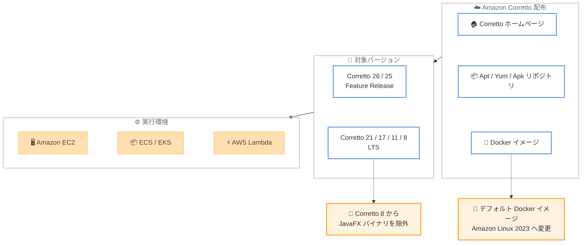

# Amazon Corretto - 2026 年 7 月四半期アップデート

**リリース日**: 2026年07月22日
**サービス**: Amazon Corretto
**機能**: 四半期セキュリティおよびクリティカルアップデート

📊 [このアップデートのインフォグラフィックを見る](https://takech9203.github.io/aws-news-summary/20260722-amazon-corretto-july-2026-quarterly-updates.html)
<!-- INFOGRAPHIC_BASE_URL は環境変数から取得 -->

## 概要

2026 年 7 月 22 日、Amazon は Amazon Corretto の OpenJDK に対する四半期セキュリティおよびクリティカルアップデートを発表しました。今回のアップデートでは、Long-Term Support (LTS) バージョンに加えて Feature Release (FR) バージョンも対象となり、Corretto 26.0.2、25.0.4、21.0.12、17.0.20、11.0.32、および 8u502 が[ダウンロード](https://aws.amazon.com/corretto/)可能になりました。Amazon Corretto は、無料で、マルチプラットフォームに対応した、本番環境対応の OpenJDK ディストリビューションです。

今回のリリースには、通常のセキュリティおよびクリティカルアップデートに加えて、2 つの重要な変更が含まれています。1 つ目は、デフォルトの Corretto Docker イメージのベース OS が Amazon Linux 2023 に変更された点です。2 つ目は、Corretto 8 から JavaFX バイナリが同梱されなくなった点です。これらの変更は、コンテナ環境で Corretto を利用しているユーザーや、Corretto 8 で JavaFX を使用しているユーザーに影響します。

本番環境で Java アプリケーションを運用しているすべての組織が対象となります。特にセキュリティを重視する環境では、四半期ごとのアップデートを適用することで、既知の脆弱性への対応と安定性の維持が可能になります。

**アップデート前の課題**

- 以前のバージョンにはセキュリティ脆弱性が存在していた可能性がある
- デフォルトの Corretto Docker イメージが旧世代の Amazon Linux ベースであった
- Corretto 8 に JavaFX が同梱されており、イメージサイズや依存関係の管理に影響していた

**アップデート後の改善**

- セキュリティおよびクリティカルな問題が修正され、より安全で安定した Java 実行環境を提供
- デフォルトの Docker イメージが Amazon Linux 2023 ベースとなり、より新しいベース OS を利用可能
- Corretto 8 の JavaFX バイナリが分離され、必要な場合のみ個別に管理できるようになった

## アーキテクチャ図



配布チャネルから各バージョンを取得し、EC2、コンテナ、Lambda などの実行環境に展開する流れを示しています。今回のリリースでの Docker イメージのベース OS 変更と Corretto 8 の JavaFX 除外を注記しています。

## サービスアップデートの詳細

### 主要機能

1. **セキュリティおよびクリティカルアップデート**
   - 既知のセキュリティ脆弱性を修正
   - クリティカルなバグ修正を含み、安定性を向上
   - 本番環境での安全かつ信頼性の高い使用をサポート

2. **LTS および Feature Release の両方をサポート**
   - Corretto 26.0.2 (Feature Release)
   - Corretto 25.0.4 (最新 LTS)
   - Corretto 21.0.12 (LTS)
   - Corretto 17.0.20 (LTS)
   - Corretto 11.0.32 (LTS)
   - Corretto 8u502 (LTS)

3. **デフォルト Docker イメージの Amazon Linux 2023 への変更**
   - デフォルトの Corretto Docker イメージが Amazon Linux 2023 ベースに変更
   - Amazon Linux 2 ベースのイメージは、まだ移行できないユーザー向けに非デフォルトオプションとして引き続き提供
   - より新しいベース OS により、パッケージやセキュリティ更新の面で改善

4. **Corretto 8 からの JavaFX バイナリ除外**
   - 本リリースから、Corretto 8 に JavaFX バイナリが同梱されなくなった
   - JavaFX を使用する場合の移行ガイダンスは Corretto 8 の GitHub ページで提供
   - 依存関係の明確化とディストリビューションの軽量化に寄与

## 技術仕様

### 更新されたバージョン

| バージョン | アップデート | サポート状況 |
|-----------|------------|------------|
| Corretto 26 | 26.0.2 | Feature Release |
| Corretto 25 | 25.0.4 | LTS |
| Corretto 21 | 21.0.12 | LTS |
| Corretto 17 | 17.0.20 | LTS |
| Corretto 11 | 11.0.32 | LTS |
| Corretto 8 | 8u502 | LTS |

### 対応プラットフォーム

- Linux (x86_64、aarch64)
- Windows (x86_64)
- macOS (x86_64、aarch64)
- Docker コンテナイメージ (デフォルト: Amazon Linux 2023)

### このリリースでの主な変更点

| 項目 | 変更内容 |
|------|---------|
| Docker デフォルトイメージ | Amazon Linux 2023 ベースに変更 (Amazon Linux 2 は非デフォルトで継続提供) |
| Corretto 8 の JavaFX | JavaFX バイナリの同梱を廃止 (GitHub で移行ガイダンスを提供) |
| 対象範囲 | LTS に加えて Feature Release バージョンも対象 |

## 設定方法

### 前提条件

1. Java アプリケーションまたは開発環境
2. 適切なプラットフォーム (Linux、Windows、macOS)
3. 管理者権限 (インストールに必要)

### 手順

#### ステップ1: Corretto のダウンロード

[Corretto ホームページ](https://aws.amazon.com/corretto) から適切なバージョンをダウンロードします。ここでは各プラットフォーム向けのインストーラーやアーカイブを入手できます。

#### ステップ2: Linux での apt/yum/apk リポジトリの設定 (オプション)

Linux システムでは、Corretto の apt、yum、または apk リポジトリを設定することで、パッケージマネージャー経由でインストールおよび自動アップデートを受け取ることができます。

```bash
# apt の例 (Debian/Ubuntu)
wget -O- https://apt.corretto.aws/corretto.key | sudo gpg --dearmor -o /usr/share/keyrings/corretto-keyring.gpg
echo "deb [signed-by=/usr/share/keyrings/corretto-keyring.gpg] https://apt.corretto.aws stable main" | sudo tee /etc/apt/sources.list.d/corretto.list
sudo apt-get update
sudo apt-get install -y java-21-amazon-corretto-jdk
```

上記のコマンドは、Corretto の署名キーを登録し、apt リポジトリを追加したうえで、Corretto 21 の JDK をインストールしています。

#### ステップ3: Docker イメージの利用 (コンテナ環境の場合)

コンテナ環境では、公式の Corretto Docker イメージを使用します。デフォルトイメージは Amazon Linux 2023 ベースになりました。

```dockerfile
FROM amazoncorretto:21
COPY target/myapp.jar /app.jar
ENTRYPOINT ["java", "-jar", "/app.jar"]
```

Amazon Linux 2 ベースのイメージが必要な場合は、非デフォルトのタグを指定します。ベース OS の変更による影響がないか、事前に検証してください。

#### ステップ4: バージョンの確認

インストール後、Java バージョンを確認します。

```bash
java -version
```

このコマンドでインストールされた Corretto のバージョンが正しく反映されていることを確認できます。

## メリット

### ビジネス面

- **無料**: ライセンス費用なしで商用利用可能
- **本番環境対応**: AWS が本番環境での使用をサポート
- **継続的なサポート**: LTS および Feature Release の両方で四半期ごとのアップデートを提供

### 技術面

- **セキュリティ**: 定期的なセキュリティアップデートで脆弱性を修正
- **モダンなベース OS**: デフォルト Docker イメージが Amazon Linux 2023 ベースとなり、コンテナ環境を最新化
- **軽量化と明確な依存関係**: Corretto 8 から JavaFX を分離し、依存関係を明確化

## デメリット・制約事項

### 制限事項

- 今回の発表では、個別の CVE 識別子や具体的な脆弱性の一覧は明示されていない
- Corretto 8 で JavaFX を使用しているアプリケーションは、別途 JavaFX を導入する対応が必要
- 特定の商用 Java ディストリビューションの独自機能は含まれない

### 考慮すべき点

- Docker イメージのベース OS 変更 (Amazon Linux 2023) により、既存のコンテナビルドへの影響を検証する必要がある
- Corretto 8 で JavaFX に依存している場合、GitHub の移行ガイダンスに従って対応する必要がある
- バージョンアップグレードにはアプリケーションの互換性テストが推奨される

## ユースケース

### ユースケース1: 本番環境での Java アプリケーション運用

**シナリオ**: EC2 インスタンスで LTS バージョンの Java アプリケーションを運用

**実装例**:
- EC2 インスタンスに Corretto 21 をインストール
- Java アプリケーションを Corretto で実行
- 四半期アップデート (例: 21.0.12) を定期的に適用

**効果**: 無料で本番環境対応の Java ランタイムを使用し、セキュリティアップデートを継続的に受け取る

### ユースケース2: コンテナ化された Java アプリケーション

**シナリオ**: Amazon ECS / EKS 上で Java マイクロサービスを Docker コンテナとして実行

**実装例**:
```dockerfile
FROM amazoncorretto:21
COPY target/myapp.jar /app.jar
ENTRYPOINT ["java", "-jar", "/app.jar"]
```

**効果**: Amazon Linux 2023 ベースのモダンな Corretto イメージを使用し、セキュリティと保守性を向上。移行できない場合は Amazon Linux 2 ベースのイメージも選択可能

### ユースケース3: Corretto 8 レガシーアプリケーションの継続運用

**シナリオ**: Corretto 8 で稼働する既存アプリケーションを継続運用しつつ、JavaFX 除外に対応

**実装例**:
- 8u502 へアップデートしてセキュリティ修正を適用
- JavaFX に依存している場合は、GitHub の移行ガイダンスに従い JavaFX を個別に導入
- 依存関係を検証したうえで本番環境へ展開

**効果**: レガシー環境でも最新のセキュリティ修正を適用しつつ、JavaFX の分離に安全に対応できる

## 料金

Amazon Corretto は完全に無料で、ライセンス費用は発生しません。

## 利用可能リージョン

Amazon Corretto は、すべての AWS リージョンおよびオンプレミス環境で利用可能です。

## 関連サービス・機能

- **AWS Lambda**: サーバーレス Java 関数の実行
- **Amazon EC2**: Java アプリケーションのホスティング
- **Amazon ECS/EKS**: コンテナ化された Java アプリケーションの実行
- **AWS CodeBuild**: Corretto を使用した Java アプリケーションのビルド
- **Amazon Linux 2023**: Corretto デフォルト Docker イメージのベース OS

## 参考リンク

- 📊 [インフォグラフィック](https://takech9203.github.io/aws-news-summary/20260722-amazon-corretto-july-2026-quarterly-updates.html)
- [公式発表 (What's New)](https://aws.amazon.com/about-aws/whats-new/2026/07/amazon-corretto-july-2026-quarterly-updates)
- [Corretto ホームページ](https://aws.amazon.com/corretto)
- [Corretto ダウンロード](https://aws.amazon.com/corretto/)
- [Corretto Linux インストールガイド](https://docs.aws.amazon.com/corretto/latest/corretto-21-ug/generic-linux-install.html)
- [GitHub - Corretto](https://github.com/corretto)

## まとめ

Amazon Corretto の 2026 年 7 月四半期アップデートにより、LTS および Feature Release の複数バージョンでセキュリティおよびクリティカルな問題が修正されました。加えて、デフォルト Docker イメージの Amazon Linux 2023 への変更と、Corretto 8 からの JavaFX バイナリの除外という重要な変更が含まれます。コンテナ環境や Corretto 8 で JavaFX を利用しているユーザーは、これらの変更による影響を検証したうえで、無料のアップデートを適用してセキュリティと安定性を向上させてください。
