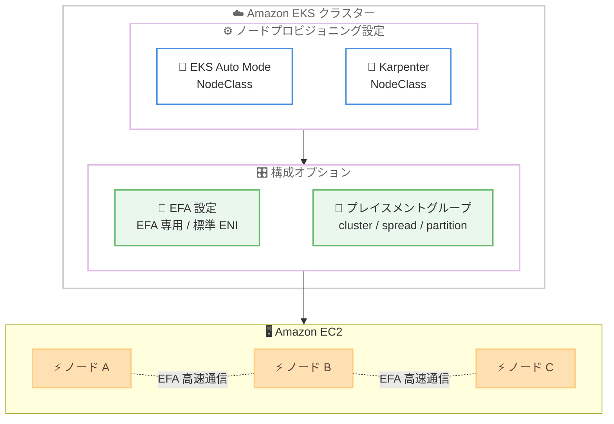

# Amazon EKS - EFA とプレイスメントグループのサポート (EKS Auto Mode / Karpenter)

**リリース日**: 2026 年 7 月 22 日
**サービス**: Amazon Elastic Kubernetes Service (Amazon EKS)
**機能**: EKS Auto Mode および Karpenter における Elastic Fabric Adapter (EFA) とプレイスメントグループのサポート

📊 [このアップデートのインフォグラフィックを見る](https://takech9203.github.io/aws-news-summary/20260722-amazon-eks-efa-placement-groups.html)
<!-- INFOGRAPHIC_BASE_URL は環境変数から取得 -->

## 概要

Amazon EKS は、EKS Auto Mode とオープンソースの Karpenter プロジェクトの両方において、2 つの Amazon EC2 機能をサポートしました。1 つ目は Elastic Fabric Adapter (EFA) のネットワークデバイス設定、2 つ目は EC2 プレイスメントグループです。これらの機能により、ユーザーはワークロードをより高いパフォーマンスと可用性に向けてチューニングできるようになります。

EFA は、EC2 インスタンス間で低レイテンシかつ高帯域幅の通信を実現するネットワークインターフェイスです。今回のアップデートにより、EFA 対応インスタンスのネットワークインターフェイスを EFA 専用または標準の ENI として構成できるようになりました。プレイスメントグループのサポートでは、cluster、spread、partition の 3 つの戦略を用いてインスタンスを配置でき、パフォーマンス、可用性、障害分離を目的に応じて最適化できます。

これらの設定はいずれも EKS Auto Mode または Karpenter のノードプール設定内で直接構成できるため、これまで必要だった追加の運用上の回避策が不要になります。分散トレーニングジョブのスループット最大化や、重要な本番サービスの障害影響範囲 (ブラストレディウス) の最小化といったユースケースに適しています。

**アップデート前の課題**

- EKS Auto Mode や Karpenter のノードプール設定では、EFA ネットワークインターフェイスをネイティブに構成できなかった
- プレイスメントグループを利用するには、追加の運用上の回避策が必要だった
- 分散トレーニングなどの高パフォーマンスワークロードや、障害分離が重要なワークロードのチューニングが難しかった

**アップデート後の改善**

- EKS Auto Mode / Karpenter のノードプール設定内で EFA を直接構成できるようになった
- cluster、spread、partition の 3 つのプレイスメントグループ戦略を選択できるようになった
- EFA 専用インターフェイスは IP アドレスを消費しないため、VPC 内の IP 使用量をより精密に管理できるようになった

## アーキテクチャ図

EKS Auto Mode または Karpenter のノードプール設定で EFA とプレイスメントグループを指定すると、対応する構成の EC2 ノードがプロビジョニングされ、ノード間で EFA による高速通信が可能になります。

## サービスアップデートの詳細

### 主要機能

1. **EFA (Elastic Fabric Adapter) ネットワークデバイス設定**
   - EFA 対応インスタンス上で、ネットワークインターフェイスを EFA 専用または標準の ENI として構成できる
   - 動的 (dynamic) および静的 (static) の両方のキャパシティノードプールで動作する
   - EFA 専用インターフェイスは IP アドレスを消費しないため、フル帯域幅の相互接続を維持しつつ VPC 内の IP 使用量を精密に管理できる

2. **EC2 プレイスメントグループのサポート**
   - cluster、spread、partition の 3 つの配置戦略を用いてインスタンスを起動できる
   - 設定は EKS Auto Mode または Karpenter のノードプール設定内で直接行える
   - プレイスメントグループを利用するための追加の運用上の回避策が不要になる

3. **パフォーマンスと可用性の最適化**
   - 分散トレーニングジョブのスループット最大化に有効
   - 重要な本番サービスの障害影響範囲 (ブラストレディウス) の最小化に有効
   - パフォーマンス、可用性、障害分離を目的に応じて選択的に最適化できる

## 技術仕様

### プレイスメントグループの配置戦略

| 戦略 | 詳細 |
|------|------|
| cluster | 単一のアベイラビリティーゾーン内でインスタンスを近接配置し、低レイテンシと高スループットを実現。分散トレーニングや HPC 向け |
| spread | インスタンスを個別のハードウェアに分散配置し、同時障害のリスクを低減。少数の重要なインスタンス向け |
| partition | インスタンスを論理的なパーティションに分割し、パーティション間でハードウェアを分離。大規模分散システム向け |

### EFA インターフェイスの構成

| 項目 | 詳細 |
|------|------|
| 構成モード | EFA 専用インターフェイス または 標準 ENI |
| IP アドレス消費 | EFA 専用インターフェイスは IP アドレスを消費しない |
| 対応ノードプール | 動的 (dynamic) / 静的 (static) の両方 |
| 対象インスタンス | EFA 対応の EC2 インスタンスタイプ |

## 設定方法

### 前提条件

1. Amazon EKS クラスターで EKS Auto Mode が有効化されている、または Karpenter が導入されている
2. EFA を利用する場合は、EFA 対応の EC2 インスタンスタイプを使用する
3. プレイスメントグループや EFA を利用するための IAM 権限が付与されている

### 手順

#### ステップ1: NodeClass での EFA 設定

EKS Auto Mode の NodeClass または Karpenter の EC2NodeClass で、ネットワークインターフェイスの構成を指定します。EFA 専用インターフェイスとして構成することで、IP アドレスを消費せずに高帯域幅の相互接続を利用できます。詳細な設定項目は、EKS Auto Mode ユーザーガイドおよび Karpenter のドキュメントを参照してください。

#### ステップ2: プレイスメントグループの指定

同じく NodeClass 内で、プレイスメントグループの配置戦略 (cluster / spread / partition) を指定します。ワークロードの特性に応じて戦略を選択することで、パフォーマンスや障害分離を最適化できます。

#### ステップ3: ノードプールの適用とプロビジョニング

設定した NodeClass をノードプールに関連付けて適用します。以降、EKS Auto Mode または Karpenter が需要に応じて、指定した EFA およびプレイスメントグループ構成の EC2 ノードを自動的にプロビジョニングします。

## メリット

### ビジネス面

- **運用負荷の軽減**: プレイスメントグループや EFA を利用するための追加の運用上の回避策が不要になり、運用がシンプルになる
- **コスト効率の向上**: EFA 専用インターフェイスが IP アドレスを消費しないため、VPC の IP アドレス空間を効率的に活用できる
- **本番サービスの信頼性向上**: spread や partition 戦略により、障害影響範囲を最小化して重要なサービスの可用性を高められる

### 技術面

- **高パフォーマンス通信**: EFA により、分散トレーニングや HPC ワークロードで低レイテンシ・高帯域幅のノード間通信を実現できる
- **柔軟なノード構成**: 動的・静的の両方のノードプールで EFA を構成でき、幅広いワークロードに対応できる
- **宣言的な設定**: NodeClass の設定として EFA とプレイスメントグループを宣言的に管理できる

## デメリット・制約事項

### 制限事項

- EFA は EFA 対応の EC2 インスタンスタイプでのみ利用可能
- cluster 戦略は単一のアベイラビリティーゾーンに限定されるため、AZ 障害には注意が必要
- プレイスメントグループには EC2 の一般的な制約 (戦略ごとのインスタンス数やインスタンスタイプの制限など) が適用される

### 考慮すべき点

- ワークロードの特性 (スループット重視か障害分離重視か) に応じて適切なプレイスメントグループ戦略を選択する必要がある
- EFA 専用インターフェイスと標準 ENI の使い分けを、通信要件と IP 管理要件の両面から検討する

## ユースケース

### ユースケース1: 分散機械学習トレーニング

**シナリオ**: 複数の GPU ノードを用いた大規模な分散トレーニングジョブで、ノード間通信がボトルネックになっている。

**効果**: cluster プレイスメントグループと EFA を組み合わせることで、ノード間の低レイテンシ・高帯域幅通信を実現し、トレーニングのスループットを最大化できる。

### ユースケース2: 重要な本番サービスの障害分離

**シナリオ**: ミッションクリティカルな本番サービスを EKS 上で運用しており、ハードウェア障害による同時ダウンを避けたい。

**効果**: spread または partition プレイスメントグループを利用することで、インスタンスを異なるハードウェアに分散配置し、障害影響範囲 (ブラストレディウス) を最小化できる。

### ユースケース3: IP アドレスが逼迫した VPC での HPC ワークロード

**シナリオ**: IP アドレス空間が限られた VPC 内で、高帯域幅通信が必要な HPC ワークロードを実行したい。

**効果**: EFA 専用インターフェイスは IP アドレスを消費しないため、IP 使用量を抑えながらフル帯域幅の相互接続を利用できる。

## 料金

本機能自体に追加料金はありません。EFA およびプレイスメントグループは EC2 の標準機能として提供されており、追加料金なしで利用できます。利用した EC2 インスタンスや EKS クラスターの通常料金が適用されます。詳細は Amazon EKS の料金ページおよび Amazon EC2 の料金ページを参照してください。

## 利用可能リージョン

Amazon EKS が利用可能なすべての AWS リージョンで提供されます。

## 関連サービス・機能

- **Amazon EKS Auto Mode**: ノードのプロビジョニングと管理を自動化する EKS の運用モード。今回の EFA / プレイスメントグループ設定を NodeClass で指定できる
- **Karpenter**: オープンソースの Kubernetes ノードオートスケーラー。EC2NodeClass で EFA とプレイスメントグループを構成できる
- **Elastic Fabric Adapter (EFA)**: HPC や機械学習ワークロード向けの高性能ネットワークインターフェイス
- **EC2 プレイスメントグループ**: インスタンスの配置を制御し、パフォーマンスや障害分離を最適化する EC2 機能

## 参考リンク

- 📊 [インフォグラフィック](https://takech9203.github.io/aws-news-summary/20260722-amazon-eks-efa-placement-groups.html)
- [公式発表 (What's New)](https://aws.amazon.com/about-aws/whats-new/2026/07/amazon-eks-efa-placement-groups/)
- [Amazon EKS Auto Mode ユーザーガイド (NodeClass)](https://docs.aws.amazon.com/eks/latest/userguide/create-node-class.html)
- [Karpenter ドキュメント (NodeClasses)](https://karpenter.sh/docs/concepts/nodeclasses/)
- [Amazon EKS 料金ページ](https://aws.amazon.com/eks/pricing/)

## まとめ

今回のアップデートにより、EKS Auto Mode と Karpenter の両方で EFA とプレイスメントグループを宣言的に構成できるようになり、これまで必要だった運用上の回避策が不要になりました。分散トレーニングや HPC ワークロードのパフォーマンス最適化、重要な本番サービスの障害分離を検討しているユーザーは、ワークロードの特性に応じて EFA 設定とプレイスメントグループ戦略の適用を検討することを推奨します。
