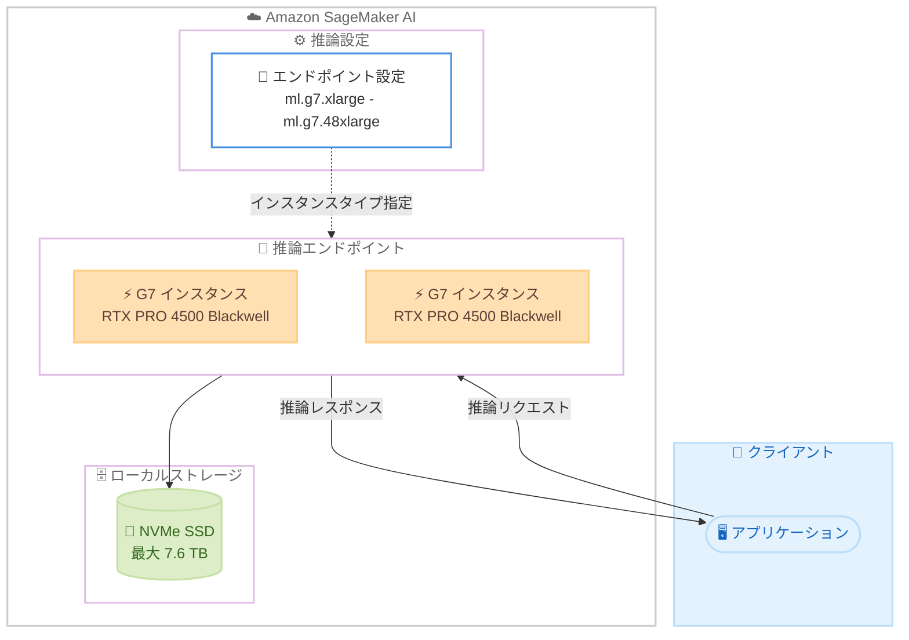

# Amazon SageMaker AI - G7 インスタンスサポート

**リリース日**: 2026 年 7 月 22 日
**サービス**: Amazon SageMaker AI
**機能**: 推論 (Inference) での G7 インスタンスサポート

📊 [このアップデートのインフォグラフィックを見る](https://takech9203.github.io/aws-news-summary/20260722-amazon-sagemaker-ai-g7.html)
<!-- INFOGRAPHIC_BASE_URL は環境変数から取得 -->

## 概要

Amazon SageMaker AI の推論機能が、NVIDIA RTX PRO 4500 Blackwell Server Edition GPU を搭載した G7 インスタンスをサポートしました。これにより、前世代の G6 インスタンスと比較して最大 4.6 倍の AI 推論パフォーマンスで機械学習モデルをデプロイできます。

本番環境で生成 AI モデルを推論用にデプロイするお客様は、中規模から大規模のモデルをコスト効率よくサービングするために、高い GPU スループットとメモリ容量を必要とします。G7 インスタンスは、GPU あたり 32 GB の GPU メモリと第 5 世代 Tensor Core、最大 700 Gbps の EFA 対応ネットワーキング (G6 と比較して 7 倍)、そして大規模モデルを計算リソースの近くに保持するための最大 7.6 TB のローカル NVMe SSD ストレージを提供します。

これらの機能により、G7 インスタンスは 7B から 30B パラメータ規模のモデルのサービング、画像および動画生成ワークロード、より高いメモリ帯域幅とスループットの恩恵を受けるマルチモデル推論エンドポイントに適しています。G7 インスタンスは SageMaker AI 推論コンソール、API、または SDK から、エンドポイント設定で G7 インスタンスタイプ (ml.g7.xlarge から ml.g7.48xlarge まで) を指定してデプロイできます。

**アップデート前の課題**

- 前世代インスタンスでは、GPU メモリの制約に収めるために、高価な計算リソースを過剰にプロビジョニングする必要があった
- メモリ制約に合わせるために、モデルを量子化する必要があった
- 中規模から大規模の生成 AI モデルを、コスト効率よくサービングすることが難しかった

**アップデート後の改善**

- G7 インスタンスにより、GPU あたり 32 GB のメモリで 7B から 30B パラメータ規模のモデルを効率的にサービングできるようになった
- 最大 4.6 倍の AI 推論パフォーマンスにより、過剰なプロビジョニングや量子化を回避しやすくなった
- 最大 700 Gbps の EFA 対応ネットワーキングと最大 7.6 TB のローカル NVMe SSD ストレージにより、大規模モデルを計算リソースの近くに保持できるようになった

## アーキテクチャ図



SageMaker AI のエンドポイント設定で G7 インスタンスタイプを指定すると、NVIDIA RTX PRO 4500 Blackwell GPU を搭載した推論エンドポイントがデプロイされ、大規模モデルをローカル NVMe SSD に保持しながら低レイテンシで推論を提供します。

## サービスアップデートの詳細

### 主要機能

1. **NVIDIA RTX PRO 4500 Blackwell Server Edition GPU の搭載**
   - GPU あたり 32 GB の GPU メモリを提供
   - 第 5 世代 Tensor Core を搭載
   - 前世代 G6 インスタンスと比較して最大 4.6 倍の AI 推論パフォーマンス

2. **高帯域ネットワーキングとストレージ**
   - 最大 700 Gbps の EFA 対応ネットワーキング (G6 と比較して 7 倍)
   - 最大 7.6 TB のローカル NVMe SSD ストレージ
   - 大規模モデルを計算リソースの近くに保持することで、モデルロードの効率を向上

3. **柔軟なインスタンスサイズと簡単なデプロイ**
   - ml.g7.xlarge から ml.g7.48xlarge までのインスタンスサイズを提供
   - SageMaker AI 推論コンソール、API、または SDK からデプロイ可能
   - エンドポイント設定でインスタンスタイプを指定するだけで利用可能

## 技術仕様

### G7 インスタンスの主要スペック

| 項目 | 詳細 |
|------|------|
| GPU | NVIDIA RTX PRO 4500 Blackwell Server Edition |
| GPU メモリ | 32 GB / GPU |
| Tensor Core | 第 5 世代 |
| ネットワーキング | 最大 700 Gbps (EFA 対応、G6 比 7 倍) |
| ローカルストレージ | 最大 7.6 TB NVMe SSD |
| 推論パフォーマンス | G6 比 最大 4.6 倍 |
| 適したモデル規模 | 7B - 30B パラメータ |

### EC2 G7 インスタンスサイズ (参考)

SageMaker AI 推論では `ml.` プレフィックス付きのインスタンスタイプを指定します。対応する EC2 G7 インスタンスの構成は以下のとおりです。

| インスタンス | GPU 数 | GPU メモリ (GB) | vCPU | システムメモリ (GiB) | ネットワーク (Gbps) |
|------|------|------|------|------|------|
| g7.2xlarge | 1 | 32 | 8 | 32 | 最大 60 |
| g7.4xlarge | 1 | 32 | 16 | 64 | 最大 100 |
| g7.8xlarge | 1 | 32 | 32 | 128 | 100 |
| g7.12xlarge | 2 | 64 | 48 | 192 | 175 |
| g7.24xlarge | 4 | 128 | 96 | 384 | 350 |
| g7.48xlarge | 8 | 256 | 192 | 768 | 700 |

### エンドポイント設定例

```json
{
  "EndpointConfigName": "g7-inference-config",
  "ProductionVariants": [
    {
      "VariantName": "AllTraffic",
      "ModelName": "my-generative-ai-model",
      "InstanceType": "ml.g7.12xlarge",
      "InitialInstanceCount": 1
    }
  ]
}
```

## 設定方法

### 前提条件

1. Amazon SageMaker AI が利用可能なアカウントと適切な IAM 権限
2. デプロイ対象の機械学習モデル (モデルアーティファクトと推論コンテナ)
3. G7 インスタンスが利用可能なリージョン (バージニア北部、オハイオ、オレゴン) の利用

### 手順

#### ステップ 1: モデルの作成

```bash
aws sagemaker create-model \
  --model-name my-generative-ai-model \
  --primary-container Image=<推論コンテナのイメージ URI>,ModelDataUrl=<モデルアーティファクトの S3 URI> \
  --execution-role-arn <SageMaker 実行ロールの ARN>
```

このコマンドは、推論コンテナイメージとモデルアーティファクトを指定して SageMaker モデルを作成します。

#### ステップ 2: エンドポイント設定の作成

```bash
aws sagemaker create-endpoint-config \
  --endpoint-config-name g7-inference-config \
  --production-variants VariantName=AllTraffic,ModelName=my-generative-ai-model,InstanceType=ml.g7.12xlarge,InitialInstanceCount=1
```

このコマンドは、G7 インスタンスタイプ (ml.g7.12xlarge) を指定してエンドポイント設定を作成します。モデル規模やスループット要件に応じてインスタンスサイズを選択します。

#### ステップ 3: エンドポイントのデプロイ

```bash
aws sagemaker create-endpoint \
  --endpoint-name g7-inference-endpoint \
  --endpoint-config-name g7-inference-config
```

このコマンドは、作成したエンドポイント設定を使用して推論エンドポイントをデプロイします。デプロイ完了後、`InService` 状態になると推論リクエストを受け付けられます。

## メリット

### ビジネス面

- **コスト効率の向上**: 最大 4.6 倍の推論パフォーマンスにより、同じスループットをより少ないインスタンスで実現でき、過剰プロビジョニングを回避できる
- **本番運用の簡素化**: メモリ制約による量子化が不要になり、モデルの精度を維持したまま本番デプロイしやすくなる
- **幅広いワークロード対応**: 7B から 30B パラメータのモデル、画像・動画生成、マルチモデルエンドポイントなど多様な生成 AI ワークロードに対応

### 技術面

- **十分な GPU メモリ**: GPU あたり 32 GB のメモリにより、中規模から大規模のモデルを量子化せずに収容できる
- **高いネットワーク帯域**: 最大 700 Gbps の EFA 対応ネットワーキングにより、分散推論やマルチノード構成での通信ボトルネックを軽減
- **高速なローカルストレージ**: 最大 7.6 TB の NVMe SSD により、大規模モデルアーティファクトを計算リソースの近くに保持し、ロード時間を短縮

## デメリット・制約事項

### 制限事項

- 現時点で利用可能なリージョンは米国東部 (バージニア北部、オハイオ)、米国西部 (オレゴン) に限定される
- 東京リージョンを含むアジアパシフィックリージョンでは、記事公開時点では未対応
- 高性能な GPU インスタンスのため、小規模モデルや低トラフィックのワークロードではコストが割高になる可能性がある

### 考慮すべき点

- モデル規模やスループット要件に応じて、適切なインスタンスサイズ (ml.g7.xlarge から ml.g7.48xlarge) を選択する必要がある
- G7 インスタンスの GPU あたりメモリは 32 GB のため、30B を大きく超えるモデルでは複数 GPU への分散やより大きなインスタンスサイズの検討が必要になる
- 料金は最新の SageMaker AI 料金ページで確認することが推奨される

## ユースケース

### ユースケース 1: 中規模 LLM の本番推論

**シナリオ**: 13B パラメータ規模のオープンソース LLM を本番環境でサービングしたいが、前世代インスタンスではメモリ制約により量子化が必要だった。

**実装例**:
```
InstanceType: ml.g7.8xlarge (GPU メモリ 32 GB)
Model: 13B パラメータの LLM (量子化なし)
```

**効果**: 32 GB の GPU メモリにより量子化せずにモデルをロードでき、精度を維持したまま高スループットの推論を提供できる。

### ユースケース 2: 画像・動画生成ワークロード

**シナリオ**: テキストから画像・動画を生成する生成 AI モデルを、複数リクエストに対して低レイテンシで提供したい。

**実装例**:
```
InstanceType: ml.g7.12xlarge (GPU 2 基、GPU メモリ 64 GB)
Model: 拡散モデルベースの画像・動画生成
```

**効果**: 高いメモリ帯域幅と GPU 性能により、画像・動画生成の処理時間を短縮し、多数の同時リクエストを処理できる。

### ユースケース 3: マルチモデル推論エンドポイント

**シナリオ**: 複数の機械学習モデルを 1 つのエンドポイントでホストし、リソースを共有しながらコストを最適化したい。

**実装例**:
```
InstanceType: ml.g7.24xlarge (GPU 4 基、GPU メモリ 128 GB)
複数モデルを 1 エンドポイントに配置
```

**効果**: 大容量の GPU メモリと高いスループットにより、複数モデルを効率的にホストし、インスタンス数を削減してコストを最適化できる。

## 料金

G7 インスタンスの SageMaker AI 推論での料金は、使用するインスタンスタイプと稼働時間に基づく従量課金制です。具体的な時間単価は、リージョンおよびインスタンスサイズによって異なります。正確な料金は、AWS SageMaker AI 料金ページで確認してください。

### 料金例

| 使用量 | 月額料金 (概算) |
|--------|------------------|
| インスタンスタイプ・リージョンによって変動 | AWS SageMaker AI 料金ページを参照 |

## 利用可能リージョン

SageMaker AI 推論での G7 インスタンスは、以下のリージョンで利用可能です。

- 米国東部 (バージニア北部)
- 米国東部 (オハイオ)
- 米国西部 (オレゴン)

## 関連サービス・機能

- **Amazon EC2 G7 インスタンス**: SageMaker AI 推論で使用される基盤となる GPU インスタンスタイプ
- **Amazon EC2 G6 インスタンス**: 前世代の GPU インスタンス。G7 は G6 比で最大 4.6 倍の推論パフォーマンスを提供
- **Elastic Fabric Adapter (EFA)**: G7 インスタンスの高帯域ネットワーキング (最大 700 Gbps) を支える機能

## 参考リンク

- 📊 [インフォグラフィック](https://takech9203.github.io/aws-news-summary/20260722-amazon-sagemaker-ai-g7.html)
- [公式発表 (What's New)](https://aws.amazon.com/about-aws/whats-new/2026/07/amazon-sagemaker-ai-g7/)
- [Amazon EC2 G7 インスタンス](https://aws.amazon.com/ec2/instance-types/g7/)
- [料金ページ](https://aws.amazon.com/sagemaker/ai/pricing/)

## まとめ

Amazon SageMaker AI 推論での G7 インスタンスサポートにより、NVIDIA RTX PRO 4500 Blackwell GPU の高い性能とメモリ容量を活用し、7B から 30B パラメータ規模のモデルや画像・動画生成ワークロードをコスト効率よくデプロイできるようになりました。生成 AI モデルを本番環境でサービングしている、または検討中のお客様は、まず米国リージョンで G7 インスタンスの推論パフォーマンスを評価し、既存の G6 ベースのエンドポイントからの移行を検討することをお勧めします。
