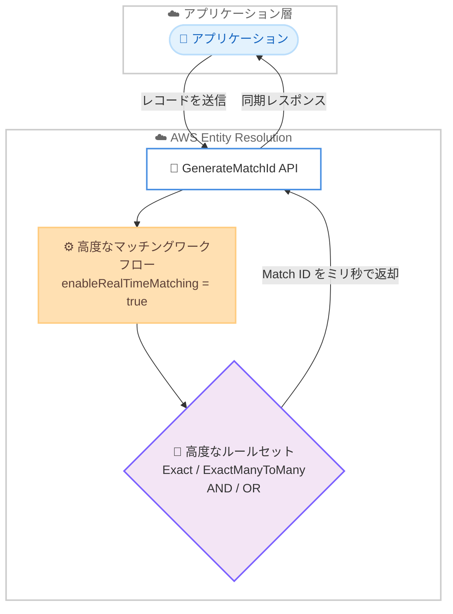

# AWS Entity Resolution - 高度なリアルタイムマッチング対応

**リリース日**: 2026 年 7 月 22 日
**サービス**: AWS Entity Resolution
**機能**: 高度なルールセットによるリアルタイムマッチング (Advanced Real-Time Matching)

📊 [このアップデートのインフォグラフィックを見る](https://takech9203.github.io/aws-news-summary/20260722-aws-entity-resolution.html)
<!-- INFOGRAPHIC_BASE_URL は環境変数から取得 -->

## 概要

AWS Entity Resolution は、高度なマッチングワークフローを通じてリアルタイムマッチングに対応しました。これにより、複雑なルールセットを使用したレコードのマッチングを、`GenerateMatchId` API 経由でミリ秒単位で実行できるようになりました。

AWS Entity Resolution は、複数のアプリケーション、チャネル、データストアに分散して保存された関連レコードを、機械学習の専門知識を必要とせずにマッチング、リンク、拡張するためのサービスです。今回のアップデート以前は、リアルタイムマッチングは単純なルールベースのワークフローでのみ利用可能でした。高度なルールセットはバッチ処理でのみ使用でき、処理には数分から数時間を要していました。この制約により、高度なマッチングロジックを用いたリアルタイムのエンティティ解決を必要とするお客様にとって、重大なギャップが生じていました。

今回のアップデートは、不正検知、リアルタイムのアカウント照会、Web サイトのパーソナライゼーションなど、低レイテンシと高度なマッチング精度の両方を必要とするユースケースを対象としています。別途マッチング用のインフラを維持したり、アプリケーションを再設計したりすることなく、リアルタイムで結果を得られる点が主要な価値提案です。

**アップデート前の課題**

- 以前は、リアルタイムマッチングは単純なルールベースのワークフローでのみ利用可能だった
- 以前は、高度なルールセットはバッチ処理でのみ使用でき、処理に数分から数時間を要していた
- 以前は、高度なマッチングロジックとリアルタイム処理を両立させるには、別途マッチング用のインフラを構築・維持する必要があった

**アップデート後の改善**

- 今回のアップデートにより、高度なルールセットを使用したマッチングをミリ秒単位でリアルタイムに実行できるようになった
- 今回のアップデートにより、`Exact`、`ExactManyToMany` といった演算子と AND/OR ロジックを組み合わせたルールをリアルタイムで利用できるようになった
- 今回のアップデートにより、新しいエンドポイントの追加やアプリケーションの移行なしに、既存の `GenerateMatchId` API をそのまま利用できるようになった

## アーキテクチャ図



アプリケーションが `GenerateMatchId` API へレコードを送信すると、リアルタイムマッチングを有効化した高度なマッチングワークフローが複雑なルールセットを評価し、Match ID をミリ秒単位で同期的に返却します。

## サービスアップデートの詳細

### 主要機能

1. **高度なルールセットによるリアルタイムマッチング**
   - 複雑なルールセットを使用したマッチングをミリ秒単位で実行
   - バッチ処理でのみ利用できた高度なルールセットを、リアルタイム処理でも利用可能に
   - 数分から数時間かかっていた処理をリアルタイムに短縮

2. **柔軟なマッチング演算子とロジック**
   - `Exact` (完全一致) および `ExactManyToMany` (多対多の完全一致) 演算子をサポート
   - AND / OR ロジックを組み合わせた高度なマッチング条件を定義可能
   - 不正検知やアカウント照会など、精度が求められるユースケースに対応

3. **既存 API の活用による容易な導入**
   - マッチングワークフローの `enableRealTimeMatching` パラメータを `true` に設定するだけで有効化
   - 既存の `GenerateMatchId` API をそのまま呼び出し
   - 新しいエンドポイントの追加やアプリケーションの移行は不要

## 技術仕様

### 対応する演算子とロジック

| 項目 | 詳細 |
|------|------|
| 演算子 | `Exact` (完全一致)、`ExactManyToMany` (多対多の完全一致) |
| 論理演算 | AND / OR の組み合わせ |
| 有効化パラメータ | `enableRealTimeMatching` (boolean) |
| 呼び出し API | `GenerateMatchId` |
| レイテンシ | ミリ秒単位 |

### API 変更履歴

| 日付 | サービス | 変更内容 |
|------|----------|----------|
| 2026/07/21 | [entityresolution](https://awsapichanges.com/archive/changes/f78b79-entityresolution.html) | 3 updated api methods - 高度なルールセットを用いたリアルタイムマッチングのサポートを追加 |

今回のアップデートでは、以下の 3 つの API メソッドに `resolutionTechniques` 配下の `enableRealTimeMatching` (boolean) パラメータが追加されました。

- `CreateMatchingWorkflow`: マッチングワークフロー作成時にリアルタイムマッチングを有効化
- `UpdateMatchingWorkflow`: 既存ワークフローの設定を更新してリアルタイムマッチングを有効化
- `GetMatchingWorkflow`: ワークフロー設定として `enableRealTimeMatching` の値を取得

### ワークフロー設定例

```json
{
  "workflowName": "customer-match-workflow",
  "inputSourceConfig": [
    {
      "inputSourceARN": "arn:aws:glue:us-east-1:123456789012:table/db/customers",
      "schemaName": "customer-schema"
    }
  ],
  "resolutionTechniques": {
    "resolutionType": "RULE_MATCHING",
    "ruleBasedProperties": {
      "attributeMatchingModel": "MANY_TO_MANY",
      "rules": [
        {
          "ruleName": "email-phone-match",
          "matchingKeys": ["email", "phone"]
        }
      ]
    },
    "enableRealTimeMatching": true
  }
}
```

## 設定方法

### 前提条件

1. AWS Entity Resolution が利用可能なリージョンでアカウントを利用できること
2. スキーママッピングと入力データソース (AWS Glue テーブルなど) が構成済みであること
3. マッチングワークフローを作成・更新するための IAM 権限を保有していること

### 手順

#### ステップ 1: リアルタイムマッチングを有効化したワークフローを作成

```bash
aws entityresolution create-matching-workflow \
  --workflow-name customer-match-workflow \
  --input-source-config file://input-source.json \
  --resolution-techniques '{"resolutionType":"RULE_MATCHING","enableRealTimeMatching":true,"ruleBasedProperties":{"attributeMatchingModel":"MANY_TO_MANY","rules":[{"ruleName":"email-phone-match","matchingKeys":["email","phone"]}]}}' \
  --role-arn arn:aws:iam::123456789012:role/EntityResolutionRole
```

このコマンドは、`enableRealTimeMatching` を `true` に設定した高度なルールベースのマッチングワークフローを新規作成します。

#### ステップ 2: 既存ワークフローでリアルタイムマッチングを有効化する場合

```bash
aws entityresolution update-matching-workflow \
  --workflow-name customer-match-workflow \
  --input-source-config file://input-source.json \
  --resolution-techniques '{"resolutionType":"RULE_MATCHING","enableRealTimeMatching":true,"ruleBasedProperties":{"attributeMatchingModel":"MANY_TO_MANY","rules":[{"ruleName":"email-phone-match","matchingKeys":["email","phone"]}]}}' \
  --role-arn arn:aws:iam::123456789012:role/EntityResolutionRole
```

このコマンドは、既存のマッチングワークフローの設定を更新し、リアルタイムマッチングを有効化します。

#### ステップ 3: GenerateMatchId API でリアルタイムマッチングを実行

```bash
aws entityresolution generate-match-id \
  --workflow-name customer-match-workflow \
  --records file://records.json
```

このコマンドは、対象レコードを既存の `GenerateMatchId` API へ送信し、Match ID をミリ秒単位で同期的に取得します。新しいエンドポイントは不要です。

## メリット

### ビジネス面

- **リアルタイムな意思決定の実現**: 不正検知やアカウント照会などで、待ち時間なく即座にエンティティを解決し、迅速な判断を可能にする
- **顧客体験の向上**: Web サイトのパーソナライゼーションなどで、リアルタイムに顧客を識別し、最適な体験を提供できる
- **導入コストの低減**: 別途マッチング用インフラを構築・維持する必要がなく、運用負荷とコストを抑えられる

### 技術面

- **低レイテンシと高精度の両立**: 高度なルールセットの精度を保ちながら、ミリ秒単位のレスポンスを実現
- **既存資産の活用**: 既存の `GenerateMatchId` API をそのまま利用でき、アプリケーションの再設計が不要
- **シンプルな有効化**: `enableRealTimeMatching` パラメータを `true` に設定するだけで機能を利用開始できる

## デメリット・制約事項

### 制限事項

- 高度なルールセットでサポートされる演算子は `Exact` および `ExactManyToMany` であり、AND / OR ロジックとの組み合わせで構成する
- 利用可能なリージョンは AWS Entity Resolution が提供されているリージョンに限られる
- リアルタイムマッチングを利用するには、ワークフローで `enableRealTimeMatching` を明示的に有効化する必要がある

### 考慮すべき点

- 高度なルールセットの設計はマッチング精度に直結するため、演算子とロジックの組み合わせを事前に十分検証することが望ましい
- リアルタイム処理とバッチ処理では想定されるスループットやコスト特性が異なるため、ユースケースに応じた選択が必要

## ユースケース

### ユースケース 1: 不正検知

**シナリオ**: 金融機関が、取引申請時に入力された顧客情報を既存の顧客プロファイルとリアルタイムで照合し、なりすましや重複アカウントの兆候を検知したい。

**実装例**:
```
GenerateMatchId API に取引申請レコードを送信し、
Exact および ExactManyToMany 演算子と AND / OR ロジックで
既存顧客との一致をミリ秒単位で判定する
```

**効果**: 取引フローを止めることなく、リアルタイムで不正の兆候を検知し、迅速に対応できる

### ユースケース 2: リアルタイムのアカウント照会

**シナリオ**: コンタクトセンターで、問い合わせ中の顧客情報を複数システムに分散した既存レコードと即座に突き合わせ、統合された顧客ビューを表示したい。

**実装例**:
```
enableRealTimeMatching を有効化したワークフローに対し、
問い合わせ中の顧客の識別情報を GenerateMatchId API へ送信し、
関連する Match ID を同期的に取得する
```

**効果**: オペレーターが待ち時間なく顧客を特定でき、応対品質と処理速度が向上する

### ユースケース 3: Web サイトのパーソナライゼーション

**シナリオ**: EC サイトが、訪問者の識別情報から既存顧客プロファイルをリアルタイムに解決し、パーソナライズしたコンテンツやレコメンドを提示したい。

**実装例**:
```
訪問者のリクエスト時に GenerateMatchId API を呼び出し、
高度なルールセットで既存プロファイルとマッチングして
Match ID をミリ秒単位で取得し、コンテンツ表示に反映する
```

**効果**: ページ表示を遅延させることなく、リアルタイムでパーソナライズされた体験を提供できる

## 料金

今回のアップデートに関する追加の料金情報は発表内で明示されていません。AWS Entity Resolution の料金体系については、公式の料金ページをご確認ください。

## 利用可能リージョン

AWS Entity Resolution が利用可能なすべての AWS リージョンで利用できます。

## 関連サービス・機能

- **AWS Glue**: マッチングワークフローの入力データソースとして、AWS Glue テーブル (Amazon S3 上のデータ) を参照する
- **Amazon S3**: バッチマッチングワークフローの入出力データの保存先として利用する
- **Amazon Connect Customer Profiles**: マッチング結果を統合顧客プロファイルに連携し、顧客データの統合に活用できる

## 参考リンク

- 📊 [インフォグラフィック](https://takech9203.github.io/aws-news-summary/20260722-aws-entity-resolution.html)
- [公式発表 (What's New)](https://aws.amazon.com/about-aws/whats-new/2026/07/aws-entity-resolution/)
- [AWS Entity Resolution ドキュメント](https://docs.aws.amazon.com/entityresolution/)
- [AWS Entity Resolution 製品ページ](https://aws.amazon.com/entity-resolution/)
- [API 変更履歴 (awsapichanges.com)](https://awsapichanges.com/archive/changes/f78b79-entityresolution.html)

## まとめ

今回のアップデートにより、AWS Entity Resolution は高度なルールセットを用いたマッチングをミリ秒単位のリアルタイム処理で実行できるようになり、精度とレイテンシの両立という長年のギャップが解消されました。既存の `GenerateMatchId` API をそのまま利用でき、`enableRealTimeMatching` を有効化するだけで導入できるため、不正検知やアカウント照会、パーソナライゼーションに取り組むお客様は、まず既存ワークフローの設定を見直してリアルタイムマッチングの適用を検討することを推奨します。
