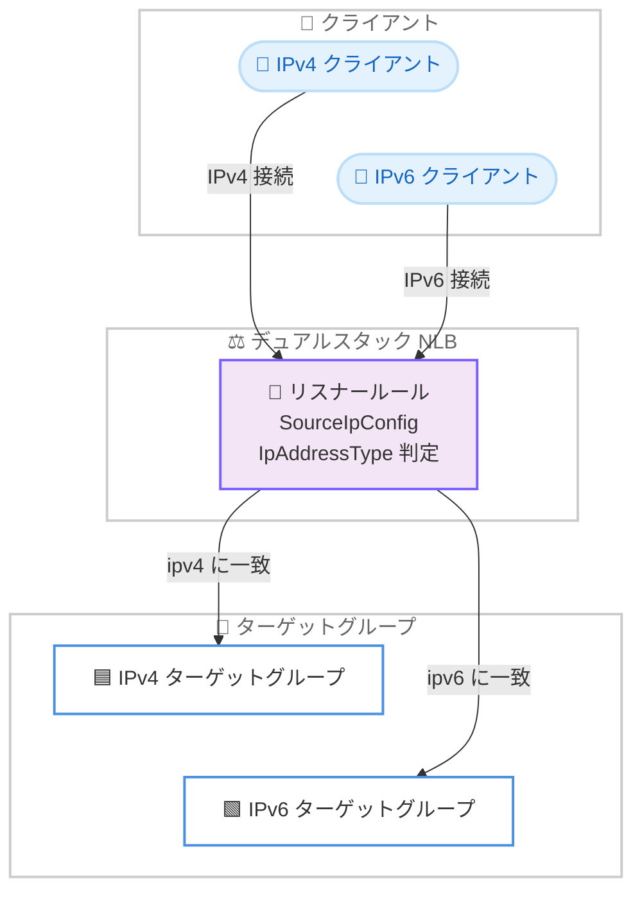

# AWS Network Load Balancer - リスナールールによるカスタムトラフィックルーティング

**リリース日**: 2026年7月22日
**サービス**: AWS Network Load Balancer (NLB)
**機能**: Listener Rules (リスナールール)

📊 [このアップデートのインフォグラフィックを見る](https://takech9203.github.io/aws-news-summary/20260722-aws-network-load-balancer-supports-listener-rules.html)
<!-- INFOGRAPHIC_BASE_URL は環境変数から取得 -->

## 概要

AWS Network Load Balancer (NLB) がリスナールールをサポートし、送信元 IP アドレスタイプ (IPv4 または IPv6) に基づいて、接続を異なるターゲットグループへルーティングできるようになりました。これにより、単一のデュアルスタック NLB で IPv6 クライアントのトラフィックを IPv6 ターゲットへ、IPv4 クライアントのトラフィックを IPv4 ターゲットへ振り分けることが可能になります。

従来、IPv4 と IPv6 の両方のクライアントに単一の NLB でサービスを提供するには、DNS で分割した 2 台のロードバランサーを運用するか、すべてのトラフィックを 1 つのターゲットグループへ集約してプロトコル変換を行う必要がありました。今回のリスナールールにより、レイヤー 3 での条件付きルーティングを同一アドレスファミリーのターゲットグループに対して実行でき、プロトコル変換や追加インフラストラクチャなしで、両方のアドレスファミリーについてクライアント IP アドレスをエンドツーエンドで保持できます。

この機能は、既存のデュアルスタック NLB に対してロードバランサーを再作成することなく追加でき、TCP、UDP、TCP_UDP、TLS の各リスナーで利用可能です。ネットワークインフラストラクチャの IPv6 移行を進めながら、既存の IPv4 ターゲットとの互換性を維持したいネットワーク管理者やアーキテクトにとって有用です。

**アップデート前の課題**

- 単一の NLB で IPv4 と IPv6 の両クライアントに対応するには、DNS で分割した 2 台のロードバランサーを運用する必要があった
- すべてのトラフィックを 1 つのターゲットグループに集約する場合、プロトコル変換によってクライアント IP アドレスが失われていた
- IPv6 への段階的な移行時に、追加のインフラストラクチャや運用の複雑さが発生していた

**アップデート後の改善**

- 単一のデュアルスタック NLB で送信元 IP アドレスタイプに基づいたトラフィックの振り分けが可能になった
- プロトコル変換が不要になり、IPv4 と IPv6 の両方でクライアント IP アドレスをエンドツーエンドで保持できるようになった
- 既存のデュアルスタック NLB に再作成なしでリスナールールを追加でき、運用がシンプルになった

## アーキテクチャ図



デュアルスタック NLB がリスナールールで送信元 IP アドレスタイプを判定し、同一アドレスファミリーのターゲットグループへトラフィックを振り分ける流れを示しています。

## サービスアップデートの詳細

### 主要機能

1. **送信元 IP アドレスタイプによる条件付きルーティング**
   - リスナールールの条件 (`SourceIpConfig`) に `IpAddressType` フィールド (`ipv4` または `ipv6`) を指定できる
   - 送信元が IPv4 か IPv6 かに応じて、接続を異なるターゲットグループへ振り分ける
   - レイヤー 3 での条件付きルーティングにより、同一アドレスファミリーのターゲットへ到達させる

2. **クライアント IP アドレスのエンドツーエンド保持**
   - プロトコル変換を行わないため、IPv4 と IPv6 の両方でクライアントの元の IP アドレスを保持する
   - ターゲット側でクライアント IP を用いたアクセス制御やロギングが引き続き可能

3. **既存 NLB への非破壊的な適用**
   - 既存のデュアルスタック NLB に対して、ロードバランサーを再作成することなくルールを追加できる
   - TCP、UDP、TCP_UDP、TLS の各リスナーで利用可能
   - 接続ドレイン、ターゲットグループのスティッキネス、クロスゾーン負荷分散、加重ターゲットグループ、クライアント IP 保持など、既存の NLB 機能と互換性がある

## 技術仕様

### リスナールールの条件

| 項目 | 詳細 |
|------|------|
| 条件フィールド | `SourceIpConfig.IpAddressType` |
| 指定可能な値 | `ipv4` \| `ipv6` |
| 対応リスナープロトコル | TCP、UDP、TCP_UDP、TLS |
| 適用対象 | デュアルスタック NLB |
| クライアント IP 保持 | 対応 (IPv4/IPv6 両方) |

### API変更履歴

| 日付 | サービス | 変更内容 |
|------|----------|----------|
| 2026/07/15 | [elasticloadbalancing](https://awsapichanges.com/archive/changes/7d6402-elasticloadbalancing.html) | 4 updated api methods - `SourceIpConfig` に `IpAddressType` フィールドを追加し、送信元 IP が IPv4 か IPv6 かに基づいて NLB リスナールールがトラフィックをマッチできるようにする対応 (CreateRule、DescribeRules、ModifyRule、SetRulePriorities) |

### リスナールール設定例

```json
{
  "Conditions": [
    {
      "Field": "source-ip",
      "SourceIpConfig": {
        "IpAddressType": "ipv6"
      }
    }
  ],
  "Actions": [
    {
      "Type": "forward",
      "TargetGroupArn": "arn:aws:elasticloadbalancing:region:account-id:targetgroup/ipv6-targets/xxxxxxxx"
    }
  ]
}
```

## 設定方法

### 前提条件

1. デュアルスタック (IPv4 と IPv6 の両方) が有効化された Network Load Balancer が存在すること
2. IPv4 ターゲットグループと IPv6 ターゲットグループがそれぞれ作成済みであること
3. リスナー (TCP、UDP、TCP_UDP、TLS のいずれか) が構成済みであること

### 手順

#### ステップ1: IPv6 トラフィック向けのリスナールールを作成

```bash
aws elbv2 create-rule \
    --listener-arn arn:aws:elasticloadbalancing:region:account-id:listener/net/my-nlb/xxxx/yyyy \
    --priority 10 \
    --conditions '[{"Field":"source-ip","SourceIpConfig":{"IpAddressType":"ipv6"}}]' \
    --actions '[{"Type":"forward","TargetGroupArn":"arn:aws:elasticloadbalancing:region:account-id:targetgroup/ipv6-targets/xxxx"}]'
```

このコマンドは、送信元 IP が IPv6 の接続を IPv6 ターゲットグループへ転送するリスナールールを作成します。

#### ステップ2: IPv4 トラフィック向けのリスナールールを作成

```bash
aws elbv2 create-rule \
    --listener-arn arn:aws:elasticloadbalancing:region:account-id:listener/net/my-nlb/xxxx/yyyy \
    --priority 20 \
    --conditions '[{"Field":"source-ip","SourceIpConfig":{"IpAddressType":"ipv4"}}]' \
    --actions '[{"Type":"forward","TargetGroupArn":"arn:aws:elasticloadbalancing:region:account-id:targetgroup/ipv4-targets/xxxx"}]'
```

このコマンドは、送信元 IP が IPv4 の接続を IPv4 ターゲットグループへ転送するリスナールールを作成します。

#### ステップ3: ルールの確認

```bash
aws elbv2 describe-rules \
    --listener-arn arn:aws:elasticloadbalancing:region:account-id:listener/net/my-nlb/xxxx/yyyy
```

このコマンドは、リスナーに設定されたルールの一覧を取得し、条件とアクションが意図どおりに構成されているかを確認します。

## メリット

### ビジネス面

- **インフラストラクチャコストの削減**: 2 台のロードバランサーを 1 台に統合できるため、運用対象のリソースが減少する
- **IPv6 移行の円滑化**: 既存の IPv4 環境を維持しながら段階的に IPv6 対応を進められる
- **追加料金なし**: リスナールール機能自体に追加料金は発生しない

### 技術面

- **クライアント IP の保持**: プロトコル変換を排除することで、両アドレスファミリーでクライアント IP をエンドツーエンドで保持できる
- **非破壊的な導入**: 既存のデュアルスタック NLB に再作成なしで適用できる
- **既存機能との互換性**: 接続ドレイン、スティッキネス、クロスゾーン負荷分散、加重ターゲットグループと併用できる

## デメリット・制約事項

### 制限事項

- 現時点でサポートされる条件は送信元 IP アドレスタイプ (`IpAddressType`) に基づくマッチングであり、デュアルスタック NLB が前提となる
- ターゲットグループは IPv4 用と IPv6 用をそれぞれ用意する必要がある

### 考慮すべき点

- ルールの優先度 (priority) 設定により評価順序が決まるため、条件の重複や意図しないマッチングが発生しないよう設計する
- 既存の DNS ベースで分割していた構成から移行する場合は、切り替え時のトラフィック挙動を検証する

## ユースケース

### ユースケース1: デュアルスタック環境でのクライアント IP 保持

**シナリオ**: IPv4 と IPv6 の両クライアントにサービスを提供しつつ、アクセスログや IP ベースのアクセス制御のためにクライアント IP を保持したい。

**実装例**:
```
IPv6 クライアント → NLB (リスナールール: ipv6) → IPv6 ターゲットグループ
IPv4 クライアント → NLB (リスナールール: ipv4) → IPv4 ターゲットグループ
```

**効果**: プロトコル変換なしで、両アドレスファミリーのクライアント IP を保持したまま適切なターゲットへ振り分けられる。

### ユースケース2: ロードバランサーの統合によるコスト最適化

**シナリオ**: これまで IPv4 用と IPv6 用に 2 台の NLB を運用し、DNS で分割していた構成を単一の NLB に統合したい。

**実装例**:
```
既存: nlb-v4 (IPv4) + nlb-v6 (IPv6) を DNS で分割
統合後: 単一デュアルスタック NLB + リスナールールで振り分け
```

**効果**: 運用対象のロードバランサーが 1 台になり、管理の複雑さと運用負荷を削減できる。

### ユースケース3: IPv6 への段階的移行

**シナリオ**: 既存の IPv4 ターゲットを維持しながら、IPv6 対応のターゲットを追加して段階的に移行したい。

**実装例**:
```
IPv4 トラフィック → 既存 IPv4 ターゲットグループ (現行維持)
IPv6 トラフィック → 新規 IPv6 ターゲットグループ (順次拡大)
```

**効果**: 既存環境への影響を抑えつつ、IPv6 対応を段階的に進められる。

## 料金

リスナールール機能は追加料金なしで利用できます。Network Load Balancer の標準料金 (ロードバランサーの稼働時間と LCU: Load Balancer Capacity Units) が適用されます。

## 利用可能リージョン

すべての AWS 商用リージョンおよび AWS GovCloud (US) リージョンで利用可能です。

## 関連サービス・機能

- **Elastic Load Balancing (ELB)**: NLB は ELB のロードバランサータイプの 1 つであり、今回のリスナールールは ELB API (`elasticloadbalancing`) を通じて構成する
- **Amazon VPC**: デュアルスタック構成では VPC およびサブネットで IPv4 と IPv6 の両アドレスファミリーを有効化する必要がある
- **Application Load Balancer (ALB)**: ALB は従来からリスナールールをサポートしており、レイヤー 7 の条件による柔軟なルーティングが可能

## 参考リンク

- 📊 [インフォグラフィック](https://takech9203.github.io/aws-news-summary/20260722-aws-network-load-balancer-supports-listener-rules.html)
- [公式発表 (What's New)](https://aws.amazon.com/about-aws/whats-new/2026/07/aws-network-load-balancer-supports-listener-rules/)
- [AWS API Changes (Elastic Load Balancing)](https://awsapichanges.com/archive/changes/7d6402-elasticloadbalancing.html)
- [Network Load Balancer ユーザーガイド](https://docs.aws.amazon.com/elasticloadbalancing/latest/network/)
- [Elastic Load Balancing 料金](https://aws.amazon.com/elasticloadbalancing/pricing/)

## まとめ

今回のアップデートにより、単一のデュアルスタック NLB で送信元 IP アドレスタイプに基づいたトラフィックルーティングが可能になり、プロトコル変換なしでクライアント IP をエンドツーエンドで保持できるようになりました。IPv4 と IPv6 の両クライアントに対応するインフラを統合してコストと運用負荷を削減でき、追加料金も発生しません。IPv6 移行を検討している場合は、既存のデュアルスタック NLB にリスナールールを追加して段階的な移行を進めることを推奨します。
