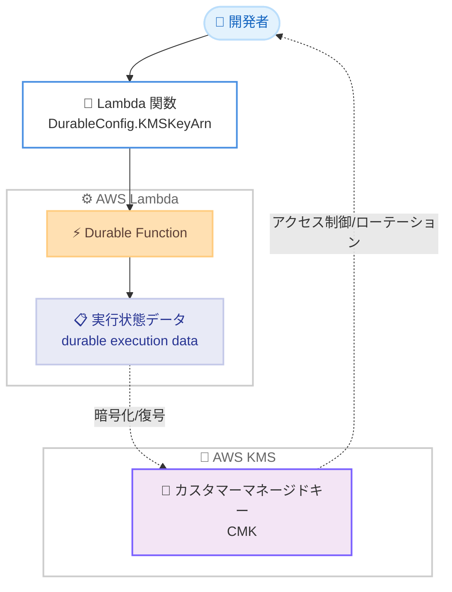

# AWS Lambda - Durable Functions のカスタマーマネージドキー暗号化対応

**リリース日**: 2026年7月22日
**サービス**: AWS Lambda
**機能**: Durable Functions のカスタマーマネージドキー (CMK) 暗号化

📊 [このアップデートのインフォグラフィックを見る](https://takech9203.github.io/aws-news-summary/20260722-durablefunctions-cmk.html)
<!-- INFOGRAPHIC_BASE_URL は環境変数から取得 -->

## 概要

AWS Lambda の Durable Functions が、実行状態データ (durable execution data) の暗号化に AWS Key Management Service (AWS KMS) のカスタマーマネージドキー (CMK) を利用できるようになりました。これまで Lambda は保存時の実行状態を AWS 所有キー (AWS owned key) で暗号化していましたが、今回のアップデートによりお客様が自身で選択・管理する暗号化キーを指定できます。

Lambda Durable Functions は、長時間実行される信頼性の高いワークフローを Lambda 関数コード内で直接構築できる機能で、状態管理を自動的に行います。今回の CMK 対応により、実行履歴や実行状態へのアクセス制御をお客様自身が管理できるようになります。

このアップデートは、金融サービスやヘルスケアなど、規制の厳しい業界でお客様所有のキーによる暗号化が求められるデータガバナンス要件を満たす必要があるユーザーにとって特に価値があります。

**アップデート前の課題**

- Durable Functions の実行状態データは AWS 所有キーでのみ暗号化され、お客様がキーを選択・管理できなかった
- キーのローテーションポリシーや、実行履歴・実行状態へのアクセスを誰に許可するかをお客様側で制御できなかった
- お客様所有のキーによる暗号化を義務付ける規制要件に対応できなかった

**アップデート後の改善**

- 実行状態データの暗号化に、お客様が管理する CMK を指定できるようになった
- キーのローテーションと、実行履歴・実行状態へのアクセス権限をお客様自身が制御できるようになった
- Durable Functions 用の暗号化キーは、環境変数や SnapStart スナップショットを保護する関数レベルのキーとは独立して動作するため、実行データへのアクセスを関数の構成とは別に管理できるようになった

## アーキテクチャ図



Durable Function の設定で CMK を指定すると、実行状態データが保存時にその CMK で暗号化され、お客様がキーのアクセス制御とローテーションを管理できます。

## サービスアップデートの詳細

### 主要機能

1. **お客様管理による暗号化 (Customer-controlled encryption)**
   - 実行状態データの暗号化に、AWS 所有キーではなくお客様が管理する CMK を指定できる
   - 金融サービスやヘルスケアなどの規制業界で求められる、お客様所有キーによるデータガバナンス要件に対応
   - 保存時 (at rest) の実行状態を対象とした暗号化

2. **キーの完全な制御 (Full key control)**
   - キーのローテーションポリシーをお客様が管理できる
   - 実行履歴や実行状態にアクセスできる主体をお客様が制御できる
   - AWS KMS のキーポリシーや IAM を通じたアクセス管理が可能

3. **独立したキー管理 (Independent key management)**
   - Durable Functions 用の暗号化キーは、関数レベルのキーとは独立して動作する
   - 関数レベルのキーは環境変数や SnapStart スナップショットを保護するもので、実行データ用のキーとは別に扱える
   - 実行データへのアクセス管理を関数の構成とは分離して運用できる

## 技術仕様

### DurableConfig の暗号化設定

Lambda API の関数構成には `DurableConfig` オブジェクトが含まれ、その中で Durable Functions 用の CMK を指定します。

| 項目 | 詳細 |
|------|------|
| パラメータ | `DurableConfig.KMSKeyArn` |
| 対象データ | Durable Functions の実行状態データ (保存時) |
| キーの種類 | AWS KMS カスタマーマネージドキー (CMK) |
| デフォルト | 未指定の場合は AWS 所有キーを使用 |
| 独立性 | 関数レベルのキー (`KMSKeyArn`) とは独立して動作 |
| 関連パラメータ | `DurableConfig.RetentionPeriodInDays`、`DurableConfig.ExecutionTimeout` |

### API変更履歴

| 日付 | サービス | 変更内容 |
|------|----------|----------|
| 2026/07/14 | [AWS Lambda](https://awsapichanges.com/archive/changes/ce62c7-lambda.html) | 8 updated methods - `CreateFunction` などの関数構成 API に `DurableConfig` (`KMSKeyArn` を含む) が定義され、Durable Functions の暗号化キー指定に対応 |

`CreateFunction` および `UpdateFunctionConfiguration` などの API では、`DurableConfig` 内の `KMSKeyArn` に CMK の ARN を指定します。関数の状態には `InvalidStateKMSKey` や `DisabledKMSKey` などのキー関連ステータスコードが返される場合があります。

### 設定例 (DurableConfig)

```json
{
  "FunctionName": "my-durable-function",
  "DurableConfig": {
    "KMSKeyArn": "arn:aws:kms:ap-northeast-1:111122223333:key/1234abcd-12ab-34cd-56ef-1234567890ab",
    "RetentionPeriodInDays": 90,
    "ExecutionTimeout": 86400
  }
}
```

## 設定方法

### 前提条件

1. Durable Functions を利用可能なリージョンで Lambda 関数を作成していること
2. AWS KMS でカスタマーマネージドキー (CMK) を作成済みであること
3. Lambda 実行ロールおよび KMS キーポリシーで、当該 CMK に対する暗号化・復号の権限が付与されていること

### 手順

#### ステップ1: KMS キーの準備

```bash
aws kms create-key --description "Lambda durable functions encryption key"
```

Durable Functions の実行状態データを暗号化するための CMK を作成します。既存のキーを利用する場合はこのステップは不要です。

#### ステップ2: Durable Function への CMK の指定

```bash
aws lambda update-function-configuration \
  --function-name my-durable-function \
  --durable-config '{"KMSKeyArn":"arn:aws:kms:ap-northeast-1:111122223333:key/1234abcd-12ab-34cd-56ef-1234567890ab"}'
```

既存の Durable Function の構成を更新し、実行状態データの暗号化に使用する CMK を指定します。新規作成時は `create-function` の `--durable-config` で同様に指定します。

#### ステップ3: キーポリシーとアクセス制御の確認

指定した CMK のキーポリシーで、Lambda サービスおよび関数の実行ロールが必要な暗号化・復号操作を実行できることを確認します。あわせて、実行履歴や実行状態にアクセスすべき主体だけがキーを利用できるよう、キーポリシーと IAM ポリシーでアクセスを制御します。

## メリット

### ビジネス面

- **規制要件への準拠**: 金融サービスやヘルスケアなど、お客様所有キーによる暗号化を求める規制やデータガバナンス要件に対応できる
- **監査対応の強化**: キーの利用状況を AWS CloudTrail などで追跡でき、監査やコンプライアンス報告に活用できる
- **追加コストの抑制**: Lambda 側の追加料金は発生せず、標準的な AWS KMS 料金のみで利用できる

### 技術面

- **キーライフサイクルの制御**: キーのローテーションや無効化をお客様のポリシーに沿って管理できる
- **関心の分離**: 実行データ用のキーを関数レベルのキーと独立させ、アクセス管理を分離できる
- **きめ細かなアクセス制御**: KMS キーポリシーと IAM を組み合わせ、実行履歴・実行状態へのアクセスを制御できる

## デメリット・制約事項

### 制限事項

- 暗号化の対象は Durable Functions の実行状態データであり、環境変数や SnapStart スナップショットは引き続き関数レベルのキーで保護される
- CMK を指定した場合、キーの無効化や削除により関数の状態が `DisabledKMSKey` や `InvalidStateKMSKey` などになり、実行に影響する可能性がある
- 利用可能なのは Durable Functions がサポートされているリージョンに限られる

### 考慮すべき点

- CMK に対する適切な権限が実行ロールおよびキーポリシーに設定されていないと、暗号化・復号が失敗する
- 標準の AWS KMS 料金 (キー保管料および API リクエスト料金) が発生するため、コスト見積もりに含める必要がある
- キーローテーションや削除の運用ポリシーを、実行状態データの保持期間 (`RetentionPeriodInDays`) とあわせて設計する必要がある

## ユースケース

### ユースケース1: 金融機関の長時間ワークフロー

**シナリオ**: 金融機関が、取引の照合や承認を含む長時間実行のワークフローを Durable Functions で構築している。規制により、保存データはお客様管理のキーで暗号化する必要がある。

**実装例**:
```
DurableConfig.KMSKeyArn = 金融部門が管理する CMK の ARN
```

**効果**: 実行状態データがお客様管理の CMK で暗号化され、規制要件を満たしつつワークフローの信頼性を維持できる。

### ユースケース2: ヘルスケアデータの処理

**シナリオ**: 医療関連システムで、患者データを扱うステートフルな処理を Durable Functions で実装している。実行履歴へのアクセスを厳格に制御する必要がある。

**実装例**:
```
CMK のキーポリシーで、特定の実行ロールとセキュリティ管理者のみに復号権限を付与
```

**効果**: 実行履歴と実行状態へのアクセスをキーポリシーで制御でき、機微なデータの保護とアクセス監査を強化できる。

### ユースケース3: マルチテナント SaaS でのキー分離

**シナリオ**: SaaS 事業者が、テナントごとに暗号化キーを分離したいと考えている。Durable Functions の実行データもテナント単位で保護したい。

**実装例**:
```
テナントごとに異なる CMK を用意し、関数の DurableConfig.KMSKeyArn に割り当て
```

**効果**: テナント単位でキーを分離でき、キーの無効化によるアクセス失効などの運用をテナントごとに実施できる。

## 料金

この機能自体に対する Lambda の追加料金は発生しません。カスタマーマネージドキーの利用にあたっては、標準の AWS KMS 料金 (キーの月額保管料および KMS API リクエスト料金) が適用されます。

### 料金例

| 使用量 | 月額料金 (概算) |
|--------|------------------|
| CMK 1 個の保管 | AWS KMS の標準キー保管料金が適用 |
| 暗号化・復号 API リクエスト | AWS KMS の標準リクエスト料金が適用 |
| Lambda 側の追加料金 | なし |

正確な料金は AWS KMS の料金ページを参照してください。

## 利用可能リージョン

Lambda Durable Functions が現在利用可能なすべての AWS リージョンで、この CMK 暗号化機能を利用できます。

## 関連サービス・機能

- **AWS Key Management Service (AWS KMS)**: 実行状態データの暗号化に使用する CMK を管理するサービス
- **AWS Lambda SnapStart**: 環境変数やスナップショットの保護に関数レベルのキーを使用する機能で、Durable Functions 用キーとは独立
- **AWS CloudTrail**: CMK の利用状況を記録し、監査やコンプライアンス対応に活用できる

## 参考リンク

- 📊 [インフォグラフィック](https://takech9203.github.io/aws-news-summary/20260722-durablefunctions-cmk.html)
- [公式発表 (What's New)](https://aws.amazon.com/about-aws/whats-new/2026/07/durablefunctions-cmk/)
- [Durable functions のドキュメント](https://docs.aws.amazon.com/lambda/latest/dg/durable-functions.html)
- [Encrypting Lambda durable execution data](https://docs.aws.amazon.com/lambda/latest/dg/durable-encryption.html)
- [AWS KMS 料金ページ](https://aws.amazon.com/kms/pricing/)

## まとめ

今回のアップデートにより、Lambda Durable Functions の実行状態データをお客様管理の CMK で暗号化できるようになり、キーのローテーションとアクセス制御をお客様自身が管理できます。金融やヘルスケアなど規制の厳しい業界で Durable Functions を活用する場合は、CMK の指定とキーポリシーの設計を検討し、データガバナンス要件への準拠を進めることを推奨します。
