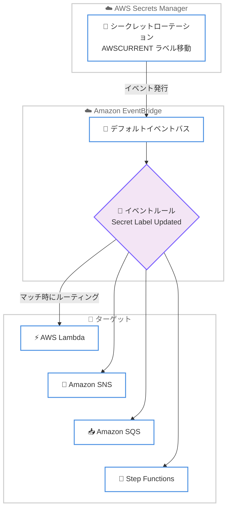

# AWS Secrets Manager - シークレット更新通知の Amazon EventBridge への発行

**リリース日**: 2026年7月22日
**サービス**: AWS Secrets Manager
**機能**: シークレット更新通知の Amazon EventBridge への発行 (Secret update notifications to Amazon EventBridge)

📊 [このアップデートのインフォグラフィックを見る](https://takech9203.github.io/aws-news-summary/20260722-secrets-manager-update-notifications.html)
<!-- INFOGRAPHIC_BASE_URL は環境変数から取得 -->

## 概要

AWS Secrets Manager は、シークレットの値が変更されたときに Amazon EventBridge へイベントを自動的に発行する機能を提供開始しました。これにより、シークレットの更新に反応するリアルタイムのイベント駆動型ワークフローを構築できるようになります。

Secrets Manager は、ステージングラベルが新しいバージョンに移動したときに `Secret Label Updated` イベントを EventBridge のデフォルトイベントバスへ発行します。たとえば、シークレットのローテーション時に `AWSCURRENT` ラベルが新しいバージョンへ移動すると、アクティブなシークレット値が変更されたことを示すイベントが送信されます。この通知は追加の設定やオプトインなしで、すべての Secrets Manager 利用可能リージョンで自動的に有効になります。

これまでシークレット値の変更を検知するには、CloudTrail のイベントを EventBridge で解析し、ローテーション成功、`PutSecretValue`、`UpdateSecretValue` など複数の API イベントをマッチングする必要がありました。今回のアップデートにより、Secrets Manager が直接 EventBridge へイベントを発行するため、こうした複雑な設定が不要になります。対象となるのは、シークレットの管理を行う開発者や運用担当者、およびセキュリティとコンプライアンス管理を担うチームです。

**アップデート前の課題**

- 以前はシークレット値の変更を検知するために、CloudTrail のイベントを EventBridge で解析する必要があった
- 以前はローテーション成功、`PutSecretValue`、`UpdateSecretValue` など複数の API イベントをマッチングする必要があり、設定が複雑だった
- 以前はシークレット更新をトリガーとしたリアルタイムのワークフロー構築に手間がかかった

**アップデート後の改善**

- 今回のアップデートにより、Secrets Manager が直接 EventBridge へ `Secret Label Updated` イベントを発行するようになった
- 今回のアップデートにより、CloudTrail を経由した複数 API イベントのマッチングが不要になった
- 今回のアップデートにより、シークレット値の変更をトリガーとしたイベント駆動型処理を追加設定なしで構築できるようになった

## アーキテクチャ図



シークレットのローテーションなどでステージングラベルが移動すると、Secrets Manager がデフォルトイベントバスにイベントを発行し、イベントルールにマッチしたイベントが Lambda、SNS、SQS、Step Functions などのターゲットへルーティングされます。

## サービスアップデートの詳細

### 主要機能

1. **`Secret Label Updated` イベントの発行**
   - Secrets Manager は、ステージングラベルが新しいバージョンへ移動したときに `Secret Label Updated` イベントを EventBridge のデフォルトイベントバスへ発行する
   - `AWSPENDING` と `AWSPREVIOUS` を除くすべてのラベルが対象で、カスタムラベルも含まれる
   - イベントはすべてのシークレットに対してデフォルトで有効になっている

2. **イベントパターンによる柔軟なフィルタリング**
   - `source` が `aws.secretsmanager`、`detail-type` が `Secret Label Updated` のイベントをマッチングできる
   - `detail` 内の `labelUpdated` でラベル (例: `AWSCURRENT`) を指定し、アクティブな値の変更のみを検知できる
   - `name` でシークレット名のプレフィックス指定 (例: `prod/`) を組み合わせた絞り込みが可能

3. **多様なターゲットへのルーティング**
   - AWS Lambda、Amazon SNS、Amazon SQS、AWS Step Functions など EventBridge がサポートするターゲットへ通知を送信できる
   - キャッシュされた認証情報のリフレッシュ、依存サービスの再起動、コンプライアンスレポートの更新などのワークフローを構築できる

## 技術仕様

### イベントの詳細

| 項目 | 詳細 |
|------|------|
| detail-type | `Secret Label Updated` |
| source | `aws.secretsmanager` |
| 発行先 | EventBridge デフォルトイベントバス |
| 対象ラベル | `AWSPENDING` と `AWSPREVIOUS` を除くすべてのステージングラベル (カスタムラベル含む) |
| 対象外 | タグ、説明、ローテーション設定、リソースポリシーなどのメタデータ変更 |
| 有効化 | すべてのシークレットでデフォルト有効 (オプトイン不要) |

### イベント構造の例

以下は、シークレットの `AWSCURRENT` ラベルが新しいバージョンへ移動したときの `Secret Label Updated` イベントの例です。

```json
{
  "version": "0",
  "id": "6a7e8feb-b491-4cf7-a9f1-bf3703467718",
  "detail-type": "Secret Label Updated",
  "source": "aws.secretsmanager",
  "account": "012345678901",
  "time": "2024-02-06T16:43:48Z",
  "region": "us-west-2",
  "resources": [
    "arn:aws:secretsmanager:us-west-2:012345678901:secret:mySecret-a1b2c3"
  ],
  "detail": {
    "name": "mySecret",
    "labelUpdated": "AWSCURRENT",
    "versionId": "a1b2c3d4-5678-90ab-cdef-EXAMPLE11111"
  }
}
```

`detail` フィールドには次の情報が含まれます。

- `name`: シークレットのフレンドリ名
- `labelUpdated`: 新しいバージョンに付与されたステージングラベル
- `versionId`: シークレットの新しいバージョンの一意の識別子

## 設定方法

### 前提条件

1. AWS Secrets Manager でシークレットが作成されていること
2. Amazon EventBridge でルールを作成する権限があること
3. 通知の送信先となるターゲット (Lambda、SNS、SQS、Step Functions など) が準備されていること

### 手順

#### ステップ1: イベントパターンの定義

```json
{
  "source": ["aws.secretsmanager"],
  "detail-type": ["Secret Label Updated"],
  "detail": {
    "labelUpdated": ["AWSCURRENT"]
  }
}
```

`AWSCURRENT` ラベルが新しいバージョンへ移動したイベント、つまりアクティブなシークレット値が変更されたイベントのみを選択するイベントパターンです。特定のシークレットに絞り込む場合は `detail.name` にプレフィックスを追加します。

#### ステップ2: EventBridge ルールの作成とターゲット指定

```bash
aws events put-rule \
  --name secret-current-updated \
  --event-pattern file://event-pattern.json

aws events put-targets \
  --rule secret-current-updated \
  --targets "Id"="1","Arn"="arn:aws:lambda:us-west-2:012345678901:function:RefreshCredentials"
```

デフォルトイベントバス上にイベントパターンを持つルールを作成し、マッチしたイベントを Lambda 関数などのターゲットへルーティングします。ターゲット側で Secrets Manager を呼び出す権限やリソースポリシーの設定を別途行ってください。

#### ステップ3: 動作確認

シークレットのローテーションを実行するか、新しいバージョンを作成して `AWSCURRENT` を移動させ、ターゲットが期待どおりに起動することを確認します。

## メリット

### ビジネス面

- **運用の簡素化**: CloudTrail を経由した複雑なイベントマッチングが不要になり、シークレット更新への対応を迅速に実装できる
- **追加コストなし**: 本機能は追加料金なしで利用できる
- **コンプライアンス強化**: シークレットのローテーションを検知してコンプライアンスレポートを自動更新できる

### 技術面

- **リアルタイム性**: シークレット値の変更を即座に検知し、キャッシュされた認証情報のリフレッシュや依存サービスの再起動を自動化できる
- **柔軟なフィルタリング**: `labelUpdated` や `name` のプレフィックスを組み合わせて、必要なイベントのみを選択できる
- **疎結合な連携**: EventBridge を介した疎結合なアーキテクチャで、複数のターゲットへ同時にイベントを配信できる

## デメリット・制約事項

### 制限事項

- `AWSPENDING` と `AWSPREVIOUS` のラベルに対してはイベントが発行されない
- タグ、説明、ローテーション設定、リソースポリシーなどのメタデータ変更ではイベントは発行されない
- イベントはデフォルトイベントバスにのみ発行される

### 考慮すべき点

- イベントの `detail` にはシークレットの値そのものは含まれない。実際の値の取得には別途 Secrets Manager の API 呼び出しが必要
- カスタムステージングラベルを利用したワークフローがある場合、意図しないラベル移動でイベントが発行される可能性があるため、`labelUpdated` によるフィルタリングを検討する

## ユースケース

### ユースケース1: キャッシュ認証情報の自動リフレッシュ

**シナリオ**: アプリケーションがデータベース認証情報をメモリにキャッシュしており、ローテーション後に古い認証情報を使い続けて接続エラーが発生する状況を防ぎたい。

**実装例**:
```json
{
  "source": ["aws.secretsmanager"],
  "detail-type": ["Secret Label Updated"],
  "detail": {
    "name": [{"prefix": "prod/db/"}],
    "labelUpdated": ["AWSCURRENT"]
  }
}
```

**効果**: `AWSCURRENT` の移動を検知して Lambda がアプリケーションのキャッシュをリフレッシュし、ローテーション後の接続エラーを未然に防止できる。

### ユースケース2: 依存サービスの再起動

**シナリオ**: 認証情報を環境変数として読み込むレガシーアプリケーションで、ローテーション後にサービスを再起動して新しい認証情報を反映させたい。

**実装例**:
```
Secret Label Updated イベント → EventBridge ルール → Step Functions
  → ECS サービスのローリング再デプロイを実行
```

**効果**: シークレット更新をトリガーに Step Functions のワークフローで依存サービスを安全に再起動し、手動対応を排除できる。

### ユースケース3: コンプライアンスレポートの自動更新

**シナリオ**: セキュリティチームがシークレットのローテーション状況を監査するため、ローテーションの発生を記録し続けたい。

**実装例**:
```
Secret Label Updated イベント → EventBridge ルール → SNS/SQS
  → 監査ログストアへローテーション履歴を記録
```

**効果**: ローテーションイベントを自動的に記録することで、コンプライアンスレポートを最新の状態に保ち、監査対応の負荷を軽減できる。

## 料金

本機能は追加料金なしで利用できます。ただし、EventBridge のルールやターゲット、Lambda、SNS、SQS、Step Functions などの下流サービスの利用には、各サービスの通常料金が適用されます。

## 利用可能リージョン

AWS Secrets Manager が利用可能なすべての AWS リージョンで利用できます。

## 関連サービス・機能

- **Amazon EventBridge**: シークレット更新イベントの受信とターゲットへのルーティングを担うイベントバスサービス
- **AWS Lambda**: シークレット更新をトリガーにキャッシュのリフレッシュなどの処理を実行するサーバーレスコンピューティング
- **AWS Step Functions**: 複数ステップにわたる依存サービスの再起動などのワークフローを実行するオーケストレーションサービス
- **AWS CloudTrail**: 従来のイベント検知手段。本機能により直接的なイベント発行が可能になった

## 参考リンク

- 📊 [インフォグラフィック](https://takech9203.github.io/aws-news-summary/20260722-secrets-manager-update-notifications.html)
- [公式発表 (What's New)](https://aws.amazon.com/about-aws/whats-new/2026/07/secrets-manager-update-notifications)
- [ドキュメント: Secret event notifications](https://docs.aws.amazon.com/secretsmanager/latest/userguide/secret-event-notifications.html)
- [ドキュメント: Secret Label Updated event](https://docs.aws.amazon.com/secretsmanager/latest/userguide/event-detail-secret-label-updated-secretsmanager.html)
- [料金ページ](https://aws.amazon.com/secrets-manager/pricing/)

## まとめ

本アップデートにより、AWS Secrets Manager はシークレット値の変更を EventBridge へ直接イベントとして発行できるようになり、CloudTrail を経由した複雑なイベントマッチングが不要になりました。追加料金なしですべての利用可能リージョンでデフォルト有効となるため、シークレットのローテーションを利用しているワークロードでは、キャッシュのリフレッシュや依存サービスの再起動、コンプライアンス記録の自動化に向けたイベント駆動型ワークフローの導入を検討することを推奨します。
