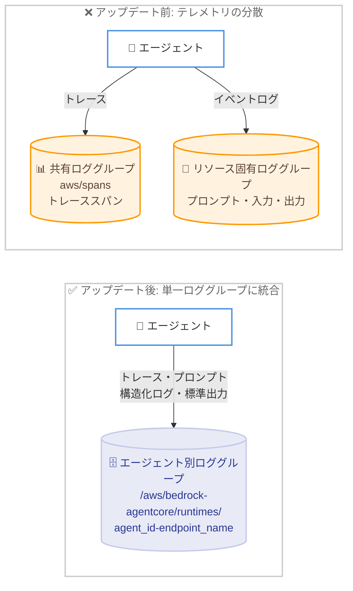

# Amazon Bedrock AgentCore - 統合オブザーバビリティ (単一ロググループでのトレースとログの集約)

**リリース日**: 2026 年 7 月 23 日
**サービス**: Amazon Bedrock AgentCore
**機能**: 統合オブザーバビリティ (Unified Observability)

📊 [このアップデートのインフォグラフィックを見る](https://takech9203.github.io/aws-news-summary/20260723-amazon-bedrock-agentcore-unified-observability-single-log-group.html)
<!-- INFOGRAPHIC_BASE_URL は環境変数から取得 -->

## 概要

Amazon Bedrock AgentCore は、AI エージェントのトレースとプロンプトを、エージェントのログと同じ Amazon CloudWatch ロググループに配信するようになりました。これにより、AI エージェントのテレメトリ (トレース、プロンプト、構造化ログ、標準出力) が単一のロググループに集約され、統合されたオブザーバビリティを実現します。

従来、AgentCore はエージェントのテレメトリを複数の配信先に分散させていました。トレーススパンは共有の `aws/spans` ロググループに送信される一方、プロンプト、入力、出力を含むイベントログはリソース固有の別のロググループに送信されていました。この構成では、1 回のエージェント呼び出しをデバッグするために複数のロググループを横断して検索する必要があり、また個々のエージェント単位でのきめ細かいアクセス制御やカスタマーマネージドキー (CMK) による暗号化を適用できませんでした。

今回のアップデートにより、エージェントのすべてのテレメトリが、エージェントごとの単一のロググループ (`/aws/bedrock-agentcore/runtimes/<agent_id>-<endpoint_name>`) に配信されます。これにより、トレースとログを 1 か所で相関分析でき、IAM ポリシーと CMK 暗号化を個々のエージェントにスコープでき、単一のロググループをサブスクライブするだけですべてのテレメトリをエクスポートできるようになります。

**アップデート前の課題**

今回のアップデート以前は、エージェントのテレメトリが分散していたため、運用上の負担がありました。

- トレーススパンは共有の `aws/spans` ロググループに、プロンプトや入出力を含むイベントログはリソース固有の別ロググループに配信されていた
- 1 回のエージェント呼び出しをデバッグするには、複数のロググループを横断して検索する必要があった
- 個々のエージェント単位できめ細かいアクセス制御や CMK 暗号化を適用できなかった
- テレメトリをエクスポートするには複数のロググループをそれぞれサブスクライブする必要があった

**アップデート後の改善**

今回のアップデートにより、テレメトリが単一のロググループに集約されました。

- トレース、プロンプト、構造化ログ、標準出力がエージェントごとの単一ロググループにまとまり、トレースとログを 1 か所で相関分析できるようになった
- IAM ポリシーと CMK 暗号化を個々のエージェント単位でスコープできるようになった
- 単一のロググループをサブスクライブするだけで、すべてのテレメトリをエクスポートできるようになった
- マルチエージェント構成では、各エージェントの完全な実行履歴が 1 つのロググループにまとまるため、エンドツーエンドのデバッグが容易になった

## アーキテクチャ図



上図はアップデート前後のテレメトリ配信先を比較したものです。従来は共有の `aws/spans` ロググループとリソース固有ロググループに分散していたテレメトリが、アップデート後はエージェント別の単一ロググループに集約されます。

## サービスアップデートの詳細

### 主要機能

1. **単一ロググループへのテレメトリ集約**
   - スパンは、共有の `aws/spans` ロググループではなく、エージェントのロググループ (`/aws/bedrock-agentcore/runtimes/<agent_id>-<endpoint_name>`) 内の `spans` ログストリームに配信される
   - トレース、プロンプト、構造化ログ、標準出力がエージェントごとに 1 か所にまとまる
   - トレースとログを同じロググループ内で相関分析できる

2. **エージェント単位のアクセス制御と暗号化**
   - IAM ポリシーを個々のエージェントのロググループにスコープできる
   - CMK (カスタマーマネージドキー) による暗号化をエージェント単位で適用できる
   - セキュリティ要件の異なる複数のエージェントを、それぞれ独立した権限・暗号化設定で運用できる

3. **テレメトリの一元エクスポート**
   - 単一のロググループをサブスクライブするだけで、すべてのテレメトリをエクスポートできる
   - サブスクリプションフィルターや外部の可観測性プラットフォームへの連携が簡素化される

## 技術仕様

### ロググループとデフォルト動作

| 項目 | 詳細 |
|------|------|
| 統合後のロググループ | `/aws/bedrock-agentcore/runtimes/<agent_id>-<endpoint_name>` |
| スパンのログストリーム | `spans` |
| 従来のトレース配信先 | 共有の `aws/spans` ロググループ |
| 新規エージェントのデフォルト | 2026 年 7 月 20 日以降、サポート対象リージョンで作成された新規エージェントは統合オブザーバビリティがデフォルトで有効 (設定不要) |
| 既存エージェント | 環境変数の設定と ADOT のアップグレードが必要 |
| 既存データ | 配信先を変更しても、既に配信済みのスパンデータは元のロググループに残る (移動されない) |

### 有効化の前提条件

AgentCore がエージェントのロググループにスパンを配信するには、以下の条件を満たす必要があります。

| 条件 | 内容 |
|------|------|
| CloudWatch Transaction Search | アカウントで有効化し、トレースセグメントを CloudWatch Logs に送信する。有効化されていない場合、スパンはエージェントのロググループに配信されない |
| 実行ロールの権限 | エージェントの実行ロールに、対象ロググループへの `logs:PutResourcePolicy` アクションを付与する。AgentCore はこの権限を使って AWS X-Ray からのスパン配信を許可する |
| ADOT バージョン | ADOT 0.18.0 以降 (`aws-opentelemetry-distro>=0.18.0`) を使用する。これより古いバージョンはスパン配信先の設定を無視し、共有の `aws/spans` ロググループに配信する |

**補足**: 今回の What's New 発表では ADOT のバージョン要件は 0.17.1 以降と案内されていますが、現時点の AgentCore デベロッパーガイドでは 0.18.0 以降が要件として明記されています。実装時は最新のドキュメントに従い、可能な限り新しいバージョンを利用することを推奨します。

### 環境変数による制御

```bash
# 共有 aws/spans ロググループを使用する既存エージェントをオプトイン
# (スパンをエージェント自身のロググループに配信)
UNIFIED_TRACES_DESTINATION_ENABLED=true

# エージェント自身のロググループを使用するエージェントをオプトアウト
# (スパンを共有 aws/spans ロググループに配信)
UNIFIED_TRACES_DESTINATION_ENABLED=false
```

## 設定方法

### 前提条件

1. CloudWatch Transaction Search がアカウントで有効化されていること
2. エージェントの実行ロールに、対象ロググループへの `logs:PutResourcePolicy` 権限が付与されていること
3. エージェントが ADOT 0.18.0 以降 (`aws-opentelemetry-distro>=0.18.0`) を使用していること

### 手順

#### ステップ 1: CloudWatch Transaction Search を有効化する

```bash
# X-Ray がトレースを CloudWatch Logs に送信できるようにリソースポリシーを追加
aws logs put-resource-policy --policy-name MyResourcePolicy --policy-document '{...}'

# トレースセグメントの配信先を CloudWatch Logs に設定
aws xray update-trace-segment-destination --destination CloudWatchLogs
```

上記のコマンドは、AWS X-Ray に CloudWatch Logs へトレースを送信する権限を付与し、トレースセグメントの配信先を CloudWatch Logs に設定します。この設定がないと、AgentCore はスパンをエージェントのロググループに配信できません。

#### ステップ 2: 既存エージェントで統合オブザーバビリティを有効化する

```bash
# エージェントランタイムに環境変数を設定
UNIFIED_TRACES_DESTINATION_ENABLED=true
```

既存のエージェントで統合オブザーバビリティをオプトインするには、エージェントランタイムに `UNIFIED_TRACES_DESTINATION_ENABLED=true` を設定します。これにより、AgentCore はエージェントのスパンを自身のロググループに配信するようになります。

#### ステップ 3: ADOT をアップグレードする

```bash
# requirements.txt に記載
aws-opentelemetry-distro>=0.18.0
boto3
```

エージェントの依存関係で ADOT のバージョンを 0.18.0 以降に更新します。古いバージョンではスパン配信先の設定が無視され、従来どおり共有の `aws/spans` ロググループに配信されるため、必ずアップグレードが必要です。なお、2026 年 7 月 20 日以降にサポート対象リージョンで新規作成したエージェントは、統合オブザーバビリティがデフォルトで有効なため、これらの設定は不要です。

## メリット

### ビジネス面

- **運用効率の向上**: 複数のロググループを横断した検索が不要になり、エージェント呼び出しのデバッグ時間を短縮できる
- **ガバナンスの強化**: エージェント単位で IAM アクセス制御と CMK 暗号化を適用でき、コンプライアンス要件に対応しやすくなる
- **設定不要の自動適用**: 新規エージェントはデフォルトで統合オブザーバビリティが有効になり、追加のセットアップコストが発生しない

### 技術面

- **トレースとログの相関分析**: 同一ロググループ内でトレースとログを突き合わせ、根本原因の特定を迅速化できる
- **エクスポートの簡素化**: 単一のロググループをサブスクライブするだけで、すべてのテレメトリを外部システムへエクスポートできる
- **マルチエージェントのデバッグ性向上**: 各エージェントの完全な実行履歴が 1 つのロググループにまとまり、エンドツーエンドの追跡が容易になる

## デメリット・制約事項

### 制限事項

- 配信先を変更しても、既に配信済みのスパンデータは移動されず、元のロググループに残る
- CloudWatch Transaction Search が有効化されていない場合、スパンはエージェントのロググループに配信されない
- ADOT のバージョンが要件を満たさない場合、設定が無視され共有の `aws/spans` ロググループに配信される
- サポート対象リージョンが対応する前に作成されたエージェントは、デフォルトで共有の `aws/spans` ロググループを使用し続ける

### 考慮すべき点

- 既存エージェントを移行する際は、環境変数の設定、実行ロールの権限付与、ADOT のアップグレードをすべて実施する必要がある
- 統合オブザーバビリティへの切り替え前後でスパンデータが分散するため、移行時期を明確に記録しておくとよい

## ユースケース

### ユースケース 1: マルチエージェントシステムのエンドツーエンドデバッグ

**シナリオ**: 複数のエージェントが連携して処理を行うシステムで、特定のエージェント呼び出しで発生したエラーの原因を調査する。

**実装例**:
```
# エージェントごとのロググループを参照
/aws/bedrock-agentcore/runtimes/<agent_id>-<endpoint_name>
# spans ログストリームでトレースを、同ロググループ内でプロンプト・入出力を確認
```

**効果**: 複数のロググループを横断せずに、各エージェントの完全な実行履歴を 1 か所で確認でき、デバッグ時間を短縮できる。

### ユースケース 2: エージェント単位のセキュリティ要件への対応

**シナリオ**: 機密データを扱うエージェントと一般的なエージェントを、それぞれ異なるアクセス制御・暗号化ポリシーで運用したい。

**実装例**:
```
# 機密エージェントのロググループに CMK 暗号化を適用
# 対応する IAM ポリシーをそのロググループにスコープ
```

**効果**: エージェント単位で CMK 暗号化ときめ細かいアクセス制御を適用でき、最小権限の原則とコンプライアンス要件を満たせる。

### ユースケース 3: テレメトリの一元エクスポート

**シナリオ**: エージェントのすべてのテレメトリを外部の可観測性プラットフォームや SIEM へ転送して分析したい。

**実装例**:
```
# エージェントの単一ロググループにサブスクリプションフィルターを設定
aws logs put-subscription-filter \
  --log-group-name "/aws/bedrock-agentcore/runtimes/<agent_id>-<endpoint_name>" \
  --filter-name "export-all-telemetry" ...
```

**効果**: 単一のロググループをサブスクライブするだけで、トレース、プロンプト、ログを含むすべてのテレメトリをエクスポートでき、連携設定を簡素化できる。

## 料金

今回のアップデート自体に追加料金はありません。テレメトリの保存・処理には通常の Amazon CloudWatch Logs および AWS X-Ray (CloudWatch Transaction Search) の料金が適用されます。詳細は各サービスの料金ページを参照してください。

## 利用可能リージョン

AgentCore ランタイムがサポートされているすべての AWS 商用リージョンで利用可能です。2026 年 7 月 20 日以降にサポート対象リージョンで作成された新規エージェントは、統合オブザーバビリティがデフォルトで有効になります。サポート対象リージョンが対応する前に作成されたエージェントは、引き続き共有の `aws/spans` ロググループをデフォルトの配信先として使用します。

## 関連サービス・機能

- **Amazon CloudWatch Logs**: エージェントのテレメトリが配信される単一ロググループの基盤となるサービス
- **AWS X-Ray / CloudWatch Transaction Search**: トレーススパンを CloudWatch Logs に配信するために有効化が必要な機能
- **AWS Distro for OpenTelemetry (ADOT)**: エージェントコードからトレース・メトリクスを出力するための SDK。統合オブザーバビリティには 0.18.0 以降が必要
- **AWS KMS (カスタマーマネージドキー)**: エージェント単位のロググループ暗号化に使用

## 参考リンク

- 📊 [インフォグラフィック](https://takech9203.github.io/aws-news-summary/20260723-amazon-bedrock-agentcore-unified-observability-single-log-group.html)
- [公式発表 (What's New)](https://aws.amazon.com/about-aws/whats-new/2026/07/amazon-bedrock-agentcore-unified-observability-single-log-group/)
- [ドキュメント (AgentCore デベロッパーガイド - オブザーバビリティの設定)](https://docs.aws.amazon.com/bedrock-agentcore/latest/devguide/observability-configure.html)
- [Amazon CloudWatch 料金ページ](https://aws.amazon.com/cloudwatch/pricing/)

## まとめ

Amazon Bedrock AgentCore の統合オブザーバビリティは、これまで分散していたエージェントのテレメトリを単一のロググループに集約し、デバッグ、アクセス制御、暗号化、エクスポートを大幅に簡素化する重要なアップデートです。新規エージェントはデフォルトで有効になるため追加設定は不要ですが、既存エージェントを利用している場合は、`UNIFIED_TRACES_DESTINATION_ENABLED=true` の設定、実行ロールへの権限付与、ADOT 0.18.0 以降へのアップグレードを実施して移行することを推奨します。
