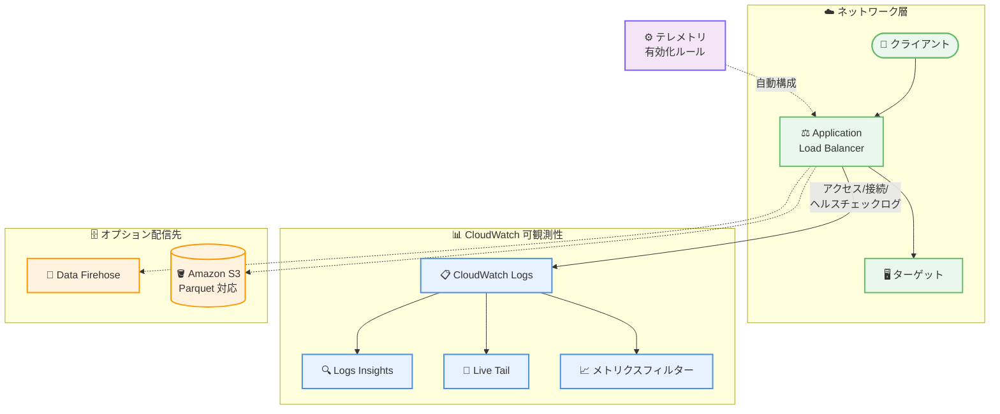

# Amazon CloudWatch Logs - Application Load Balancer ログのサポート

**リリース日**: 2026 年 7 月 23 日
**サービス**: Amazon CloudWatch Logs
**機能**: Application Load Balancer (ALB) ログの vended logs としてのサポート

📊 [このアップデートのインフォグラフィックを見る](https://takech9203.github.io/aws-news-summary/20260723-amazon-cloudwatch-logs.html)
<!-- INFOGRAPHIC_BASE_URL は環境変数から取得 -->

## 概要

Amazon CloudWatch Logs が、Application Load Balancer (ALB) のログを vended logs (ベンドログ) としてサポートするようになりました。これにより、ALB のアクセスログ、接続ログ、ヘルスチェックログを CloudWatch 内で直接分析できるようになり、ネットワークトラフィックパターンの可観測性が向上し、デバッグが簡素化されます。

従来、ALB のログを詳細に分析するには Amazon S3 にログを配信し、Amazon Athena などの別のツールでクエリを実行する必要がありました。今回のアップデートにより、CloudWatch Logs Insights によるクエリ、メトリクスフィルターによる監視とアラーム、Live Tail によるリアルタイム表示といった CloudWatch のネイティブ機能を ALB ログに対して利用できます。

さらに、CloudWatch のテレメトリ有効化ルール (telemetry enablement rules) を設定することで、組織、アカウント、または特定のリソース単位で、既存および新規の ALB リソースに対してロギングを自動的に構成できます。これにより、手動セットアップなしで一貫した監視を実現できます。対象ユーザーは、ロードバランサーを利用するアプリケーション運用チームや、ネットワークトラブルシューティングを担当するインフラ担当者です。

**アップデート前の課題**

- 以前は ALB のログを詳細に分析するには S3 に配信し、Athena など別のツールでクエリを実行する必要があった
- 以前は CloudWatch Logs Insights や Live Tail などの CloudWatch ネイティブ機能を ALB ログに直接適用できなかった
- 以前は複数の ALB リソースに対するロギング設定を個別に手動で構成する必要があった

**アップデート後の改善**

- 今回のアップデートにより ALB のアクセスログ、接続ログ、ヘルスチェックログを CloudWatch 内で直接分析できるようになった
- 今回のアップデートにより CloudWatch Logs Insights、メトリクスフィルター、Live Tail を ALB ログに対して利用できるようになった
- 今回のアップデートによりテレメトリ有効化ルールで組織やアカウント単位のロギング設定を自動化でき、手動セットアップが不要になった

## アーキテクチャ図



ALB が生成するアクセスログ、接続ログ、ヘルスチェックログを CloudWatch Logs へ直接配信し、Logs Insights や Live Tail で分析するフローを示しています。テレメトリ有効化ルールによりロギング設定を自動構成でき、オプションで Data Firehose や S3 への配信も可能です。

## サービスアップデートの詳細

### 主要機能

1. **ALB ログの CloudWatch Logs への直接配信**
   - アクセスログ、接続ログ、ヘルスチェックログを vended logs として CloudWatch Logs に配信
   - クライアント接続、トラフィック分散、接続ステータス、ターゲットのヘルス状態を可視化
   - ネットワーク問題の特定とトラブルシューティングを高速化

2. **CloudWatch ネイティブ機能の活用**
   - CloudWatch Logs Insights によるアクセスパターンのクエリ分析
   - メトリクスフィルターによる監視とアラームの作成
   - Live Tail によるトラフィックのリアルタイム表示

3. **テレメトリ有効化ルールによる自動構成**
   - 組織、アカウント、または特定のリソース単位でロギングを自動設定
   - 既存および新規の ALB リソースの両方に適用
   - 手動セットアップなしで一貫した監視を実現

4. **柔軟な配信先オプション**
   - CloudWatch Logs に加え、Amazon Data Firehose や Amazon S3 への配信が可能
   - S3 配信では Apache Parquet 形式をサポート

## 技術仕様

### ログの種類と配信先

| 項目 | 詳細 |
|------|------|
| 対象ログ | アクセスログ、接続ログ、ヘルスチェックログ |
| 主な配信先 | CloudWatch Logs |
| オプション配信先 | Amazon Data Firehose、Amazon S3 |
| S3 フォーマット | Apache Parquet 形式に対応 |
| 設定方法 | AWS マネジメントコンソール (ロードバランサーの統合タブ)、AWS CLI、SDK |

### API 変更履歴

今回のアップデートに直接関連する awsapichanges.com 上の API 変更エントリは確認されませんでした。設定はロードバランサーの統合タブ、および CloudWatch のテレメトリ有効化ルールを通じて行います。

## 設定方法

### 前提条件

1. Application Load Balancer が作成済みであること
2. CloudWatch Logs へのログ配信に必要な IAM 権限が設定されていること
3. 利用するリージョンで ALB と CloudWatch の両方が利用可能であること

### 手順

#### ステップ 1: ロードバランサーの統合タブを開く

AWS マネジメントコンソールで対象の Application Load Balancer を選択し、統合 (Integrations) タブを開きます。ここから CloudWatch Logs へのログ配信を構成します。

#### ステップ 2: CloudWatch Logs へのログ配信を有効化する

配信するログの種類 (アクセスログ、接続ログ、ヘルスチェックログ) と、配信先のロググループを指定します。AWS CLI や SDK を使用した構成も可能です。

#### ステップ 3: テレメトリ有効化ルールを設定する (任意)

複数の ALB リソースに対して一貫してロギングを適用する場合、CloudWatch のテレメトリ有効化ルールを設定します。組織、アカウント、または特定のリソース単位で、既存および新規の ALB に対してロギングを自動構成できます。

## メリット

### ビジネス面

- **運用効率の向上**: 別ツールへの切り替えなしに CloudWatch 内でログ分析を完結でき、トラブルシューティング時間を短縮
- **ガバナンスの強化**: テレメトリ有効化ルールにより、組織全体で一貫したロギング設定を自動的に適用
- **コスト最適化**: S3 への配信は無料であり、用途に応じて配信先を使い分け可能

### 技術面

- **可観測性の統合**: ALB ログを CloudWatch の Logs Insights、メトリクスフィルター、Live Tail で統一的に分析
- **リアルタイム性**: Live Tail によりトラフィックをリアルタイムで確認可能
- **柔軟なデータ活用**: S3 への Parquet 形式配信により、大規模なログ分析基盤との連携が容易

## デメリット・制約事項

### 制限事項

- CloudWatch Logs および Data Firehose への配信は vended logs として課金される
- Parquet 変換にはコストが発生する (バージニア北部で 0.035 USD/GB)
- 利用は ALB と CloudWatch の両方が利用可能なリージョンに限定される

### 考慮すべき点

- ログ量が多い環境では vended logs の課金額が増加する可能性があるため、配信先の選定 (CloudWatch Logs / S3) を検討する
- コストを重視する場合、無料の S3 配信と CloudWatch Logs 配信を用途に応じて使い分ける

## ユースケース

### ユースケース 1: ネットワーク障害の迅速なトラブルシューティング

**シナリオ**: 特定のクライアントからの接続が断続的に失敗する問題が報告された。

**実装例**:
```
CloudWatch Logs Insights で接続ログをクエリし、接続ステータスや
ターゲットのヘルス状態を分析して障害の原因を特定する
```

**効果**: S3 と Athena を介さず CloudWatch 内で直接分析でき、原因特定までの時間を短縮

### ユースケース 2: 組織全体での一貫したログ監視の自動化

**シナリオ**: 複数アカウントで多数の ALB を運用しており、すべてに一貫したロギング設定を適用したい。

**実装例**:
```
CloudWatch のテレメトリ有効化ルールを組織単位で設定し、
既存および新規の ALB に対してロギングを自動構成する
```

**効果**: 手動セットアップなしで組織全体の監視を標準化し、設定漏れを防止

### ユースケース 3: リアルタイムのトラフィック監視

**シナリオ**: 新しいアプリケーションのリリース直後に、トラフィックの挙動をリアルタイムで確認したい。

**実装例**:
```
Live Tail で ALB のアクセスログをリアルタイム表示し、
メトリクスフィルターで異常なアクセスパターンにアラームを設定する
```

**効果**: リリース直後の問題を即座に検知し、迅速に対応

## 料金

ALB ログを CloudWatch Logs および Amazon Data Firehose に配信する場合、vended logs として課金されます。Amazon S3 への配信は無料です。S3 配信時の Apache Parquet 形式への変換には、バージニア北部リージョンで 0.035 USD/GB のコストが発生します。詳細な料金は CloudWatch の料金ページを参照してください。

### 料金例

| 使用量 | 月額料金 (概算) |
|--------|------------------|
| CloudWatch Logs / Data Firehose への配信 | vended logs 料金が適用 |
| Amazon S3 への配信 | 無料 |
| Parquet 変換 (バージニア北部) | 0.035 USD/GB |

## 利用可能リージョン

Application Load Balancer と CloudWatch の両方が利用可能な、すべての AWS 商用リージョンおよび AWS GovCloud (US) リージョンで利用できます。

## 関連サービス・機能

- **Application Load Balancer**: 今回ログ配信の対象となるロードバランサー。アクセスログ、接続ログ、ヘルスチェックログを生成
- **Amazon CloudWatch Logs Insights**: 配信されたログに対してクエリ分析を実行
- **Amazon Data Firehose**: ALB ログのオプション配信先
- **Amazon S3**: ALB ログのオプション配信先。Apache Parquet 形式に対応

## 参考リンク

- 📊 [インフォグラフィック](https://takech9203.github.io/aws-news-summary/20260723-amazon-cloudwatch-logs.html)
- [公式発表 (What's New)](https://aws.amazon.com/about-aws/whats-new/2026/07/amazon-cloudwatch-logs/)
- [CloudWatch Logs での ALB ログの構成](https://docs.aws.amazon.com/elasticloadbalancing/latest/application/load-balancer-cloudwatch-logs.html)
- [テレメトリ有効化ルール](https://docs.aws.amazon.com/AmazonCloudWatch/latest/monitoring/telemetry-config-rules.html)
- [CloudWatch 料金ページ](https://aws.amazon.com/cloudwatch/pricing/)

## まとめ

このアップデートにより、Application Load Balancer のログを CloudWatch 内で直接分析でき、ネットワークトラフィックの可観測性が大きく向上します。特にテレメトリ有効化ルールによる自動構成は、大規模環境での監視の標準化に有効です。ALB を運用している場合は、既存のログ配信構成を見直し、CloudWatch Logs への統合とコスト影響の評価を検討することを推奨します。
