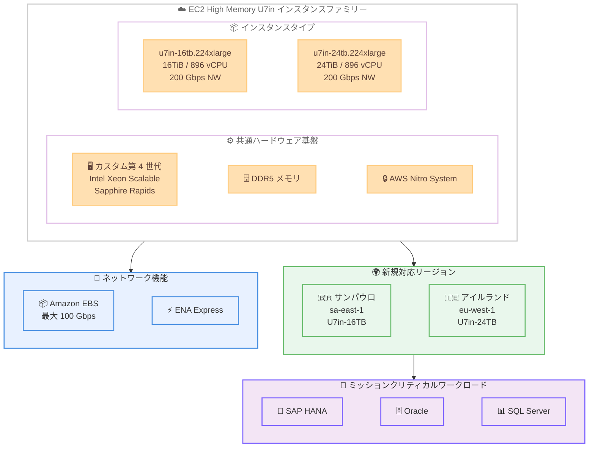

# Amazon EC2 - High Memory U7i インスタンスの追加リージョン展開

**リリース日**: 2026年07月23日
**サービス**: Amazon EC2
**機能**: High Memory U7in-16TB、U7in-24TB インスタンスの追加リージョン展開

📊 [このアップデートのインフォグラフィックを見る](https://takech9203.github.io/aws-news-summary/20260723-amazon-ec2-high-memory-u7i.html)

## 概要

Amazon EC2 High Memory U7i インスタンスが新たな AWS リージョンで利用可能になりました。U7in-16TB インスタンス (u7in-16tb.224xlarge) が南米 (サンパウロ) リージョンで、U7in-24TB インスタンス (u7in-24tb.224xlarge) がヨーロッパ (アイルランド) リージョンで提供開始されています。

U7in インスタンスは AWS 第 7 世代のインスタンスファミリーに属し、カスタム第 4 世代 Intel Xeon Scalable Processors (Sapphire Rapids) を搭載しています。DDR5 メモリテクノロジーを採用し、16TiB から 24TiB のメモリ容量を提供します。いずれのインスタンスも 896 vCPU と最大 200 Gbps のネットワーク帯域幅をサポートし、SAP HANA、Oracle、SQL Server などのミッションクリティカルなインメモリデータベースワークロードに最適化されています。

今回のリージョン拡大により、南米およびヨーロッパのユーザーがデータレジデンシー要件を満たしつつ、急成長するデータ環境でトランザクション処理スループットをスケールアップできるようになります。

**アップデート前の課題**

- 南米 (サンパウロ) リージョンで U7in-16TB インスタンスが利用できず、16TiB メモリ規模のインメモリデータベースを同リージョンで実行できなかった
- ヨーロッパ (アイルランド) リージョンで U7in-24TB インスタンスが利用できず、最大級のインメモリワークロードのリージョン選択肢が限られていた
- 大容量メモリインスタンスを利用するために、地理的に離れたリージョンにワークロードを配置する必要があった

**アップデート後の改善**

- 南米 (サンパウロ) で u7in-16tb.224xlarge (16TiB メモリ、896 vCPU、200 Gbps ネットワーク) が利用可能になった
- ヨーロッパ (アイルランド) で u7in-24tb.224xlarge (24TiB メモリ、896 vCPU、200 Gbps ネットワーク) が利用可能になった
- 南米およびヨーロッパのユーザーが、データレジデンシー要件を満たしながら大規模インメモリデータベースをローカルリージョンで運用できるようになった

## アーキテクチャ図



U7in High Memory インスタンスファミリーの 2 つのインスタンスタイプと、今回新たに対応した 2 リージョン、主要なインメモリデータベースワークロードの関係を示した図です。

## サービスアップデートの詳細

### 主要機能

1. **U7in-16TB インスタンス - 南米 (サンパウロ) 追加**
   - インスタンスタイプ: u7in-16tb.224xlarge
   - 16TiB の DDR5 メモリ、896 vCPU を搭載
   - 南米 (サンパウロ) リージョンで利用可能に
   - 最大 100 Gbps の EBS 帯域幅および 200 Gbps のネットワーク帯域幅をサポート
   - 高速データローディングとバックアップに最適

2. **U7in-24TB インスタンス - ヨーロッパ (アイルランド) 追加**
   - インスタンスタイプ: u7in-24tb.224xlarge
   - 24TiB の DDR5 メモリ、896 vCPU を搭載
   - ヨーロッパ (アイルランド) リージョンで利用可能に
   - 最大 100 Gbps の EBS 帯域幅および 200 Gbps のネットワーク帯域幅をサポート
   - 最大級のインメモリデータベースワークロードに対応

3. **ENA Express による高速ネットワーク**
   - 両インスタンスタイプで ENA Express をサポート
   - テールレイテンシを削減し、安定したネットワークパフォーマンスを提供
   - 大容量データの高速転送を実現

## 技術仕様

### インスタンスタイプ比較

| 項目 | u7in-16tb.224xlarge | u7in-24tb.224xlarge |
|------|---------------------|---------------------|
| メモリ | 16TiB DDR5 | 24TiB DDR5 |
| vCPU | 896 | 896 |
| プロセッサ | カスタム第 4 世代 Intel Xeon Scalable | カスタム第 4 世代 Intel Xeon Scalable |
| EBS 帯域幅 | 最大 100 Gbps | 最大 100 Gbps |
| ネットワーク帯域幅 | 200 Gbps | 200 Gbps |
| ENA Express | サポート | サポート |
| 今回の追加リージョン | sa-east-1 | eu-west-1 |

### 対応ワークロード

| ワークロード | 説明 |
|-------------|------|
| SAP HANA | ミッションクリティカルなインメモリデータベース、OLTP/OLAP 統合処理 |
| Oracle Database | 大規模トランザクション処理、インメモリオプション活用 |
| SQL Server | エンタープライズデータベースワークロード、インメモリ OLTP |
| インメモリキャッシュ | 大規模キャッシュレイヤー、リアルタイム分析 |

## 設定方法

### 前提条件

1. AWS アカウントが有効化されている
2. 対象リージョンでサービスクォータが適切に設定されている (High Memory インスタンスはデフォルトクォータで不足する可能性が高い)
3. High Memory インスタンスの起動に必要な IAM 権限が設定されている

### 手順

#### ステップ 1: サービスクォータの確認と引き上げ

```bash
# High Memory インスタンスの vCPU クォータを確認 (例: サンパウロ)
aws service-quotas get-service-quota \
  --service-code ec2 \
  --quota-code L-43DA4232 \
  --region sa-east-1
```

U7in インスタンスは 896 vCPU を使用するため、デフォルトのクォータでは不足します。事前にクォータ引き上げをリクエストしてください。

#### ステップ 2: U7in インスタンスの起動

```bash
# u7in-16tb.224xlarge をサンパウロリージョンで起動
aws ec2 run-instances \
  --instance-type u7in-16tb.224xlarge \
  --image-id ami-xxxxxxxxx \
  --subnet-id subnet-xxxxxxxxx \
  --security-group-ids sg-xxxxxxxxx \
  --key-name my-key-pair \
  --region sa-east-1

# u7in-24tb.224xlarge をアイルランドリージョンで起動
aws ec2 run-instances \
  --instance-type u7in-24tb.224xlarge \
  --image-id ami-xxxxxxxxx \
  --subnet-id subnet-xxxxxxxxx \
  --security-group-ids sg-xxxxxxxxx \
  --key-name my-key-pair \
  --region eu-west-1
```

対象リージョンに対応した AMI ID を指定してインスタンスを起動します。SAP HANA ワークロードの場合は、SAP 認定 AMI の使用を推奨します。

#### ステップ 3: EBS ボリュームの最適化

```bash
# 高スループット EBS ボリュームを作成 (例: アイルランドリージョン)
aws ec2 create-volume \
  --volume-type io2 \
  --size 10000 \
  --iops 64000 \
  --availability-zone eu-west-1a \
  --region eu-west-1
```

U7in インスタンスは最大 100 Gbps の EBS 帯域幅をサポートしています。io2 または io2 Block Express ボリュームを使用することで、データの読み込みとバックアップのパフォーマンスを最大限活用できます。

## メリット

### ビジネス面

- **データレジデンシーの遵守**: ブラジル (サンパウロ) やアイルランドのデータ保護規制に対応しながら、大容量メモリインスタンスを利用可能
- **レイテンシの最適化**: 南米およびヨーロッパのエンドユーザーに近いリージョンでインメモリデータベースを実行することで、アプリケーション応答時間を改善
- **災害復旧の柔軟性**: リージョン選択肢の拡大により、マルチリージョン構成での DR 戦略の選択肢が増加

### 技術面

- **超大容量メモリ**: 最大 24TiB の DDR5 メモリにより、単一インスタンスで大規模インメモリデータベースを実行可能
- **高帯域幅ネットワーク**: 両インスタンスとも 200 Gbps のネットワーク帯域幅を提供し、大容量データの高速転送を実現
- **スケーラブルなトランザクション処理**: 急成長するデータ環境でトランザクション処理スループットを垂直スケールで対応可能
- **ENA Express 対応**: 両インスタンスタイプで ENA Express をサポートし、テールレイテンシを削減

## デメリット・制約事項

### 制限事項

- 今回追加されたインスタンスタイプとリージョンの組み合わせは限定的 (U7in-16TB はサンパウロ、U7in-24TB はアイルランドのみ)
- High Memory インスタンスはオンデマンドまたは専用ホストでの起動が一般的で、スポットインスタンスでは利用できない
- デフォルトのサービスクォータでは vCPU 数が不足する可能性が高く、事前のクォータ引き上げリクエストが必要

### 考慮すべき点

- 非常に大きなインスタンスサイズのため、オンデマンド料金が高額になる (特に U7in-24TB)
- メモリ集約型ワークロード以外では、コストパフォーマンスが最適でない場合がある
- インスタンスの起動に時間がかかる場合があるため、Capacity Reservations による事前予約を検討すべき
- SAP HANA など認定ワークロードを実行する場合は、SAP 認定インスタンスおよび AMI の使用が必須

## ユースケース

### ユースケース 1: サンパウロでの大規模 Oracle インメモリ処理

**シナリオ**: ブラジルの金融機関が、16TiB のメモリを活用してリアルタイムのトランザクション処理とインメモリ分析を同時に実行したい。データはブラジル国内に保持する必要がある。

**実装例**:
```bash
# サンパウロリージョンで Oracle 用 U7in-16TB インスタンスを起動
aws ec2 run-instances \
  --instance-type u7in-16tb.224xlarge \
  --image-id ami-oracle-sa-east-1 \
  --subnet-id subnet-xxxxxxxxx \
  --security-group-ids sg-xxxxxxxxx \
  --key-name my-key-pair \
  --region sa-east-1 \
  --placement Tenancy=dedicated
```

**効果**: 16TiB の DDR5 メモリと 896 vCPU、200 Gbps のネットワーク帯域幅により、大規模なリアルタイムトランザクション処理と分析クエリを高速に実行できます。ブラジル国内でのデータレジデンシー要件を満たしながら、低レイテンシアクセスを実現します。

### ユースケース 2: アイルランドでの SAP HANA スケールアップ

**シナリオ**: ヨーロッパに拠点を持つ企業が、GDPR に準拠しながら SAP HANA を最大規模で運用したい。24TiB メモリの単一インスタンスで大規模なインメモリデータベースを稼働させたい。

**実装例**:
```bash
# アイルランドリージョンで SAP HANA 用 U7in-24TB インスタンスを起動
aws ec2 run-instances \
  --instance-type u7in-24tb.224xlarge \
  --image-id ami-sap-hana-eu-west-1 \
  --subnet-id subnet-xxxxxxxxx \
  --security-group-ids sg-xxxxxxxxx \
  --key-name my-key-pair \
  --region eu-west-1 \
  --placement Tenancy=dedicated
```

**効果**: 24TiB の DDR5 メモリにより、最大級の SAP HANA インメモリデータベースを単一インスタンスで運用できます。アイルランドリージョンでの展開により、GDPR 準拠を維持しながら EU 圏のユーザーへ低レイテンシでサービスを提供できます。

### ユースケース 3: 大容量データベースの高速バックアップ

**シナリオ**: 大規模インメモリデータベースを運用する企業が、200 Gbps のネットワーク帯域幅と 100 Gbps の EBS 帯域幅を活用して、データローディングとバックアップの時間を短縮したい。

**実装例**:
```bash
# io2 Block Express ボリュームをアタッチして高速バックアップを実現
aws ec2 create-volume \
  --volume-type io2 \
  --size 16000 \
  --iops 100000 \
  --availability-zone sa-east-1a \
  --region sa-east-1
```

**効果**: 高帯域幅の EBS とネットワークにより、大容量データの読み込みとバックアップにかかる時間を大幅に短縮でき、メンテナンスウィンドウの短縮とビジネス継続性の向上を実現します。

## 料金

U7in High Memory インスタンスの料金はリージョンおよびインスタンスタイプにより異なります。オンデマンド、Savings Plans、Reserved Instances で購入可能です。

### 料金例

| インスタンスタイプ | 利用可能な購入オプション |
|-------------------|------------------------|
| u7in-16tb.224xlarge | オンデマンド、Savings Plans、Reserved Instances |
| u7in-24tb.224xlarge | オンデマンド、Savings Plans、Reserved Instances |

*High Memory インスタンスは高額なため、長期利用の場合は Savings Plans または Reserved Instances の活用を強く推奨します。最新の料金については [Amazon EC2 料金ページ](https://aws.amazon.com/ec2/pricing/) を参照してください。

## 利用可能リージョン

今回新たに追加されたリージョンは以下の通りです。

| インスタンスタイプ | 新規追加リージョン |
|-------------------|-------------------|
| u7in-16tb.224xlarge | 南米 (サンパウロ) - sa-east-1 |
| u7in-24tb.224xlarge | ヨーロッパ (アイルランド) - eu-west-1 |

既存の利用可能リージョンと合わせて、U7i/U7in インスタンスの提供リージョンが順次拡大しています。

## 関連サービス・機能

- **Amazon EBS**: U7in インスタンスは最大 100 Gbps の EBS 帯域幅をサポートし、io2 Block Express ボリュームとの組み合わせで高速なデータ読み込みとバックアップを実現
- **ENA Express**: 両 U7in インスタンスで標準サポートされ、テールレイテンシを削減し安定したネットワークパフォーマンスを提供
- **AWS Nitro System**: U7in インスタンスの基盤となるハードウェア仮想化プラットフォームで、高いセキュリティとパフォーマンスを提供
- **Amazon EC2 Dedicated Hosts**: ライセンス要件に応じて専用ホスト上での運用が可能で、Oracle や SQL Server の BYOL に対応
- **EC2 Capacity Reservations**: 大規模インスタンスの可用性を確保するためのキャパシティ予約機能

## 参考リンク

- 📊 [インフォグラフィック](https://takech9203.github.io/aws-news-summary/20260723-amazon-ec2-high-memory-u7i.html)
- [公式発表 (What's New)](https://aws.amazon.com/about-aws/whats-new/2026/07/amazon-ec2-high-memory-u7i/)
- [EC2 High Memory インスタンス](https://aws.amazon.com/ec2/instance-types/high-memory/)
- [Amazon EC2 料金](https://aws.amazon.com/ec2/pricing/)

## まとめ

Amazon EC2 High Memory U7in-16TB インスタンスが南米 (サンパウロ) で、U7in-24TB インスタンスがヨーロッパ (アイルランド) で利用可能になり、これらのリージョンでデータレジデンシー要件を満たしながら大規模インメモリデータベースを運用できるようになりました。いずれも 896 vCPU と 200 Gbps のネットワーク帯域幅を備え、SAP HANA、Oracle、SQL Server などのミッションクリティカルなワークロードに最適です。南米またはヨーロッパでこれらのワークロードを運用している場合は、新リージョンでの展開を検討してください。
