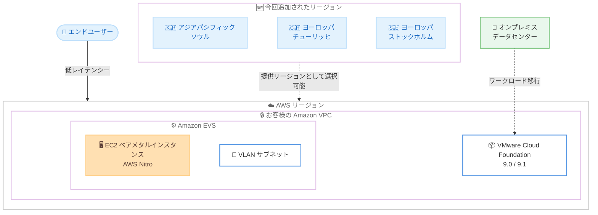

# Amazon EVS - 追加リージョンでの提供開始

**リリース日**: 2026 年 7 月 23 日
**サービス**: Amazon Elastic VMware Service (Amazon EVS)
**機能**: アジアパシフィック (ソウル)、ヨーロッパ (チューリッヒ)、ヨーロッパ (ストックホルム) リージョンでの提供開始

📊 [このアップデートのインフォグラフィックを見る](https://takech9203.github.io/aws-news-summary/20260723-amazon-evs-available-in-additional-regions.html)
<!-- INFOGRAPHIC_BASE_URL は環境変数から取得 -->

## 概要

Amazon Elastic VMware Service (Amazon EVS) が、アジアパシフィック (ソウル)、ヨーロッパ (チューリッヒ)、ヨーロッパ (ストックホルム) の 3 リージョンで新たに利用可能になりました。Amazon EVS は、VMware Cloud Foundation (VCF) をお客様の Amazon Virtual Private Cloud (VPC) 内の EC2 ベアメタルインスタンス上で直接実行できるサービスで、AWS Nitro によって支えられています。

Amazon EVS を利用すると、完全な VCF 環境をわずか数時間でセットアップでき、AWS へのワークロード移行を迅速に進められます。これにより、老朽化したインフラストラクチャの解消、運用リスクの低減、データセンター撤退の期限といった重要な時間的制約への対応が可能になります。今回の提供リージョン拡大では、既存のすべての Amazon EVS 機能がサポートされます。これには、メモリ階層化 (memory tiering) などの最新の VMware 機能を活用するための VCF 9.0 および 9.1 のサポートが含まれます。

提供リージョンの追加により、エンドユーザーに近いリージョンを選択することで VMware ワークロードのレイテンシーを低減できるほか、データレジデンシーや主権 (ソブリンティ) の要件への準拠、そして高可用性と回復性に関する選択肢の拡大が実現します。

**アップデート前の課題**

- 以前はソウル、チューリッヒ、ストックホルムの各リージョンで Amazon EVS を利用できず、これらの地域に近いお客様は他リージョンを選択する必要があった
- 以前は特定地域のデータレジデンシーや主権要件を満たすリージョンで VMware ワークロードを稼働できない場合があった
- 以前は選択できるリージョンが限られており、可用性や回復性を高めるためのリージョン配置の選択肢が制約されていた

**アップデート後の改善**

- 今回のアップデートにより、アジアパシフィック (ソウル)、ヨーロッパ (チューリッヒ)、ヨーロッパ (ストックホルム) の各リージョンでも Amazon EVS を利用できるようになった
- 今回のアップデートにより、エンドユーザーに近いリージョンを選択でき、VMware ワークロードのレイテンシーを低減できるようになった
- 今回のアップデートにより、データレジデンシーや主権要件への準拠、および高可用性と回復性のためのリージョン配置の選択肢が拡大した

## アーキテクチャ図

ソウル、チューリッヒ、ストックホルムの各リージョンで Amazon EVS を選択できるようになり、エンドユーザーに近いリージョンで VMware ワークロードを稼働できる構成を示しています。

## サービスアップデートの詳細

### 主要機能

1. **提供リージョンの拡大**
   - アジアパシフィック (ソウル) リージョンで新たに利用可能
   - ヨーロッパ (チューリッヒ) リージョンで新たに利用可能
   - ヨーロッパ (ストックホルム) リージョンで新たに利用可能

2. **既存のすべての Amazon EVS 機能をサポート**
   - VCF 9.0 および 9.1 をサポートし、最新の VMware 機能を活用可能
   - メモリ階層化 (memory tiering) などの最新の VMware 機能に対応
   - お客様の Amazon VPC 内の EC2 ベアメタルインスタンス上で VCF を直接実行

3. **迅速な環境構築と移行**
   - 完全な VCF 環境をわずか数時間でセットアップ可能
   - AWS へのワークロード移行を迅速化し、老朽化インフラの解消や運用リスク低減を支援
   - データセンター撤退などの時間的制約のある移行要件に対応

## 技術仕様

### アーキテクチャ構成

| 項目 | 詳細 |
|------|------|
| コンピュート基盤 | EC2 ベアメタルインスタンス (AWS Nitro を採用) |
| デプロイ先 | お客様の Amazon VPC |
| ネットワーク | 環境作成時に指定した CIDR で作成される VLAN サブネット |
| サポート VCF バージョン | VCF 9.0 および 9.1 |
| 対応機能 | メモリ階層化 (memory tiering) などの最新 VMware 機能 |
| 今回の追加リージョン | ソウル、チューリッヒ、ストックホルム |

### API 変更履歴

今回のアップデートに関連する awsapichanges.com への API 変更の登録は確認されませんでした。

## 設定方法

### 前提条件

1. 追加された対象リージョン (ソウル、チューリッヒ、ストックホルムのいずれか) の AWS アカウント
2. EC2 ベアメタルインスタンスをデプロイするための Amazon VPC
3. VCF Installer および VCF 9.0 / 9.1 のライセンス (VMware / Broadcom から調達)

### 手順

#### ステップ 1: 対象リージョンの選択と EVS 環境の作成

Amazon EVS コンソール、AWS CLI、または AWS CloudFormation (`AWS::EVS::Environment`) を利用して、ソウル、チューリッヒ、ストックホルムのいずれかのリージョンで EVS 環境を作成します。環境作成時に、指定した CIDR 範囲を使用して必要な VLAN サブネットが作成され、ホストが環境に追加されます。

#### ステップ 2: VCF のカスタマイズ

vSphere のユーザーインターフェイスから、ログイン、ポリシー、モニタリングなど、要件に応じて環境を構成します。VCF 9.0 / 9.1 のメモリ階層化などの最新機能を活用できます。

#### ステップ 3: 接続とワークロード移行

環境をオンプレミスのデータセンターに接続し、VCF ワークロードを Amazon EVS へ移行します。IP アドレスの変更やスタッフの再教育、運用手順の書き換えを行うことなく移行を進められます。

## メリット

### ビジネス面

- **時間的制約への対応**: データセンター撤退の期限など、時間的制約のある移行要件に対して、数時間での環境構築により迅速に対応
- **データ主権への準拠**: チューリッヒやストックホルムなどのリージョンを選択することで、データレジデンシーや主権要件を満たしやすくなる
- **運用リスクの低減**: 老朽化したインフラストラクチャを解消し、運用リスクを低減

### 技術面

- **低レイテンシー**: エンドユーザーに近いリージョンを選択でき、VMware ワークロードのレイテンシーを低減
- **高可用性と回復性**: リージョン配置の選択肢が拡大し、可用性と回復性の設計オプションが増加
- **既存機能の完全サポート**: VCF 9.0 / 9.1 を含む既存のすべての Amazon EVS 機能を利用可能

## デメリット・制約事項

### 制限事項

- 今回追加されたのはソウル、チューリッヒ、ストックホルムの 3 リージョンであり、東京リージョンを含む他リージョンでの提供状況は別途確認が必要
- VCF ソフトウェアのライセンス (サブスクリプション) は VMware / Broadcom から別途調達する必要がある
- VCF のインストール後の運用、管理はお客様の責任範囲となる

### 考慮すべき点

- EC2 ベアメタルインスタンスを利用するため、リージョンごとのインスタンス提供状況とコストを確認する必要がある
- データレジデンシー要件に応じて、適切なリージョンを選択することが望ましい
- 既存環境からの移行時は、対象リージョンでのサービスおよび機能の提供状況を事前に確認することが望ましい

## ユースケース

### ユースケース 1: 韓国国内向けワークロードの低レイテンシー化

**シナリオ**: 韓国国内のエンドユーザーを主対象とする企業が、VMware ワークロードをより近いリージョンで稼働させたい。

**効果**: アジアパシフィック (ソウル) リージョンで Amazon EVS を利用することで、エンドユーザーに近いリージョンでワークロードを稼働させ、レイテンシーを低減できます。

### ユースケース 2: スイスのデータ主権要件への準拠

**シナリオ**: 金融や公共分野など、データを国内に保持する必要がある企業が、VMware 環境をクラウドへ移行したい。

**効果**: ヨーロッパ (チューリッヒ) リージョンを選択することで、データレジデンシーや主権要件に準拠しながら VCF ワークロードを AWS 上で稼働できます。

### ユースケース 3: 北欧地域での高可用性構成

**シナリオ**: 北欧地域を対象とする企業が、可用性と回復性を高めるためのリージョン配置の選択肢を広げたい。

**効果**: ヨーロッパ (ストックホルム) リージョンが追加されたことで、リージョン配置の選択肢が広がり、高可用性と回復性を考慮した設計が可能になります。

## 料金

Amazon EVS の利用料金は、EC2 ベアメタルインスタンスなどの AWS リソース使用量に基づきます。VCF ソフトウェアのライセンス (サブスクリプション) は VMware / Broadcom から別途調達する必要があります。リージョンによって料金が異なる場合があるため、詳細は Amazon EVS の料金ページを参照してください。

## 利用可能リージョン

今回のアップデートにより、Amazon EVS は以下のリージョンで新たに利用可能になりました。

- アジアパシフィック (ソウル)
- ヨーロッパ (チューリッヒ)
- ヨーロッパ (ストックホルム)

上記に加え、既存の提供リージョンでも引き続き利用可能です。最新の提供リージョン一覧は Amazon EVS の製品ページを参照してください。

## 関連サービス・機能

- **Amazon EC2 (ベアメタルインスタンス)**: AWS Nitro を採用し、VCF の基盤となるコンピュートリソース
- **Amazon VPC**: EVS 環境がデプロイされるネットワーク境界
- **AWS CloudFormation**: `AWS::EVS::Environment` リソースを利用した EVS 環境のプロビジョニング
- **VMware Cloud Foundation (VCF) 9.0 / 9.1**: EVS 上で稼働する VMware 仮想化ソリューション

## 参考リンク

- 📊 [インフォグラフィック](https://takech9203.github.io/aws-news-summary/20260723-amazon-evs-available-in-additional-regions.html)
- [公式発表 (What's New)](https://aws.amazon.com/about-aws/whats-new/2026/07/amazon-evs-available-in-additional-regions/)
- [Amazon EVS 製品ページ](https://aws.amazon.com/evs/)
- [ドキュメント (ユーザーガイド)](https://docs.aws.amazon.com/evs/latest/userguide/what-is-evs.html)

## まとめ

Amazon EVS がアジアパシフィック (ソウル)、ヨーロッパ (チューリッヒ)、ヨーロッパ (ストックホルム) の 3 リージョンで新たに利用可能になり、VCF 9.0 / 9.1 を含む既存のすべての機能をこれらのリージョンで活用できるようになりました。低レイテンシー化、データレジデンシーや主権要件への準拠、高可用性と回復性の選択肢の拡大が実現します。これらの地域で VMware ワークロードのクラウド移行を検討しているお客様は、対象リージョンでの Amazon EVS の利用を検討することをおすすめします。
