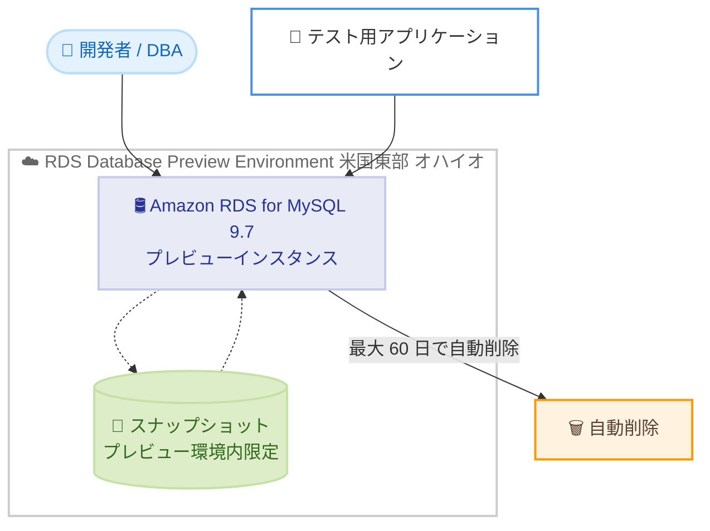

# Amazon RDS for MySQL - MySQL 9.7 の Database Preview Environment 対応

**リリース日**: 2026 年 7 月 23 日
**サービス**: Amazon RDS for MySQL
**機能**: Amazon RDS Database Preview Environment での MySQL 9.7 サポート

📊 [このアップデートのインフォグラフィックを見る](https://takech9203.github.io/aws-news-summary/20260723-amazon-rds-mysql-long-term-9-7-rds-database-preview.html)
<!-- INFOGRAPHIC_BASE_URL は環境変数から取得 -->

## 概要

Amazon RDS for MySQL が、Amazon RDS Database Preview Environment においてコミュニティ版 MySQL 9.7 をサポートするようになりました。これにより、正式リリース (GA) 前の最新バージョンを Amazon RDS for MySQL 上で評価できます。MySQL 9.7 は、コミュニティ版 MySQL の最新の長期サポート (LTS) リリースであり、バグ修正、セキュリティパッチ、新機能を含んでいます。

Database Preview Environment は、アプリケーションのテストや MySQL 9.7 の新機能の検証を、GA 前に行うためのサンドボックス環境を提供します。本番環境に影響を与えることなく、新バージョンの互換性や動作を事前に確認できるため、実際のアップグレード計画をより確実に立てられます。

対象となるのは、次期メジャーバージョンへの移行を検討しているデータベース管理者や開発者、および新機能の早期評価を行いたいチームです。プレビュー環境のインスタンスは最大 60 日間保持され、保持期間を過ぎると自動的に削除されます。

**アップデート前の課題**

- MySQL 9.7 のような GA 前の最新バージョンを、Amazon RDS のマネージド環境で評価する手段がなかった
- 新バージョンの互換性検証のために、自前で MySQL 環境を構築してテストする必要があった
- 本番環境と同等のマネージド RDS 上で、リリース前バージョンの動作を確認できなかった

**アップデート後の改善**

- Amazon RDS Database Preview Environment 上で MySQL 9.7 を直接評価できるようになった
- アプリケーションのテストや新機能の検証を、マネージドなサンドボックス環境で実施できる
- GA 前に互換性や動作を確認することで、将来のアップグレードをより計画的に進められる

## アーキテクチャ図

プレビュー環境は米国東部 (オハイオ) リージョンで稼働し、作成したインスタンスとスナップショットはプレビュー環境内でのみ利用できます。インスタンスは最大 60 日間保持された後、自動的に削除されます。

## サービスアップデートの詳細

### 主要機能

1. **MySQL 9.7 の早期評価**
   - コミュニティ版 MySQL の最新 LTS リリースである MySQL 9.7 を Amazon RDS 上で利用可能
   - GA 前のバージョンをマネージド環境でテストできる
   - バグ修正、セキュリティパッチ、新機能を事前に検証できる

2. **サンドボックス環境の提供**
   - アプリケーションの互換性テストを本番環境から隔離して実施
   - MySQL 9.7 の新機能を安全に検証できる
   - プレビュー環境専用の環境として提供される

3. **自動的なライフサイクル管理**
   - プレビュー環境のインスタンスは最大 60 日間保持される
   - 保持期間経過後は自動的に削除され、リソースの管理負荷を軽減
   - 検証用途に適した一時的な環境として活用できる

## 技術仕様

### Database Preview Environment の仕様

| 項目 | 詳細 |
|------|------|
| サポートエンジン | コミュニティ版 MySQL 9.7 (最新 LTS リリース) |
| 稼働リージョン | 米国東部 (オハイオ) US East (Ohio) |
| インスタンス保持期間 | 最大 60 日間 (経過後に自動削除) |
| スナップショットの利用範囲 | プレビュー環境内のインスタンスの作成・復元のみ |
| 料金 | 米国東部 (オハイオ) の本番 RDS インスタンスと同額 |

### 制約に関する注意点

- プレビュー環境で作成したスナップショットは、プレビュー環境外の RDS インスタンスの作成や復元には使用できません
- プレビュー環境は本番ワークロードでの使用を想定していません

## 設定方法

### 前提条件

1. AWS アカウントを保有していること
2. Amazon RDS の作成・管理に必要な IAM 権限を持っていること
3. 米国東部 (オハイオ) リージョンでプレビュー環境を利用できること

### 手順

#### ステップ 1: Database Preview Environment にアクセス

AWS マネジメントコンソールから Amazon RDS Database Preview Environment にアクセスします。プレビュー環境は通常の RDS コンソールとは別の専用環境として提供されます。詳細は「Working with the Database Preview Environment」のドキュメントを参照してください。

#### ステップ 2: MySQL 9.7 インスタンスを作成

プレビュー環境でデータベースエンジンとして MySQL 9.7 を選択し、インスタンスを作成します。作成手順は通常の RDS インスタンスと同様ですが、作成されたインスタンスはプレビュー環境内でのみ利用可能です。

#### ステップ 3: アプリケーションのテストと機能検証

作成したインスタンスに対して、既存アプリケーションの互換性テストや MySQL 9.7 の新機能の検証を実施します。インスタンスは最大 60 日間で自動削除されるため、検証結果は期間内に記録しておきます。

## メリット

### ビジネス面

- **アップグレードリスクの低減**: GA 前に互換性を検証することで、本番環境へのアップグレード時のリスクを事前に把握できる
- **計画的な移行の実現**: 新バージョンの動作を早期に確認し、移行計画を余裕を持って策定できる
- **運用負荷の軽減**: インスタンスが自動削除されるため、検証環境の後片付けの手間が不要

### 技術面

- **マネージド環境での検証**: 自前で MySQL 環境を構築せず、RDS のマネージド機能を利用して検証できる
- **本番同等の評価**: 本番の RDS インスタンスと同じ料金・構成で評価できるため、実運用に近い条件でテストできる
- **新機能の早期把握**: MySQL 9.7 の新機能やセキュリティ改善を事前に理解できる

## デメリット・制約事項

### 制限事項

- プレビュー環境は米国東部 (オハイオ) リージョンのみで利用可能
- インスタンスは最大 60 日間で自動削除されるため、長期的な検証には適さない
- プレビュー環境で作成したスナップショットはプレビュー環境外では利用できない
- 本番ワークロードでの使用は想定されていない

### 考慮すべき点

- 検証用データやスナップショットは、保持期間内にプレビュー環境外へ移行できない点に留意する必要がある
- 料金は本番 RDS インスタンスと同額のため、コストを意識した検証計画が必要

## ユースケース

### ユースケース 1: 次期バージョンへのアップグレード事前検証

**シナリオ**: 現在 MySQL の旧バージョンを本番運用しているチームが、MySQL 9.7 への移行を検討している。

**効果**: プレビュー環境で既存アプリケーションの互換性を事前に確認し、GA 後の本番アップグレードをスムーズに実施できる。

### ユースケース 2: MySQL 9.7 新機能の評価

**シナリオ**: 開発チームが MySQL 9.7 で追加された新機能を、実際のワークロードで評価したい。

**効果**: 本番環境に影響を与えることなく、新機能の効果や動作をマネージド環境で検証できる。

### ユースケース 3: アプリケーション互換性テスト

**シナリオ**: 複数のアプリケーションが MySQL に依存しており、バージョン変更による影響範囲を把握したい。

**効果**: プレビュー環境で各アプリケーションを接続してテストし、非互換な挙動を早期に発見できる。

## 料金

Database Preview Environment のインスタンスは、米国東部 (オハイオ) リージョンで作成される本番 RDS インスタンスと同額で課金されます。プレビュー環境専用の割引や無料枠はないため、通常の RDS 料金と同様のコストが発生します。インスタンスは最大 60 日間で自動削除されますが、稼働中は料金が発生する点に注意が必要です。

最新の料金は Amazon RDS for MySQL の料金ページを参照してください。

## 利用可能リージョン

Amazon RDS Database Preview Environment は米国東部 (オハイオ) US East (Ohio) リージョンで提供されます。

## 関連サービス・機能

- **Amazon RDS for MySQL**: 本アップデートの対象となるマネージド MySQL データベースサービス
- **Amazon RDS スナップショット**: プレビュー環境内で作成・復元に利用できるが、環境外との相互利用はできない
- **AWS Database Migration Service (DMS)**: 本番環境への移行時にデータ移行を支援するサービス

## 参考リンク

- 📊 [インフォグラフィック](https://takech9203.github.io/aws-news-summary/20260723-amazon-rds-mysql-long-term-9-7-rds-database-preview.html)
- [公式発表 (What's New)](https://aws.amazon.com/about-aws/whats-new/2026/07/amazon-rds-mysql-long-term-9-7-rds-database-preview/)
- [ドキュメント: Working with the Database Preview Environment](https://docs.aws.amazon.com/AmazonRDS/latest/UserGuide/CHAP_Previewenvironment.html)
- [Amazon RDS Database Preview Environment](https://aws.amazon.com/rds/databasepreview/)
- [Amazon RDS for MySQL 料金ページ](https://aws.amazon.com/rds/mysql/pricing/)

## まとめ

Amazon RDS Database Preview Environment での MySQL 9.7 サポートにより、最新の LTS リリースを GA 前にマネージド環境で評価できるようになりました。次期バージョンへの移行を検討しているチームは、米国東部 (オハイオ) リージョンでプレビューインスタンスを作成し、互換性テストや新機能の検証を早期に開始することをお勧めします。インスタンスが最大 60 日間で自動削除される点と、スナップショットがプレビュー環境内でのみ利用可能である点に留意して検証計画を立ててください。
