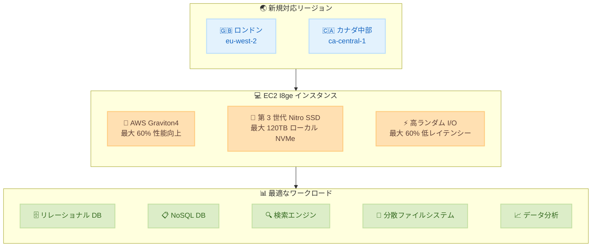

# Amazon EC2 - I8ge インスタンスが追加の AWS リージョンで一般提供開始

**リリース日**: 2026年07月23日
**サービス**: Amazon EC2
**機能**: I8ge ストレージ最適化インスタンス

📊 [このアップデートのインフォグラフィックを見る](https://takech9203.github.io/aws-news-summary/20260723-aws-i8ge-additional-regions.html)

## 概要

AWS は 2026 年 7 月 23 日、Amazon EC2 I8ge インスタンスが欧州 (ロンドン) およびカナダ (中部) の各 AWS リージョンで一般提供 (GA) を開始したことを発表しました。I8ge インスタンスは AWS Graviton4 プロセッサーを搭載したストレージ最適化インスタンスで、前世代の Graviton2 ベースのストレージ最適化インスタンスと比較して最大 60% 優れたコンピューティング性能を提供します。

I8ge インスタンスは第 3 世代 AWS Nitro SSD によるローカル NVMe ストレージを使用し、最大 120TB のローカル NVMe ストレージを提供します。前世代の Im4gn インスタンスと比較して、TB あたり最大 55% 優れたリアルタイムストレージ性能を実現し、ストレージ I/O レイテンシーが最大 60% 低減、ストレージ I/O レイテンシーのばらつきが最大 75% 低減されています。リレーショナルデータベース、NoSQL データベース、検索エンジン、分散ファイルシステム、データ分析など、ローカルストレージ上の大規模データセットへの高ランダム I/O アクセスと一貫した低レイテンシーを必要とするワークロードに最適です。

今回のリージョン拡大により、欧州 (ロンドン) およびカナダ (中部) のお客様も、データレジデンシー要件を満たしながら最新の Graviton4 ベースのストレージ最適化インスタンスを活用できるようになりました。

**アップデート前の課題**

- 欧州 (ロンドン) およびカナダ (中部) リージョンでは I8ge インスタンスが利用できず、Graviton4 ベースのストレージ最適化インスタンスの性能を活用できなかった
- 前世代の Im4gn インスタンスではストレージ I/O レイテンシーが高く、レイテンシーのばらつきも大きかった
- ローカル NVMe ストレージの性能が限定的で、データベースやリアルタイム分析のパフォーマンスに制約があった

**アップデート後の改善**

- 欧州 (ロンドン) およびカナダ (中部) の 2 つの新リージョンで I8ge インスタンスが利用可能になり、Graviton4 プロセッサーの高性能をストレージ集約型ワークロードで活用できるようになった
- 第 3 世代 AWS Nitro SSD により、TB あたり最大 55% 優れたリアルタイムストレージ性能と最大 120TB のローカル NVMe ストレージを実現
- ストレージ I/O レイテンシーが最大 60% 低減され、I/O レイテンシーのばらつきが最大 75% 低減された
- コンピューティング性能が前世代比で最大 60% 向上し、データ処理全体のスループットが改善された

## アーキテクチャ図



この図は、I8ge インスタンスが新たに利用可能になった 2 つのリージョンと、Graviton4 プロセッサー・第 3 世代 Nitro SSD・高ランダム I/O ストレージの 3 つの主要コンポーネント、および最適なワークロードの関係を示しています。

## サービスアップデートの詳細

### 主要機能

1. **AWS Graviton4 プロセッサー搭載**
   - Arm ベースの最新世代プロセッサーにより、高い電力効率と優れたコンピューティング性能を実現
   - 前世代の Graviton2 ベースのストレージ最適化インスタンスと比較して最大 60% 優れたコンピューティング性能
   - ストレージ集約型ワークロードに最適化されたプロセッサー構成

2. **第 3 世代 AWS Nitro SSD**
   - 最新世代のローカル NVMe ストレージにより、前世代 Im4gn インスタンスと比較して TB あたり最大 55% 優れたリアルタイムストレージ性能
   - 最大 120TB のローカル NVMe ストレージを提供
   - ストレージ I/O レイテンシーが最大 60% 低減
   - ストレージ I/O レイテンシーのばらつきが最大 75% 低減
   - 高ランダム I/O アクセスパターンに最適化

3. **豊富なインスタンスサイズと高帯域幅**
   - 2 つのメタルサイズを含む 11 種類のインスタンスサイズを提供
   - 最大 180 Gbps のネットワーク帯域幅
   - 最大 60 Gbps の専用 EBS 帯域幅
   - ローカルストレージ上の大規模データセットへの高速ランダム I/O アクセスに最適化

## 技術仕様

### I8ge と前世代インスタンスの性能比較

| 指標 | I8ge vs Graviton2 ストレージ最適化 | I8ge vs Im4gn |
|------|-----------------------------------|---------------|
| コンピューティング性能 | 最大 60% 向上 | - |
| リアルタイムストレージ性能 (TB あたり) | - | 最大 55% 向上 |
| ストレージ I/O レイテンシー | - | 最大 60% 低減 |
| I/O レイテンシーばらつき | - | 最大 75% 低減 |

### I8ge インスタンスの主要スペック

| 項目 | 詳細 |
|------|------|
| プロセッサー | AWS Graviton4 (Arm ベース) |
| ストレージ | 第 3 世代 AWS Nitro SSD (ローカル NVMe) |
| 最大ローカルストレージ | 120TB |
| インスタンスサイズ | 11 種類 (メタル 2 サイズを含む) |
| ネットワーク帯域幅 | 最大 180 Gbps |
| EBS 帯域幅 | 最大 60 Gbps (専用) |
| インスタンスファミリー | ストレージ最適化 (I ファミリー) |
| 前世代 | Im4gn (Graviton2 ベース) |

### I ファミリーインスタンスの世代比較

| 世代 | プロセッサー | ストレージ世代 | 特徴 |
|------|-------------|--------------|------|
| I3 | Intel Xeon | 第 1 世代 NVMe SSD | 初代 NVMe ストレージ最適化 |
| Im4gn | AWS Graviton2 | 第 2 世代 AWS Nitro SSD | Graviton ベース初のストレージ最適化 |
| I8ge | AWS Graviton4 | 第 3 世代 AWS Nitro SSD | 最新世代、最高性能 |

## 設定方法

### 前提条件

1. AWS アカウントと適切な IAM 権限
2. 対象リージョンへのアクセス (ロンドン: eu-west-2、カナダ中部: ca-central-1)
3. Graviton (Arm) アーキテクチャ対応の AMI
4. 必要な VPC およびサブネット設定

### 手順

#### ステップ1: Arm 対応 AMI の確認

```bash
# ロンドンリージョンで Arm 対応の Amazon Linux 2023 AMI を検索
aws ec2 describe-images \
  --region eu-west-2 \
  --filters "Name=name,Values=al2023-ami-*-arm64*" \
            "Name=state,Values=available" \
  --owners amazon \
  --query "Images | sort_by(@, &CreationDate) | [-1].ImageId" \
  --output text
```

I8ge インスタンスは Graviton4 (Arm) プロセッサーを搭載しているため、Arm アーキテクチャ対応の AMI を使用する必要があります。

#### ステップ2: I8ge インスタンスの起動

```bash
# I8ge インスタンスをロンドンリージョンで起動
aws ec2 run-instances \
  --image-id ami-xxxxxxxxxxxxxxxxx \
  --instance-type i8ge.xlarge \
  --region eu-west-2 \
  --subnet-id subnet-xxxxxxxxxxxxxxxxx \
  --security-group-ids sg-xxxxxxxxxxxxxxxxx \
  --key-name my-key-pair
```

このコマンドは、ロンドンリージョン (eu-west-2) で I8ge インスタンスを起動します。ローカル NVMe ストレージはインスタンスに自動的にアタッチされます。

#### ステップ3: ローカル NVMe ストレージの確認とマウント

```bash
# インスタンスに接続後、NVMe デバイスを確認
lsblk

# NVMe ストレージをフォーマットしてマウント
sudo mkfs -t xfs /dev/nvme1n1
sudo mkdir /data
sudo mount /dev/nvme1n1 /data
```

I8ge インスタンスのローカル NVMe ストレージは一時ストレージ (エフェメラルストレージ) です。インスタンスの停止や終了時にデータが失われるため、永続化が必要なデータは EBS や S3 にバックアップしてください。

## メリット

### ビジネス面

- **データレジデンシー要件への対応**: 欧州 (ロンドン) およびカナダ (中部) での提供開始により、地域のデータ主権要件を満たしながら最新のストレージ最適化インスタンスを利用可能
- **コスト効率の向上**: 同じワークロードをより少ないインスタンスで処理でき、TB あたりの性能向上によりストレージコストを最適化
- **レイテンシー改善によるユーザー体験向上**: データベースの応答時間改善により、エンドユーザーへのレスポンスタイムが短縮

### 技術面

- **大幅なストレージ I/O 性能向上**: 第 3 世代 Nitro SSD により、TB あたり最大 55% のリアルタイムストレージ性能向上と最大 120TB のローカルストレージ
- **予測可能なパフォーマンス**: I/O レイテンシーのばらつきが最大 75% 低減され、安定したデータベース性能を実現
- **Graviton4 によるコンピューティング強化**: 前世代比最大 60% のコンピューティング性能向上により、データ処理やクエリ実行が高速化
- **高い帯域幅**: 最大 180 Gbps のネットワーク帯域幅と最大 60 Gbps の専用 EBS 帯域幅により、大規模データ転送とストレージアクセスを高速化

## デメリット・制約事項

### 制限事項

- Arm (Graviton) アーキテクチャのため、x86 専用のソフトウェアやバイナリは動作しない (Arm 対応版が必要)
- ローカル NVMe ストレージはエフェメラル (一時的) であり、インスタンス停止・終了時にデータが失われる
- すべてのリージョンで利用可能ではないため、マルチリージョン構成の場合は可用性を確認する必要がある

### 考慮すべき点

- Im4gn からの移行時には、アプリケーションの Graviton4 互換性テストを実施することを推奨
- ローカル NVMe ストレージの容量はインスタンスサイズに依存するため、ワークロードに適したサイズの選択が重要
- データの永続化には EBS ボリュームや S3 への定期的なバックアップ戦略が必要
- Graviton2 から Graviton4 への移行では、一部のパフォーマンス特性が異なる可能性があるため、ベンチマークテストを推奨

## ユースケース

### ユースケース1: 高性能リレーショナルデータベース

**シナリオ**: 金融サービス企業が、大規模なトランザクションデータを管理するセルフマネージド PostgreSQL データベースを欧州 (ロンドン) リージョンで運用したい

**実装例**:
```bash
# I8ge インスタンスで PostgreSQL データベースサーバーを起動
aws ec2 run-instances \
  --image-id ami-xxxxxxxxxxxxxxxxx \
  --instance-type i8ge.4xlarge \
  --region eu-west-2 \
  --block-device-mappings '[{"DeviceName":"/dev/xvda","Ebs":{"VolumeSize":50}}]' \
  --user-data file://postgres-setup.sh
```

**効果**: ストレージ I/O レイテンシーの 60% 低減により、トランザクション処理のレスポンスタイムが大幅に改善され、ピーク時のクエリ性能が向上

### ユースケース2: NoSQL データベースクラスター

**シナリオ**: IoT プラットフォームが、大量のセンサーデータをリアルタイムで書き込み・検索する Apache Cassandra クラスターをカナダ (中部) リージョンで運用したい

**実装例**:
```bash
# Cassandra ノード用に複数の I8ge インスタンスを起動
aws ec2 run-instances \
  --image-id ami-xxxxxxxxxxxxxxxxx \
  --instance-type i8ge.8xlarge \
  --count 3 \
  --region ca-central-1 \
  --placement "GroupName=cassandra-cluster"
```

**効果**: TB あたり 55% のストレージ性能向上と 75% のレイテンシーばらつき低減により、大量の書き込みと読み取りを安定した性能で処理可能

### ユースケース3: OpenSearch による全文検索

**シナリオ**: メディア企業が、数百万件のドキュメントに対するリアルタイム全文検索を提供するセルフマネージド OpenSearch クラスターを構築したい

**実装例**:
```bash
# OpenSearch データノード用 I8ge インスタンスを起動
aws ec2 run-instances \
  --image-id ami-xxxxxxxxxxxxxxxxx \
  --instance-type i8ge.2xlarge \
  --count 5 \
  --region eu-west-2 \
  --user-data file://opensearch-node-setup.sh
```

**効果**: 高ランダム I/O 性能と低レイテンシーにより、インデックス検索の応答時間が改善され、ユーザーへの検索結果返却が高速化

## 料金

I8ge インスタンスの料金は、選択したインスタンスサイズ、リージョン、購入オプションによって異なります。ストレージ最適化インスタンスには、ローカル NVMe ストレージのコストがインスタンス料金に含まれています。詳細な料金については、[Amazon EC2 料金ページ](https://aws.amazon.com/ec2/pricing/) をご確認ください。

### 購入オプション

| 購入オプション | 説明 |
|--------------|------|
| オンデマンド | 使用した時間に応じて支払い、長期コミットメント不要 |
| Savings Plans | 1 年または 3 年のコミットメントで割引料金を適用 |
| リザーブドインスタンス | 特定のインスタンスタイプに対する長期コミットメントで割引 |

## 利用可能リージョン

今回のアップデートにより、I8ge インスタンスは以下のリージョンで新たに利用可能になりました。

**新規対応リージョン (2026年7月23日)**:
- 欧州 (ロンドン) - eu-west-2
- カナダ (中部) - ca-central-1

**注**: これらのリージョンでの提供開始により、欧州およびカナダのお客様は、地域のデータレジデンシー要件を満たしながら、最新の Graviton4 ベースのストレージ最適化インスタンスを活用できるようになりました。

## 関連サービス・機能

- **Amazon EBS**: I8ge のローカル NVMe ストレージと組み合わせて、永続データ用に EBS ボリュームを使用
- **Amazon S3**: ローカルストレージのデータバックアップ先として活用
- **Amazon EC2 Auto Scaling**: ワークロードに応じた I8ge インスタンスの自動スケーリング
- **AWS Graviton**: I8ge が搭載する Graviton4 プロセッサーのエコシステムと Arm 対応ソフトウェア
- **AWS Nitro System**: I8ge の基盤となるセキュリティとパフォーマンスの最適化インフラストラクチャ

## 参考リンク

- 📊 [インフォグラフィック](https://takech9203.github.io/aws-news-summary/20260723-aws-i8ge-additional-regions.html)
- [公式発表 (What's New)](https://aws.amazon.com/about-aws/whats-new/2026/07/aws-i8ge-additional-regions/)
- [Amazon EC2 I8ge インスタンス製品ページ](https://aws.amazon.com/ec2/instance-types/i8ge/)
- [Amazon EC2 料金ページ](https://aws.amazon.com/ec2/pricing/)
- [AWS Graviton プロセッサー](https://aws.amazon.com/ec2/graviton/)
- [Amazon EC2 ドキュメント](https://docs.aws.amazon.com/ec2/)

## まとめ

Amazon EC2 I8ge インスタンスが欧州 (ロンドン) およびカナダ (中部) の 2 つの新リージョンで一般提供を開始したことにより、これらの地域のお客様も Graviton4 プロセッサーと第 3 世代 Nitro SSD を活用した最新のストレージ最適化インスタンスを利用できるようになりました。前世代の Im4gn インスタンスと比較して、コンピューティング性能が最大 60% 向上し、ストレージ I/O レイテンシーが最大 60% 低減、レイテンシーのばらつきが最大 75% 低減されています。リレーショナルデータベース、NoSQL データベース、検索エンジンなど、ローカルストレージへの高ランダム I/O アクセスを必要とするワークロードを運用している場合は、I8ge インスタンスへの移行を検討し、パフォーマンスとコスト効率の向上を実現してください。
</content>
</invoke>
