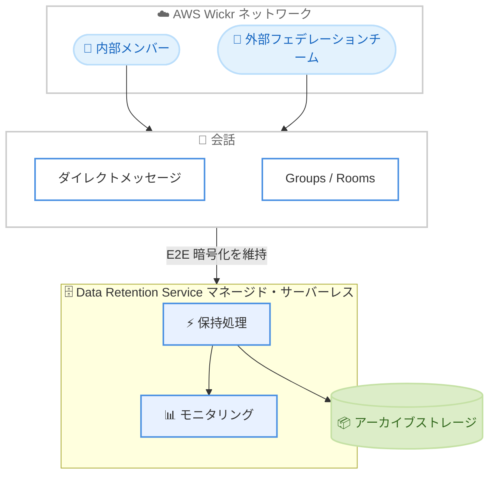

# AWS Wickr - Data Retention Service

**リリース日**: 2026 年 7 月 23 日
**サービス**: AWS Wickr
**機能**: Data Retention Service (データ保持サービス)

📊 [このアップデートのインフォグラフィックを見る](https://takech9203.github.io/aws-news-summary/20260723-aws-wickr-data.html)

## 概要

AWS Wickr は、Premium ユーザー向けにマネージド型の Data Retention Service (データ保持サービス) を発表しました。この機能により、組織はネットワーク全体の会話をアーカイブし、コンプライアンスや監査に必要な記録を保持できます。AWS Wickr は、エンドツーエンドの暗号化メッセージング、ファイル管理、画面共有、音声・ビデオ会議を提供するエンタープライズグレードのセキュアなコラボレーション製品です。

今回の Data Retention Service は、サーバーレスアーキテクチャ上に構築されており、従来のコンテナベースのデータ保持方式に代わるクラウドベースの選択肢を提供します。組織の管理者は、ネットワーク単位でデータ保持を有効化することで、ダイレクトメッセージや Groups・Rooms 内の会話を、内部メンバーと外部フェデレーションチームの両方にわたってアーカイブできます。

規制対応やガバナンスの観点から会話記録の保持と監査証跡を必要とする金融、医療、公共部門などの組織にとって、エンドツーエンドの暗号化基準を維持しながらデータ保持を実現できる点が主要な価値提案となります。

**アップデート前の課題**

- 従来はコンテナベースのデータ保持ボットを自前でデプロイ・運用する必要があり、インフラの管理負担が大きかった
- 会話量の増減に応じたスケーリングを手動で考慮する必要があった
- データ保持基盤の監視やメンテナンスを組織側で継続的に行う必要があった

**アップデート後の改善**

- 今回のアップデートにより、マネージド型のサーバーレスアーキテクチャでデータ保持が可能になり、インフラ管理が不要になった
- 会話量に応じた自動スケーリングにより、容量計画やスケーリングの手動対応が不要になった
- デプロイの簡素化と包括的なモニタリングにより、運用負担が軽減された

## アーキテクチャ図

内部・外部を含むネットワーク全体の会話が、エンドツーエンドの暗号化を維持したままマネージド型のサーバーレス基盤で保持・アーカイブされる流れを示しています。

## サービスアップデートの詳細

### 主要機能

1. **ネットワーク全体の会話保持**
   - ダイレクトメッセージと Groups・Rooms 内の会話を対象とする
   - 内部メンバーだけでなく、外部のフェデレーションチームとの会話も保持対象に含まれる
   - コンプライアンスや監査証跡のために組織全体のコミュニケーション記録を保存できる

2. **サーバーレスアーキテクチャ**
   - デプロイの簡素化を実現し、従来のコンテナベース方式に比べて導入が容易
   - マネージドインフラにより、組織側でのサーバー管理が不要
   - 会話量に応じた自動スケーリングと包括的なモニタリングを提供

3. **エンドツーエンド暗号化の維持**
   - Wickr のエンドツーエンド暗号化基準を保持したままデータ保持を実現
   - セキュリティ要件を満たしながらアーカイブと監査が可能

## 技術仕様

### 従来方式との比較

| 項目 | 従来のコンテナベース方式 | Data Retention Service |
|------|--------------------------|------------------------|
| インフラ管理 | 組織側で管理が必要 | マネージド (管理不要) |
| スケーリング | 手動での考慮が必要 | 自動スケーリング |
| デプロイ | コンテナのデプロイ・運用が必要 | 簡素化されたデプロイ |
| モニタリング | 個別に構築が必要 | 包括的なモニタリングを提供 |
| 暗号化 | エンドツーエンド暗号化 | エンドツーエンド暗号化を維持 |

### 対象範囲

| 項目 | 詳細 |
|------|------|
| 対象会話 | ダイレクトメッセージ、Groups、Rooms |
| 対象ユーザー | 内部メンバー、外部フェデレーションチーム |
| 有効化単位 | ネットワーク単位 (管理者がオプトインで有効化) |
| 対象プラン | Premium プランのみ |

## 設定方法

### 前提条件

1. AWS Wickr の Premium プランを利用していること
2. ネットワーク管理者権限を持っていること
3. データ保持を有効化する対象ネットワークが利用可能リージョンで運用されていること

### 手順

#### ステップ1: Wickr 管理コンソールにアクセス

Wickr Admin コンソールにログインし、対象ネットワークの設定画面を開きます。Premium プランのネットワークで Data Retention の設定項目が利用可能です。

#### ステップ2: Data Retention のオプトイン

ネットワーク設定からデータ保持機能を有効化 (オプトイン) します。有効化により、以降のネットワーク全体の会話がマネージド型のサーバーレス基盤で保持対象となります。

#### ステップ3: モニタリングと運用

有効化後は、包括的なモニタリング機能を通じてデータ保持の状況を確認します。詳細な設定手順は Wickr 管理者ドキュメントを参照してください。

## メリット

### ビジネス面

- **コンプライアンス対応**: 規制業界において求められる会話記録の保持と監査証跡を、セキュアに実現できる
- **運用コストの削減**: マネージド型サービスによりインフラ管理・運用の負担が軽減される
- **外部連携も対象**: 外部フェデレーションチームとの会話も保持対象となり、組織全体のガバナンスを強化できる

### 技術面

- **インフラ管理不要**: サーバーレスアーキテクチャによりサーバーやコンテナの運用が不要
- **自動スケーリング**: 会話量の増減に応じて自動的にスケールし、容量計画が不要
- **セキュリティ維持**: エンドツーエンドの暗号化を維持したままデータ保持を実現

## デメリット・制約事項

### 制限事項

- Premium プランのユーザーのみが利用可能
- 利用可能リージョンが限定されている
- データ保持はネットワーク単位でのオプトインが必要

### 考慮すべき点

- データ保持を有効化する際は、組織のプライバシーポリシーや従業員への通知など、法的・倫理的な配慮が必要
- 保持されるデータの管理・アクセス制御について、内部統制の観点から運用ルールを整備することが望ましい

## ユースケース

### ユースケース1: 金融機関のコンプライアンス対応

**シナリオ**: 金融規制により従業員間のコミュニケーション記録の保持が義務付けられている金融機関が、セキュアなコラボレーションを維持しつつ監査証跡を確保したい。

**効果**: エンドツーエンド暗号化を維持したまま、ダイレクトメッセージや Rooms の会話をアーカイブでき、規制要件を満たしながら運用負担を抑えられる。

### ユースケース2: 公共部門のガバナンス強化

**シナリオ**: 公共部門の組織が、外部のパートナー組織 (フェデレーションチーム) との会話も含めた記録保持を必要としている。

**効果**: 内部・外部を問わずネットワーク全体の会話を保持でき、情報公開請求や監査に対応できる。

### ユースケース3: コンテナ運用からの移行

**シナリオ**: 従来のコンテナベースのデータ保持ボットを自前で運用しており、インフラ管理の負担を軽減したい組織。

**効果**: マネージド型のサーバーレスサービスへ移行することで、デプロイが簡素化され、自動スケーリングとモニタリングにより運用負担が大幅に削減される。

## 料金

Data Retention Service は AWS Wickr の Premium プランのユーザーが利用でき、管理者がネットワーク単位でオプトインすることで有効化できます。公式発表では具体的な追加料金の記載はありません。詳細な料金については AWS Wickr の料金ページを参照してください。

## 利用可能リージョン

以下のリージョンで利用可能です。

- 米国東部 (バージニア北部)
- カナダ (中部)
- アジアパシフィック (シドニー)
- アジアパシフィック (東京)
- アジアパシフィック (シンガポール)
- 欧州 (フランクフルト)
- 欧州 (ストックホルム)
- 欧州 (チューリッヒ)
- AWS GovCloud (米国西部)

## 関連サービス・機能

- **AWS Wickr**: 本機能の基盤となるエンドツーエンド暗号化コラボレーションサービス
- **フェデレーション機能**: 外部組織との会話を可能にする機能で、Data Retention Service はこれらの会話も保持対象とする
- **AWS GovCloud (US)**: 政府機関向けの隔離されたリージョンで、規制対応のユースケースに対応

## 参考リンク

- 📊 [インフォグラフィック](https://takech9203.github.io/aws-news-summary/20260723-aws-wickr-data.html)
- [公式発表 (What's New)](https://aws.amazon.com/about-aws/whats-new/2026/07/aws-wickr-data/)
- [AWS Wickr ドキュメント](https://docs.aws.amazon.com/wickr/)
- [AWS Wickr 料金ページ](https://aws.amazon.com/wickr/pricing/)

## まとめ

AWS Wickr の Data Retention Service は、エンドツーエンド暗号化を維持しながらネットワーク全体の会話をマネージド型のサーバーレス基盤でアーカイブできる機能です。規制対応や監査証跡を必要とする組織は、従来のコンテナベース運用から移行することで運用負担を大幅に削減できます。Premium プランを利用している組織は、対象リージョンでのオプトインによる有効化を検討することをお勧めします。
