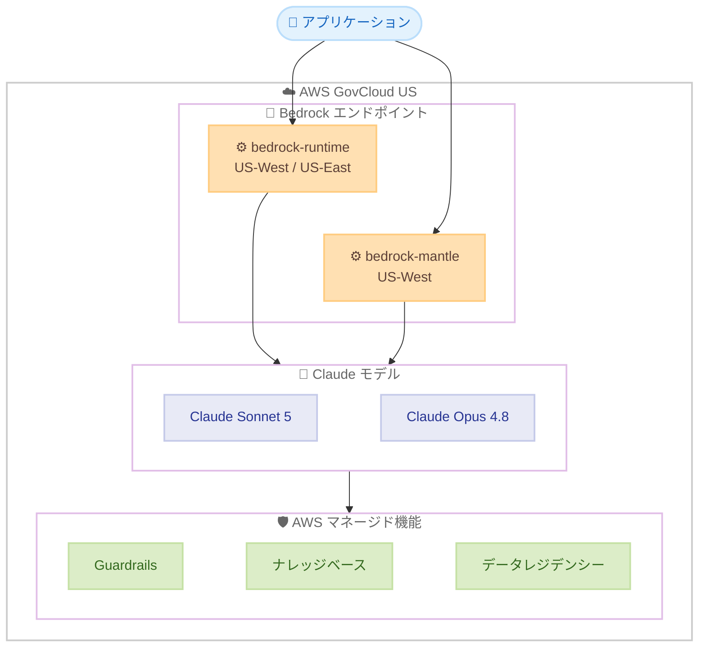

# Amazon Bedrock - Claude Sonnet 5 の AWS GovCloud (US) 提供開始

**リリース日**: 2026 年 07 月 23 日
**サービス**: Amazon Bedrock
**機能**: Anthropic Claude Sonnet 5 (AWS GovCloud (US) 対応)

📊 [このアップデートのインフォグラフィックを見る](https://takech9203.github.io/aws-news-summary/20260723-claude-sonnet-5-govcloud.html)
<!-- INFOGRAPHIC_BASE_URL は環境変数から取得 -->

## 概要

AWS は、Anthropic の基盤モデル Claude Sonnet 5 を AWS GovCloud (US) の Amazon Bedrock で利用可能にしました。これにより、米国政府機関や規制対象のワークロードを AWS GovCloud (US) 上で運用しているお客様が、コンプライアンス要件を満たしたクラウド環境で Claude Sonnet 5 を活用できるようになります。

Claude Sonnet 5 は、コーディング、専門業務、エージェント型タスクにわたって高い性能を発揮しながら、能力とコスト、速度のバランスを保つモデルです。コーディングでは、大規模なコードベースの探索、複数ファイルにまたがる変更、デバッグやリファクタリングといったタスクを、修正の往復を抑えながら完了まで導きます。エージェント用途では、ツールを的確に呼び出し、多数のステップにわたって状態を保持し、エラーから回復します。ナレッジワークでは、スプレッドシートの作成、ドキュメントの起草、非構造化データの構造化分析への変換を行います。

今回のリリースにより、Claude Opus 4.8 と Claude Sonnet 5 が、AWS GovCloud (US-West および US-East) の bedrock-runtime エンドポイントと、AWS GovCloud (US-West) の bedrock-mantle エンドポイントで推論に利用できます。Amazon Bedrock はデータを AWS インフラストラクチャ内に保持し、Guardrails、ナレッジベース、リージョンデータレジデンシーといった AWS マネージドの機能を備えた統合サービスを通じて Claude Sonnet 5 へのアクセスを提供します。

**アップデート前の課題**

- 以前は AWS GovCloud (US) の Amazon Bedrock で Claude Sonnet 5 を利用できなかった
- 規制対象のワークロードを扱うお客様は、GovCloud のコンプライアンス境界内で最新の Claude モデルを利用する手段が限られていた
- Anthropic Messages API に対応した次世代推論エンジンを GovCloud で利用できなかった

**アップデート後の改善**

- AWS GovCloud (US) の Amazon Bedrock で Claude Sonnet 5 が利用可能になった
- AWS GovCloud (US-West および US-East) の bedrock-runtime エンドポイントで Claude Opus 4.8 と Claude Sonnet 5 の推論を実行できるようになった
- AWS GovCloud (US-West) の bedrock-mantle エンドポイントで Anthropic Messages API による推論が可能になった

## アーキテクチャ図



AWS GovCloud (US) 内のアプリケーションが bedrock-runtime または bedrock-mantle エンドポイントを経由して Claude Sonnet 5 / Claude Opus 4.8 にアクセスし、Guardrails やナレッジベースなどの AWS マネージド機能と組み合わせて推論を実行する構成を示しています。

## サービスアップデートの詳細

### 主要機能

1. **AWS GovCloud (US) での Claude Sonnet 5 提供**
   - AWS GovCloud (US) の Amazon Bedrock で Claude Sonnet 5 を利用可能
   - Claude Opus 4.8 も同時に AWS GovCloud (US) で利用可能
   - 規制対象ワークロードのコンプライアンス境界内で最新の Claude モデルを活用できる

2. **エンドポイントごとの提供範囲**
   - bedrock-runtime エンドポイント: AWS GovCloud (US-West および US-East) で推論を実行
   - bedrock-mantle エンドポイント: AWS GovCloud (US-West) で推論を実行

3. **Bedrock Mantle による Anthropic Messages API 対応**
   - Bedrock Mantle は Amazon Bedrock の次世代推論エンジン
   - Anthropic Messages API をサポートし、Anthropic ネイティブの API 形式で推論を実行できる

4. **Claude Sonnet 5 の性能特性**
   - コーディング: 大規模コードベースの探索、複数ファイルの変更、デバッグ、リファクタリングを少ない修正の往復で完了
   - エージェント型タスク: 的確なツール呼び出し、多ステップにわたる状態保持、エラーからの回復
   - ナレッジワーク: スプレッドシート作成、ドキュメント起草、非構造化データの構造化分析への変換

## 技術仕様

### Claude Sonnet 5 の主な仕様

Claude Sonnet 5 の主なモデル仕様は以下のとおりです。ここで示すモデル ID や仕様は Anthropic の公式情報に基づきます。Amazon Bedrock 上では、モデル ID に `anthropic.` プレフィックスが付与されます。

| 項目 | 詳細 |
|------|------|
| モデル ID (Amazon Bedrock) | `anthropic.claude-sonnet-5` |
| コンテキストウィンドウ | 最大 1M トークン |
| 最大出力トークン | 128K トークン |
| 適応的思考 (adaptive thinking) | デフォルトで有効 |
| effort レベル | low / medium / high / xhigh / max |
| 高解像度ビジョン | 対応 (長辺最大 2576 ピクセル) |

### 設定や権限

Amazon Bedrock で Claude Sonnet 5 を呼び出すには、対象モデルへのアクセスを有効化したうえで、実行ロールに Bedrock の推論 API に対する権限を付与します。以下は IAM ポリシーの例です。

```json
{
  "Version": "2012-10-17",
  "Statement": [
    {
      "Effect": "Allow",
      "Action": [
        "bedrock:InvokeModel",
        "bedrock:InvokeModelWithResponseStream"
      ],
      "Resource": "arn:aws-us-gov:bedrock:*::foundation-model/anthropic.claude-sonnet-5"
    }
  ]
}
```

## 設定方法

### 前提条件

1. AWS GovCloud (US) のアカウントを保有していること
2. AWS GovCloud (US-West) または (US-East) で Amazon Bedrock を利用できること
3. Amazon Bedrock のモデルアクセス設定で Claude Sonnet 5 へのアクセスを有効化していること

### 手順

#### ステップ1: モデルアクセスの有効化

Amazon Bedrock のコンソールで、AWS GovCloud (US) リージョンを選択し、モデルアクセスの設定画面から Claude Sonnet 5 へのアクセスをリクエストして有効化します。この操作により、対象アカウントで Claude Sonnet 5 を推論に利用できるようになります。

#### ステップ2: bedrock-runtime エンドポイントでの推論

```bash
aws bedrock-runtime invoke-model \
  --region us-gov-west-1 \
  --model-id anthropic.claude-sonnet-5 \
  --body '{"anthropic_version":"bedrock-2023-05-31","max_tokens":1024,"messages":[{"role":"user","content":"AWS GovCloud について教えてください"}]}' \
  --cli-binary-format raw-in-base64-out \
  output.json
```

このコマンドは、AWS GovCloud (US-West) の bedrock-runtime エンドポイントに対して Claude Sonnet 5 を呼び出し、応答を output.json に保存します。リージョンやパラメータは利用環境に合わせて調整してください。

#### ステップ3: Bedrock Mantle エンドポイントでの推論

Bedrock Mantle は Anthropic Messages API をサポートしています。AWS GovCloud (US-West) の bedrock-mantle エンドポイントを利用する場合は、Anthropic の SDK が提供する Bedrock Mantle 向けクライアントを構成し、`anthropic.claude-sonnet-5` を指定して推論を実行します。エンドポイント URL やクライアント設定は、Amazon Bedrock の公式ドキュメントを参照してください。

## メリット

### ビジネス面

- **コンプライアンス対応**: AWS GovCloud (US) のコンプライアンス境界内で最新の Claude モデルを利用でき、規制対象ワークロードでの生成 AI 活用を進められる
- **コストと性能のバランス**: Claude Sonnet 5 は能力とコスト、速度のバランスに優れており、高頻度のワークロードにも適している
- **統合サービスによる運用効率**: Guardrails やナレッジベースなど AWS マネージド機能と組み合わせて、統一されたサービス上で運用できる

### 技術面

- **強力なコーディング・エージェント能力**: 複数ファイル変更やツール呼び出しを含む複雑なタスクを高い精度で実行できる
- **次世代推論エンジンの利用**: Bedrock Mantle により Anthropic Messages API 形式での推論が可能になり、Anthropic ネイティブの API に沿った実装ができる
- **データの AWS インフラ内保持**: 推論データが AWS インフラストラクチャ内に保持され、リージョンデータレジデンシーが提供される

## デメリット・制約事項

### 制限事項

- bedrock-mantle エンドポイントは AWS GovCloud (US-West) でのみ提供され、US-East では利用できない
- 本アップデートは AWS GovCloud (US) を対象としており、標準の商用リージョンとは提供状況が異なる
- 利用には Amazon Bedrock のモデルアクセスの有効化が必要

### 考慮すべき点

- AWS GovCloud (US) の利用には、アカウントの要件や利用資格の条件を満たす必要がある
- bedrock-runtime と bedrock-mantle でエンドポイントや API 形式が異なるため、用途に応じて適切なエンドポイントを選択する必要がある

## ユースケース

### ユースケース1: 政府機関向けの安全なコーディング支援

**シナリオ**: AWS GovCloud (US) 上で運用している政府機関向けアプリケーションの開発チームが、コンプライアンス境界を維持したままコーディング支援を導入したい。

**実装例**:
```
bedrock-runtime (us-gov-west-1) 経由で anthropic.claude-sonnet-5 を呼び出し、
複数ファイルにまたがるコード変更やデバッグ、リファクタリングを支援する
```

**効果**: 規制要件を満たしたクラウド環境で、修正の往復を抑えたコーディング支援を実現できます。

### ユースケース2: 規制対象ワークロードでのエージェント型自動化

**シナリオ**: 規制対象の業務プロセスを扱う組織が、複数ステップのツール操作を伴う業務自動化エージェントを AWS GovCloud (US) 内で構築したい。

**実装例**:
```
bedrock-mantle (us-gov-west-1) 経由で Anthropic Messages API を利用し、
ツール呼び出しと状態保持を伴うエージェントワークフローを実行する
```

**効果**: 多数のステップにわたって状態を保持し、エラーから回復するエージェントを、コンプライアンス境界内で運用できます。

### ユースケース3: 非構造化データの構造化分析

**シナリオ**: 政府系機関が、報告書などの非構造化データを構造化分析に変換し、スプレッドシートやドキュメントを作成したい。

**実装例**:
```
Amazon Bedrock のナレッジベースと Claude Sonnet 5 を組み合わせ、
非構造化ドキュメントから構造化された分析結果を生成する
```

**効果**: 大量の文書を構造化分析に変換し、意思決定に活用できる形で整理できます。

## 料金

Amazon Bedrock 上の Claude モデルの料金は、Amazon Bedrock の料金体系に基づきます。Amazon Bedrock は入力トークンと出力トークンに応じた従量課金であり、AWS GovCloud (US) の料金は標準の商用リージョンと異なる場合があります。正確な料金は Amazon Bedrock の料金ページで確認してください。

### 料金例

| 使用量 | 月額料金（概算） |
|--------|------------------|
| 詳細は Amazon Bedrock の料金ページを参照 | 従量課金 (入力/出力トークン単位) |

## 利用可能リージョン

- **bedrock-runtime エンドポイント**: AWS GovCloud (US-West) および AWS GovCloud (US-East)
- **bedrock-mantle エンドポイント**: AWS GovCloud (US-West)

Claude Opus 4.8 と Claude Sonnet 5 が上記のエンドポイントで推論に利用できます。

## 関連サービス・機能

- **Amazon Bedrock Guardrails**: 生成 AI アプリケーションに安全性とコンプライアンスのガードレールを適用する AWS マネージド機能
- **Amazon Bedrock ナレッジベース**: 独自データを取り込み、検索拡張生成 (RAG) を実現する機能
- **Amazon Bedrock (Bedrock Mantle)**: Anthropic Messages API をサポートする次世代推論エンジン

## 参考リンク

- 📊 [インフォグラフィック](https://takech9203.github.io/aws-news-summary/20260723-claude-sonnet-5-govcloud.html)
- [公式発表 (What's New)](https://aws.amazon.com/about-aws/whats-new/2026/07/claude-sonnet-5-govcloud/)
- [Claude Sonnet 5 モデルカード](https://docs.aws.amazon.com/bedrock/latest/userguide/model-card-anthropic-claude-sonnet-5.html)
- [Amazon Bedrock モデルのリージョン別対応状況](https://docs.aws.amazon.com/bedrock/latest/userguide/models-region-compatibility.html#model-regions-anthropic)

## まとめ

このアップデートにより、AWS GovCloud (US) の Amazon Bedrock で Claude Sonnet 5 と Claude Opus 4.8 が利用可能になり、規制対象ワークロードを扱うお客様がコンプライアンス境界内で最新の Claude モデルを活用できるようになりました。コーディング、エージェント型タスク、ナレッジワークに強みを持つ Claude Sonnet 5 を、Guardrails やナレッジベースなどの AWS マネージド機能と組み合わせて安全に運用できます。AWS GovCloud (US) で生成 AI の導入を検討している場合は、Amazon Bedrock のモデルアクセスを有効化し、用途に応じて bedrock-runtime または bedrock-mantle エンドポイントの利用を検討してください。
