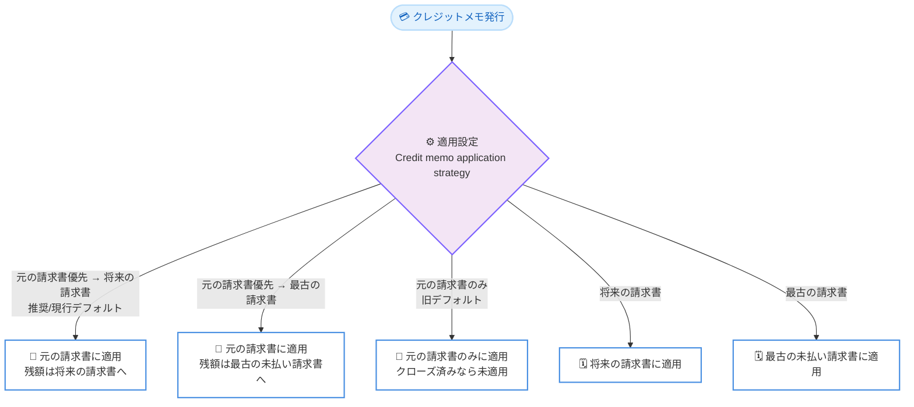

# AWS Billing and Cost Management - クレジットメモの自動適用設定

**リリース日**: 2026 年 7 月 23 日
**サービス**: AWS Billing and Cost Management
**機能**: クレジットメモの残高適用設定 (Balance application preferences)

📊 [このアップデートのインフォグラフィックを見る](https://takech9203.github.io/aws-news-summary/20260723-credit-memo-applications.html)
<!-- INFOGRAPHIC_BASE_URL は環境変数から取得 -->

## 概要

AWS は、電子資金振替 (EFT) で支払いを行うお客様を対象に、クレジットメモ (credit memo) を未払いの請求書へ自動的に適用する方法を設定できる機能を追加しました。お客様は AWS Billing and Cost Management コンソールの [Payment preferences] ページから、自社の支払いプロセスに合わせた適用方法を選択できます。

クレジットメモとは、AWS が発行する貸方伝票で、過払いや調整などによって生じた金額をお客様の未払い請求書に充当するために使用されます。今回のアップデートにより、クレジットメモを元の請求書に適用するか、次に発行される請求書に適用するか、あるいは最も古い未払い請求書に適用するかといった複数の選択肢を組み合わせて指定できるようになりました。デフォルトでは、クレジットメモはまず元の請求書に適用され、その後は将来の請求書に適用されます。

この機能は、経理部門が社内の会計処理や消込作業に合わせてクレジットメモの適用方法を柔軟にコントロールしたいというニーズに応えるものです。すべての商用 AWS リージョンで利用可能です。

**アップデート前の課題**

- クレジットメモの追加設定が導入される以前は、AWS はクレジットメモを元の請求書のみに適用するデフォルト動作を採用していた
- 元の請求書がすでにクローズされている場合、クレジットメモは未適用のまま残り、他の未払い請求書へ自動的に充当されなかった
- お客様が自社の会計処理や消込プロセスに合わせて適用方法を選択する手段がなかった

**アップデート後の改善**

- 今回のアップデートにより、コンソール上で 5 種類の適用方法から選択できるようになった
- 元の請求書、将来の請求書、最も古い未払い請求書への適用を組み合わせて指定できるようになった
- 設定は保存後すぐに反映され、社内の支払いプロセスに合わせた柔軟な運用が可能になった

## アーキテクチャ図



上図は、発行されたクレジットメモが、選択した適用設定に応じてどの請求書へ充当されるかの分岐を示しています。

## サービスアップデートの詳細

### 主要機能

1. **5 種類のクレジットメモ適用方法**
   - 元の請求書に優先適用し、残額を将来の請求書へ適用 (推奨・現行デフォルト)
   - 元の請求書に優先適用し、残額を最も古い未払い請求書へ適用
   - 元の請求書のみに適用 (旧デフォルト)
   - 将来の請求書に適用
   - 最も古い未払い請求書に適用

2. **コンソールからのセルフサービス設定**
   - AWS Billing and Cost Management コンソールの [Payment preferences] ページにある [Balance application preferences] タブから設定
   - [Credit memo application strategy] で希望する適用方法を選択し、[Save preferences] で保存
   - 変更はすぐに反映され、以降のすべてのクレジットメモ適用に適用される

3. **適用時の通知と履歴確認**
   - クレジットメモが適用されると、アカウントの請求先連絡先 (ルート連絡先、代替請求先連絡先、追加の請求先連絡先) にメール通知が送信される
   - 通知にはクレジットメモ番号、適用合計額、適用先請求書、残額 (一部適用の場合) が含まれる
   - 未適用のクレジットメモは [Payments] ページの [Unapplied funds] タブで確認できる

## 技術仕様

### 適用方法の一覧

| 適用方法 | 説明 |
|------|------|
| 元の請求書優先 → 将来の請求書 (推奨・現行デフォルト) | 発行対象の請求書がオープンであればそこに適用し、残額は次の対象となる将来の請求書へ順次適用 |
| 元の請求書優先 → 最古の請求書 | 発行対象の請求書に適用し、残額は最も古い未払い請求書へ適用 |
| 元の請求書のみ (旧デフォルト) | 発行対象の請求書がオープンな場合のみ適用。クローズ済みの場合は未適用のまま残る |
| 将来の請求書 | クレジットメモを保留し、次の対象となる将来の請求書へ適用 |
| 最古の請求書 | 最も古い未払い請求書へ適用 |

### 適用ロジック

| 項目 | 詳細 |
|------|------|
| 全額適用 | クレジットメモの金額が対象請求書の残高以下の場合、全額が適用される |
| 一部適用 | クレジットメモの金額が単一請求書の残高を超える場合、まずその請求書に適用し、残額は設定に応じて追加の請求書へ適用される |
| 複数請求書への適用 | 最古の請求書を対象とする設定では、最も古い請求書から順にクレジットメモが消費されるまで適用される |

## 設定方法

### 前提条件

1. 電子資金振替 (EFT) で支払いを行う AWS アカウントであること
2. クレジットカードなど EFT 以外の支払い方法のアカウントでは利用できない ([Balance application preferences] タブが表示されない)
3. AWS Billing and Cost Management コンソールへのアクセス権限があること

### 手順

#### ステップ 1: Payment preferences ページを開く

AWS Billing and Cost Management コンソール (https://console.aws.amazon.com/costmanagement/) を開き、ナビゲーションペインで [Payment preferences] を選択します。

#### ステップ 2: Balance application preferences タブを選択

[Balance application preferences] タブを開き、[Credit memo application strategy] のセクションを表示します。ここで現在の適用方法を確認できます。

#### ステップ 3: 適用方法を選択して保存

希望する適用方法を選択し、[Save preferences] を選択します。変更はただちに反映され、以降のすべてのクレジットメモ適用に適用されます。すでに適用済みのクレジットメモは設定変更の影響を受けません。

## メリット

### ビジネス面

- **社内プロセスとの整合**: 経理部門の消込作業や会計処理のルールに合わせてクレジットメモの適用先を制御できる
- **未適用残高の削減**: 元の請求書がクローズ済みでも、将来の請求書や最古の請求書へ自動的に充当できるため、未適用のまま残るクレジットメモを減らせる
- **透明性の向上**: 適用のたびにメール通知が届き、適用先や残額を把握しやすくなる

### 技術面

- **セルフサービス設定**: コンソールから即座に設定を変更でき、手動での問い合わせや調整作業が不要
- **即時反映**: 保存後すぐに以降の適用へ反映されるため、運用変更が迅速
- **追加コストなし**: 請求管理機能の一部として無料で利用できる

## デメリット・制約事項

### 制限事項

- 電子資金振替 (EFT) で支払うアカウントのみが対象で、クレジットカード等の支払い方法では利用できない
- クレジットメモのみが対象であり、AWS のプロモーションクレジットには影響しない
- AWS Marketplace の購入に対して発行されたクレジットメモは元の請求書にのみ適用され、他の請求書へ振り向けることはできない
- クレジットメモは、同じ販売者 (seller of record) かつ同じ通貨の請求書にのみ適用できる

### 考慮すべき点

- 設定変更は将来のクレジットメモ適用にのみ影響し、すでに適用済みのものは変更されない
- [元の請求書のみ] を選択した場合、元の請求書がクローズ済みだとクレジットメモは未適用のまま残る
- アカウントの他の制限により [Balance application preferences] タブが表示されない場合がある

## ユースケース

### ユースケース 1: 未払い残高の早期解消

**シナリオ**: 複数の未払い請求書を抱える企業が、クレジットメモを最も古い請求書から充当して延滞を早期に解消したい。

**実装例**:
```
Credit memo application strategy: 最古の請求書に適用
```

**効果**: 発行されたクレジットメモが最も古い未払い請求書から順に適用され、延滞リスクの高い残高を優先的に減らせる。

### ユースケース 2: 元の請求書との対応関係を維持

**シナリオ**: 会計上、クレジットメモを対象となった元の請求書に紐付けて処理する必要がある企業。

**実装例**:
```
Credit memo application strategy: 元の請求書のみに適用
```

**効果**: クレジットメモが必ず元の請求書に対応付けられ、消込の追跡が容易になる。ただし元の請求書がクローズ済みの場合は未適用として残る点に留意する。

### ユースケース 3: 将来の支払い負担の平準化

**シナリオ**: キャッシュフロー管理のため、クレジットメモを将来の請求書に充当して今後の支払い額を抑えたい企業。

**実装例**:
```
Credit memo application strategy: 将来の請求書に適用
```

**効果**: クレジットメモが保留され、次に発行される対象請求書へ順次適用されるため、将来の支払い額が軽減される。

## 料金

この機能自体は AWS Billing and Cost Management の一部として追加費用なしで利用できます。クレジットメモの適用設定を変更しても、追加の料金は発生しません。

## 利用可能リージョン

すべての商用 AWS リージョンで利用可能です。

## 関連サービス・機能

- **AWS Billing and Cost Management**: 本機能を提供する請求管理サービス。[Payment preferences] ページから設定を行う
- **AWS プロモーションクレジット**: クレジットメモとは別に管理される。本設定はプロモーションクレジットには影響しない
- **AWS Marketplace**: Marketplace 購入に対するクレジットメモは元の請求書にのみ適用される制約がある

## 参考リンク

- 📊 [インフォグラフィック](https://takech9203.github.io/aws-news-summary/20260723-credit-memo-applications.html)
- [公式発表 (What's New)](https://aws.amazon.com/about-aws/whats-new/2026/07/credit-memo-applications/)
- [ドキュメント: Managing balance application preferences](https://docs.aws.amazon.com/awsaccountbilling/latest/aboutv2/manage-balance-application-preferences.html)

## まとめ

このアップデートは、EFT で支払う AWS ユーザーがクレジットメモの適用方法を自社の会計プロセスに合わせて柔軟に制御できるようにするものです。追加費用なしでコンソールから即座に設定でき、未適用残高の削減や消込作業の効率化につながります。経理部門を担当する方は、[Payment preferences] ページで自社に最適な適用方法を確認・設定することをおすすめします。
