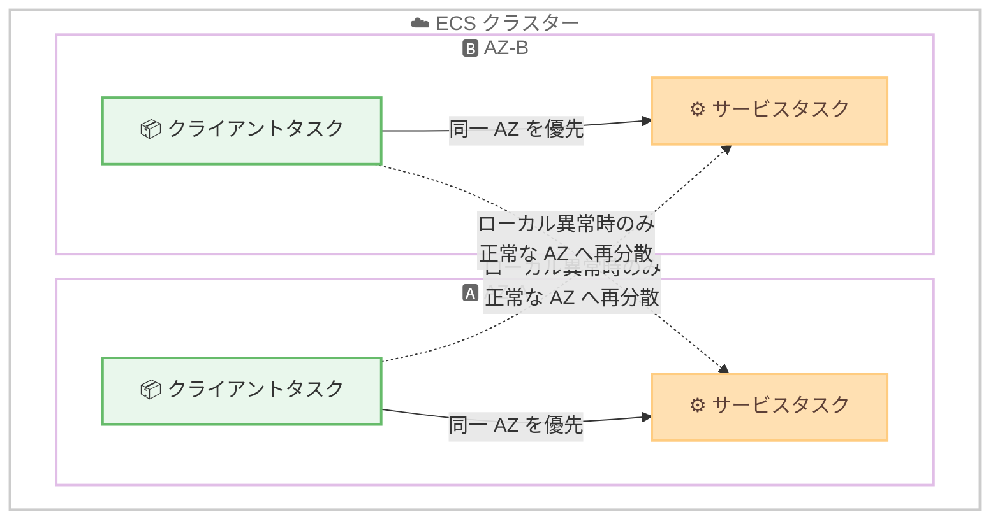

# Amazon ECS Service Connect - ゾーン対応ルーティング

**リリース日**: 2026 年 7 月 23 日
**サービス**: Amazon Elastic Container Service (ECS)
**機能**: ECS Service Connect Zone-Aware Routing (ゾーン対応ルーティング)

📊 [このアップデートのインフォグラフィックを見る](https://takech9203.github.io/aws-news-summary/20260723-ecs-service-connect-zone-aware.html)
<!-- INFOGRAPHIC_BASE_URL は環境変数から取得 -->

## 概要

Amazon ECS は、ECS Service Connect にゾーン対応ルーティング (Zone-Aware Routing) のサポートを追加しました。この機能は、サービス間通信のトラフィックを、リクエスト元のタスクと同じアベイラビリティーゾーン (AZ) 内のエンドポイントへ優先的にルーティングします。これにより、AZ をまたぐデータ転送 (クロス AZ トラフィック) を削減し、コストとレイテンシーの両方を低減できます。

従来、耐障害性を高めるためにアプリケーションを複数の AZ に分散配置すると、サービス間の通信が AZ をまたいで発生し、クロス AZ のデータ転送コストと追加のレイテンシーが避けられませんでした。ゾーン対応ルーティングは、この「コストと耐障害性のトレードオフ」を解消することを目的としています。

この機能は、すべての新規および既存のサービスに対してデフォルトで有効になり、追加のインフラストラクチャやコード変更を必要としません。既存のサービスでは、新しいルーティング動作を有効化するために 1 回の再デプロイのみが必要です。追加料金なしで利用できます。

**アップデート前の課題**

- 耐障害性のためにタスクを複数の AZ に分散すると、サービス間通信が AZ をまたいで発生し、クロス AZ データ転送コストが発生していた
- AZ をまたぐ通信により、サービス間のレイテンシーが増加していた
- コスト削減と耐障害性の確保が、トレードオフの関係になっていた

**アップデート後の改善**

- 同一 AZ 内のエンドポイントへトラフィックを優先的にルーティングすることで、クロス AZ データ転送コストを削減できるようになった
- 同一 AZ 内での通信を優先することで、サービス間のレイテンシーを低減できるようになった
- ローカルエンドポイントが異常または容量不足になった場合、トラフィックが正常な AZ へ自動的に再分散されるため、コスト削減と可用性の維持を両立できるようになった

## アーキテクチャ図



ゾーン対応ルーティングでは、実線が示すように同一 AZ 内のエンドポイントへトラフィックを優先し、点線が示すようにローカルエンドポイントが異常な場合のみ他の AZ へ再分散します。

## サービスアップデートの詳細

### 主要機能

1. **同一 AZ 優先ルーティング**
   - リクエスト元のタスクと同じ AZ 内にあるエンドポイントへ、サービス間トラフィックを優先的にルーティングする
   - AZ をまたぐデータ転送を削減し、コストとレイテンシーを低減する

2. **動的なトラフィックウェイト調整**
   - エンドポイントのスケールに応じて、トラフィックウェイトを動的に調整する
   - 対象サービス間で負荷が均等に保たれる

3. **異常時の自動フェイルオーバー**
   - ローカルの (同一 AZ の) エンドポイントが異常になる、または容量のしきい値を下回った場合、トラフィックを正常な AZ へ自動的に再分散する
   - 可用性を維持しながらコスト最適化を実現する

4. **デフォルト有効化とゼロコード変更**
   - すべての新規および既存サービスでデフォルトで有効になる
   - 追加のインフラストラクチャやコード変更は不要
   - 既存サービスでは、新しいルーティング動作を有効化するために 1 回の再デプロイのみが必要

## 技術仕様

### 機能の特性

| 項目 | 詳細 |
|------|------|
| 対象 | ECS Service Connect を利用するサービス間通信 |
| ルーティング方針 | リクエスト元と同一 AZ のエンドポイントを優先 |
| フェイルオーバー | ローカルエンドポイントが異常/容量不足の場合、正常な AZ へ自動再分散 |
| ウェイト調整 | エンドポイントのスケールに応じて動的に調整 |
| 有効化 | デフォルトで有効 (既存サービスは 1 回の再デプロイが必要) |
| 追加コスト | なし |
| モニタリング | AZ メタデータ付きの Amazon VPC Flow Logs で確認可能 |

### モニタリング

AZ メタデータを含む Amazon VPC Flow Logs を使用することで、トラフィックパターンを監視し、ルーティングが期待どおりに機能しているかを確認できます。

## 設定方法

### 前提条件

1. Amazon ECS のクラスターとサービスが構成されていること
2. サービス間通信に ECS Service Connect が有効化されていること
3. 耐障害性のためにタスクが複数の AZ に分散配置されていること

### 手順

#### ステップ1: 既存サービスの再デプロイ

```bash
aws ecs update-service \
  --cluster my-cluster \
  --service my-service \
  --force-new-deployment
```

既存のサービスでは、ゾーン対応ルーティングの新しい動作を有効化するために 1 回の再デプロイが必要です。`--force-new-deployment` オプションを指定して既存タスクを新しいタスクに置き換えることで、ルーティング動作が適用されます。新規に作成するサービスでは、この機能はデフォルトで有効になっています。

#### ステップ2: ルーティング動作の確認

```bash
# VPC Flow Logs を有効化し、AZ メタデータを含める
aws ec2 create-flow-logs \
  --resource-type VPC \
  --resource-ids vpc-xxxxxxxx \
  --traffic-type ALL \
  --log-destination-type cloud-watch-logs \
  --log-group-name /vpc/flowlogs
```

AZ メタデータを含む VPC Flow Logs を使用して、トラフィックが同一 AZ 内で処理されているかを確認します。これにより、ゾーン対応ルーティングが期待どおりに機能していることを検証できます。

## メリット

### ビジネス面

- **コスト削減**: 同一 AZ 内の通信を優先することで、クロス AZ データ転送コストを削減できる
- **追加料金なし**: この機能は追加コストなしで利用でき、既存の構成をそのまま活用してコスト最適化が可能
- **導入の容易さ**: コード変更や新しいインフラストラクチャが不要で、既存サービスは 1 回の再デプロイのみで導入できる

### 技術面

- **レイテンシー低減**: 同一 AZ 内での通信を優先することで、ネットワークレイテンシーを削減できる
- **可用性の維持**: ローカルエンドポイントの異常時に自動フェイルオーバーが機能するため、可用性を損なわずにコスト最適化できる
- **動的な負荷分散**: エンドポイントのスケールに応じてトラフィックウェイトが動的に調整され、負荷が均等に保たれる

## デメリット・制約事項

### 制限事項

- ECS Service Connect が有効化されているサービス間通信が対象となる
- 既存サービスでは、機能を有効化するために 1 回の再デプロイが必要
- 単一 AZ にタスクが偏っている構成では、フェイルオーバー時に得られる耐障害性のメリットは限定的

### 考慮すべき点

- コスト削減効果を最大化するには、各 AZ に十分な数のエンドポイントを配置しておくことが望ましい
- ローカルエンドポイントが不足すると他の AZ への再分散が発生し、期待したコスト削減が得られない場合がある
- ルーティングの効果は、VPC Flow Logs の AZ メタデータを用いて実際のトラフィックパターンで検証することが推奨される

## ユースケース

### ユースケース1: マイクロサービス間通信のコスト最適化

**シナリオ**: 複数のマイクロサービスを ECS 上で稼働させ、耐障害性のために複数の AZ に分散配置している。サービス間の頻繁な通信により、クロス AZ データ転送コストが増大していた。

**実装例**:
```
- ECS Service Connect を有効化
- 各サービスを再デプロイしてゾーン対応ルーティングを有効化
- VPC Flow Logs でクロス AZ トラフィックの減少を確認
```

**効果**: 同一 AZ 内の通信が優先され、クロス AZ データ転送コストを削減できる。

### ユースケース2: レイテンシーに敏感なアプリケーション

**シナリオ**: 低レイテンシーが求められるサービス間 API 呼び出しが多数発生しており、AZ をまたぐ通信による遅延がパフォーマンスに影響していた。

**実装例**:
```
- ゾーン対応ルーティングを有効化
- 各 AZ に十分なエンドポイントを配置
- 同一 AZ 内での通信を優先させてレイテンシーを低減
```

**効果**: AZ をまたぐ通信が減り、サービス間のレイテンシーが改善される。

### ユースケース3: コストと可用性を両立する本番環境

**シナリオ**: 本番環境で高可用性を維持しつつ、データ転送コストも最適化したい。

**実装例**:
```
- 各 AZ に冗長なエンドポイントを配置
- ゾーン対応ルーティングにより通常時は同一 AZ を優先
- ローカルエンドポイント異常時は正常な AZ へ自動フェイルオーバー
```

**効果**: 通常時はコストを最適化しつつ、異常時には可用性を維持できる。

## 料金

ゾーン対応ルーティングは、ECS Service Connect がサポートされているリージョンで追加料金なしで利用できます。ECS および Service Connect の既存の料金体系がそのまま適用されます。なお、この機能により同一 AZ 内の通信が優先されるため、AZ をまたぐデータ転送料金の削減効果が期待できます。

## 利用可能リージョン

ECS Service Connect がサポートされている、すべての AWS 商用リージョンおよび AWS GovCloud (US) リージョンで利用可能です。

## 関連サービス・機能

- **Amazon ECS Service Connect**: サービス間通信を簡素化するマネージド機能。ゾーン対応ルーティングはこの Service Connect の拡張機能として提供される
- **Amazon VPC Flow Logs**: AZ メタデータを含めることで、ゾーン対応ルーティングのトラフィックパターンを監視・検証できる
- **AWS Availability Zones**: 複数の AZ にまたがる分散構成が、この機能によるコスト最適化とフェイルオーバーの前提となる

## 参考リンク

- 📊 [インフォグラフィック](https://takech9203.github.io/aws-news-summary/20260723-ecs-service-connect-zone-aware.html)
- [公式発表 (What's New)](https://aws.amazon.com/about-aws/whats-new/2026/07/ecs-service-connect-zone-aware/)
- [AWS Blog: Announcing zone-aware routing in Amazon ECS Service Connect](https://aws.amazon.com/blogs/containers/announcing-zone-aware-routing-in-amazon-ecs-service-connect/)
- [ドキュメント: Service Connect zone-aware routing](https://docs.aws.amazon.com/AmazonECS/latest/developerguide/service-connect-zone-aware-routing.html)

## まとめ

ECS Service Connect のゾーン対応ルーティングは、コストと耐障害性のトレードオフを解消する重要なアップデートです。追加料金なし、コード変更なしで導入でき、既存サービスは 1 回の再デプロイのみで有効化できます。複数 AZ に分散配置したマイクロサービス環境では、クロス AZ データ転送コストとレイテンシーの削減効果が期待できるため、既存サービスの再デプロイを計画し、VPC Flow Logs で効果を検証することを推奨します。
