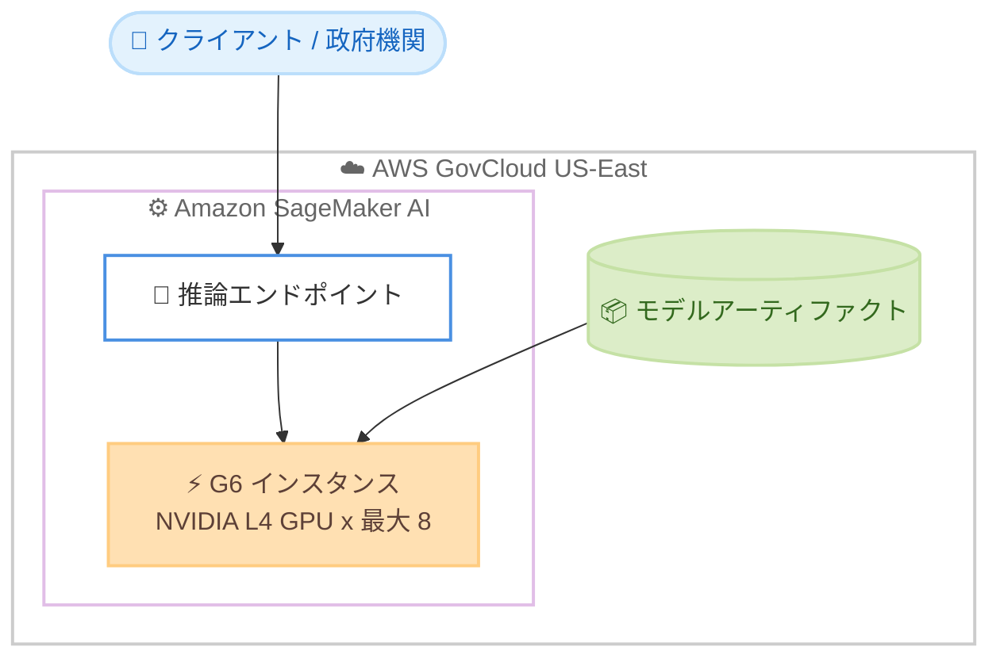

# Amazon SageMaker AI - G6 インスタンスのリージョン拡大

**リリース日**: 2026 年 7 月 23 日
**サービス**: Amazon SageMaker AI (Inference)
**機能**: Amazon EC2 G6 インスタンスのリージョン拡大

📊 [このアップデートのインフォグラフィックを見る](https://takech9203.github.io/aws-news-summary/20260723-g6-sagemaker-ai-inference.html)
<!-- INFOGRAPHIC_BASE_URL は環境変数から取得 -->

## 概要

AWS は、Amazon EC2 G6 インスタンスを SageMaker AI の推論ワークロード向けに新しいリージョンへ拡大したことを発表しました。今回のアップデートにより、G6 インスタンスは AWS GovCloud (US-East) リージョンでも利用可能になり、これまでサポートされていたリージョンに追加されました。

G6 インスタンスは、最大 8 基の NVIDIA L4 Tensor Core GPU (各 24 GB メモリ) と第 3 世代 AMD EPYC プロセッサを搭載しています。G4dn インスタンスと比較して最大 2 倍のディープラーニング推論性能を提供し、24 GB の GPU メモリに収まるワークロードに適しています。

GovCloud (US-East) での提供により、政府機関やコンプライアンス要件の厳しい組織は、厳格なコンプライアンスおよびデータレジデンシー要件を満たしながら、生成 AI ワークロード (小規模から中規模の言語モデル、画像生成、コンピュータビジョンタスクなど) を SageMaker AI 上で提供できるようになります。

**アップデート前の課題**

- GovCloud (US-East) では SageMaker AI 推論向けに G6 インスタンスを利用できなかった
- コンプライアンスやデータレジデンシー要件のある組織が、費用対効果の高い GPU 推論環境を選択しにくかった
- 政府系ワークロードで生成 AI 推論を実行する際の選択肢が限られていた

**アップデート後の改善**

- GovCloud (US-East) でも SageMaker AI 推論に G6 インスタンスを利用できるようになった
- コンプライアンス要件を満たしつつ、G6 の高い価格性能比で本番推論を実行できる
- 政府機関が小規模から中規模の LLM、画像生成、コンピュータビジョンを含む生成 AI ワークロードを提供できる

## アーキテクチャ図



GovCloud (US-East) 内の SageMaker AI 推論エンドポイントが、G6 インスタンス上でモデルをホストし、クライアントからの推論リクエストに応答する構成を示しています。

## サービスアップデートの詳細

### 主要機能

1. **G6 インスタンスの GovCloud (US-East) 対応**
   - SageMaker AI の推論ワークロード向けに G6 インスタンスが GovCloud (US-East) で利用可能になった
   - これまでサポートされていたリージョンに追加される形での拡大

2. **NVIDIA L4 GPU による高い推論性能**
   - 最大 8 基の NVIDIA L4 Tensor Core GPU を搭載し、各 GPU は 24 GB のメモリを備える
   - G4dn インスタンスと比較して最大 2 倍のディープラーニング推論性能を提供

3. **コンプライアンス要件への対応**
   - GovCloud (US-East) での提供により、厳格なコンプライアンスおよびデータレジデンシー要件を満たしながら生成 AI ワークロードを実行できる
   - 小規模から中規模の言語モデル、画像生成、コンピュータビジョンタスクなどに対応

## 技術仕様

### G6 インスタンスの主要スペック

| 項目 | 詳細 |
|------|------|
| GPU | 最大 8 基の NVIDIA L4 Tensor Core GPU |
| GPU メモリ | 各 GPU あたり 24 GB |
| CPU | 第 3 世代 AMD EPYC プロセッサ |
| 推論性能 | G4dn 比で最大 2 倍のディープラーニング推論性能 |
| 適したワークロード | 24 GB の GPU メモリに収まる推論ワークロード |

## 設定方法

### 前提条件

1. GovCloud (US-East) リージョンで利用可能な AWS アカウント
2. Amazon SageMaker AI を利用するための IAM 権限
3. デプロイ対象のモデルアーティファクト (Amazon S3 上のモデルデータ)

### 手順

#### ステップ1: モデルの作成

```bash
aws sagemaker create-model \
  --model-name my-g6-model \
  --primary-container Image=<推論コンテナイメージ URI>,ModelDataUrl=s3://<バケット>/model.tar.gz \
  --execution-role-arn <実行ロール ARN> \
  --region us-gov-east-1
```

SageMaker AI にモデルを登録します。GovCloud (US-East) のリージョンコード `us-gov-east-1` を指定します。

#### ステップ2: エンドポイント設定の作成

```bash
aws sagemaker create-endpoint-config \
  --endpoint-config-name my-g6-endpoint-config \
  --production-variants VariantName=AllTraffic,ModelName=my-g6-model,InstanceType=ml.g6.xlarge,InitialInstanceCount=1 \
  --region us-gov-east-1
```

推論に使用するインスタンスタイプとして G6 系 (例: `ml.g6.xlarge`) を指定したエンドポイント設定を作成します。

#### ステップ3: エンドポイントのデプロイ

```bash
aws sagemaker create-endpoint \
  --endpoint-name my-g6-endpoint \
  --endpoint-config-name my-g6-endpoint-config \
  --region us-gov-east-1
```

エンドポイント設定をもとに推論エンドポイントをデプロイします。デプロイ完了後、G6 インスタンス上でモデルが推論リクエストに応答します。

## メリット

### ビジネス面

- **コンプライアンス対応**: GovCloud (US-East) での提供により、厳格なコンプライアンスやデータレジデンシー要件を満たしながら生成 AI を運用できる
- **価格性能比**: 本番推論ワークロードに対して高い価格性能比を提供する
- **政府系ワークロードの拡大**: 政府機関や規制産業が生成 AI 推論を実行する選択肢が広がる

### 技術面

- **高い推論性能**: G4dn 比で最大 2 倍のディープラーニング推論性能を発揮する
- **柔軟な GPU 構成**: 最大 8 基の NVIDIA L4 GPU を利用でき、ワークロードに応じたスケールが可能
- **多様なワークロード対応**: 小規模から中規模の LLM、画像生成、コンピュータビジョンに対応する

## デメリット・制約事項

### 制限事項

- 各 GPU のメモリは 24 GB のため、24 GB を超える GPU メモリを必要とする大規模モデルには適さない
- 今回の拡大は GovCloud (US-East) が対象であり、すべてのリージョンで利用できるわけではない

### 考慮すべき点

- 大規模モデルや高メモリ要件のワークロードには、より大容量の GPU を搭載したインスタンスの検討が必要
- 利用可能なインスタンスサイズやクォータはリージョンごとに異なる場合があるため、事前に確認が必要

## ユースケース

### ユースケース1: 政府機関での生成 AI 推論

**シナリオ**: 政府機関が、コンプライアンスおよびデータレジデンシー要件を満たしながら小規模から中規模の言語モデルを推論エンドポイントとして提供したい。

**効果**: GovCloud (US-East) の G6 インスタンスを利用することで、要件を満たしつつ費用対効果の高い推論環境を構築できる。

### ユースケース2: 画像生成ワークロード

**シナリオ**: 規制産業の組織が、画像生成モデルを本番環境でホストしたい。

**効果**: NVIDIA L4 GPU を搭載した G6 インスタンスにより、24 GB の GPU メモリに収まる画像生成モデルを高い価格性能比で提供できる。

### ユースケース3: コンピュータビジョンタスク

**シナリオ**: コンピュータビジョンによる分類や物体検出を GovCloud 環境で運用したい。

**効果**: G4dn 比で最大 2 倍の推論性能により、レイテンシと処理効率を改善しながらコンプライアンス要件を維持できる。

## 料金

G6 インスタンスは本番推論ワークロードに対して高い価格性能比を提供します。SageMaker AI での具体的な料金は、リージョンおよびインスタンスサイズによって異なります。最新の料金は Amazon SageMaker AI の料金ページを参照してください。

## 利用可能リージョン

今回のアップデートにより、SageMaker AI 推論向けの G6 インスタンスは AWS GovCloud (US-East) でも利用可能になりました。これまでサポートされていたリージョンに追加される形での拡大です。

## 関連サービス・機能

- **Amazon EC2 G6 インスタンス**: NVIDIA L4 GPU を搭載した GPU インスタンスファミリー。SageMaker AI 推論の基盤となる
- **Amazon SageMaker AI**: 機械学習モデルの構築、トレーニング、デプロイを行うマネージドサービス。推論エンドポイントに G6 インスタンスを利用できる
- **AWS GovCloud (US)**: 米国政府の規制やコンプライアンス要件に対応した分離リージョン

## 参考リンク

- 📊 [インフォグラフィック](https://takech9203.github.io/aws-news-summary/20260723-g6-sagemaker-ai-inference.html)
- [公式発表 (What's New)](https://aws.amazon.com/about-aws/whats-new/2026/07/g6-sagemaker-ai-inference/)
- [Amazon EC2 G6 インスタンス](https://aws.amazon.com/ec2/instance-types/g6/)
- [Amazon SageMaker AI 料金ページ](https://aws.amazon.com/sagemaker-ai/pricing/)

## まとめ

今回のアップデートにより、コンプライアンス要件の厳しい GovCloud (US-East) でも、NVIDIA L4 GPU を搭載した G6 インスタンスを SageMaker AI 推論に利用できるようになりました。政府機関や規制産業で生成 AI 推論を検討している場合は、G6 の価格性能比とコンプライアンス対応を評価し、対象ワークロードが 24 GB の GPU メモリに収まるかを確認したうえで導入を検討してください。
