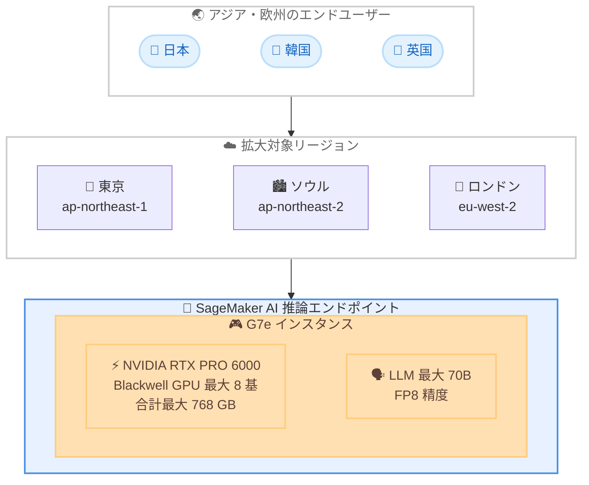

# Amazon SageMaker AI - G7e インスタンスの推論向けリージョン拡大

**リリース日**: 2026 年 7 月 23 日
**サービス**: Amazon SageMaker AI
**機能**: SageMaker AI 推論での Amazon EC2 G7e インスタンスのリージョン拡大

📊 [このアップデートのインフォグラフィックを見る](https://takech9203.github.io/aws-news-summary/20260723-g7e-sagemaker-ai.html)

## 概要

Amazon EC2 G7e インスタンスが、Amazon SageMaker AI の推論において、アジアパシフィック (ソウル)、欧州 (ロンドン)、アジアパシフィック (東京) の各リージョンで利用可能になりました。これにより、これらのリージョンのお客様は、最新世代の NVIDIA Blackwell アーキテクチャ GPU を搭載した推論エンドポイントを、エンドユーザーの近くにデプロイできるようになります。

G7e インスタンスは、最大 8 基の NVIDIA RTX PRO 6000 Blackwell Server Edition GPU を搭載し、GPU あたり 96 GB のメモリを備えています。さらに第 5 世代 Intel Xeon プロセッサと、最大 1,600 Gbps の Elastic Fabric Adapter (EFA) ネットワーク帯域幅を提供し、前世代の G6e インスタンスと比較して最大 2.3 倍の推論パフォーマンスを実現します。単一インスタンスで最大 768 GB の合計 GPU メモリを提供するため、FP8 精度で最大 700 億 (70B) パラメータの中規模から大規模な言語モデルを、マルチノード構成なしで提供できます。

今回のリージョン拡大により、アジアおよび欧州のお客様は、生成 AI ワークロードのレイテンシを低減しながら、LLM 推論、画像・動画生成、空間コンピューティング、科学技術計算といった要求の高いワークロードを実行できます。特に東京リージョンでの提供開始は、日本国内のエンドユーザーへ低レイテンシで生成 AI 推論を提供したいお客様にとって重要な選択肢となります。

**アップデート前の課題**

- アジアパシフィック (ソウル)、欧州 (ロンドン)、アジアパシフィック (東京) の各リージョンでは、SageMaker AI 推論で G7e インスタンスを選択できなかった
- これらのリージョンのエンドユーザーに対して、最新の Blackwell GPU を用いた推論エンドポイントを近接デプロイできず、他リージョンを利用するとネットワークレイテンシが増加していた
- 大規模モデルの推論において、前世代の G6e インスタンスでは推論パフォーマンスに制約があった
- 700 億パラメータ規模のモデルを単一インスタンスで提供しづらく、マルチノード構成が必要になる場合があった

**アップデート後の改善**

- アジアパシフィック (ソウル)、欧州 (ロンドン)、アジアパシフィック (東京) で SageMaker AI 推論エンドポイントに G7e インスタンスを利用できるようになった
- エンドユーザーの近くに推論エンドポイントをデプロイでき、生成 AI ワークロードのレイテンシを低減できるようになった
- 前世代の G6e インスタンスと比較して最大 2.3 倍の推論パフォーマンスを実現できるようになった
- 最大 768 GB の合計 GPU メモリにより、FP8 精度で最大 70B パラメータのモデルをマルチノード構成なしで提供できるようになった

## アーキテクチャ図



この図は、アジア・欧州のエンドユーザーに近い東京、ソウル、ロンドンの各リージョンで G7e インスタンスを用いた SageMaker AI 推論エンドポイントを提供し、レイテンシを低減する構成を示しています。

## サービスアップデートの詳細

### 主要機能

1. **推論向け G7e インスタンスのリージョン拡大**
   - アジアパシフィック (ソウル) で利用可能に
   - 欧州 (ロンドン) で利用可能に
   - アジアパシフィック (東京) で利用可能に
   - エンドユーザーに近いリージョンで推論エンドポイントをデプロイ可能

2. **NVIDIA RTX PRO 6000 Blackwell GPU の高性能推論**
   - 最大 8 基の NVIDIA RTX PRO 6000 Blackwell Server Edition GPU を搭載
   - GPU あたり 96 GB、最大 768 GB の合計 GPU メモリ
   - 前世代 G6e と比較して最大 2.3 倍の推論パフォーマンス

3. **大規模モデルの単一インスタンス提供**
   - FP8 精度で最大 70B パラメータの言語モデルを提供可能
   - マルチノード構成が不要で、運用の複雑さを低減
   - 中規模から大規模のモデルに対応

4. **高性能な CPU とネットワーク**
   - 第 5 世代 Intel Xeon プロセッサを搭載
   - 最大 1,600 Gbps の Elastic Fabric Adapter (EFA) ネットワーク帯域幅
   - 高スループットな推論処理に対応

## 技術仕様

### G7e インスタンスの主要スペック

| 項目 | 詳細 |
|------|------|
| GPU | NVIDIA RTX PRO 6000 Blackwell Server Edition (最大 8 基) |
| GPU メモリ | GPU あたり 96 GB (最大合計 768 GB) |
| CPU | 第 5 世代 Intel Xeon プロセッサ |
| ネットワーク帯域幅 | 最大 1,600 Gbps (Elastic Fabric Adapter) |
| 推論パフォーマンス | 前世代 G6e と比較して最大 2.3 倍 |
| 対応モデル規模 | FP8 精度で最大 70B パラメータ (マルチノード不要) |

### 対応ワークロード

| ワークロード | 説明 |
|------|------|
| LLM 推論 | 大規模言語モデルの推論エンドポイント提供 |
| 画像・動画生成 | 生成 AI による画像および動画の生成 |
| 空間コンピューティング | 3D や空間認識を伴うワークロード |
| 科学技術計算 | 高い GPU メモリと帯域幅を要する計算処理 |

## 設定方法

### 前提条件

1. AWS アカウントが作成されている
2. 対象リージョン (東京、ソウル、ロンドンのいずれか) で SageMaker AI が利用可能である
3. 適切な IAM 権限 (SageMaker のモデルデプロイ権限) が付与されている
4. 対象リージョンで G7e インスタンスのサービスクォータが確保されている

### 手順

#### ステップ 1: サービスクォータの確認

```bash
aws service-quotas list-service-quotas \
  --service-code sagemaker \
  --region ap-northeast-1 \
  --query "Quotas[?contains(QuotaName, 'g7e')]"
```

このコマンドは、東京リージョンの SageMaker で利用可能な G7e 関連のサービスクォータを一覧表示します。クォータが不足している場合は、Service Quotas コンソールから引き上げをリクエストしてください。

#### ステップ 2: モデルと推論エンドポイント設定の作成

```bash
aws sagemaker create-endpoint-config \
  --endpoint-config-name g7e-inference-config \
  --region ap-northeast-1 \
  --production-variants '[{
    "VariantName": "g7e-variant",
    "ModelName": "my-llm-model",
    "InstanceType": "ml.g7e.xlarge",
    "InitialInstanceCount": 1
  }]'
```

このコマンドは、G7e インスタンス (`ml.g7e.xlarge`) を利用する推論エンドポイント設定を作成します。事前に作成したモデル (`my-llm-model`) を指定します。

#### ステップ 3: 推論エンドポイントのデプロイ

```bash
aws sagemaker create-endpoint \
  --endpoint-name g7e-llm-endpoint \
  --endpoint-config-name g7e-inference-config \
  --region ap-northeast-1
```

このコマンドは、作成したエンドポイント設定を用いて推論エンドポイントを東京リージョンにデプロイします。デプロイ完了後、エンドユーザーに近いリージョンで低レイテンシな推論を提供できます。

## メリット

### ビジネス面

- **ユーザー体験の向上**: エンドユーザーの近くに推論エンドポイントを配置でき、生成 AI アプリケーションの応答レイテンシを低減できる
- **データレジデンシーへの対応**: 東京、ソウル、ロンドンの各リージョンで推論を実行でき、地域のデータ所在地要件に対応しやすくなる
- **コスト効率の高い推論**: 前世代比で最大 2.3 倍の推論パフォーマンスにより、同一スループットあたりのコストを最適化できる

### 技術面

- **大規模モデルの単一インスタンス提供**: 最大 768 GB の GPU メモリにより、FP8 精度で 70B パラメータのモデルをマルチノード構成なしで提供できる
- **運用の簡素化**: マルチノード構成が不要になることで、推論基盤の構成と運用が簡潔になる
- **高いデータスループット**: 最大 1,600 Gbps の EFA 帯域幅により、大量の推論リクエストでもボトルネックを抑えられる
- **マネージド環境での GPU 活用**: SageMaker AI のマネージド推論エンドポイントとして最新の Blackwell GPU を利用できる

## デメリット・制約事項

### 制限事項

- 本アップデートは推論向けのリージョン拡大であり、対象は今回追加されたソウル、ロンドン、東京と既存の対応リージョンに限られる
- G7e インスタンスのサービスクォータがデフォルトでは低い可能性があり、事前に引き上げリクエストが必要な場合がある
- NVIDIA RTX PRO 6000 は、A100 や H100 などのデータセンター向け GPU とはアーキテクチャが異なり、ワークロードによって性能特性が異なる

### 考慮すべき点

- G7e インスタンスは高性能な分、オンデマンド料金が高額になるため、トラフィックに応じたオートスケーリングやエンドポイントの適切な管理でコストを抑える運用が重要
- 70B を超える超大規模モデルや、FP8 以外の高精度が求められるケースでは、マルチインスタンス構成や他のインスタンスタイプの検討が必要になる場合がある
- リージョンごとにインスタンスの提供状況や料金が異なるため、デプロイ前に対象リージョンの詳細を確認する

## ユースケース

### ユースケース 1: 日本国内向け生成 AI チャットアプリケーション

**シナリオ**: 日本国内のエンドユーザー向けに生成 AI チャットボットを提供する企業が、応答レイテンシを最小化したい。

**実装例**:
```bash
# 東京リージョンに G7e 推論エンドポイントをデプロイ
aws sagemaker create-endpoint \
  --endpoint-name jp-chatbot-endpoint \
  --endpoint-config-name g7e-inference-config \
  --region ap-northeast-1
```

**効果**: 東京リージョンで推論を実行することで、日本国内ユーザーへのネットワークレイテンシを低減し、リアルタイム性の高いチャット体験を提供できる。

### ユースケース 2: 70B パラメータ LLM の単一インスタンス提供

**シナリオ**: 700 億パラメータ規模の LLM を、複雑なマルチノード構成を避けてシンプルに本番提供したい。

**実装例**:
```python
import boto3

sm = boto3.client("sagemaker", region_name="eu-west-2")
sm.create_endpoint_config(
    EndpointConfigName="llm-70b-config",
    ProductionVariants=[{
        "VariantName": "g7e-variant",
        "ModelName": "llm-70b-fp8",
        "InstanceType": "ml.g7e.48xlarge",
        "InitialInstanceCount": 1,
    }],
)
```

**効果**: 最大 768 GB の GPU メモリを活用し、FP8 精度の 70B モデルを単一インスタンスで提供でき、運用の複雑さを低減できる。

### ユースケース 3: 欧州向け画像・動画生成サービス

**シナリオ**: 欧州のユーザー向けに画像・動画生成 API を提供し、地域内での低レイテンシと高いスループットを実現したい。

**実装例**:
```bash
# ロンドンリージョンに画像生成モデルの推論エンドポイントをデプロイ
aws sagemaker create-endpoint \
  --endpoint-name eu-image-gen-endpoint \
  --endpoint-config-name g7e-inference-config \
  --region eu-west-2
```

**効果**: ロンドンリージョンで Blackwell GPU を用いた推論を実行し、欧州ユーザーへ低レイテンシで画像・動画生成サービスを提供できる。

## 料金

SageMaker AI 推論での G7e インスタンスの利用は、使用したインスタンスタイプと稼働時間に基づいて課金されます。料金はリージョンによって異なります。

### 料金例

| インスタンスタイプ | 用途 | 課金単位 |
|------------------|------|---------|
| ml.g7e.xlarge | GPU 推論 | 時間単位 |
| ml.g7e.2xlarge | GPU 推論 | 時間単位 |
| ml.g7e.4xlarge | GPU 推論 | 時間単位 |
| ml.g7e.8xlarge | GPU 推論 | 時間単位 |
| ml.g7e.16xlarge | GPU 推論 | 時間単位 |
| ml.g7e.48xlarge | GPU 推論 | 時間単位 |

料金の詳細は [Amazon SageMaker AI 料金ページ](https://aws.amazon.com/sagemaker/ai/pricing/) を参照してください。

## 利用可能リージョン

今回のリージョン拡大により、以下のリージョンで SageMaker AI 推論での G7e インスタンス利用が可能になりました。

- **Asia Pacific (Seoul)**: ap-northeast-2
- **Europe (London)**: eu-west-2
- **Asia Pacific (Tokyo)**: ap-northeast-1

上記に加え、既存の対応リージョンでも引き続き利用できます。

## 関連サービス・機能

- **Amazon EC2 G7e インスタンス**: SageMaker AI で利用される G7e の基盤となる EC2 インスタンスタイプ。NVIDIA RTX PRO 6000 Blackwell Server Edition GPU を搭載
- **Amazon SageMaker AI**: モデルの開発・トレーニング・デプロイを統合的に管理するプラットフォーム。推論エンドポイントを通じて本番提供を実現
- **Amazon SageMaker Studio**: G7e インスタンスをサポートするインタラクティブな開発環境。推論エンドポイントのデプロイ前のモデル開発・実験に利用
- **Amazon SageMaker HyperPod**: 基盤モデルのトレーニング・デプロイ向けの専用インフラストラクチャ。同じく G7e インスタンスをサポート

## 参考リンク

- 📊 [インフォグラフィック](https://takech9203.github.io/aws-news-summary/20260723-g7e-sagemaker-ai.html)
- [公式発表 (What's New)](https://aws.amazon.com/about-aws/whats-new/2026/07/g7e-sagemaker-ai/)
- [Amazon EC2 G7e インスタンス](https://aws.amazon.com/ec2/instance-types/g7e/)
- [Amazon SageMaker AI 料金ページ](https://aws.amazon.com/sagemaker/ai/pricing/)

## まとめ

Amazon SageMaker AI 推論で G7e インスタンスがアジアパシフィック (ソウル)、欧州 (ロンドン)、アジアパシフィック (東京) に拡大されたことで、アジア・欧州のお客様は最新の NVIDIA RTX PRO 6000 Blackwell GPU を用いた推論エンドポイントをエンドユーザーの近くにデプロイできるようになりました。前世代比で最大 2.3 倍の推論パフォーマンス、最大 768 GB の GPU メモリによる 70B モデルの単一インスタンス提供により、生成 AI ワークロードのレイテンシとコストを最適化できます。日本国内向けサービスを提供するお客様は、東京リージョンでの提供開始を機に、サービスクォータとリージョン別の料金を確認したうえで、推論基盤への採用を検討することを推奨します。
