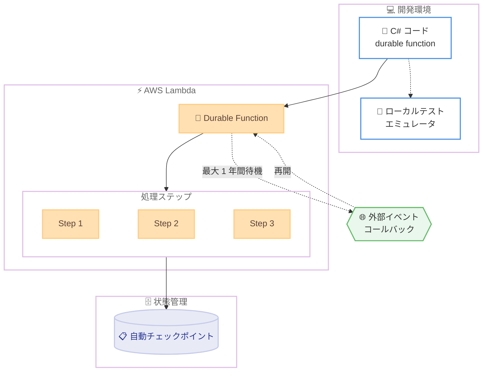

# AWS Lambda - .NET 向け Durable Execution SDK

**リリース日**: 2026 年 7 月 23 日
**サービス**: AWS Lambda
**機能**: Lambda Durable Execution SDK for .NET (一般提供開始)

📊 [このアップデートのインフォグラフィックを見る](https://takech9203.github.io/aws-news-summary/20260723-lambdadf-dotnet.html)
<!-- INFOGRAPHIC_BASE_URL は環境変数から取得 -->

## 概要

AWS は、.NET 向けの Lambda Durable Execution SDK の一般提供 (GA) を開始しました。この SDK により、C# 開発者は Lambda durable functions を使用して、回復性のある長時間実行ワークフローを構築できます。開発者は独自の進捗トラッキングの仕組みを構築したり、外部のオーケストレーションサービスに接続したりすることなく、複数ステップのアプリケーションをコード内で直接記述できます。

durable functions は進捗を自動的にチェックポイントとして記録し、外部イベントを待機する際には最大 1 年間実行を一時停止できます。これにより、支払い処理パイプライン、AI エージェントのオーケストレーション、人間による承認を含むワークフロー (human-in-the-loop) などのユースケースに適した、信頼性の高いアプリケーションを構築できます。

SDK は慣用的な (idiomatic) C# 体験を提供し、既存の .NET ツールチェーンに NuGet からインストールできます。また、ローカルテスト用のエミュレータが含まれており、本番環境へのデプロイ前にローカルでビルドとデバッグを実施できます。

**アップデート前の課題**

このアップデート以前、C# 開発者が Lambda で長時間実行ワークフローを構築する際には次のような課題がありました。

- 複数ステップのワークフローの進捗を追跡するために、独自の状態管理の仕組みを構築する必要があった
- 外部イベントの待機やステップ間の連携のために、別のオーケストレーションサービスやサードパーティツールへの接続が必要だった
- 障害発生時の再試行や再開のロジックを開発者自身が実装する必要があり、コードが複雑化していた

**アップデート後の改善**

今回のアップデートにより、次のことが可能になりました。

- 独自の進捗トラッキングや外部オーケストレーションサービスなしで、複数ステップのワークフローを C# コード内で直接記述できるようになった
- 進捗の自動チェックポイントにより、外部イベント待機時に最大 1 年間実行を一時停止できるようになった
- ローカルテストエミュレータにより、本番デプロイ前にワークフローをローカルで開発・デバッグできるようになった

## アーキテクチャ図



C# で記述した durable function が Lambda 上でステップごとに実行され、進捗が自動的にチェックポイントとして記録されます。外部イベントを待機する間は実行を一時停止し、コールバックによって再開されます。

## サービスアップデートの詳細

### 主要機能

1. **Steps (進捗トラッキング)**
   - ワークフローを複数のステップに分割し、各ステップの進捗を追跡します
   - 各ステップの完了時に状態が自動的にチェックポイントとして記録されます
   - 障害発生時には記録済みの進捗から再開できるため、処理をやり直す必要がありません

2. **Callback integration (コールバック連携)**
   - 人間やエージェントを介在させるワークフロー (human/agent-in-the-loop) を実現します
   - 外部からのコールバックによってワークフローを再開できます
   - 承認プロセスや AI エージェントのオーケストレーションに適しています

3. **Durable invocation (信頼性の高い関数チェーン)**
   - 関数を信頼性の高い形で連鎖 (チェーン) 実行できます
   - 複数の関数呼び出しを組み合わせた複雑なワークフローを構築できます

4. **Waits (効率的な一時停止)**
   - 外部イベントを待機する間、実行を効率的に一時停止できます
   - 最大 1 年間の待機に対応しています

5. **ローカルテストエミュレータ**
   - 本番環境へのデプロイ前に、ローカルでワークフローのビルドとデバッグを実施できます
   - 専用の NuGet パッケージとして提供されます

## 技術仕様

### 提供形態

| 項目 | 詳細 |
|------|------|
| 対応言語 | .NET / C# |
| 配布方法 | NuGet パッケージ (`Amazon.Lambda.DurableExecution`) |
| ローカルテスト | エミュレータパッケージ (`Amazon.Lambda.DurableExecution.Testing`) |
| 待機可能期間 | 最大 1 年間 |
| ステータス | 一般提供 (GA) |

### API 変更履歴

今回のアップデートに直接関連する awsapichanges.com 上の API 変更は確認できませんでした。durable functions の機能は Lambda の既存 API を通じて利用します。

## 設定方法

### 前提条件

1. .NET 開発環境 (対応する .NET SDK)
2. AWS アカウントと Lambda を利用するための IAM 権限
3. NuGet パッケージを取得できる開発環境

### 手順

#### ステップ 1: NuGet パッケージのインストール

```bash
dotnet add package Amazon.Lambda.DurableExecution
```

このコマンドは、durable functions を構築するための SDK をプロジェクトに追加します。

#### ステップ 2: ローカルテストパッケージのインストール

```bash
dotnet add package Amazon.Lambda.DurableExecution.Testing
```

このコマンドは、ローカルでワークフローをテスト・デバッグするためのエミュレータパッケージを追加します。

#### ステップ 3: durable function の実装

SDK が提供する Steps、Waits、Callback、Durable invocation などのプリミティブを使用して、C# コード内で複数ステップのワークフローを記述します。詳細な実装方法は Lambda durable functions 開発者ガイドを参照してください。

## メリット

### ビジネス面

- **開発工数の削減**: 独自の状態管理やオーケストレーション基盤の構築が不要になり、ビジネスロジックの実装に集中できます
- **信頼性の向上**: 自動チェックポイントにより、障害発生時も処理を最初からやり直す必要がなく、業務の信頼性が高まります
- **運用コストの最適化**: 外部オーケストレーションサービスへの依存を減らせます

### 技術面

- **慣用的な C# 体験**: 既存の .NET ツールチェーンにそのまま統合でき、学習コストが低い
- **長時間ワークフローへの対応**: 最大 1 年間の一時停止に対応し、承認待ちや外部イベント待機を含むワークフローを実装できる
- **ローカル開発の効率化**: エミュレータにより、デプロイ前にローカルでテスト・デバッグが可能

## デメリット・制約事項

### 制限事項

- .NET / C# 環境が対象です (他の言語ランタイムについては別途 SDK の対応状況を確認する必要があります)
- 利用可能リージョンについては AWS Regional Services List で確認が必要です

### 考慮すべき点

- durable functions の実行モデルとチェックポイントの動作を理解した上で設計する必要があります
- 長時間の待機を伴うワークフローでは、状態の一貫性やべき等性 (idempotency) を考慮した実装が推奨されます

## ユースケース

### ユースケース 1: 支払い処理パイプライン

**シナリオ**: 複数のステップ (与信確認、決済、通知など) から構成される支払い処理を、各ステップの進捗を確実に追跡しながら実行したい。

**効果**: 各ステップが自動的にチェックポイントとして記録されるため、途中で障害が発生しても完了済みのステップをやり直さずに再開でき、二重決済などのリスクを低減できます。

### ユースケース 2: AI エージェントのオーケストレーション

**シナリオ**: 複数の AI エージェントや外部ツールを連携させ、長時間にわたる処理を調整したい。

**効果**: Durable invocation とコールバック連携により、エージェント間の処理を信頼性高くチェーンでき、外部応答を待機する間も実行を効率的に一時停止できます。

### ユースケース 3: 人間による承認を含むワークフロー

**シナリオ**: 申請から承認までのプロセスで、担当者の承認を待ってから次の処理に進めたい。

**効果**: Waits とコールバック連携により、承認イベントを最大 1 年間待機でき、承認後に自動的にワークフローを再開できます。

## 料金

Lambda durable functions の利用に伴う料金は、AWS Lambda の料金体系に従います。具体的な料金については AWS Lambda 料金ページを参照してください。SDK 自体は NuGet から無償で入手できます。

## 利用可能リージョン

利用可能なリージョンについては、AWS Regional Services List を参照してください。

## 関連サービス・機能

- **AWS Lambda durable functions**: 本 SDK が対象とする、回復性のある長時間実行ワークフローを実現する Lambda の機能
- **AWS Step Functions**: 複数ステップのワークフローをオーケストレーションするサービス。durable functions はコード中心のアプローチを提供する点で補完的
- **AWS Lambda (.NET ランタイム)**: 本 SDK が動作する基盤となる C# / .NET 実行環境

## 参考リンク

- 📊 [インフォグラフィック](https://takech9203.github.io/aws-news-summary/20260723-lambdadf-dotnet.html)
- [公式発表 (What's New)](https://aws.amazon.com/about-aws/whats-new/2026/07/lambdadf-dotnet/)
- [Lambda durable functions 開発者ガイド](https://docs.aws.amazon.com/lambda/latest/dg/durable-functions.html)
- [AWS Lambda Durable Execution SDK (NuGet)](https://www.nuget.org/packages/Amazon.Lambda.DurableExecution)
- [ローカルテストエミュレータ (NuGet)](https://www.nuget.org/packages/Amazon.Lambda.DurableExecution.Testing/)
- [AWS Lambda 料金ページ](https://aws.amazon.com/lambda/pricing/)

## まとめ

.NET 向け Lambda Durable Execution SDK の一般提供により、C# 開発者は独自のオーケストレーション基盤を構築することなく、回復性のある長時間実行ワークフローを慣用的なコードで実装できるようになりました。支払い処理、AI エージェントのオーケストレーション、承認ワークフローなどを検討している .NET チームは、まず NuGet パッケージとローカルエミュレータを使ってプロトタイプを試すことを推奨します。
