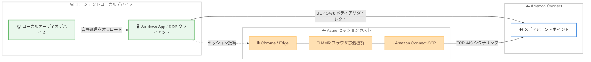

# Amazon Connect - Azure Virtual Desktop および Windows 365 Cloud PC 向けオーディオ最適化

**リリース日**: 2026 年 7 月 24 日
**サービス**: Amazon Connect
**機能**: Azure Virtual Desktop (AVD) および Windows 365 Cloud PC 向けオーディオ最適化

📊 [このアップデートのインフォグラフィックを見る](https://takech9203.github.io/aws-news-summary/20260724-amazon-connect.html)
<!-- INFOGRAPHIC_BASE_URL は環境変数から取得 -->

## 概要

Amazon Connect は、Microsoft Azure Virtual Desktop (AVD) または Windows 365 Cloud PC を利用するエージェントが、仮想デスクトップセッションから直接、オーディオ最適化を有効にした状態で通話を受けられるようになりました。これにより、仮想デスクトップ環境で発生しがちな音声品質の低下という課題に対処できます。

この機能は、Microsoft Multimedia Redirection (MMR) を活用します。IT 管理者が仮想デスクトップ環境に対して一度だけセットアップを行うことで、メディア処理が仮想デスクトップからエージェントのローカルデバイスにリダイレクトされます。音声処理をローカルデバイスにオフロードし、音声を Amazon Connect に直接リダイレクトすることで、ネットワーク環境が厳しい状況でも音声品質が向上します。

エージェントは、AVD または Windows 365 Cloud PC のセッションにログインし、Amazon Connect のエージェントワークスペース、またはオープンソースの JavaScript ライブラリで構築したカスタムエージェントインターフェイスを使用して通話の受付を開始できます。今回の対応は、既存の Amazon WorkSpaces、Citrix クラウドデスクトップ、Omnissa クラウドデスクトップ向けのオーディオ最適化に加わるものです。

**アップデート前の課題**

- AVD や Windows 365 Cloud PC を利用するエージェントは、オーディオ最適化の対象外であり、音声処理が仮想デスクトップ側で行われていた
- 仮想デスクトップとローカルデバイス間で音声を経由させるため、ネットワーク遅延やパケットロスの影響を受けやすく、音声品質が低下しやすかった
- オーディオ最適化がサポートされる仮想デスクトップ環境は WorkSpaces、Citrix、Omnissa に限られていた

**アップデート後の改善**

- AVD および Windows 365 Cloud PC でもオーディオ最適化が利用可能になった
- メディアがエージェントのローカルデバイスに直接リダイレクトされ、音声品質が向上した
- エージェントワークスペースとカスタム CCP の両方でこの機能を利用できる

## アーキテクチャ図



MMR により、音声メディアは仮想デスクトップを経由せず、エージェントのローカルデバイスと Amazon Connect の間で直接やり取りされます。シグナリングは TCP/443、メディアは UDP/3478 を使用します。

## サービスアップデートの詳細

### 主要機能

1. **Microsoft Multimedia Redirection (MMR) による音声リダイレクト**
   - 音声処理をエージェントのローカルデバイスにオフロードする
   - 音声を仮想デスクトップ経由ではなく Amazon Connect に直接リダイレクトする
   - ネットワーク環境が厳しい状況でも音声品質が向上する

2. **エージェントワークスペースとカスタム CCP への対応**
   - Amazon Connect のエージェントワークスペースでそのまま利用できる
   - オープンソースの [amazon-connect-streams](https://github.com/amazon-connect/amazon-connect-streams) ライブラリを使用したカスタム CCP でも利用できる
   - `VDIPlatform` パラメータを `AZURE` に設定することで有効化する

3. **既存の VDI 環境への追加サポート**
   - 既存の Amazon WorkSpaces、Citrix クラウドデスクトップ、Omnissa クラウドデスクトップに加えて、AVD と Windows 365 Cloud PC がサポート対象になった
   - IT 管理者による一度きりのセットアップで環境全体に適用できる

## 技術仕様

### システム要件

| 項目 | 詳細 |
|------|------|
| エージェントローカルデバイス | Windows App (バージョン 2.0.297.0 以降) または Remote Desktop アプリ (バージョン 1.2.5709 以降)、Microsoft Visual C++ 再頒布可能パッケージ 14.32.31332.0 以降 |
| Azure セッションホスト | Multimedia Redirection のインストール、Microsoft Visual C++ 再頒布可能パッケージ 14.32.31332.0 以降 |
| ブラウザ | セッションホスト上の最新版 Google Chrome または Microsoft Edge (その他のブラウザは非対応) |
| MMR ブラウザ拡張機能 | バージョン 1.0.2605.29004 以降をセッションホストにインストールし有効化 |
| ネットワーク (セッションホスト) | Amazon Connect ドメインへ TCP/443 で到達可能にする |
| ネットワーク (ローカルデバイス) | Amazon Connect へ Softphone Media UDP ポート 3478 で到達可能にする |

### VDIPlatform パラメータの設定

エージェントワークスペースの場合は URL に `VDIPlatform=AZURE` クエリパラメータを追加します。埋め込み CCP やカスタム CCP の場合は `initCCP` 設定に以下を追加します。

```javascript
softphone: {
    allowFramedSoftphone: true,
    VDIPlatform: "AZURE"
}
```

`VDIPlatform` を `AZURE` に設定すると、CCP は Azure オーディオ最適化のみを使用し、標準の Web ブラウザオーディオへのフォールバックは行いません。パラメータを設定しない場合、Amazon Connect は利用可能なときに Azure オーディオ最適化を自動検出して有効化しますが、最適化された音声経路を一貫して使用するため、パラメータを明示的に設定することが推奨されます。

## 設定方法

### 前提条件

1. AVD または Windows 365 Cloud PC 環境が構築されていること
2. セッションホストに MMR とブラウザ拡張機能がインストールされ、有効化されていること
3. サポート対象のブラウザ (Chrome または Edge) がセッションホスト上で利用可能であること

### 手順

#### ステップ1: 仮想デスクトップ環境の準備

IT 管理者がセッションホストに Multimedia Redirection をインストールし、Chrome または Edge 向けの MMR ブラウザ拡張機能をインストールして有効化します。単一のインストーラーで MMR サービスと拡張機能の両方がインストールされます。

#### ステップ2: 呼び出しリダイレクトの許可リスト設定

MMR 拡張機能は `AllowedCallRedirectionSites` ポリシーの許可リストに含まれるドメインのみリダイレクトします。Amazon Connect のエージェントワークスペースや Connect ドメインでホストされた CCP を利用する場合 (`allowFramedSoftphone` が `true`) は、デフォルトの許可リストに含まれているため追加設定は不要です。独自ドメインでホストするカスタム CCP (`allowFramedSoftphone: false`) の場合は、グループポリシー、レジストリ、または Microsoft Intune を使用して、そのドメインを許可リストに追加します。

#### ステップ3: メディアフローの検証

ブラウザの開発者ツール (F12) のコンソールで以下を実行し、`true` が返ることを確認します。

```javascript
navigator.mediaDevices.isCallRedirectionEnabled
```

その後、仮想デスクトップブラウザで CCP ドメインのマイク権限を無効化してページを更新し、通話を発信します。ローカルデバイスが音声を処理するため、仮想デスクトップブラウザのマイクが無効でも通話が機能することを確認できます。

## メリット

### ビジネス面

- **エージェント体験の向上**: 音声品質が改善され、顧客とのコミュニケーションがスムーズになる
- **VDI 導入の柔軟性**: Azure ベースの仮想デスクトップを採用している組織でも高品質な音声を提供できる
- **既存投資の活用**: WorkSpaces、Citrix、Omnissa に続く選択肢として、Microsoft 環境を利用する企業の要件に対応する

### 技術面

- **音声品質の向上**: メディアをローカルデバイスにリダイレクトすることでネットワーク遅延やパケットロスの影響を軽減する
- **一度きりのセットアップ**: IT 管理者による環境全体への一括設定で運用負荷を抑える
- **柔軟なインターフェイス**: エージェントワークスペースとオープンソースライブラリによるカスタム CCP の両方に対応する

## デメリット・制約事項

### 制限事項

- **政府向けクラウド**: Microsoft は Azure US Government 向けの AVD、および GCC、GCC-High、DoD 環境向けの Windows 365 では MMR をサポートしていない
- **Voice Focus**: VDI 環境ではオーディオリダイレクトと互換性がないため、ノイズ抑制 (Voice Focus) はサポートされない
- **ビデオ**: 現時点で MMR Call Redirection はビデオをサポートしていない
- **ブラウザ制限**: Chrome または Edge のみ対応し、その他のブラウザでは動作しない

### 考慮すべき点

- 事前に Microsoft 側の MMR 前提条件を満たす必要があり、Microsoft のドキュメントも併せて確認することが重要である
- カスタムドメインで CCP をホストする場合は、許可リストへのドメイン追加が必須となる

## ユースケース

### ユースケース1: Azure 中心の IT 環境でのコンタクトセンター運用

**シナリオ**: 全社的に Microsoft Azure を採用し、エージェントの端末を AVD で標準化している企業が、Amazon Connect をコンタクトセンター基盤として利用する。

**効果**: 追加のオンプレミス端末を用意せず、既存の Azure 仮想デスクトップ環境のまま高品質な音声通話を実現できる。

### ユースケース2: リモートワークエージェントの音声品質確保

**シナリオ**: 在宅勤務のエージェントが Windows 365 Cloud PC からコンタクトセンター業務を行うが、家庭のネットワーク環境がまちまちで音声品質が安定しない。

**効果**: メディアをローカルデバイスにリダイレクトすることで、仮想デスクトップ経由の音声劣化を回避し、安定した通話品質を提供できる。

### ユースケース3: カスタム CCP を利用する既存システムへの組み込み

**シナリオ**: 独自の業務アプリケーションに amazon-connect-streams で構築したカスタム CCP を組み込んでいる企業が、AVD 上でオーディオ最適化を利用したい。

**効果**: `initCCP` に `VDIPlatform: "AZURE"` を追加し、許可リストを設定するだけで既存のカスタム UI をそのまま活用しながらオーディオ最適化を有効化できる。

## 料金

本機能の利用に追加料金はかかりません。Amazon Connect の通常の音声通話料金が適用されます。詳細は料金ページを参照してください。

## 利用可能リージョン

Amazon Connect が提供されているすべての AWS リージョンで利用可能です。ただし、AWS GovCloud (US-West) は対象外です。

## 関連サービス・機能

- **Amazon WorkSpaces**: 既存のオーディオ最適化対応 VDI 環境の 1 つ
- **Citrix / Omnissa クラウドデスクトップ**: 同じくオーディオ最適化がサポートされている VDI 環境
- **amazon-connect-streams**: カスタムエージェントインターフェイス (CCP) を構築するためのオープンソース JavaScript ライブラリ

## 参考リンク

- 📊 [インフォグラフィック](https://takech9203.github.io/aws-news-summary/20260724-amazon-connect.html)
- [公式発表 (What's New)](https://aws.amazon.com/about-aws/whats-new/2026/06/amazon-connect/)
- [ドキュメント: Optimize Connect audio for Azure Virtual Desktop and Windows 365](https://docs.aws.amazon.com/connect/latest/adminguide/using-ccp-vdi-azure-step-by-step.html)
- [amazon-connect-streams (GitHub)](https://github.com/amazon-connect/amazon-connect-streams)

## まとめ

このアップデートにより、Microsoft Azure Virtual Desktop および Windows 365 Cloud PC を利用するエージェントでも、Amazon Connect のオーディオ最適化を活用して高品質な音声通話が可能になりました。Azure 環境を標準化している組織やリモートワークのエージェントを抱えるコンタクトセンターにとって有効な選択肢となります。導入にあたっては、Microsoft の MMR 前提条件と AWS 側のネットワーク設定を確認し、IT 管理者による一度きりのセットアップを実施することを推奨します。
