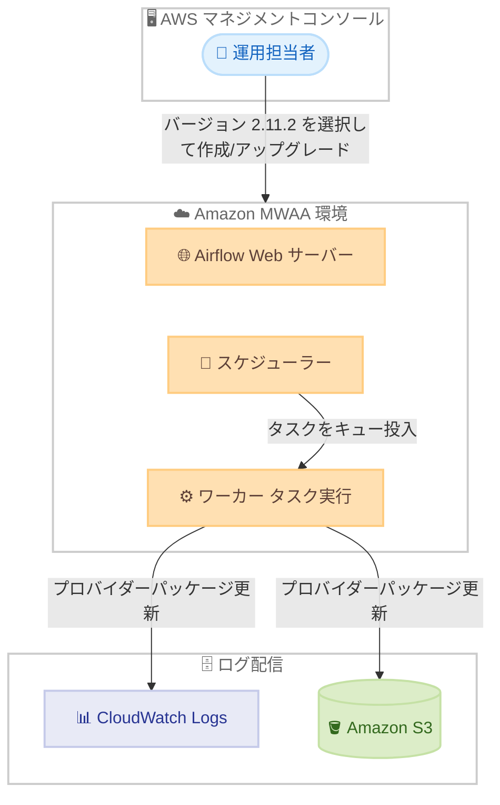

# Amazon MWAA - Apache Airflow 2.11.2 サポート

**リリース日**: 2026 年 7 月 24 日
**サービス**: Amazon Managed Workflows for Apache Airflow (MWAA)
**機能**: Apache Airflow バージョン 2.11.2 のサポート

📊 [このアップデートのインフォグラフィックを見る](https://takech9203.github.io/aws-news-summary/20260724-amazon-mwaa-now-supports-apache-airflow-version-2-11-2.html)
<!-- INFOGRAPHIC_BASE_URL は環境変数から取得 -->

## 概要

Amazon Managed Workflows for Apache Airflow (MWAA) が、Apache Airflow バージョン 2.11.2 のサポートを開始しました。Amazon MWAA は Apache Airflow を大規模に実行できるマネージドサービスであり、ワークフローのオーケストレーションをスケーラブルに提供します。

Apache Airflow 2.11.2 は、セキュリティの改善、バグ修正、依存関係のアップグレードを含むメンテナンスリリースです。このリリースでは、セキュリティパッチを含むコア依存関係のアップグレードに加えて、Airflow Web サーバーとタスク実行レイヤーの安定性が改善されています。また、キューに登録されたタスクのライフサイクル管理の修正、ログ内のシークレットマスキングの強化、Task Instances 一覧ビューの UI 修正、S3 および CloudWatch へのログ配信を担うプロバイダーパッケージの更新も含まれます。

新しい Apache Airflow 2.11.2 環境の作成、または既存環境のアップグレードは、現在利用可能なすべての Amazon MWAA リージョンにおいて、AWS マネジメントコンソールから数クリックで実行できます。

**アップデート前の課題**

- 2.11.2 より前のパッチバージョンでは、今回修正された既知のバグやセキュリティ上の懸念が残っていた
- キューに登録されたタスクのライフサイクル管理に関する不具合が存在していた
- ログ内のシークレットマスキングが一部のケースで不十分だった

**アップデート後の改善**

- コア依存関係のセキュリティパッチが適用され、Web サーバーとタスク実行レイヤーの安定性が向上した
- キューに登録されたタスクのライフサイクル管理の不具合が修正された
- ログ内のシークレットマスキングが強化され、機密情報の意図しない露出リスクが低減された
- S3 および CloudWatch へのログ配信に関わるプロバイダーパッケージが更新された

## アーキテクチャ図

Amazon MWAA 環境において、バージョン 2.11.2 では Web サーバーとタスク実行レイヤーの安定性が改善され、CloudWatch および S3 へのログ配信を担うプロバイダーパッケージが更新されています。

## サービスアップデートの詳細

### 主要機能

1. **コア依存関係のセキュリティパッチ**
   - Apache Airflow のコア依存関係にセキュリティパッチが適用された
   - Airflow Web サーバーの安定性が改善された
   - タスク実行レイヤーの安定性が改善された

2. **タスクライフサイクル管理の修正**
   - キューに登録されたタスクのライフサイクル管理に関する不具合が修正された
   - タスクの状態遷移がより信頼性の高いものになった

3. **ログとセキュリティの改善**
   - ログ内のシークレットマスキングが強化され、機密情報の露出リスクが低減された
   - Task Instances 一覧ビューにおける UI 表示の不具合が修正された

4. **プロバイダーパッケージの更新**
   - Amazon S3 へのログ配信に関わるプロバイダーパッケージが更新された
   - Amazon CloudWatch へのログ配信に関わるプロバイダーパッケージが更新された

## 技術仕様

### バージョン情報

| 項目 | 詳細 |
|------|------|
| Apache Airflow バージョン | 2.11.2 |
| リリースタイプ | メンテナンスリリース (セキュリティ改善、バグ修正、依存関係更新) |
| Python バージョン | Python 3.12 (2.11 系) |
| スケジューラー数 | デフォルト 2、最小 2、最大 5 |
| ワーカー数 | デフォルト 10、最小 1、最大 25 |

### バージョンサポートポリシー

| 項目 | 詳細 |
|------|------|
| サポート対象バージョン数 | 常時 3 つ以上のマイナーバージョンをサポート |
| パッチバージョンのサポート期間 | 初回提供から最低 12 か月 |
| サポート終了の事前通知 | サポート終了日の 180 日以上前に告知 |
| アップグレード | マイナーバージョンアップグレードをサポート (例: x.1.z から x.2.z) |
| ダウングレード | サポート対象であれば以前のマイナーバージョンへのダウングレードが可能 |

## 設定方法

### 前提条件

1. Amazon MWAA を利用可能な AWS アカウントを保有していること
2. DAG や依存関係を保存する Amazon S3 バケットを準備していること
3. 既存環境をアップグレードする場合は、DAG やプラグイン、requirements ファイルが 2.11.2 と互換性があることを事前に確認していること

### 手順

#### ステップ1: 新規環境の作成

AWS マネジメントコンソールの Amazon MWAA で新規環境を作成する際、Apache Airflow のバージョンとして 2.11.2 を選択します。バージョンを指定しない場合は、最新のサポートバージョンで環境が作成されます。

#### ステップ2: 既存環境のアップグレード

既存の Amazon MWAA 環境を編集し、Apache Airflow バージョンを 2.11.2 に変更します。Amazon MWAA はマイナーバージョンアップグレードをサポートしており、数クリックでアップグレードを実行できます。

アップグレード前に、DAG やプラグイン、requirements ファイルの互換性を検証環境で確認することを推奨します。2.7.2 以降のバージョンでは、requirements ファイルに `--constraint` 文が必要です。

#### ステップ3: 動作確認

アップグレード後、Airflow UI 上で DAG が正常にロードされること、タスクが期待どおりに実行されること、CloudWatch および S3 へのログ配信が正常に行われることを確認します。

## メリット

### ビジネス面

- **セキュリティリスクの低減**: セキュリティパッチとシークレットマスキングの強化により、機密情報の露出リスクが低減される
- **運用の安定性向上**: Web サーバーとタスク実行レイヤーの安定性改善により、ワークフローの信頼性が高まる
- **サポート期間の確保**: 最新のパッチバージョンを利用することで、より長いサポート期間を確保できる

### 技術面

- **タスク管理の信頼性向上**: キューに登録されたタスクのライフサイクル管理の修正により、タスクの状態遷移がより確実になる
- **ログ配信の改善**: S3 および CloudWatch 向けプロバイダーパッケージの更新により、ログ配信が改善される
- **UI の改善**: Task Instances 一覧ビューの表示不具合が解消され、運用時の可視性が向上する

## デメリット・制約事項

### 制限事項

- メジャーバージョンをまたぐアップグレード (例: 2.y.z から 3.y.z) はサポートされない
- ダウングレードはダウングレード時点でサポートされているバージョンに限られる
- 2.7.2 以降のバージョンでは requirements ファイルに `--constraint` 文が必須となる

### 考慮すべき点

- アップグレードは本番環境に適用する前に、検証環境で DAG やプラグインの互換性を確認することが望ましい
- メンテナンスリリースであるため、新機能の追加ではなく安定性とセキュリティの改善が中心である
- サポート終了日が近づいたバージョンを利用している場合は、Health Dashboard の通知を確認し早期のアップグレードを検討する

## ユースケース

### ユースケース1: セキュリティ要件が厳しい環境でのログ管理

**シナリオ**: 金融機関などで、DAG のログに接続情報などの機密情報が含まれる可能性がある環境を運用している。

**効果**: 強化されたシークレットマスキングにより、ログ内の機密情報の意図しない露出リスクが低減され、コンプライアンス要件への対応が容易になります。

### ユースケース2: 大量のタスクを処理するデータパイプライン

**シナリオ**: 多数のタスクを並列で実行する ETL パイプラインを運用しており、キューに登録されたタスクの状態管理に課題を感じている。

**効果**: タスクライフサイクル管理の修正により、キューに登録されたタスクの状態遷移がより確実になり、パイプラインの信頼性が向上します。

### ユースケース3: S3 および CloudWatch を活用したログ集約

**シナリオ**: DAG の実行ログを Amazon S3 と CloudWatch Logs に配信して一元管理している。

**効果**: 更新されたプロバイダーパッケージにより、S3 および CloudWatch へのログ配信が改善され、ログの可観測性が向上します。

## 料金

今回のアップデート自体による追加料金は発生しません。Amazon MWAA の料金は、環境クラス (mw1.small、mw1.medium、mw1.large など)、追加ワーカーおよびスケジューラーのインスタンス時間、メタデータベースのストレージ使用量に基づきます。詳細は Amazon MWAA の料金ページを参照してください。

## 利用可能リージョン

現在 Amazon MWAA が利用可能なすべてのリージョンで、Apache Airflow 2.11.2 を利用できます。

## 関連サービス・機能

- **Amazon S3**: DAG、プラグイン、requirements ファイルの保存先であり、実行ログの配信先としても利用される
- **Amazon CloudWatch**: DAG やタスクの実行ログの配信先であり、環境のモニタリングに利用される
- **AWS Health Dashboard**: サポート終了が近づいたバージョンの通知が届く

## 参考リンク

- 📊 [インフォグラフィック](https://takech9203.github.io/aws-news-summary/20260724-amazon-mwaa-now-supports-apache-airflow-version-2-11-2.html)
- [公式発表 (What's New)](https://aws.amazon.com/about-aws/whats-new/2026/07/amazon-mwaa-now-supports-apache-airflow-version-2-11-2)
- [Amazon MWAA とは (ドキュメント)](https://docs.aws.amazon.com/mwaa/latest/userguide/what-is-mwaa.html)
- [Amazon MWAA でサポートされる Apache Airflow バージョン](https://docs.aws.amazon.com/mwaa/latest/userguide/airflow-versions.html)

## まとめ

Apache Airflow 2.11.2 のサポート開始は、セキュリティ、安定性、ログ管理の改善を中心としたメンテナンスリリースです。既存環境を運用しているお客様は、検証環境での互換性確認を行ったうえで、早期のアップグレードを検討することを推奨します。新規環境を作成する場合は、最新のパッチバージョンである 2.11.2 を選択することで、より長いサポート期間とセキュリティ上の利点を得られます。
