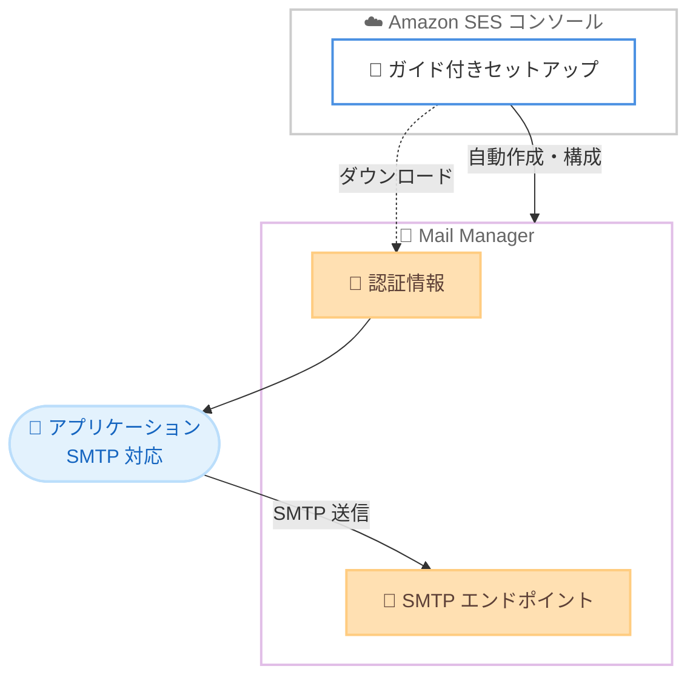

# Amazon SES - Mail Manager を利用した SMTP 送信の簡素化

**リリース日**: 2026 年 7 月 24 日
**サービス**: Amazon Simple Email Service (Amazon SES)
**機能**: Mail Manager を利用した SMTP エンドポイントのガイド付きセットアップ

📊 [このアップデートのインフォグラフィックを見る](https://takech9203.github.io/aws-news-summary/20260724-amazon-ses-simplified-smtp-mail-manager.html)
<!-- INFOGRAPHIC_BASE_URL は環境変数から取得 -->

## 概要

Amazon SES は、Mail Manager を利用して SMTP 経由でメールを送信するための、簡素化されたコンソール体験を発表しました。従来、SMTP でメールを送信するには複数のリソースを個別に構成する必要があり、複数のステップを踏む必要がありました。今回のアップデートにより、ガイド付きセットアップが必要なリソースを自動的に作成・構成するため、開発者は数クリックで送信を開始できます。

このガイド付きセットアップでは、動作可能な SMTP エンドポイントと、ダウンロード可能な認証情報が提供されます。取得した認証情報は、SMTP をサポートするあらゆるアプリケーションやフレームワークに組み込んで利用できます。

この機能は、メール通知、パスワードリセット、トランザクションメッセージなどを送信するアプリケーションを開発するチームが、本番環境で利用可能な SMTP 設定へ素早く到達したい場合に適しています。

**アップデート前の課題**

このアップデート以前は、Mail Manager を利用した SMTP 送信の設定に手間がかかっていました。

- 以前は SMTP でメールを送信するために、必要なリソースを個別に構成する必要があった
- 以前は設定完了までに複数のステップを踏む必要があり、初期構築に時間がかかった
- 以前は SMTP エンドポイントと認証情報を利用可能な状態にするまでの導線が明確でなかった

**アップデート後の改善**

今回のアップデートにより、SMTP 送信のセットアップが大幅に簡素化されました。

- 今回のアップデートにより、ガイド付きセットアップが必要なリソースを自動的に作成・構成するようになった
- 今回のアップデートにより、数クリックで動作可能な SMTP エンドポイントを取得できるようになった
- 今回のアップデートにより、ダウンロード可能な認証情報をあらゆる SMTP 対応アプリケーションへすぐに組み込めるようになった

## アーキテクチャ図

ガイド付きセットアップが Mail Manager のリソースを自動的に作成・構成し、SMTP エンドポイントと認証情報を提供します。アプリケーションはその認証情報を用いて SMTP でメールを送信します。

## サービスアップデートの詳細

### 主要機能

1. **ガイド付きセットアップ**
   - 必要な Mail Manager リソースを自動的に作成・構成する
   - 従来の複数ステップにわたる個別構成を不要にする
   - 数クリックで送信を開始できる

2. **動作可能な SMTP エンドポイント**
   - セットアップ完了時点で利用可能な SMTP エンドポイントが提供される
   - 追加の手動構成なしにメール送信を開始できる

3. **ダウンロード可能な認証情報**
   - セットアップ時に SMTP 認証情報を取得できる
   - SMTP をサポートするあらゆるアプリケーションやフレームワークに組み込んで利用できる

## 技術仕様

### 提供される要素

| 項目 | 詳細 |
|------|------|
| セットアップ方式 | Amazon SES コンソールのガイド付きセットアップ |
| 提供物 | 動作可能な SMTP エンドポイント、ダウンロード可能な認証情報 |
| 対象リソース | Mail Manager の関連リソース (自動作成・構成) |
| 連携先 | SMTP をサポートするアプリケーション・フレームワーク |

### API 変更履歴

今回のアップデートはコンソール上のセットアップ体験の改善が中心であり、本機能に直接対応する新規 API メソッドの追加は確認されていません。なお、同時期に Amazon SES では以下の API 変更が確認されています (本アップデートとは別のもの)。

| 日付 | サービス | 変更内容 |
|------|----------|----------|
| 2026/07/20 | [Amazon Simple Email Service](https://awsapichanges.com/archive/changes/39540f-email.html) | 1 new 1 updated api methods - 新しい料金プラン (Essentials, Pro, Enterprise) の導入。`PutAccountPricingAttributes` の追加、`GetAccount` への `PricingAttributes` フィールド追加 |

## 設定方法

### 前提条件

1. Amazon SES を利用可能な AWS アカウントを保有していること
2. Amazon SES コンソールへアクセスできる IAM 権限を保有していること
3. 送信元として利用する ID (ドメインまたはメールアドレス) の検証準備

### 手順

#### ステップ 1: Amazon SES コンソールでガイド付きセットアップを開始

Amazon SES コンソールを開き、Mail Manager を利用した SMTP 送信のガイド付きセットアップを開始します。ガイドに従うことで、必要なリソースが自動的に作成・構成されます。

#### ステップ 2: SMTP エンドポイントと認証情報を取得

セットアップが完了すると、動作可能な SMTP エンドポイントとダウンロード可能な認証情報が提供されます。認証情報は安全な場所に保管します。

#### ステップ 3: アプリケーションへ組み込み

取得した SMTP エンドポイントと認証情報を、SMTP をサポートするアプリケーションやフレームワークに設定してメール送信を開始します。

## メリット

### ビジネス面

- **市場投入までの時間短縮**: 数クリックで本番環境で利用可能な SMTP 設定に到達でき、開発の初速が向上する
- **運用負荷の低減**: リソースの個別構成が不要になり、設定にかかる工数が削減される
- **導入障壁の低下**: SMTP の設定に不慣れなチームでもガイドに沿って構築できる

### 技術面

- **設定の自動化**: 必要な Mail Manager リソースを自動的に作成・構成する
- **移植性の高さ**: SMTP をサポートするあらゆるアプリケーションやフレームワークで利用できる標準的な認証情報を取得できる
- **一貫した構成**: ガイドに従うことで構成漏れや設定ミスを抑えられる

## デメリット・制約事項

### 制限事項

- 本アップデートは Amazon SES コンソール上のセットアップ体験の改善が中心である
- 詳細なリソース構成のカスタマイズが必要な場合は、引き続き個別の設定が必要になる可能性がある

### 考慮すべき点

- SMTP 認証情報は機密情報であるため、安全な管理と適切なローテーションが求められる
- 実際の送信には Amazon SES の送信クォータやサンドボックス制限などの通常のルールが適用される

## ユースケース

### ユースケース 1: トランザクションメールの送信

**シナリオ**: EC サイトで注文確認やパスワードリセットのメールを送信したい。

**効果**: ガイド付きセットアップで素早く SMTP エンドポイントと認証情報を取得し、既存アプリケーションに組み込んでトランザクションメールを送信できる。

### ユースケース 2: 既存フレームワークからのメール通知

**シナリオ**: SMTP に対応した Web アプリケーションフレームワークから、システム通知メールを送信したい。

**効果**: ダウンロードした認証情報をフレームワークの SMTP 設定に組み込むだけで、追加の構成なしに通知メールを送信できる。

### ユースケース 3: 新規プロジェクトの迅速な立ち上げ

**シナリオ**: 新しいアプリケーションでメール送信機能を最短で組み込みたい。

**効果**: 個別のリソース構成を行わずに、数クリックで本番利用可能な SMTP 設定を用意でき、開発の初速を高められる。

## 料金

今回の発表内で本機能自体の料金に関する記載はありません。Amazon SES の利用には通常の Amazon SES および Mail Manager の料金が適用されます。最新の料金は Amazon SES の料金ページを参照してください。

## 利用可能リージョン

Amazon SES が提供されているすべての AWS リージョンで利用可能です。

## 関連サービス・機能

- **Amazon SES Mail Manager**: メールの受信・送信・処理を管理する機能。本アップデートのガイド付きセットアップが自動構成する対象
- **SMTP インターフェイス**: 標準的なメール送信プロトコル。本機能で取得した認証情報を用いて送信を行う
- **Amazon SES 送信 API**: SMTP 以外のプログラマティックな送信手段としての代替オプション

## 参考リンク

- 📊 [インフォグラフィック](https://takech9203.github.io/aws-news-summary/20260724-amazon-ses-simplified-smtp-mail-manager.html)
- [公式発表 (What's New)](https://aws.amazon.com/about-aws/whats-new/2026/07/amazon-ses-simplified-smtp-mail-manager/)
- [Amazon SES ドキュメント](https://docs.aws.amazon.com/ses/)
- [Amazon SES 料金ページ](https://aws.amazon.com/ses/pricing/)

## まとめ

このアップデートは、Amazon SES で Mail Manager を利用した SMTP 送信のセットアップを大幅に簡素化し、開発者が数クリックで本番利用可能な SMTP エンドポイントと認証情報を取得できるようにするものです。トランザクションメールや通知メールを送信するアプリケーションを迅速に立ち上げたいチームにとって有用であり、まずは Amazon SES コンソールのガイド付きセットアップを試すことをお勧めします。
