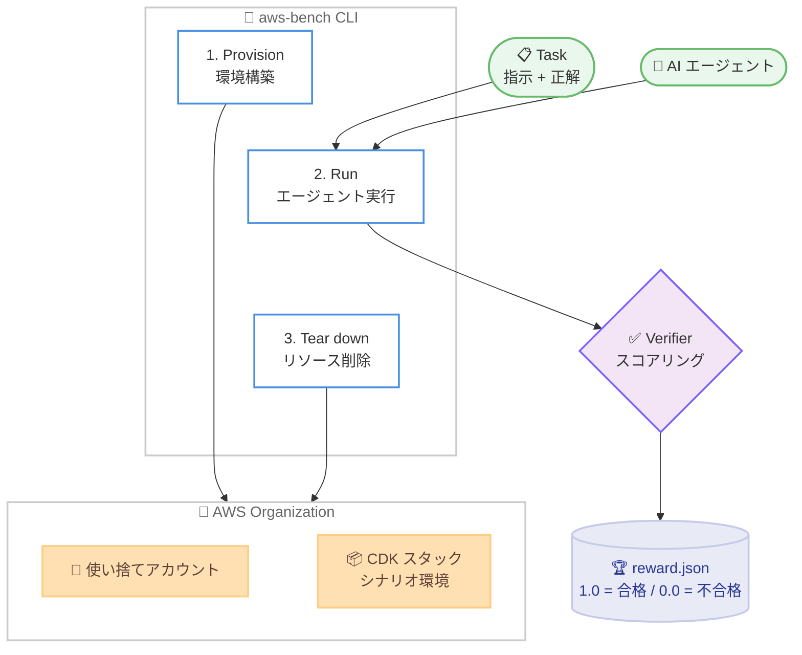

# aws-bench - AI エージェント向けオープンソースベンチマーク

**リリース日**: 2026 年 7 月 24 日
**サービス**: aws-bench (オープンソース)
**機能**: AWS タスクにおける AI エージェントの精度と効率を測定するベンチマーク

📊 [このアップデートのインフォグラフィックを見る](https://takech9203.github.io/aws-news-summary/20260724-aws-bench.html)
<!-- INFOGRAPHIC_BASE_URL は環境変数から取得 -->

## 概要

AWS は、AI エージェントが実際の AWS タスクをどれだけ正確かつ効率的に完了できるかを測定するオープンソースベンチマーク aws-bench のリサーチプレビューを発表しました。aws-bench は、モデルプロバイダーや AI 研究者に対して、AWS インフラストラクチャ上でのエージェントのパフォーマンスを客観的かつ再現可能な方法で測定し、失敗の原因を診断する手段を提供します。

従来のベンチマークが固定されたデータセットに対してスコアを算出するのに対し、aws-bench は使い捨ての実際の AWS 環境に対してエージェントを実行する点が特徴です。テストケースは、実際の AWS 利用状況の分析に基づいて作成されており、調査、トラブルシューティング、インフラストラクチャの作成といった領域をカバーします。各テストケースは、自然言語クエリと、定義済みのクラウドリソース状態、そして正解 (ground-truth) を組み合わせることで、一貫性のある検証可能なスコアリングを実現します。

aws-bench は Harbor フレームワークを基盤とし、AWS 固有のプロビジョニングと検証ロジック (verifier) を拡張したものです。GitHub 上で Apache License 2.0 のもとで公開されており、テスト環境を構築し、評価の実行とスコアリングを行い、リソース状態をリセットするための使いやすい CLI ツールが同梱されています。

**アップデート前の課題**

- AWS 環境における AI エージェントのパフォーマンスを、客観的かつ再現可能な方法で測定する標準的な手段が存在しなかった
- 固定されたデータセットに基づくベンチマークでは、実際のクラウドリソースを操作する現実的なタスクの評価が難しかった
- エージェントの失敗原因を体系的に診断し、基盤モデルやエージェントハーネスの改善につなげる仕組みが不足していた

**アップデート後の改善**

- 実際の AWS 利用状況に基づくテストケースで、エージェントのパフォーマンスを客観的に測定できるようになった
- 使い捨ての実 AWS 環境に対してエージェントを実行し、ライブ状態に対して検証できるようになった
- CLI ツールにより、テスト環境の構築、評価の実行とスコアリング、リソース状態のリセットが容易になった

## アーキテクチャ図



aws-bench は、環境のプロビジョニング、エージェントの実行とスコアリング、リソースの削除という 3 つのフェーズで、実際の AWS 環境に対してエージェントを評価します。

## サービスアップデートの詳細

### 主要機能

1. **実環境ベースのベンチマーク**
   - 固定データセットではなく、使い捨ての実 AWS 環境に対してエージェントを実行
   - テストケースは実際の AWS 利用状況の分析に基づいて作成
   - 調査、トラブルシューティング、インフラストラクチャの作成をカバー

2. **2 種類のタスクファミリー**
   - Introspection (イントロスペクション): 読み取り専用の診断タスク。LLM によって評価される
   - Mutation (ミューテーション): リソースの作成・変更タスク。ライブ状態に対してプログラムで検証された後、ロールバックされる

3. **CLI ツールによる自動化**
   - 環境の初期化、リソースのデプロイ、ドリフトチェック、リセット、削除を CLI で実行
   - 各テストケースは自然言語クエリ、リソース状態、正解を組み合わせて検証可能なスコアリングを実現
   - トライアルごとに reward.json が出力され、1.0 (合格) または 0.0 (不合格) が記録される

## 技術仕様

### コアコンセプト

| 項目 | 詳細 |
|------|------|
| Scenario | 専用アカウントにマッピングされた実際の AWS 環境 |
| Task | 指示、検証ロジック (verifier)、リファレンス解答を持つ 1 つの課題 |
| Run | データセット全体を通した完全な実行。個々の試行は trial と呼ばれる |
| Verifier | スコアリングロジック。報酬 (reward) を書き込む (1.0 = 合格、0.0 = 不合格) |

### 提供データセット

| データセット | 内容 |
|------|------|
| aws-bench-quickstart | 9 タスク / 1 シナリオ |
| aws-bench-basic | 78 タスク / 4 シナリオ |
| aws-bench-advanced | 47 タスク / 3 シナリオ |

### 動作要件

| 項目 | 詳細 |
|------|------|
| OS | macOS または Linux |
| Python | 3.12 以上 |
| パッケージマネージャー | uv |
| コンテナ | Docker (Compose v2 プラグイン、buildx 0.17.0 以上) |
| AWS 権限 | AWS Organization およびメンバーアカウントを作成できる権限を持つ AWS アカウント |
| ライセンス | Apache License 2.0 |

## 設定方法

### 前提条件

1. macOS または Linux 環境と Python 3.12 以上
2. uv パッケージマネージャーと Docker (Compose v2、buildx 0.17.0 以上)
3. AWS Organization とメンバーアカウントを作成できる権限を持つ AWS アカウント

### 手順

#### ステップ1: リポジトリのクローンとセットアップ

```bash
git clone https://github.com/aws-bench/aws-bench.git && cd aws-bench
uv sync
uv run aws-bench --help
```

リポジトリをクローンして依存関係をインストールし、CLI のヘルプを表示して動作を確認します。

#### ステップ2: テスト環境の構築

```bash
# 環境のプロビジョニングとリソースのデプロイ
uv run aws-bench env init --env-name my-bench
uv run aws-bench env setup --env-name my-bench
```

env init で使い捨てアカウントをプロビジョニングし、env setup でシナリオのインフラストラクチャ (CDK スタック) をデプロイします。

#### ステップ3: ベンチマークの実行

```bash
# 単一シナリオデータセットの実行
uv run aws-bench run -d ec2-multiregion@latest --env-name my-bench -a claude-code -m <model-id>
```

指定したデータセットに対してエージェントを実行し、verifier がスコアリングを行います。結果は jobs/<timestamp>/ 配下にトライアルごとの reward.json として出力されます。

## メリット

### ビジネス面

- **客観的な評価基準**: モデルプロバイダーや研究者が、AWS 環境における AI エージェントのパフォーマンスを再現可能な方法で比較できる
- **オープンソース**: Apache License 2.0 で公開されており、無償で利用・拡張が可能
- **進捗の追跡**: 基盤モデルやエージェントハーネスの改善状況を継続的に測定できる

### 技術面

- **実環境ベースの検証**: 使い捨ての実 AWS 環境に対して評価するため、現実的なタスク遂行能力を測定できる
- **CLI による自動化**: 環境の構築、実行、リセット、削除を一連のコマンドで自動化できる
- **拡張性**: Harbor フレームワークを基盤とし、AWS 固有のプロビジョニングと verifier を追加できる

## デメリット・制約事項

### 制限事項

- リサーチプレビューとして提供されており、仕様が変更される可能性がある
- 実行には AWS Organization およびメンバーアカウントを作成できる権限が必要
- 対応 OS は macOS と Linux のみ (Windows は明示的にサポートされていない)

### 考慮すべき点

- 実際の AWS 環境をプロビジョニングするため、ベンチマーク実行に伴う AWS 利用料金が発生する
- Docker や uv、Python 3.12 以上など複数の前提ツールのセットアップが必要
- Mutation タスクはライブ状態を変更するため、専用アカウントでの実行が前提となる

## ユースケース

### ユースケース1: 基盤モデルの性能改善

**シナリオ**: モデルプロバイダーが、新しい基盤モデルの AWS タスク遂行能力を評価・改善したい。

**実装例**:
```
uv run aws-bench run -d aws-bench-basic@latest --env-name eval -a claude-code -m <model-id>
```

**効果**: 78 タスク / 4 シナリオにわたる標準データセットで、モデルの精度を客観的に測定し改善につなげられる。

### ユースケース2: エージェントハーネスの改良

**シナリオ**: AI 研究者が、エージェントのツール呼び出しやプロンプト戦略 (ハーネス) を改良し、その効果を検証したい。

**実装例**:
```
uv run aws-bench run -d aws-bench-advanced@latest --env-name harness-test -a claude-code -m <model-id>
```

**効果**: より難易度の高い 47 タスク / 3 シナリオで、ハーネス変更による遂行能力の変化を verifier のスコアで比較できる。

### ユースケース3: 失敗原因の診断

**シナリオ**: エージェントが特定の AWS トラブルシューティングタスクで失敗する原因を特定したい。

**実装例**:
```
uv run aws-bench run -d aws-bench-quickstart@latest --env-name debug -a claude-code -m <model-id>
uv run aws-bench env show --env-name debug
```

**効果**: 少数のタスクで素早く実行し、reward.json とリソース状態を確認して失敗パターンを診断できる。

## 料金

aws-bench 自体はオープンソースソフトウェアであり、Apache License 2.0 のもとで無償で利用できます。ただし、ベンチマークの実行時には実際の AWS 環境 (メンバーアカウント、CDK スタックによるリソース) をプロビジョニングするため、その利用に応じた通常の AWS 料金が発生します。発生する料金は、実行するシナリオで作成されるリソースの種類と実行時間に依存します。

## 利用可能リージョン

aws-bench はオープンソースツールとして GitHub 上で公開されており、特定の AWS リージョンに限定されるものではありません。実行時に使用する AWS リージョンは、プロビジョニングするシナリオやアカウント設定に依存します。

## 関連サービス・機能

- **AWS Organizations**: aws-bench は使い捨てのメンバーアカウントを作成・削除するために AWS Organization を利用する
- **AWS CDK**: シナリオのインフラストラクチャは CDK スタックとしてデプロイされる
- **Harbor フレームワーク**: aws-bench の基盤となる評価フレームワーク。AWS 固有の拡張が加えられている

## 参考リンク

- 📊 [インフォグラフィック](https://takech9203.github.io/aws-news-summary/20260724-aws-bench.html)
- [公式発表 (What's New)](https://aws.amazon.com/about-aws/whats-new/2026/07/aws-bench/)
- [GitHub リポジトリ](https://github.com/aws-bench/aws-bench)

## まとめ

aws-bench は、AWS 環境における AI エージェントの遂行能力を、実際のクラウド環境に対して客観的かつ再現可能な方法で測定するオープンソースベンチマークです。モデルプロバイダーや AI 研究者は、まず aws-bench-quickstart データセットで動作を確認し、基盤モデルやエージェントハーネスの改善に向けた評価基盤として活用することが推奨されます。
