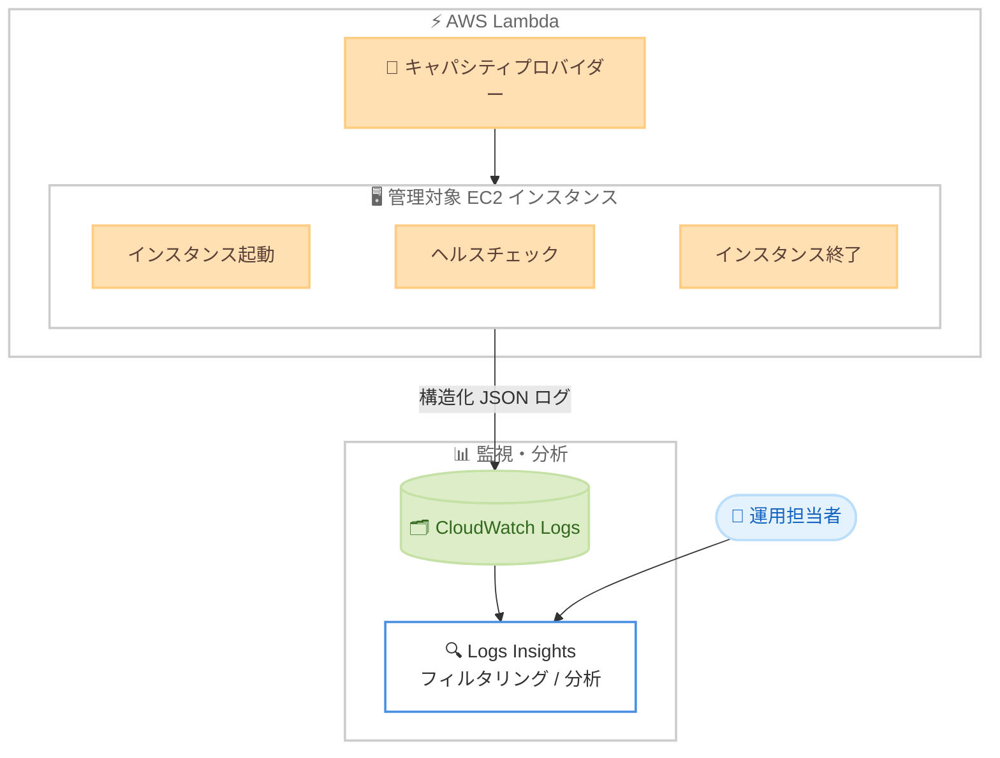

# AWS Lambda - Lambda Managed Instances キャパシティプロバイダーのログ発行

**リリース日**: 2026 年 7 月 24 日
**サービス**: AWS Lambda
**機能**: Lambda Managed Instances (LMI) キャパシティプロバイダーのログ発行

📊 [このアップデートのインフォグラフィックを見る](https://takech9203.github.io/aws-news-summary/20260724-aws-lambda-managed-instances-logs.html)
<!-- INFOGRAPHIC_BASE_URL は環境変数から取得 -->

## 概要

AWS Lambda は、Lambda Managed Instances (LMI) のキャパシティプロバイダーに関するログを Amazon CloudWatch Logs へ発行する機能を追加しました。これにより、スケーリングアクティビティやインスタンスのライフサイクル操作に対する可視性が向上し、Lambda が管理する EC2 インスタンスの監視、トラブルシューティング、最適化が容易になります。

Lambda Managed Instances は、サーバーレスのシンプルさを維持しながら、Amazon EC2 上で Lambda 関数を実行できる仕組みです。キャパシティプロバイダーは、Lambda がプロビジョニングするコンピューティングリソースを定義します。今回のアップデートでは、キャパシティプロバイダーが管理するコンピューティングリソースについて、インスタンスの起動、終了、ヘルスチェックといったライフサイクルイベントを捕捉した構造化 JSON ログが自動的に生成されます。

この機能は、LMI が利用可能なすべての AWS 商用リージョンで提供されます。ログはすべてのキャパシティプロバイダーでデフォルトで有効化されており、Lambda コンソールのキャパシティプロバイダーページから確認できます。LMI を利用して、予測可能な大量ワークロードや特殊なコンピューティング要件を持つワークロードを運用しているユーザーが主な対象となります。

**アップデート前の課題**

- LMI キャパシティプロバイダーが管理する EC2 インスタンスのスケーリングやライフサイクルの状況を把握する手段が限られていた
- インスタンスの起動や終了、ヘルスチェックの失敗などのイベントを直接確認できず、トラブルシューティングに時間がかかっていた
- プロビジョニングエラーや失敗した操作を特定するための一元的なログが存在しなかった

**アップデート後の改善**

- インスタンスのライフサイクルイベントを捕捉した構造化 JSON ログが自動的に CloudWatch Logs へ発行されるようになった
- CloudWatch Logs 上でフィルタリングを行い、失敗した操作やプロビジョニングエラーを迅速に特定できるようになった
- すべてのキャパシティプロバイダーでログがデフォルトで有効となり、追加設定なしで監視を開始できるようになった

## アーキテクチャ図



キャパシティプロバイダーが管理する EC2 インスタンスのライフサイクルイベントが構造化 JSON ログとして CloudWatch Logs へ発行され、運用担当者がフィルタリングや分析を行える流れを示しています。

## サービスアップデートの詳細

### 主要機能

1. **ライフサイクルイベントの構造化ログ**
   - インスタンスの起動、終了、ヘルスチェックといったライフサイクルイベントを捕捉
   - 構造化 JSON 形式で発行されるため、CloudWatch Logs でのフィルタリングや解析が容易
   - スケーリングアクティビティの可視性を提供

2. **CloudWatch Logs への自動発行**
   - キャパシティプロバイダーが管理するコンピューティングリソースについて、Lambda が自動的にログを生成
   - すべてのキャパシティプロバイダーでデフォルトで有効
   - Lambda コンソールのキャパシティプロバイダーページからログを確認可能

3. **柔軟なログ設定**
   - Lambda API、Lambda コンソール、AWS CLI、AWS SAM、AWS CloudFormation を通じてログ設定を調整可能
   - Infrastructure as Code (IaC) による構成管理にも対応

## 技術仕様

### ログの概要

| 項目 | 詳細 |
|------|------|
| ログ形式 | 構造化 JSON |
| 捕捉するイベント | インスタンスの起動、終了、ヘルスチェックなどのライフサイクルイベント |
| 送信先 | Amazon CloudWatch Logs |
| デフォルト設定 | すべてのキャパシティプロバイダーで有効 |
| 設定手段 | Lambda API、Lambda コンソール、AWS CLI、AWS SAM、AWS CloudFormation |
| 確認方法 | Lambda コンソールのキャパシティプロバイダーページ |

### API 変更履歴

今回のアップデートに直接関連する新規または変更された API メソッドは、awsapichanges.com では確認できませんでした。ログ設定は既存の Lambda API、コンソール、AWS CLI、AWS SAM、AWS CloudFormation を通じて管理します。

## 設定方法

### 前提条件

1. Lambda Managed Instances (LMI) が利用可能な AWS 商用リージョンを使用していること
2. LMI のキャパシティプロバイダーが設定されていること
3. CloudWatch Logs へのログ書き込みに必要な IAM 権限が付与されていること

### 手順

#### ステップ1: キャパシティプロバイダーのログを確認する

Lambda コンソールのキャパシティプロバイダーページを開くと、デフォルトで発行されているログを確認できます。ログはすべてのキャパシティプロバイダーで有効化されているため、追加の有効化操作は不要です。

#### ステップ2: CloudWatch Logs でイベントをフィルタリングする

```bash
# CloudWatch Logs Insights でライフサイクルイベントを分析する例
aws logs start-query \
  --log-group-name "<キャパシティプロバイダーのロググループ>" \
  --start-time $(date -d '1 hour ago' +%s) \
  --end-time $(date +%s) \
  --query-string 'fields @timestamp, @message | filter @message like /termination/ | sort @timestamp desc'
```

上記は CloudWatch Logs Insights を使用して、直近 1 時間分のログからインスタンスの終了イベントを抽出する例です。構造化 JSON ログのため、失敗した操作やプロビジョニングエラーを効率的に絞り込めます。

#### ステップ3: IaC でログ設定を管理する

AWS SAM や AWS CloudFormation のテンプレートにキャパシティプロバイダーの構成を定義することで、ログ設定を含む環境をコードとして再現可能に管理できます。

## メリット

### ビジネス面

- **運用効率の向上**: ライフサイクルイベントを可視化することで、障害の切り分けや対応にかかる時間を短縮できます
- **追加設定不要**: すべてのキャパシティプロバイダーでデフォルト有効のため、導入コストをかけずに監視を開始できます
- **コスト最適化の支援**: スケーリングアクティビティを把握することで、EC2 のキャパシティ利用を見直しやすくなります

### 技術面

- **構造化ログによる解析容易性**: JSON 形式のためフィルタリングや自動処理がしやすく、デバッグサイクルを短縮できます
- **既存ツールとの統合**: CloudWatch Logs へ発行されるため、CloudWatch アラームや Logs Insights など既存の監視エコシステムと連携できます
- **IaC 対応**: AWS SAM や AWS CloudFormation でログ設定を宣言的に管理できます

## デメリット・制約事項

### 制限事項

- LMI が利用可能な AWS 商用リージョンでのみ提供されます
- 発行されるログには標準の Amazon CloudWatch Logs の料金が適用されます

### 考慮すべき点

- ログ量に応じて CloudWatch Logs の保存・取り込みコストが発生するため、保持期間 (リテンション) の設定を検討する必要があります
- 大量のインスタンスライフサイクルイベントが発生する環境では、ログ量が増加する可能性があるため、必要なフィルタリングやサブスクリプションの設計を推奨します

## ユースケース

### ユースケース1: プロビジョニングエラーの迅速な特定

**シナリオ**: 大量ワークロードを LMI で運用中に、一部のインスタンスが正常に起動していない疑いがある。

**実装例**:
```
CloudWatch Logs Insights で launch / health check の失敗イベントをフィルタリング
```

**効果**: 失敗した操作を短時間で特定し、根本原因の調査に集中できます。

### ユースケース2: スケーリングアクティビティの可視化

**シナリオ**: トラフィックの変動に応じたインスタンスの起動・終了の傾向を把握したい。

**実装例**:
```
ライフサイクルイベントログを時系列で集計し、CloudWatch ダッシュボードで可視化
```

**効果**: スケーリングの挙動を把握し、キャパシティ設計やコスト最適化の判断材料にできます。

### ユースケース3: 監視の自動化

**シナリオ**: インスタンス終了やヘルスチェック失敗が発生した際に運用チームへ通知したい。

**実装例**:
```
CloudWatch Logs のメトリクスフィルターと CloudWatch アラームを組み合わせて SNS へ通知
```

**効果**: 異常イベントを早期に検知し、インシデント対応の初動を迅速化できます。

## 料金

このログ機能自体に追加料金はありません。発行されたログには標準の Amazon CloudWatch Logs の料金 (取り込み、保存、分析) が適用されます。LMI 自体は、Savings Plans やリザーブドインスタンスなどの EC2 の料金体系のメリットを活用できます。

## 利用可能リージョン

Lambda Managed Instances (LMI) が利用可能なすべての AWS 商用リージョンで提供されます。

## 関連サービス・機能

- **Amazon CloudWatch Logs**: ライフサイクルログの発行先。フィルタリングや分析、アラーム連携に利用します
- **Amazon EC2**: LMI が管理するコンピューティングリソース。Savings Plans やリザーブドインスタンスの料金メリットを活用できます
- **AWS CloudFormation / AWS SAM**: キャパシティプロバイダーとログ設定を IaC として管理する手段を提供します

## 参考リンク

- 📊 [インフォグラフィック](https://takech9203.github.io/aws-news-summary/20260724-aws-lambda-managed-instances-logs.html)
- [公式発表 (What's New)](https://aws.amazon.com/about-aws/whats-new/2026/07/aws-lambda-managed-instances-logs/)
- [Lambda Managed Instances 製品ページ](https://aws.amazon.com/lambda/lambda-managed-instances/)
- [ドキュメント](https://docs.aws.amazon.com/lambda/latest/dg/lambda-managed-instances.html)

## まとめ

今回のアップデートにより、Lambda Managed Instances のキャパシティプロバイダーが管理する EC2 インスタンスのライフサイクルが CloudWatch Logs で可視化されるようになりました。すべてのキャパシティプロバイダーでデフォルト有効かつ追加料金なしで利用できるため、LMI を運用しているユーザーは、ログの保持期間やフィルタリング、アラーム連携の設計を検討し、監視とトラブルシューティングの体制を整えることを推奨します。
