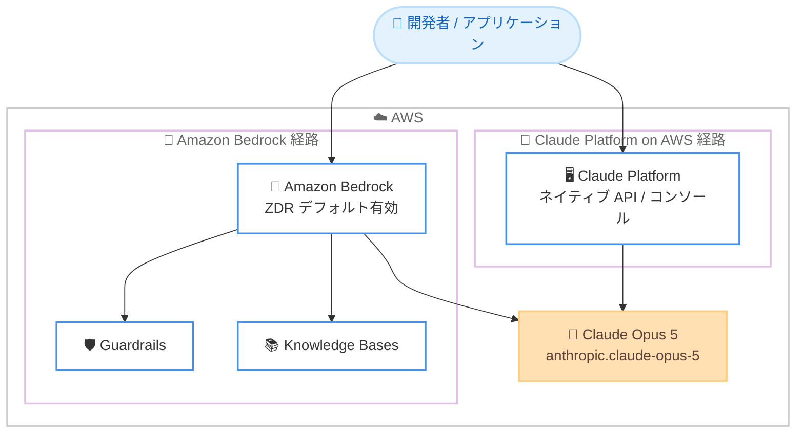

# Claude Opus 5 - AWS での提供開始

**リリース日**: 2026 年 7 月 24 日
**サービス**: Amazon Bedrock / Claude Platform on AWS
**機能**: Anthropic Claude Opus 5

📊 [このアップデートのインフォグラフィックを見る](https://takech9203.github.io/aws-news-summary/20260724-claude-opus-5-aws.html)
<!-- INFOGRAPHIC_BASE_URL は環境変数から取得 -->

## 概要

AWS は、Anthropic の最新かつ最も高性能な Opus モデルである Claude Opus 5 の提供を開始しました。Claude Opus 5 は、高度なコーディング、エージェント処理、専門的な業務を担うチームを対象としており、ゼロデータ保持 (ZDR) に対応しています。長時間稼働するエージェントを支える基盤モデルとして、コーディングと専門業務の両面で大きな改善を実現しています。

このモデルは、経験豊富なエンジニアのようにコードベースを把握し、作業を進めながら戦略を適応させて本番品質のコードを生成できます。また、数時間から夜間にわたって稼働し続けるエージェントを支え、エラーからの回復や障害の回避を行います。推論と分析の面では、長い文書に対するより深い推論と精度の向上を提供し、特にドキュメント量の多いエンタープライズ業務で最も大きな改善が見られます。

AWS では 2 つのアクセス経路が提供されます。Amazon Bedrock 経由では ZDR がデフォルトで有効化され、リージョンごとのデータレジデンシーや Guardrails、Knowledge Bases といった AWS マネージド機能を利用しながら、データを AWS インフラストラクチャ内に保持できます。もう一方の Claude Platform on AWS 経由では、AWS マネジメントコンソールから Anthropic のネイティブプラットフォームに直接アクセスでき、同じ API とコンソール体験を AWS の請求と認証に統合した形で利用できます。

**アップデート前の課題**

Claude Opus 5 の提供以前は、以下のような課題がありました。

- 従来の Opus モデルでは、数時間から夜間にわたって安定して稼働し続けるエージェントの実現に制約があった
- 大規模で複雑なコードベースの把握と本番品質のコード生成に、より高い性能が求められていた
- ドキュメント量の多いエンタープライズ業務において、より深い推論と高い精度が必要とされていた

**アップデート後の改善**

今回のアップデートにより、以下が可能になりました。

- Amazon Bedrock 上で ZDR をデフォルト有効にしながら、最新の Opus モデルを利用できるようになった
- 長時間稼働するエージェント処理を、エラー回復や障害回避を伴いながら実行できるようになった
- 1M トークンのコンテキストウィンドウと最大 128K トークンの出力により、長文の推論と大規模な分析が可能になった

## アーキテクチャ図



Claude Opus 5 には Amazon Bedrock 経由と Claude Platform on AWS 経由の 2 つのアクセス経路があり、いずれも同一のモデルにアクセスします。

## サービスアップデートの詳細

### 主要機能

1. **高度なコーディング能力**
   - 経験豊富なエンジニアのようにコードベースを把握できる
   - 作業を進めながら戦略を適応させ、本番品質のコードを生成する
   - 大規模で複雑なプロジェクトに対応する

2. **長時間稼働エージェント**
   - 数時間から夜間にわたって安定して稼働し続けるエージェントを支える
   - エラーからの回復や障害の回避を自律的に行う
   - 長期実行タスクの信頼性を高める

3. **推論と分析の向上**
   - 長い文書に対するより深い推論を提供する
   - 精度が向上し、特にドキュメント量の多いエンタープライズ業務で効果を発揮する
   - 適応的思考 (adaptive thinking) がデフォルトで有効

4. **2 つのアクセス経路**
   - Amazon Bedrock: ZDR デフォルト有効、データレジデンシー、Guardrails、Knowledge Bases に対応
   - Claude Platform on AWS: AWS コンソールから Anthropic ネイティブプラットフォームに直接アクセス

## 技術仕様

### モデル仕様

| 項目 | 詳細 |
|------|------|
| モデル名 | Claude Opus 5 |
| モデル ID (bedrock-runtime) | `anthropic.claude-opus-5` |
| Geo 推論 ID | `us.anthropic.claude-opus-5` / `eu.anthropic.claude-opus-5` / `au.anthropic.claude-opus-5` |
| Global 推論 ID | `global.anthropic.claude-opus-5` |
| コンテキストウィンドウ | 1M トークン |
| 最大出力トークン | 128K トークン |
| 推論 (Reasoning) | 対応 (適応的思考がデフォルト有効。無効化可能だが effort は high で上限) |
| ナレッジカットオフ | 2026 年 5 月 |
| 入力モダリティ | テキスト、画像 |
| 出力モダリティ | テキスト |
| モデルライフサイクル | Active |
| Marketplace 製品 ID | `prod-if5d653ow7ehg` |

### 対応機能

| 機能 | 詳細 |
|------|------|
| プロンプトキャッシング | 対応 (最小 512 トークン / チェックポイント、最大 4 チェックポイント、TTL は 5 分と 1 時間) |
| Computer use | 対応 (ツールタイプ `computer_20251124`、ベータヘッダー `computer-use-2025-11-24`) |
| サービスティア | Standard、Batch に対応 |
| 対応 API | Invoke、Converse、Messages |
| 対応エンドポイント | bedrock-runtime、bedrock-mantle |

### API 変更履歴

| 日付 | サービス | 変更内容 |
|------|----------|----------|
| 2026/07/24 | Amazon Bedrock | Claude Opus 5 のモデル追加 (`anthropic.claude-opus-5`) |

## 設定方法

### 前提条件

1. AWS アカウントを保有していること
2. Amazon Bedrock で Claude Opus 5 へのモデルアクセスが有効になっていること
3. 対応リージョンにおいて適切な IAM 権限が付与されていること

### 手順

#### ステップ1: API キーの生成

Amazon Bedrock コンソールから長期 API キーを生成し、環境変数に設定します。

```bash
export AWS_BEARER_TOKEN_BEDROCK="<Bedrock API キーを指定>"
```

このコマンドは、Messages API での認証に使用する Bedrock API キーを環境変数として設定します。

#### ステップ2: SDK のインストール

利用する API に応じて必要なライブラリをインストールします。

```bash
# Messages API を利用する場合
pip install -U "anthropic[bedrock]"

# Invoke / Converse API を利用する場合
pip install boto3
```

Messages API を使用する場合は Anthropic SDK を、Invoke / Converse API を使用する場合は boto3 をインストールします。

#### ステップ3: 推論リクエストの実行

Converse API を使用してモデルを呼び出す例です。

```python
import boto3

client = boto3.client('bedrock-runtime', region_name='us-east-1')
response = client.converse(
    modelId='global.anthropic.claude-opus-5',
    messages=[
        {
            'role': 'user',
            'content': [{'text': 'Amazon Bedrock の機能を説明してください'}]
        }
    ]
)
print(response)
```

このコードは、Global 推論プロファイルを指定して Claude Opus 5 に対して推論リクエストを送信します。

## メリット

### ビジネス面

- **エンタープライズ業務の高度化**: ドキュメント量の多い業務での精度向上により、専門的な業務の自動化を促進する
- **開発生産性の向上**: 本番品質のコード生成により、開発チームの生産性を高める
- **柔軟な導入経路**: Amazon Bedrock と Claude Platform on AWS の 2 経路により、要件に応じた導入が可能

### 技術面

- **大規模コンテキスト**: 1M トークンのコンテキストウィンドウにより、大規模なコードベースや長文ドキュメントを一度に処理できる
- **長時間稼働の信頼性**: エラー回復と障害回避により、長期実行エージェントを安定して運用できる
- **セキュリティとデータ保護**: Amazon Bedrock 経由では ZDR がデフォルト有効となり、Guardrails や Knowledge Bases と組み合わせて安全に利用できる

## デメリット・制約事項

### 制限事項

- 推論を無効化した場合でも effort は high で上限が設定される
- サービスティアは Standard と Batch のみに対応 (Priority、Flex、Reserved は非対応)
- 出力モダリティはテキストのみで、画像や音声の出力には対応しない

### 考慮すべき点

- リージョンによって In-Region、Geo、Global の対応状況が異なるため、データレジデンシー要件に応じて推論プロファイルを選択する必要がある
- 東京 (ap-northeast-1) を含むアジアパシフィックの多くのリージョンでは、In-Region および Geo での利用は非対応で、Global 推論のみ対応となる
- 料金は Amazon Bedrock の料金ページを参照して事前に確認することが望ましい

## ユースケース

### ユースケース1: 大規模コードベースの開発支援

**シナリオ**: 大規模で複雑なプロジェクトにおいて、コードの把握と本番品質のコード生成を AI に支援させたい。

**効果**: 経験豊富なエンジニアのようにコードベースを把握し、作業を進めながら戦略を適応させることで、開発の生産性と品質を高めます。

### ユースケース2: 長時間稼働の自律エージェント

**シナリオ**: 夜間バッチ処理や継続的なタスク実行など、長時間にわたって自律的に稼働するエージェントを構築したい。

**効果**: エラーからの回復や障害の回避を行いながら、数時間から夜間にわたって安定して稼働するエージェントを実現します。

### ユースケース3: ドキュメント量の多いエンタープライズ分析

**シナリオ**: 契約書や技術文書など、長文かつ大量のドキュメントを対象とした分析と推論を行いたい。

**効果**: 1M トークンのコンテキストウィンドウと向上した推論精度により、ドキュメント量の多い業務で深い分析を提供します。

## 料金

料金体系については、Amazon Bedrock の料金ページを参照してください。Amazon Bedrock では、トークン単位の従量課金である Standard ティアと、バッチ処理向けの Batch ティアが Claude Opus 5 で利用可能です。

## 利用可能リージョン

Claude Opus 5 は Global Cross-Region 推論により世界中の主要リージョンで利用可能です。In-Region と Geo Cross-Region の対応状況はリージョンによって異なります。

- **In-Region 対応**: us-east-1 (バージニア北部)、eu-north-1 (ストックホルム)、eu-west-1 (アイルランド)、ap-southeast-4 (メルボルン)
- **Geo Cross-Region 対応**: 米国、カナダ、EU の各リージョンおよび ap-southeast-2 (シドニー)、ap-southeast-4 (メルボルン) など
- **Global Cross-Region 対応**: 東京 (ap-northeast-1) を含む、記載されたすべてのリージョン

データレジデンシーは、US geo (`us.anthropic.claude-opus-5`)、EU geo (`eu.anthropic.claude-opus-5`)、AU geo (`au.anthropic.claude-opus-5`) の各推論プロファイルで制御できます。Global (`global.anthropic.claude-opus-5`) はレジデンシー制約なしで最大スループットを実現します。

## 関連サービス・機能

- **Amazon Bedrock Guardrails**: 有害コンテンツのフィルタリングや機密情報の保護を提供し、Claude Opus 5 と組み合わせて安全に利用できる
- **Amazon Bedrock Knowledge Bases**: RAG (検索拡張生成) を実現し、社内データに基づいた回答を生成する
- **Claude Platform on AWS**: Anthropic ネイティブプラットフォームへの直接アクセスを AWS コンソールから提供する
- **プロンプトキャッシング**: 繰り返し使用するコンテキストをキャッシュし、推論の高速化とコスト削減を実現する

## 参考リンク

- 📊 [インフォグラフィック](https://takech9203.github.io/aws-news-summary/20260724-claude-opus-5-aws.html)
- [公式発表 (What's New)](https://aws.amazon.com/about-aws/whats-new/2026/07/claude-opus-5-aws/)
- [Claude Opus 5 モデルカード (Amazon Bedrock)](https://docs.aws.amazon.com/bedrock/latest/userguide/model-card-anthropic-claude-opus-5.html)
- [モデルのリージョン別対応状況](https://docs.aws.amazon.com/bedrock/latest/userguide/models-region-compatibility.html#model-regions-anthropic)
- [Claude Platform on AWS ドキュメント](https://docs.aws.amazon.com/claude-platform/latest/userguide/setup.html)
- [Amazon Bedrock 料金ページ](https://aws.amazon.com/bedrock/pricing/)

## まとめ

Claude Opus 5 は、Anthropic の最も高性能な Opus モデルとして、高度なコーディング、長時間稼働エージェント、ドキュメント量の多いエンタープライズ業務に大きな価値をもたらします。Amazon Bedrock 経由では ZDR がデフォルト有効となり、セキュリティとデータ保護を重視するエンタープライズ利用に適しています。まずは対応リージョンでモデルアクセスを有効化し、自社のユースケースに合わせた推論プロファイルを選択して評価を進めることを推奨します。
