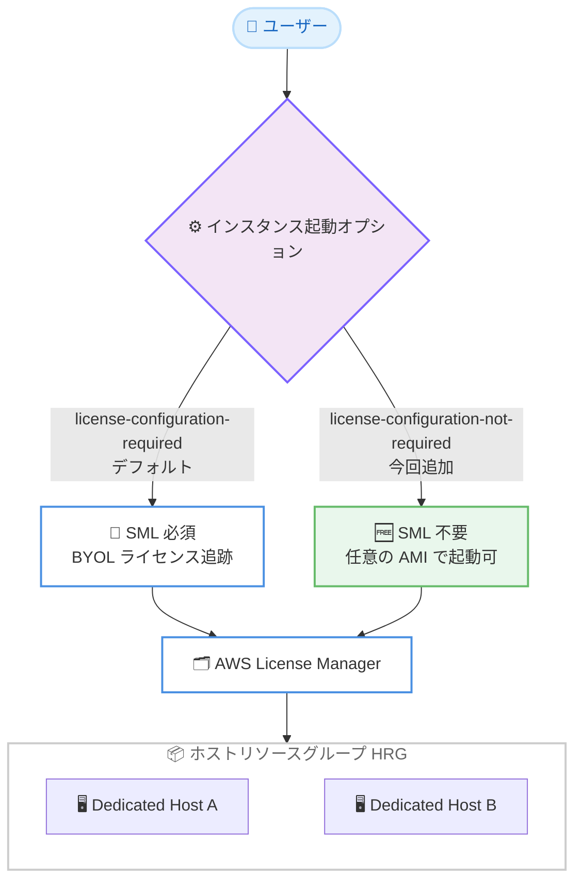

# Amazon EC2 Dedicated Hosts - セルフマネージドライセンス不要のホストリソースグループ対応

**リリース日**: 2026 年 7 月 24 日
**サービス**: Amazon EC2 (Dedicated Hosts) / AWS License Manager
**機能**: セルフマネージドライセンス (SML) なしでのホストリソースグループ (HRG) 作成

📊 [このアップデートのインフォグラフィックを見る](https://takech9203.github.io/aws-news-summary/20260724-ec2-dedicated-hosts-hrg.html)
<!-- INFOGRAPHIC_BASE_URL は環境変数から取得 -->

## 概要

Amazon EC2 Dedicated Hosts において、セルフマネージドライセンス (Self-Managed License、SML) の作成と AMI の関連付けを行わずに、ホストリソースグループ (Host Resource Group、HRG) を作成できるようになりました。これまで HRG を作成するには、AWS License Manager でセルフマネージドライセンスを作成し、AMI を関連付ける手順が必須でしたが、今回のアップデートによりこの前提ステップが不要になりました。

ホストリソースグループは、複数の Dedicated Hosts を単一のエンティティとして管理する仕組みです。License Manager がインスタンスの起動に応じてホストの割り当てや解放を自動的に行うため、ホスト管理の運用負荷を軽減できます。今回の変更により、ライセンス追跡を必要としないワークロードでも、この自動ホスト管理の利便性を手軽に活用できるようになりました。

この柔軟性は、特に EC2 Mac インスタンスを利用するお客様や、Bring Your Own License (BYOL) ではなくハードウェアレベルの分離を目的として Dedicated Hosts を必要とするお客様にとって価値があります。一方で、BYOL ワークロードを持つお客様は、引き続き SML 付きの HRG を作成することで、関連付けられた AMI から起動されたインスタンスのみをホスト上で実行するように制限し、ホストレベルでのライセンス消費を追跡できます。

**アップデート前の課題**

- HRG を作成する前に、AWS License Manager でセルフマネージドライセンス (SML) を作成する必要があった
- SML に AMI を関連付ける手順が必須であり、ライセンス追跡が不要なワークロードでも設定作業が発生していた
- EC2 Mac インスタンスやハードウェア分離のみを目的とする用途でも、BYOL 前提の設定を強いられていた

**アップデート後の改善**

- SML の作成と AMI の関連付けなしで HRG を作成できるようになった
- ライセンス追跡を必要としないワークロード (Mac ワークロードなど) で、設定手順を簡素化できるようになった
- BYOL ワークロードでは従来どおり SML 付きの HRG を利用でき、用途に応じて選択できる柔軟性が向上した

## アーキテクチャ図



インスタンス起動オプションの選択により、SML が必須となる従来のパス (BYOL 向け) と、SML が不要な新しいパス (Mac やハードウェア分離向け) のいずれかを選択できます。

## サービスアップデートの詳細

### 主要機能

1. **インスタンス起動オプションの選択**
   - HRG 作成時に、インスタンス起動オプションとして「ライセンス設定が必要 (License configuration required)」または「ライセンス設定が不要 (License configuration not required)」を選択できる
   - 「ライセンス設定が必要」はデフォルトの動作で、AMI に関連付けられたコアベースまたはソケットベースの SML が必要となる
   - 「ライセンス設定が不要」を選択すると、任意の AMI でインスタンスを起動でき、ライセンス設定のセットアップが不要になる

2. **SML なしでの HRG 作成**
   - EC2 コンソールで HRG 作成時に「Restrict to AMIs associated with self-managed license」オプションのチェックを外す
   - AWS CLI では `instance-launch-option` を `license-configuration-required` 以外の設定にする
   - Mac ワークロードやハードウェアレベルの分離が目的のワークロードに適している

3. **BYOL ワークロード向けの継続サポート**
   - BYOL ワークロードでは、引き続き SML 付きで HRG を作成できる
   - 関連付けられた AMI から起動されたインスタンスのみをホスト上で実行するように制限できる
   - ホストレベルでのライセンス消費を License Manager が自動的に追跡する

## 技術仕様

### インスタンス起動オプションの比較

| 項目 | ライセンス設定が必要 (デフォルト) | ライセンス設定が不要 (今回追加) |
|------|------|------|
| SML の作成 | 必須 | 不要 |
| AMI の関連付け | 必須 | 不要 |
| 起動可能な AMI | 関連付けられた AMI のみ | 任意の AMI |
| ライセンス追跡 | License Manager が自動追跡 | 追跡なし |
| 主な用途 | BYOL ワークロード | Mac ワークロード、ハードウェア分離 |

### ホストリソースグループの設定項目

| 項目 | 詳細 |
|------|------|
| ホストの自動割り当て | 利用可能なキャパシティを超える場合に EC2 が新しいホストを自動割り当て |
| ホストの自動解放 | 実行中インスタンスがない未使用ホストを EC2 が自動解放 |
| ホストの自動復旧 | 予期せず障害が発生したホストから新しいホストへインスタンスを移動 |
| インスタンス起動オプション | ライセンス設定の要否を決定 (作成後も変更可能) |
| 関連付ける SML | 「ライセンス設定が必要」の場合に必須。「不要」の場合は適用外 |
| インスタンスファミリー (任意) | 起動可能なインスタンスタイプを指定 |

## 設定方法

### 前提条件

1. Amazon EC2 Dedicated Hosts を利用可能な AWS アカウント
2. AWS License Manager および EC2 に対する適切な IAM 権限
3. HRG がサポートされているリージョンでの利用

### 手順

#### ステップ1: EC2 コンソールで HRG を作成する (SML なし)

EC2 コンソールでホストリソースグループを作成する画面を開き、「Restrict to AMIs associated with self-managed license」オプションのチェックを外します。これにより、SML の作成や AMI の関連付けを行わずに HRG を作成できます。

#### ステップ2: AWS CLI で作成する場合

```bash
# SML を要求しない HRG を作成する例
aws license-manager create-license-configuration \
  --name "mac-workload-hrg" \
  ...
```

CLI で HRG を作成する際は、`instance-launch-option` の設定を通じてライセンス設定の要否を制御します。ライセンス追跡が不要なワークロードでは、ライセンス設定を必須としない構成を選択します。設定後もこのオプションは変更可能です。

#### ステップ3: BYOL ワークロードの場合

BYOL ワークロードでは、従来どおり SML を作成し AMI を関連付けたうえで HRG を作成します。これにより、関連付けられた AMI からのインスタンス起動のみに制限され、ホストレベルのライセンス消費が追跡されます。

## メリット

### ビジネス面

- **運用負荷の軽減**: ライセンス追跡が不要なワークロードで、SML 作成という前提ステップを省略できる
- **導入の迅速化**: EC2 Mac インスタンスやハードウェア分離を目的とする用途で、より短時間で HRG を構築できる
- **選択の柔軟性**: BYOL とハードウェア分離のどちらの目的でも、用途に応じて最適な構成を選べる

### 技術面

- **自動ホスト管理の活用**: SML なしでも、ホストの自動割り当て、解放、復旧といった License Manager の自動管理機能を利用できる
- **設定変更の柔軟性**: インスタンス起動オプションは HRG 作成後も変更できる
- **一元管理**: 複数の Dedicated Hosts を単一のエンティティとして管理できる

## デメリット・制約事項

### 制限事項

- HRG に Dedicated Host を追加した後は、ホストに直接インスタンスを起動できず、HRG 経由での起動が必要になる
- 「ライセンス設定が不要」の構成では、ライセンス消費の自動追跡は行われない
- Nitro ベース以外のインスタンスでは、同一 HRG 内で同じインスタンスタイプのみ起動可能 (Nitro ベースは異なるタイプの混在が可能)

### 考慮すべき点

- ライセンスコンプライアンスの追跡が必要な BYOL ワークロードでは、引き続き SML 付き構成を選択する必要がある
- 用途 (BYOL かハードウェア分離か) に応じてインスタンス起動オプションを適切に選択する

## ユースケース

### ユースケース1: EC2 Mac インスタンスの運用

**シナリオ**: iOS/macOS アプリのビルドやテストのために EC2 Mac インスタンスを利用する。ライセンス追跡は不要で、ホスト管理を簡素化したい。

**効果**: SML の作成や AMI の関連付けなしで HRG を作成し、ホストの自動割り当てや解放を活用しながら Mac ワークロードを運用できる。

### ユースケース2: ハードウェアレベルの分離要件

**シナリオ**: コンプライアンスやセキュリティ要件のため、物理サーバーを占有するハードウェアレベルの分離が必要だが、BYOL は利用しない。

**効果**: ライセンス設定を不要とした HRG により、ハードウェア分離を確保しつつ、License Manager による自動ホスト管理を利用できる。

### ユースケース3: BYOL ワークロードのライセンス管理

**シナリオ**: 既存の Windows Server や商用ソフトウェアライセンスを持ち込み (BYOL)、ライセンス消費を正確に追跡する必要がある。

**効果**: SML 付きの HRG を作成することで、関連付けられた AMI からのインスタンス起動のみに制限し、ホストレベルでのライセンス消費を自動追跡できる。

## 料金

本アップデート自体による追加料金はありません。EC2 Dedicated Hosts および AWS License Manager の通常料金が適用されます。詳細は各サービスの料金ページを参照してください。

## 利用可能リージョン

ホストリソースグループがサポートされているすべての AWS リージョンで利用可能です。

## 関連サービス・機能

- **Amazon EC2 Dedicated Hosts**: 物理サーバーを占有する専有ホスト。HRG の管理対象となるリソース
- **AWS License Manager**: ライセンス管理およびホストリソースグループの作成・管理を担うサービス
- **EC2 Mac インスタンス**: SML 不要の HRG の主要な利用対象となる Mac ワークロード向けインスタンス

## 参考リンク

- 📊 [インフォグラフィック](https://takech9203.github.io/aws-news-summary/20260724-ec2-dedicated-hosts-hrg.html)
- [公式発表 (What's New)](https://aws.amazon.com/about-aws/whats-new/2026/07/ec2-dedicated-hosts-hrg/)
- [ドキュメント (Host resource groups in License Manager)](https://docs.aws.amazon.com/license-manager/latest/userguide/host-resource-groups.html)
- [Amazon EC2 Dedicated Hosts](https://docs.aws.amazon.com/AWSEC2/latest/UserGuide/dedicated-hosts-overview.html)

## まとめ

このアップデートにより、セルフマネージドライセンスの作成という前提ステップなしで EC2 Dedicated Hosts のホストリソースグループを作成できるようになり、特に EC2 Mac インスタンスやハードウェア分離目的の利用が大幅に簡素化されました。BYOL ワークロードでは従来どおり SML 付き構成でライセンス追跡が可能です。用途に応じてインスタンス起動オプションを選択し、自動ホスト管理の利便性を活用することをおすすめします。
