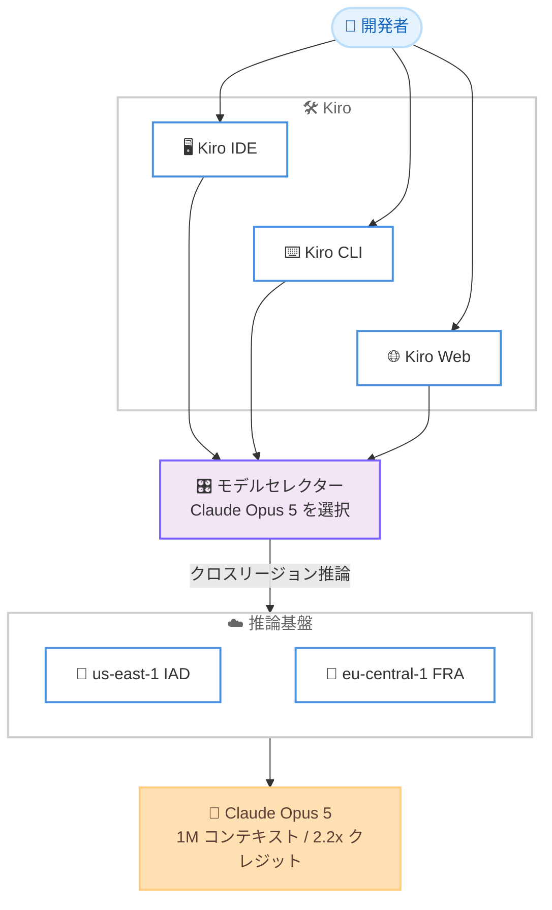

# Kiro - Claude Opus 5 の提供開始

**リリース日**: 2026 年 7 月 24 日
**サービス**: Kiro
**機能**: Claude Opus 5 モデルのサポート (実験的サポート)

📊 [このアップデートのインフォグラフィックを見る](https://takech9203.github.io/aws-news-summary/20260724-kiro-opus-5.html)
<!-- INFOGRAPHIC_BASE_URL は環境変数から取得 -->

## 概要

AWS が提供する AI 搭載 IDE である Kiro で、Anthropic の最新かつ最も高性能な Opus クラスモデルである Claude Opus 5 が利用可能になりました。Claude Opus 5 は Kiro IDE、CLI、Web のすべてのインターフェースで提供され、Opus 4.8 からの大きな進化として、長時間を要する作業への強さ、並列エージェントの調整能力の向上、長時間セッションにおけるコストとレイテンシーをきめ細かく制御する新しいコントロールを備えています。

Claude Opus 5 は、最も困難なエージェントタスクに対応するワークホースとして位置付けられています。複数ファイルにまたがる機能開発、大規模なリファクタリング、エンドツーエンドの機能実装に優れ、スタブやプレースホルダーを残さずにタスクを完全に完了します。Kiro においては、IDE でのスペック駆動ワークフローがより高い忠実度で実行され、複数ステップのタスクがより少ない監督で確実に完了するようになります。

AWS の Agentic AI 担当 VP である Deepak Singh 氏は、「Opus 5 は長時間実行される複数ステップの作業のために構築された強力なエージェントコーディングモデルであり、コードベースを深く理解し、複雑なタスク全体で文脈を保持し、機能開発とバグ修正の要件を Opus 4.8 よりも効果的に特定する」とコメントしています。

**アップデート前の課題**

Claude Opus 5 の提供以前は、以下のような課題がありました。

- 以前は Opus 4.8 が最上位モデルであり、長時間を要する複雑なタスクの完遂能力に改善の余地があった
- 並列エージェントを実行した際に、エージェント同士が互いの作業を上書きしてしまうケースがあった
- 長時間セッションにおけるコストとレイテンシーをきめ細かく制御する手段が限られていた

**アップデート後の改善**

今回のアップデートにより、以下が可能になりました。

- Kiro IDE、CLI、Web のすべてで、最新の Opus クラスモデルである Claude Opus 5 を選択できるようになった
- マルチエージェント調整が改善され、エージェント同士の作業の上書きが減少し、ライター・ベリファイアパターンをより効果的に活用できるようになった
- 1M トークンのフルコンテキストウィンドウにより、大規模なコードベースを対象とした作業が可能になった

## アーキテクチャ図



Kiro IDE、CLI、Web のいずれからもモデルセレクターで Claude Opus 5 を選択でき、us-east-1 と eu-central-1 を基盤としたクロスリージョン推論で提供されます。

## サービスアップデートの詳細

### 主要機能

1. **コーディングとナレッジワークにおける最先端の性能**
   - 複数ファイルにまたがる機能開発、大規模リファクタリング、エンドツーエンドの機能実装に優れる
   - スタブやプレースホルダーを残さず、タスクを完全に完了する
   - 自身の作業を検証し、成功するまで慎重に反復する

2. **スペック駆動ワークフローの忠実度向上**
   - IDE でのスペック駆動ワークフローが、より高い忠実度と少ないドリフトで実行される
   - 複数ステップのタスクが、より少ない監督で確実に完了する

3. **コードレビュー性能の向上**
   - 1 回のレビューパスで実際のバグを高い割合で検出し、誤検出は少ない
   - 低い effort 設定でも精度を維持するため、コミット時の高速レビューと、後からの徹底的なレビューを使い分けられる

4. **マルチエージェント調整の改善**
   - エージェント同士が互いの作業を上書きするケースが減少
   - ライター・ベリファイアパターンをより効果的に活用できる
   - Kiro の CLI や IDE で並列エージェントを実行する場合、最初に試すべきモデルとされている

5. **サイバーセキュリティセーフガードの強化**
   - ソースコード内の脆弱性の発見は許可しつつ、バイナリベースの脆弱性スキャン、ペネトレーションテスト、エクスプロイト生成は分類器によりブロックされる
   - Anthropic のデータによると、大多数のセッションは影響を受けない
   - 無害なタスクで誤検出が発生した場合は、Kiro で別のモデルに切り替えることで対応できる

## 技術仕様

### モデル仕様

| 項目 | 詳細 |
|------|------|
| モデル名 | Claude Opus 5 |
| 提供インターフェース | Kiro IDE、CLI、Web |
| コンテキストウィンドウ | 1M トークン (フルサイズ) |
| クレジット倍率 | 2.2x |
| 提供状態 | 実験的サポート (experimental) として段階的ロールアウト |
| 対象プラン | Kiro Pro、Pro+、Pro Max、Power |
| 推論リージョン | us-east-1 (IAD)、eu-central-1 (FRA)、クロスリージョン推論対応 |

## 設定方法

### 前提条件

1. Kiro Pro、Pro+、Pro Max、Power のいずれかのプランを契約していること
2. 段階的ロールアウトの対象になっていること
3. 実験的機能のグローバルクロスリージョン推論に関するデータ保護の挙動を理解していること

### 手順

#### ステップ1: Kiro を最新化する

```bash
# Kiro CLI を利用している場合は再起動して最新モデルを確認
kiro
```

IDE または CLI を再起動すると、利用可能な最新モデルが確認されます。Kiro を未導入の場合は、公式サイトのダウンロードページから入手します。Web 利用の場合はブラウザーを更新するだけで、モデルセレクターに Claude Opus 5 が表示されます。

#### ステップ2: モデルセレクターで Claude Opus 5 を選択する

IDE、CLI、Web のモデルセレクターから「Claude Opus 5」を選択します。実験的サポートのため、段階的ロールアウトの状況によっては表示までに時間がかかる場合があります。

#### ステップ3: タスクを実行する

スペック駆動開発、大規模リファクタリング、コードレビュー、並列エージェント実行などのタスクで Claude Opus 5 を活用します。クレジット倍率が 2.2x である点を考慮し、タスクの重要度に応じてモデルを使い分けます。

## メリット

### ビジネス面

- **開発生産性の向上**: 複数ステップのタスクがより少ない監督で完了するため、開発者はより高付加価値な作業に集中できる
- **品質の向上**: スタブやプレースホルダーを残さない完全なタスク遂行と、誤検出の少ないコードレビューにより、成果物の品質が高まる
- **コスト制御**: 長時間セッションにおけるコストとレイテンシーをきめ細かく制御する新しいコントロールにより、利用コストを管理しやすくなる

### 技術面

- **大規模コンテキスト**: 1M トークンのフルコンテキストウィンドウにより、大規模なコードベース全体を把握した作業が可能
- **マルチエージェント調整**: 並列エージェント実行時の作業の上書きが減少し、ライター・ベリファイアパターンを効果的に活用できる
- **クロスリージョン推論**: us-east-1 と eu-central-1 を基盤とするクロスリージョン推論により、可用性が確保される

## デメリット・制約事項

### 制限事項

- 実験的サポート (experimental) としての提供であり、段階的ロールアウト中のため、すべてのユーザーがすぐに利用できるとは限らない
- 対象プランは Kiro Pro、Pro+、Pro Max、Power であり、Free プランでは利用できない
- クレジット倍率が 2.2x と高く、他のモデルより多くのクレジットを消費する
- サイバーセキュリティセーフガードにより、バイナリベースの脆弱性スキャン、ペネトレーションテスト、エクスプロイト生成はブロックされる

### 考慮すべき点

- 無害なタスクでセーフガードの誤検出が発生した場合は、別のモデルへの切り替えが必要になる
- 実験的機能はグローバルクロスリージョン推論を使用するため、データ保護要件がある場合は Kiro のデータ保護ドキュメントを事前に確認することが望ましい
- クレジット消費を考慮し、難易度の高いタスクに Opus 5 を、軽量なタスクに他のモデルを使い分ける運用が推奨される

## ユースケース

### ユースケース1: 大規模リファクタリングとエンドツーエンドの機能開発

**シナリオ**: 複数ファイルにまたがる機能追加や、大規模なコードベースのリファクタリングを AI エージェントに任せたい。

**効果**: スタブやプレースホルダーを残さずタスクを完全に完了し、自身の作業を検証しながら成功するまで反復するため、本番品質の成果物を得られます。

### ユースケース2: コミット時の高速コードレビュー

**シナリオ**: コミット時には高速なレビューを行い、後からより徹底的なレビューを実施する 2 段階のレビュー運用を行いたい。

**効果**: 低い effort 設定でも精度を維持するため、コミット時の高速パスと後からの徹底パスを使い分けられ、誤検出の少ない実効性の高いレビューを実現します。

### ユースケース3: 並列エージェントによる開発

**シナリオ**: Kiro の CLI や IDE で複数のエージェントを並列実行し、大きな開発タスクを分担させたい。

**効果**: エージェント同士の作業の上書きが減少し、ライター・ベリファイアパターンを効果的に活用できるため、並列エージェント開発の信頼性が向上します。

## 料金

Claude Opus 5 は 2.2x のクレジット倍率で提供されます。つまり、他の標準モデルと比較して 2.2 倍のクレジットを消費します。対象プランは Kiro Pro (月額 20 USD、1,000 クレジット)、Pro+ (月額 40 USD、2,000 クレジット)、Pro Max (月額 100 USD、5,000 クレジット)、Power (月額 200 USD、10,000 クレジット) です。詳細は Kiro の料金ページを参照してください。

## 利用可能リージョン

Kiro はグローバルに利用可能なサービスです。Claude Opus 5 の推論は us-east-1 (IAD) と eu-central-1 (FRA) を基盤とし、クロスリージョン推論に対応しています。段階的ロールアウト中のため、利用可能になる時期はユーザーによって異なる場合があります。

## 関連サービス・機能

- **Amazon Bedrock**: 同日に Claude Opus 5 が AWS (Amazon Bedrock / Claude Platform on AWS) でも提供開始されており、API 経由でのモデル利用は Bedrock 側で行える
- **Kiro スペック駆動開発**: 要件、設計、タスクを構造化して開発を進める Kiro の中核機能であり、Opus 5 により忠実度が向上する
- **Kiro CLI / Web**: IDE に加えて CLI と Web でも同じモデルセレクターから Opus 5 を利用できる

## 参考リンク

- 📊 [インフォグラフィック](https://takech9203.github.io/aws-news-summary/20260724-kiro-opus-5.html)
- [Kiro Blog: Claude Opus 5 is now available in Kiro](https://kiro.dev/blog/opus-5/)
- [Kiro Changelog](https://kiro.dev/changelog/)
- [Kiro ドキュメント: データ保護 (実験的機能のグローバルクロスリージョン推論)](https://kiro.dev/docs/privacy-and-security/data-protection/#global-cross-region-inference-for-experimental-features)
- [Kiro 料金ページ](https://kiro.dev/pricing/)
- [Kiro ダウンロード](https://kiro.dev/downloads/)
- [関連発表: Claude Opus 5 is now available on AWS](https://aws.amazon.com/about-aws/whats-new/2026/07/claude-opus-5-aws/)

## まとめ

Claude Opus 5 の Kiro への追加により、大規模リファクタリング、エンドツーエンドの機能開発、並列エージェント実行といった最も困難なエージェントタスクを、より高い信頼性で実行できるようになりました。実験的サポートとして段階的にロールアウトされているため、Pro 以上のプランを利用中の場合は IDE や CLI を再起動してモデルセレクターを確認し、クレジット倍率 2.2x を考慮しながら難易度の高いタスクから評価を始めることを推奨します。
