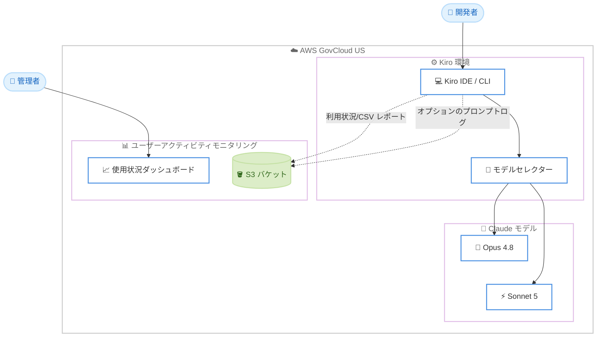

# Kiro - Opus 4.8、Sonnet 5、ユーザーアクティビティモニタリングの AWS GovCloud (US) 対応

**リリース日**: 2026 年 7 月 24 日
**サービス**: Kiro (AWS の AI 搭載 IDE)
**機能**: Claude Opus 4.8、Claude Sonnet 5、ユーザーアクティビティモニタリング

📊 [このアップデートのインフォグラフィックを見る](https://takech9203.github.io/aws-news-summary/20260724-kiro-opus-sonnet-monitoring-launch-aws-govcloud-us.html)
<!-- INFOGRAPHIC_BASE_URL は環境変数から取得 -->

## 概要

AWS は、AI 搭載の統合開発環境 (IDE) である Kiro において、2 つの新しい Claude モデル (Claude Opus 4.8 および Claude Sonnet 5) と、エンタープライズ向けのユーザーアクティビティモニタリング機能を AWS GovCloud (US) リージョンで一般提供 (GA) 開始したことを発表しました。この機能は Kiro の IDE と CLI の両方で利用できます。

Claude Opus 4.8 は「最も知的な Opus モデル」と位置付けられ、自己検証能力の向上、より効率的なツール呼び出し、長期プロジェクトにおける追従性の改善を実現しています。編集の前に計画を立てるアプローチを取り、複雑で多段階のタスクに適しています。一方、Claude Sonnet 5 は「最もエージェント的な Sonnet モデル」として、より強力な推論、ツール利用、コーディング能力を Sonnet レベルの価格で提供し、ベンチマークで Opus 4.8 に近い性能を低コストで実現します。

ユーザーアクティビティモニタリングは、エンタープライズ管理者に組織全体の利用状況を可視化する機能です。集計メトリクスを表示する使用状況ダッシュボード、ユーザーごとの日次 CSV レポート、オプションのプロンプトログ記録などを提供し、規制対象の政府機関ワークロードにおけるコンプライアンスと監査の要件に対応します。

**アップデート前の課題**

- AWS GovCloud (US) 環境では、Kiro の最新の Claude モデル (Opus 4.8、Sonnet 5) を利用できなかった
- エンタープライズ管理者が組織全体の Kiro 利用状況を一元的に可視化する手段が限られていた
- コンプライアンスや監査のために、プロンプトとレスポンスのログを取得する標準的な仕組みがなかった

**アップデート後の改善**

- AWS GovCloud (US) リージョンで Claude Opus 4.8 および Claude Sonnet 5 が利用可能になった
- 使用状況ダッシュボードとユーザーごとの日次 CSV レポートにより、クレジット消費とモデル利用状況を把握できるようになった
- オプションのプロンプトログ記録により、コンプライアンスとデバッグのためのデータを自社アカウントに保存できるようになった

## アーキテクチャ図

開発者は Kiro IDE または CLI のモデルセレクターから Opus 4.8 または Sonnet 5 を選択して利用でき、管理者は使用状況ダッシュボードと自社 S3 バケットに配信されるレポートを通じて組織全体の利用状況を監視します。

## サービスアップデートの詳細

### 主要機能

1. **Claude Opus 4.8**
   - 最も知的な Opus モデルとして位置付けられている
   - 自己検証能力の向上、より効率的なツール呼び出し、長期プロジェクトにおける追従性の改善を実現
   - 編集の前に計画を立てるため、複雑で多段階のタスクに適している
   - 100 万トークンのコンテキストウィンドウをサポート
   - クレジット倍率は 2.2 倍

2. **Claude Sonnet 5**
   - 最もエージェント的な Sonnet モデルとして位置付けられている
   - より強力な推論、ツール利用、コーディング能力を Sonnet レベルの価格で提供
   - ベンチマークで Opus 4.8 に近い性能を、より低コストで実現
   - 実験的サポートとして提供
   - 100 万トークンのコンテキストウィンドウをサポート
   - クレジット倍率は 1.3 倍

3. **ユーザーアクティビティモニタリング**
   - 集計メトリクスを表示する使用状況ダッシュボードを提供
   - ユーザーごとの日次 CSV レポート (クレジット、モデル利用状況) を自社の S3 バケットに配信し、最適化と監査に活用可能
   - オプションのプロンプトログ記録により、プロンプトとレスポンスを取得してコンプライアンスとデバッグに利用可能
   - データは自社アカウントに保存され、S3 ストレージ以外の追加料金は発生しない

## 技術仕様

### モデルの比較

| 項目 | Claude Opus 4.8 | Claude Sonnet 5 |
|------|-----------------|-----------------|
| 位置付け | 最も知的な Opus モデル | 最もエージェント的な Sonnet モデル |
| コンテキストウィンドウ | 100 万トークン | 100 万トークン |
| クレジット倍率 | 2.2 倍 | 1.3 倍 |
| 提供状態 | 一般提供 | 実験的サポート |
| 特徴 | 自己検証、効率的なツール呼び出し、長期プロジェクトの追従性 | 強力な推論とコーディングを低コストで提供 |

### ユーザーアクティビティモニタリングの構成要素

| 項目 | 詳細 |
|------|------|
| 使用状況ダッシュボード | 組織全体の集計メトリクスを可視化 |
| 日次 CSV レポート | ユーザーごとのクレジット消費とモデル利用状況を S3 バケットに配信 |
| プロンプトログ記録 | オプションで、プロンプトとレスポンスをコンプライアンス/デバッグ用に取得 |
| データ保存先 | 自社の AWS アカウント (S3 ストレージ以外の追加料金なし) |

## 設定方法

### 前提条件

1. AWS GovCloud (US) で Kiro を利用できる環境が整っていること
2. Kiro IDE または CLI がインストールされていること
3. ユーザーアクティビティモニタリングを利用する場合、レポート配信先の S3 バケットを準備していること

### 手順

#### ステップ 1: Kiro IDE または CLI の更新

Kiro IDE または CLI を最新バージョンに更新し、再起動します。再起動後、モデルセレクターに新しいモデル (Opus 4.8、Sonnet 5) が表示されるようになります。

#### ステップ 2: モデルの選択

Kiro のモデルセレクターから、タスクに応じて Claude Opus 4.8 または Claude Sonnet 5 を選択します。複雑で多段階のタスクには Opus 4.8、コスト効率を重視する場合は Sonnet 5 を選択します。

#### ステップ 3: ユーザーアクティビティモニタリングの設定

エンタープライズ管理者は、使用状況ダッシュボードで組織全体の利用状況を確認します。日次 CSV レポートの配信先となる S3 バケットを指定し、必要に応じてプロンプトログ記録を有効化します。詳細な設定手順は GovCloud のドキュメントおよびモニタリングガイドを参照してください。

## メリット

### ビジネス面

- **規制対応の強化**: AWS GovCloud (US) で最新の AI モデルを利用でき、政府機関や規制対象ワークロードでも先進的な開発支援を活用できる
- **コスト最適化**: 使用状況ダッシュボードと日次レポートにより、クレジット消費を可視化し利用の最適化を図れる
- **コンプライアンスと監査**: プロンプトログ記録により、コンプライアンスと監査の要件を満たすためのデータを取得できる

### 技術面

- **高性能なモデルの選択肢**: 複雑なタスク向けの Opus 4.8 と、コスト効率に優れた Sonnet 5 を用途に応じて選択できる
- **長いコンテキスト**: 両モデルとも 100 万トークンのコンテキストウィンドウをサポートし、大規模なコードベースやドキュメントを扱える
- **データの自社管理**: モニタリングデータは自社の AWS アカウントに保存され、S3 ストレージ以外の追加料金が発生しない

## デメリット・制約事項

### 制限事項

- Claude Sonnet 5 は実験的サポートとして提供されており、動作や仕様が変更される可能性がある
- 新しいモデルを利用するには、Kiro IDE または CLI を最新バージョンへ更新して再起動する必要がある
- 各モデルにはクレジット倍率が設定されており (Opus 4.8: 2.2 倍、Sonnet 5: 1.3 倍)、消費するクレジット量が異なる

### 考慮すべき点

- プロンプトログ記録を有効化する場合、プロンプトとレスポンスが保存されるため、組織のデータ取り扱いポリシーとの整合性を確認する
- CSV レポートやログの保存には S3 ストレージ料金が発生する
- タスクの複雑さとコストのバランスを考慮し、適切なモデルを選択する必要がある

## ユースケース

### ユースケース 1: 政府機関の大規模開発プロジェクト

**シナリオ**: 規制対象のワークロードを扱う政府機関のチームが、複雑で多段階の開発タスクを AWS GovCloud (US) 環境で進める。

**効果**: Claude Opus 4.8 の計画能力と自己検証能力により、複雑なリファクタリングや機能追加を効率的に進められる。100 万トークンのコンテキストウィンドウにより、大規模なコードベース全体を考慮した支援を受けられる。

### ユースケース 2: コスト効率を重視した日常的な開発

**シナリオ**: 開発チームが日常的なコーディングタスクをコストを抑えつつ効率的に進めたい。

**効果**: Claude Sonnet 5 を利用することで、Opus 4.8 に近い性能を Sonnet レベルの価格で得られ、クレジット消費を抑えながら生産性を維持できる。

### ユースケース 3: 組織全体の利用状況の監査と最適化

**シナリオ**: エンタープライズ管理者が、組織全体の Kiro 利用状況を把握し、コスト最適化とコンプライアンス対応を行いたい。

**効果**: 使用状況ダッシュボードと日次 CSV レポートによりユーザーごとのクレジット消費とモデル利用状況を把握でき、プロンプトログ記録により監査要件に対応できる。

## 料金

各 Claude モデルにはクレジット倍率が設定されています。Claude Opus 4.8 は 2.2 倍、Claude Sonnet 5 は 1.3 倍のクレジットを消費します。

ユーザーアクティビティモニタリングのデータは自社の AWS アカウントに保存され、S3 ストレージ料金以外の追加料金は発生しません。

## 利用可能リージョン

AWS GovCloud (US) リージョン

## 関連サービス・機能

- **Amazon S3**: 日次 CSV レポートおよびオプションのプロンプトログの保存先として利用される
- **Claude (Anthropic)**: Kiro の基盤となる AI モデルを提供する。今回 Opus 4.8 および Sonnet 5 が追加された
- **AWS GovCloud (US)**: 政府機関や規制対象ワークロード向けの独立した AWS リージョン

## 参考リンク

- 📊 [インフォグラフィック](https://takech9203.github.io/aws-news-summary/20260724-kiro-opus-sonnet-monitoring-launch-aws-govcloud-us.html)
- [公式発表 (What's New)](https://aws.amazon.com/about-aws/whats-new/2026/07/kiro-opus-sonnet-monitoring-launch-aws-govcloud-us/)
- [Kiro 公式サイト](https://kiro.dev/)

## まとめ

今回のアップデートにより、AWS GovCloud (US) 環境でも Kiro の最新 AI モデル (Claude Opus 4.8、Claude Sonnet 5) とエンタープライズ向けのユーザーアクティビティモニタリングが利用可能になりました。規制対象の政府機関ワークロードでも先進的な AI 開発支援とガバナンスを両立できる点が大きな価値です。GovCloud (US) で Kiro を利用している組織は、IDE または CLI を最新バージョンに更新し、用途に応じたモデル選択とモニタリング設定を検討することをおすすめします。
