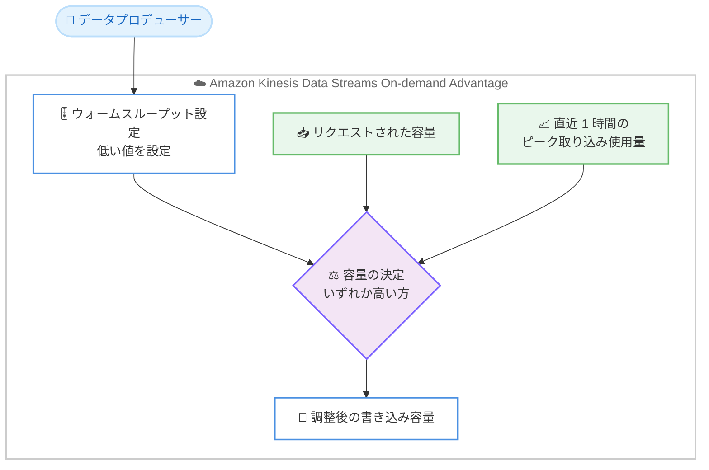

# Amazon Kinesis Data Streams - ウォームスループットによる書き込み容量のスケールダウン

**リリース日**: 2026 年 7 月 24 日
**サービス**: Amazon Kinesis Data Streams
**機能**: On-demand Advantage モードでのウォームスループット (Warm Throughput) スケールダウン

📊 [このアップデートのインフォグラフィックを見る](https://takech9203.github.io/aws-news-summary/20260724-on-demand-scale-down.html)
<!-- INFOGRAPHIC_BASE_URL は環境変数から取得 -->

## 概要

Amazon Kinesis Data Streams は、あらゆる規模でデータストリームのキャプチャ、処理、保存を容易に行えるサーバーレスのストリーミングデータサービスです。オンデマンドストリームは、データの取り込み使用量の増加に応じて、書き込み (ingest) 容量を自動的に増やします。

これまで On-demand Advantage モードでは、ウォームスループットを使ってストリームの書き込み容量を事前に温めておく (プロビジョニングしておく) ことで、急激なトラフィック変動に備えることができました。しかし、この操作は容量を「引き上げる」方向にしか使えませんでした。今回のアップデートにより、AWS はウォームスループットを「引き下げる」スケールダウンにも対応し、ストリームの書き込みスループットを上下双方向で完全に制御できるようになりました。

スケールダウンを行うには、オンデマンドストリームに対してより低いウォームスループット値を設定します。ストリームは、リクエストされた容量、または直近 1 時間のピーク時取り込み使用量をサポートするために必要な容量のいずれか高い方に調整されます。これにより、現在のトラフィックに対して十分な容量を常に保持しながら、不要になった余剰容量を解放できます。この機能は、On-demand Advantage モードが有効なすべてのオンデマンドストリームで追加費用なしで利用できます。

**アップデート前の課題**

- ウォームスループットは容量を事前に引き上げる用途にしか使えず、書き込み容量を意図的に引き下げる手段がなかった
- 一時的なトラフィックバースト (突発的な急増) によってストリームがウォーム容量を大きく超えてスケールした後、その拡大した容量を明示的に縮小できなかった
- 余剰容量を抱えたまま運用せざるを得ず、コスト効率とキャパシティ管理の柔軟性に制約があった

**アップデート後の改善**

- より低いウォームスループット値を設定するだけで、書き込み容量のスケールダウンが可能になった
- 直近 1 時間のピーク使用量を下限とすることで、現在のトラフィックに必要な容量を確保しつつ余剰分のみを解放できる
- 書き込みスループットを上下双方向で制御でき、追加費用なしでキャパシティ管理とコスト効率を最適化できる

## アーキテクチャ図



スケールダウン要求時、ストリームはリクエスト値と直近 1 時間のピーク使用量を比較し、高い方の容量に調整することで安全に余剰容量を解放します。

## サービスアップデートの詳細

### 主要機能

1. **ウォームスループットによるスケールダウン**
   - オンデマンドストリームに対してより低いウォームスループット値を設定することで、書き込み容量を縮小できる
   - 一時的なデータバーストによってストリームがウォーム容量を大きく超えてスケールした場合に、意図的に容量を縮小するトリガーとして利用できる
   - これにより書き込みスループットを上下双方向で完全に制御できる

2. **ピーク使用量を下限とした安全な容量調整**
   - スケールダウン後の容量は、リクエストされた値、または直近 1 時間のピーク取り込み使用量に必要な容量のいずれか高い方に決定される
   - 現在のトラフィックを処理するのに十分な容量を常に確保したうえで、余剰分のみを解放する
   - トラフィックのスループットを下回る過度な縮小によるスロットリングを防ぐ

3. **追加費用なしでの提供**
   - ウォームスループットのスケールダウンは、On-demand Advantage モードが有効なすべてのオンデマンドストリームで追加費用なしで利用できる
   - ウォームスループットの設定自体も追加費用は発生しない

## 技術仕様

### Kinesis Data Streams のキャパシティモード比較

| モード | 容量管理 | ウォームスループット | 特徴 |
|--------|----------|----------------------|------|
| On-demand Standard | 自動スケール (直近 30 日ピークの最大 2 倍) | 非対応 | キャパシティプランニング不要。ストリームごとの固定料金あり |
| On-demand Advantage | 自動スケール + ウォームスループットによる事前制御 | 対応 (今回スケールダウンにも対応) | アカウントレベル設定。ストリーム固定料金なし。取り込み/取得料金が最低 60% 低い |
| Provisioned | シャード数を手動指定 | 非対応 | `UpdateShardCount` によるシャードの手動スケール |

### スケールダウンの動作

| 項目 | 詳細 |
|------|------|
| スケールダウンの起動方法 | オンデマンドストリームに低いウォームスループット値を設定 |
| 調整後の容量 | リクエスト値と直近 1 時間のピーク取り込み使用量のうち高い方 |
| 目的 | 現在のトラフィックに必要な容量を確保しつつ余剰容量を解放 |
| 費用 | 追加費用なし |
| 対象 | On-demand Advantage モードが有効なすべてのオンデマンドストリーム |

## 設定方法

### 前提条件

1. AWS アカウントで On-demand Advantage モードが有効になっていること (アカウントレベルの設定)
2. On-demand Advantage 有効化時、リージョン内の全オンデマンドストリームで最低 25 MiB/s のデータ取り込みと 25 MiB/s のデータ取得をコミットすること
3. 対象ストリームがオンデマンドモードで稼働していること

### 手順

#### ステップ1: 現在のストリーム状態の確認

```bash
aws kinesis describe-stream-summary --stream-name my-stream
```

対象ストリームのモードと現在のウォームスループット設定を確認します。ストリームのステータスが `ACTIVE` であることを確認してから設定変更を行います。

#### ステップ2: ウォームスループットの引き下げ設定

```bash
# ウォームスループットを低い値に設定してスケールダウンを起動
aws kinesis update-stream-warm-throughput \
    --stream-name my-stream \
    --warm-throughput-in-mib-per-second 100
```

より低いウォームスループット値を設定することで、ストリームは余剰容量の解放を開始します。実際の縮小幅は、設定値と直近 1 時間のピーク取り込み使用量のうち高い方に基づいて決定されます。

<!-- 上記コマンド名およびパラメータ名は一般的な例です。実際の API 名は最新の AWS CLI / API リファレンスで確認してください。 -->

#### ステップ3: 調整結果の確認

設定変更後、ストリームのステータスは一時的に `UPDATING` になります。`ACTIVE` に戻ったら、`describe-stream-summary` で調整後の容量を再確認します。

## メリット

### ビジネス面

- **コスト効率の向上**: 一時的なトラフィック急増後に不要となった余剰容量を解放でき、コストを最適化できる
- **追加費用なし**: On-demand Advantage モードが有効であれば追加料金なしで利用できる
- **運用の柔軟性**: 予測されるイベントに向けたスケールアップと、イベント後のスケールダウンを一貫した仕組みで管理できる

### 技術面

- **双方向のキャパシティ制御**: 書き込みスループットを上げるだけでなく下げることもでき、完全なコントロールを実現
- **安全な縮小**: 直近 1 時間のピーク使用量を下限とするため、過度な縮小によるスロットリングを防止
- **シンプルな操作**: ウォームスループット値を設定するだけで、シャード数の手動計算なしに容量を調整できる

## デメリット・制約事項

### 制限事項

- 本機能は On-demand Advantage モードが有効なオンデマンドストリームでのみ利用可能 (On-demand Standard や Provisioned モードは対象外)
- スケールダウン後の容量は直近 1 時間のピーク使用量を下回れないため、リクエスト値どおりに即座に縮小されるとは限らない
- On-demand Advantage を有効化すると、無効化まで最低 24 時間待つ必要がある
- On-demand Advantage から On-demand Standard に戻すには、事前にオンデマンドストリームに設定したウォームスループットをすべて削除する必要がある

### 考慮すべき点

- On-demand Advantage はリージョン内の全オンデマンドストリームで最低 25 MiB/s の取り込みと取得をコミットするアカウントレベル設定であるため、使用量が要件を下回る場合はショートフォール (不足分) が課金される
- スケールダウンの効果を最大化するには、トラフィックのピークが収まったタイミングを見極めて設定を行う必要がある

## ユースケース

### ユースケース1: イベント後のキャパシティ縮小

**シナリオ**: セールやライブ配信などのイベントに向けてウォームスループットを 200 MB/s に引き上げていたが、イベント終了後は通常の 40 MB/s 程度のトラフィックに戻った。

**実装例**:
```
イベント前: warm throughput = 200 MB/s に設定
イベント後: warm throughput = 40 MB/s に引き下げ
→ 直近 1 時間のピーク使用量を下回らない範囲で余剰容量を解放
```

**効果**: イベントで確保した余剰容量を安全に解放し、キャパシティ管理を最適化できる。

### ユースケース2: 一時的バースト後の容量リセット

**シナリオ**: 突発的なデータバーストにより、オンデマンドストリームがウォーム容量を大きく超えて自動スケールしたまま高い容量を維持している。

**実装例**:
```
バースト後: warm throughput をより低い値に設定してスケールダウンを起動
→ 直近 1 時間のピーク使用量に必要な容量まで縮小
```

**効果**: 一時的な急増によって拡大した容量を意図的にリセットし、現在のトラフィックに見合った容量で運用できる。

### ユースケース3: 予測可能なトラフィックサイクルへの追従

**シナリオ**: 日中は書き込みトラフィックが高く、夜間は大きく低下するような予測可能なワークロードを運用している。

**実装例**:
```
日中: warm throughput = 高い値
夜間: warm throughput = 低い値に引き下げ
```

**効果**: トラフィックのサイクルに合わせてウォームスループットを上下させ、必要な容量を確保しながら効率的に運用できる。

## 料金

ウォームスループットのスケールダウンは、On-demand Advantage モードが有効なすべてのオンデマンドストリームで追加費用なしで利用できます。ウォームスループットの設定自体にも追加費用は発生しません。

On-demand Advantage モードでは、ストリームごとの固定料金が撤廃され、データ取り込み、データ取得、およびオプションの拡張保持の料金のみが課金されます。各料金ディメンションは On-demand Standard と比較して最低 60% 低く設定されています。詳細は料金ページを参照してください。

## 利用可能リージョン

Amazon Kinesis Data Streams On-demand Advantage がサポートされているすべての AWS リージョンで利用できます。

## 関連サービス・機能

- **On-demand Advantage モード**: 本機能の前提となるアカウントレベルのキャパシティモード。ウォームスループットによる事前の容量制御と簡素化された料金体系を提供する
- **AWS Lambda / Amazon Managed Service for Apache Flink**: Kinesis Data Streams のデータをリアルタイムに処理するコンシューマーとして連携する
- **Enhanced Fan-Out (EFO)**: On-demand Advantage モードでは 1 ストリームあたり最大 50 個のコンシューマーを登録でき、追加のスループット料金なしで利用できる

## 参考リンク

- 📊 [インフォグラフィック](https://takech9203.github.io/aws-news-summary/20260724-on-demand-scale-down.html)
- [公式発表 (What's New)](https://aws.amazon.com/about-aws/whats-new/2026/07/kinesis/on-demand-scale-down)
- [ドキュメント: ストリームのサイジングとモードの選択](https://docs.aws.amazon.com/streams/latest/dev/how-do-i-size-a-stream.html)
- [ドキュメント: ストリームの更新](https://docs.aws.amazon.com/streams/latest/dev/updating-a-stream.html)
- [料金ページ](https://aws.amazon.com/kinesis/data-streams/pricing/)

## まとめ

今回のアップデートにより、Kinesis Data Streams の On-demand Advantage モードでウォームスループットを引き下げるスケールダウンが可能になり、書き込みスループットを上下双方向で完全に制御できるようになりました。直近 1 時間のピーク使用量を下限とすることで安全性を保ちながら余剰容量を解放できるため、イベント後や一時的バースト後のキャパシティ管理とコスト最適化に有効です。追加費用なしで利用できるため、On-demand Advantage モードを利用しているワークロードでは積極的に活用を検討することをおすすめします。
