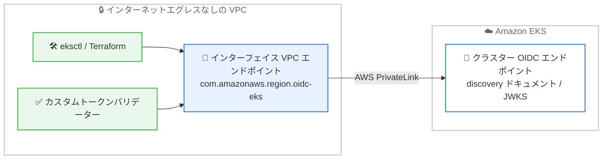

# Amazon EKS - クラスター OIDC エンドポイントの AWS PrivateLink サポート

**リリース日**: 2026 年 7 月 27 日
**サービス**: Amazon Elastic Kubernetes Service (Amazon EKS)
**機能**: クラスター OIDC discovery / JWKS エンドポイントへの AWS PrivateLink 経由アクセス

📊 [このアップデートのインフォグラフィックを見る](https://takech9203.github.io/aws-news-summary/20260727-amazon-eks-oidc-endpoint-privatelink.html)

## 概要

Amazon EKS は、クラスターの OIDC discovery / JWKS エンドポイントに対する AWS PrivateLink サポートを発表しました。このエンドポイントは IAM roles for service accounts (IRSA) で使用されるもので、今回のアップデートにより、インターネットエグレスを持たない VPC からもプライベートにアクセスできるようになります。

すべての EKS クラスターは、IRSA のためにパブリック署名キーを OIDC エンドポイントで公開しています。今回のアップデートで、`com.amazonaws.<region>.oidc-eks` サービスのインターフェイス VPC エンドポイントを作成することにより、VPC 内で動作する eksctl、Terraform、カスタムトークンバリデーターなどのツールが、OIDC discovery ドキュメントと JWKS にプライベートに到達できます。

閉域ネットワーク要件を持つ金融、公共、医療などの規制業界のワークロードや、セキュリティポリシー上インターネットアクセスを許可できない環境で EKS を運用するユーザーにとって、IRSA のセットアップとトークン検証を完全にプライベートなネットワーク経路で実行できる重要なアップデートです。

**アップデート前の課題**

このアップデート以前に存在していた課題や制限は以下のとおりです。

- クラスターの OIDC discovery / JWKS エンドポイントはパブリックエンドポイントとしてのみ提供されており、アクセスにはインターネットエグレスが必要だった
- インターネットエグレスのない閉域 VPC では、IRSA のセットアップやサービスアカウントトークンの検証を行うために NAT ゲートウェイやプロキシなどの迂回経路を用意する必要があった
- OIDC エンドポイントへの通信がパブリックネットワークを経由するため、通信経路を VPC 内に閉じたいという規制・コンプライアンス要件を満たしにくかった

**アップデート後の改善**

今回のアップデートにより可能になったことは以下のとおりです。

- `com.amazonaws.<region>.oidc-eks` のインターフェイス VPC エンドポイントを作成することで、OIDC discovery ドキュメントと JWKS に VPC 内からプライベートにアクセスできるようになった
- インターネットエグレスのない VPC でも、IRSA のセットアップとトークン検証が可能になった
- EKS 管理用 VPC エンドポイントでプライベート DNS を有効にしている場合、DNS 名が正しくプライベートに解決されるようになった

## アーキテクチャ図



VPC 内のツールやトークンバリデーターが、インターフェイス VPC エンドポイントを通じて AWS PrivateLink 経由で EKS クラスターの OIDC エンドポイントにプライベートにアクセスする構成です。

## サービスアップデートの詳細

### 主要機能

1. **OIDC discovery / JWKS エンドポイントへのプライベートアクセス**
   - すべての EKS クラスターが IRSA 用に公開しているパブリック署名キーのエンドポイントに、VPC 内からプライベートに到達可能
   - OIDC discovery ドキュメント (`.well-known/openid-configuration`) と JWKS の両方に対応
   - eksctl、Terraform、カスタムトークンバリデーターなど VPC 内で動作するツールから利用可能

2. **専用のインターフェイス VPC エンドポイントサービス**
   - サービス名は `com.amazonaws.<region>.oidc-eks`
   - 通常のインターフェイス VPC エンドポイントと同様に、サブネットとセキュリティグループを指定して作成
   - 既存の EKS 管理用 VPC エンドポイント (`com.amazonaws.<region>.eks`) とは別のサービスとして提供

3. **プライベート DNS 解決**
   - EKS 管理用 VPC エンドポイントでプライベート DNS を有効にしている場合、OIDC エンドポイントの DNS 名が VPC 内で正しくプライベート IP に解決される
   - アプリケーション側のエンドポイント URL 変更が不要

## 技術仕様

### VPC エンドポイントの構成要素

| 項目 | 詳細 |
|------|------|
| エンドポイントタイプ | インターフェイス型 (AWS PrivateLink) |
| サービス名 | `com.amazonaws.<region>.oidc-eks` |
| 対象エンドポイント | クラスター OIDC discovery ドキュメントおよび JWKS |
| 主な用途 | IRSA のセットアップ、サービスアカウントトークンの検証 |
| DNS 解決 | EKS 管理用 VPC エンドポイントのプライベート DNS 有効時に正しく解決 |
| 追加料金 | なし (AWS PrivateLink の標準料金のみ) |

## 設定方法

### 前提条件

1. Amazon EKS クラスターが作成済みであること
2. VPC エンドポイントを作成する VPC とサブネットが用意されていること
3. VPC エンドポイントの作成権限 (`ec2:CreateVpcEndpoint` など) を持つ IAM プリンシパルで操作すること

### 手順

#### ステップ 1: インターフェイス VPC エンドポイントの作成

```bash
aws ec2 create-vpc-endpoint \
  --vpc-id vpc-0123456789abcdef0 \
  --vpc-endpoint-type Interface \
  --service-name com.amazonaws.ap-northeast-1.oidc-eks \
  --subnet-ids subnet-0123456789abcdef0 subnet-0fedcba9876543210 \
  --security-group-ids sg-0123456789abcdef0 \
  --private-dns-enabled
```

対象 VPC に `oidc-eks` サービスのインターフェイス VPC エンドポイントを作成しています。複数のアベイラビリティゾーンのサブネットを指定することで可用性を高め、プライベート DNS を有効化して DNS 名の解決を VPC 内に閉じています。セキュリティグループでは HTTPS (443 番ポート) のインバウンド通信を許可しておく必要があります。

#### ステップ 2: OIDC エンドポイントへの疎通確認

```bash
# クラスターの OIDC issuer URL を取得
OIDC_ISSUER=$(aws eks describe-cluster \
  --name my-cluster \
  --query "cluster.identity.oidc.issuer" \
  --output text)

# VPC 内のインスタンスから discovery ドキュメントを取得
curl -s "${OIDC_ISSUER}/.well-known/openid-configuration"
```

`describe-cluster` でクラスターの OIDC issuer URL を取得し、VPC 内のインスタンスから OIDC discovery ドキュメントを取得して、PrivateLink 経由での疎通を確認しています。インターネットエグレスのない VPC でもレスポンスが返れば、プライベートアクセスが機能しています。

#### ステップ 3: IRSA のセットアップ

```bash
eksctl utils associate-iam-oidc-provider \
  --cluster my-cluster \
  --approve
```

eksctl を使用してクラスターの OIDC プロバイダーを IAM に関連付けています。今回のアップデートにより、この操作に必要な OIDC エンドポイントへのアクセスも VPC 内からプライベートに実行できます。

## メリット

### ビジネス面

- **コンプライアンス要件への適合**: OIDC エンドポイントへの通信を AWS ネットワーク内に閉じられるため、閉域ネットワークを要求する規制業界の要件を満たしやすくなる
- **コスト削減の可能性**: OIDC エンドポイントへのアクセスのためだけに NAT ゲートウェイを維持していた場合、その構成を見直す余地が生まれる
- **追加費用なしで利用可能**: AWS PrivateLink の標準料金のみで利用でき、機能自体への追加課金はない

### 技術面

- **インターネットエグレス不要**: NAT ゲートウェイやプロキシを経由せずに、IRSA のセットアップとトークン検証を実行できる
- **既存ツールとの互換性**: eksctl、Terraform、カスタムトークンバリデーターなどの既存ツールが、構成変更を最小限にそのまま動作する
- **一貫したプライベート DNS 解決**: EKS 管理用 VPC エンドポイントのプライベート DNS と組み合わせることで、エンドポイント URL を変更せずにプライベート経路へ切り替えられる

## デメリット・制約事項

### 制限事項

- インターフェイス VPC エンドポイントの作成が必要であり、AWS PrivateLink の標準料金 (エンドポイント時間料金とデータ処理料金) が発生する
- インターフェイス VPC エンドポイント共通の制約 (アベイラビリティゾーンごとの配置、セキュリティグループ設定など) が適用される

### 考慮すべき点

- DNS 名を正しくプライベートに解決するには、EKS 管理用 VPC エンドポイントでプライベート DNS を有効にする構成が推奨される
- 複数のアベイラビリティゾーンにワークロードが分散している場合、各アベイラビリティゾーンのサブネットにエンドポイントを配置して可用性とレイテンシーを最適化することが望ましい
- VPC 外部 (オンプレミスなど) からアクセスする場合は、Direct Connect や VPN と DNS フォワーディングの構成を別途検討する必要がある

## ユースケース

### ユースケース 1: 閉域 VPC での IRSA セットアップ

**シナリオ**: 金融機関の本番環境で、インターネットエグレスを一切許可しない VPC 上の EKS クラスターに IRSA を導入したい。

**実装例**:
```bash
# oidc-eks の VPC エンドポイントを作成後、閉域 VPC 内の踏み台から実行
eksctl utils associate-iam-oidc-provider --cluster prod-cluster --approve

eksctl create iamserviceaccount \
  --cluster prod-cluster \
  --namespace app \
  --name s3-reader \
  --attach-policy-arn arn:aws:iam::aws:policy/AmazonS3ReadOnlyAccess \
  --approve
```

**効果**: NAT ゲートウェイやプロキシを構築することなく、閉域ネットワークのまま IRSA によるきめ細かな IAM 権限管理を実現できる。

### ユースケース 2: VPC 内でのサービスアカウントトークン検証

**シナリオ**: VPC 内で動作する独自の認証基盤が、EKS クラスターが発行したサービスアカウントトークンの署名を JWKS を使って検証している。

**実装例**:
```bash
# VPC 内のバリデーターから JWKS を取得して署名検証に使用
curl -s "${OIDC_ISSUER}/keys"
```

**効果**: JWKS の取得がプライベート経路で完結するため、トークン検証コンポーネントを配置するサブネットからインターネット向けの経路を排除でき、攻撃対象領域を縮小できる。

### ユースケース 3: NAT ゲートウェイ依存の削減

**シナリオ**: Terraform で EKS クラスターと IRSA を管理しており、CI/CD ランナーが動作するプライベートサブネットから OIDC エンドポイントにアクセスするためだけに NAT ゲートウェイを維持している。

**実装例**:
```hcl
resource "aws_vpc_endpoint" "oidc_eks" {
  vpc_id              = var.vpc_id
  service_name        = "com.amazonaws.ap-northeast-1.oidc-eks"
  vpc_endpoint_type   = "Interface"
  subnet_ids          = var.private_subnet_ids
  security_group_ids  = [aws_security_group.vpce.id]
  private_dns_enabled = true
}
```

**効果**: OIDC エンドポイントアクセスのための NAT ゲートウェイ依存を取り除き、ネットワーク構成の簡素化とコスト最適化を図れる。

## 料金

この機能自体に追加料金はなく、AWS PrivateLink の標準料金のみが適用されます。インターフェイス VPC エンドポイントには、アベイラビリティゾーンごとのエンドポイント時間料金と、処理データ量に応じたデータ処理料金が発生します。詳細は [AWS PrivateLink 料金ページ](https://aws.amazon.com/privatelink/pricing/) を参照してください。

## 利用可能リージョン

Amazon EKS が利用可能なすべての AWS リージョンで利用できます。

## 関連サービス・機能

- **AWS PrivateLink**: 本機能の基盤となるプライベート接続サービス。インターフェイス VPC エンドポイントを通じて AWS サービスへのプライベートアクセスを提供する
- **IAM roles for service accounts (IRSA)**: Kubernetes サービスアカウントに IAM ロールを関連付ける仕組み。OIDC エンドポイントはこの仕組みの中核であり、今回のアップデートの直接の対象
- **EKS 管理用 VPC エンドポイント**: `com.amazonaws.<region>.eks` サービスのエンドポイント。プライベート DNS を有効にすることで、OIDC エンドポイントの DNS 名も正しくプライベートに解決される
- **EKS Pod Identity**: IRSA の代替となるポッドへの IAM 権限付与の仕組み。OIDC プロバイダーの関連付けが不要なため、要件に応じた使い分けの検討対象となる

## 参考リンク

- 📊 [インフォグラフィック](https://takech9203.github.io/aws-news-summary/20260727-amazon-eks-oidc-endpoint-privatelink.html)
- [公式発表 (What's New)](https://aws.amazon.com/about-aws/whats-new/2026/07/amazon-eks-oidc-endpoint-privatelink)
- [ドキュメント: Access the cluster OIDC endpoint using AWS PrivateLink](https://docs.aws.amazon.com/eks/latest/userguide/vpc-interface-endpoints.html#oidc-vpc-interface-endpoints)
- [ドキュメント: IAM roles for service accounts](https://docs.aws.amazon.com/eks/latest/userguide/iam-roles-for-service-accounts.html)
- [料金ページ: AWS PrivateLink](https://aws.amazon.com/privatelink/pricing/)

## まとめ

Amazon EKS のクラスター OIDC エンドポイントが AWS PrivateLink に対応し、インターネットエグレスのない VPC からも IRSA のセットアップとトークン検証が可能になりました。閉域ネットワーク要件を持つ環境で EKS を運用しているユーザーは、`com.amazonaws.<region>.oidc-eks` のインターフェイス VPC エンドポイントを作成し、NAT ゲートウェイやプロキシに依存した既存構成の見直しを検討することをお勧めします。
