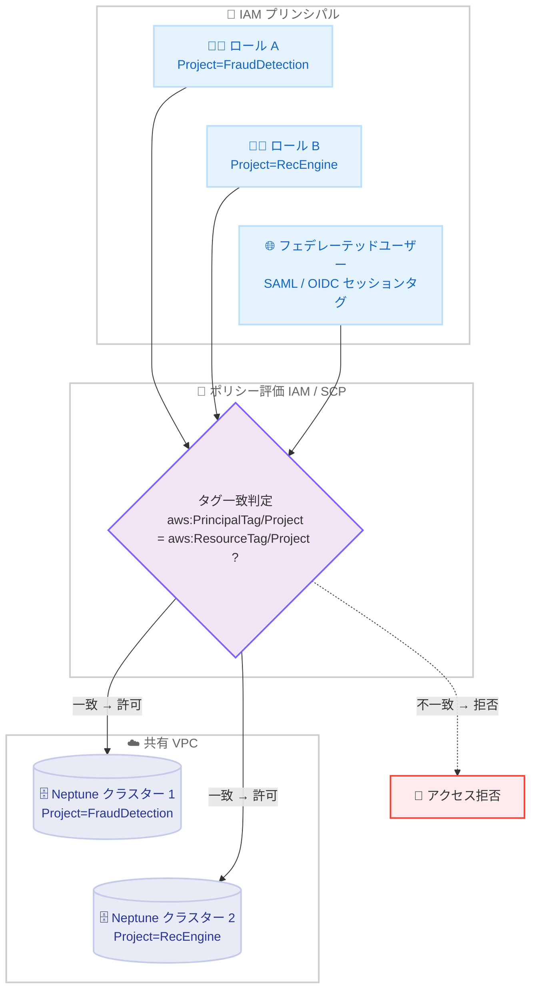

# Amazon Neptune - IAM タグベースアクセスコントロール (TBAC) サポート

**リリース日**: 2026 年 7 月 27 日
**サービス**: Amazon Neptune
**機能**: データプレーン操作に対するタグベースアクセスコントロール (TBAC)

📊 [このアップデートのインフォグラフィックを見る](https://takech9203.github.io/aws-news-summary/20260727-amazon-neptune-tbac.html)

## 概要

Amazon Neptune Database が、IAM のタグベースアクセスコントロール (TBAC) をサポートしました。AWS リソースタグと IAM プリンシパルタグを IAM ポリシーおよびサービスコントロールポリシー (SCP) の条件として使用し、Neptune のデータプレーン操作 (`neptune-db:*` アクション) へのアクセスを制御できます。

これまで Neptune は VPC 分離、TLS 暗号化、IAM 認証といった多層のセキュリティ機能を提供してきましたが、今回のアップデートにより、属性ベースの認可レイヤーが追加されました。例えば `Project=FraudDetection` タグを持つプリンシパルは、同じタグを持つクラスターのみに自動的にアクセスが制限されます。多数のクラスターを大規模に運用する組織では、ポリシーごとにクラスター ARN を列挙することなく、動的にアクセス境界を強制できます。

外部 ID プロバイダーからの SAML / OIDC セッションタグを使用したフェデレーテッド ID ワークフローにも対応しており、`neptune-db:QueryLanguage` などの既存の条件キーや詳細な権限と組み合わせた、きめ細かなアクセス制御も可能です。

**アップデート前の課題**

以前の Neptune のデータプレーンアクセス制御には、以下の課題がありました。

- クラスター単位でアクセスを制御するには、IAM ポリシーに個々のクラスター ARN を列挙する必要があり、クラスターの追加・削除のたびにポリシーの更新が必要だった
- 共有 VPC 環境では、ネットワーク的に到達可能なクラスターに対して、IAM 認証をパスしたプリンシパルが意図せず横断的にアクセスできるラテラルアクセスのリスクがあった
- プロジェクトや部門単位の分離を組織全体で一律に強制する仕組みがなく、個別のポリシー管理に依存していた

**アップデート後の改善**

今回のアップデートにより、以下が可能になりました。

- プリンシパルタグとリソースタグの一致を条件とすることで、ARN を列挙せずに動的なアクセス境界を定義できるようになった
- SCP により組織単位 (OU) やアカウント全体にガードレールとして TBAC を適用し、共有 VPC 環境でのラテラルアクセスリスクを排除できるようになった
- SAML / OIDC セッションタグを活用し、フェデレーテッドユーザーにも ID プロバイダーの属性に基づくアクセス制御を適用できるようになった
- `neptune-db:QueryLanguage` などの条件キーやアクション単位の権限と組み合わせ、「どのクラスターに」「どの操作を」「どのクエリ言語で」実行できるかを一つのポリシーで表現できるようになった

## アーキテクチャ図



IAM プリンシパルのタグと Neptune クラスターのリソースタグをポリシー評価時に比較し、一致する場合のみデータプレーン操作を許可する仕組みです。共有 VPC 内でもタグが一致しないクラスターへのアクセスは拒否されます。

## サービスアップデートの詳細

### 主要機能

1. **タグ一致によるデータプレーンアクセス制御**
   - `aws:PrincipalTag/{TagKey}` と `aws:ResourceTag/{TagKey}` の条件キー変数を `neptune-db:*` アクションに対して使用可能
   - プリンシパルタグとクラスターのリソースタグが一致する場合のみアクセスを許可する動的なポリシーを定義できる
   - クラスターに付与したタグは、データプレーンのポリシー評価のためにクラスター内の全インスタンスに伝播する

2. **SCP による組織全体のガードレール**
   - AWS Organizations の OU またはアカウントレベルで Deny ベースの SCP を適用し、タグ不一致時のアクセスを組織全体で一律に拒否できる
   - `Null` 条件を使用して、必須タグが付与されていないクラスターへのアクセスを拒否し、タグ付けの徹底を強制できる
   - 個々のアカウントの Allow ポリシーはそのまま維持でき、SCP がガードレールとして機能する

3. **フェデレーテッド ID ワークフロー対応**
   - 外部 ID プロバイダーの SAML / OIDC 属性マッピングによるセッションタグをプリンシパルタグとして評価可能
   - ID プロバイダー側の属性 (所属プロジェクト、部門など) に基づいて Neptune へのアクセスを制御できる

4. **既存のアクセス制御機能との組み合わせ**
   - `neptune-db:ReadDataViaQuery` などのアクション単位の権限と組み合わせ、タグが一致するクラスターに対する読み取り専用アクセスなどを表現できる
   - `neptune-db:QueryLanguage` 条件キーと組み合わせ、アクセス可能なクラスターと使用可能なクエリ言語 (Gremlin、openCypher、SPARQL) を同時に制限できる

## 技術仕様

### Neptune のセキュリティレイヤーと TBAC の位置付け

| レイヤー | 仕組み | 制御対象 |
|------|------|------|
| ネットワーク分離 | VPC、セキュリティグループ、VPC エンドポイント | Neptune エンドポイントに到達できるホスト |
| 暗号化 | 転送時 TLS 1.3、保管時 AWS KMS | データの機密性 |
| IAM 認証 | SigV4 署名付きリクエスト | 呼び出し元の認証 |
| アクションベース制御 | `neptune-db:` アクション | 実行可能な操作 |
| 条件キー | `neptune-db:QueryLanguage` など | ポリシーへの文脈的制約 |
| **TBAC (今回追加)** | `aws:ResourceTag` と `aws:PrincipalTag` の照合 | タグ一致に基づくアクセス先クラスターの制限 |

### 主要な条件キー

| 条件キー | 説明 |
|------|------|
| `aws:PrincipalTag/{TagKey}` | 呼び出し元プリンシパル (IAM ユーザー / ロール / フェデレーテッドセッション) のタグ値に解決される |
| `aws:ResourceTag/{TagKey}` | 対象の Neptune リソースのタグ値に解決される |

### ポリシー例: タグ不一致時の拒否 (SCP / IAM ポリシー共通パターン)

```json
{
  "Version": "2012-10-17",
  "Statement": [
    {
      "Sid": "DenyNeptuneProjectMismatch",
      "Effect": "Deny",
      "Action": "neptune-db:*",
      "Resource": "*",
      "Condition": {
        "StringNotEquals": {
          "aws:ResourceTag/Project": "${aws:PrincipalTag/Project}"
        }
      }
    },
    {
      "Sid": "DenyNeptuneMissingProjectTag",
      "Effect": "Deny",
      "Action": "neptune-db:*",
      "Resource": "*",
      "Condition": {
        "Null": {
          "aws:ResourceTag/Project": "true"
        }
      }
    }
  ]
}
```

1 つ目のステートメントは、リソースの `Project` タグとプリンシパルの `Project` タグが一致しない場合にすべてのデータプレーン操作を拒否します。2 つ目のステートメントは、`Project` タグが付与されていないクラスターへのアクセスを拒否し、タグ付けの徹底を強制します。

## 設定方法

### 前提条件

1. Neptune エンジンバージョン 1.2.0.0 以降を使用していること
2. Neptune DB クラスターで IAM 認証が有効化されていること
3. Neptune DB クラスターと IAM プリンシパルの両方に、ポリシーで評価するタグが付与されていること

### 手順

#### ステップ 1: タグ体系の定義

組織の境界を表すタグキーを設計します。一般的なパターンは以下のとおりです。

| タグキー | 用途 | 値の例 |
|------|------|------|
| Project | アプリケーション / ワークロード識別子 | FraudDetection、RecommendationEngine |
| Department | 事業部門 / コストセンター | Engineering、Finance |
| Environment | デプロイステージ | production、staging、development |

#### ステップ 2: Neptune DB クラスターへのタグ付け

```bash
aws neptune add-tags-to-resource \
  --resource-name arn:aws:rds:us-east-1:123456789012:cluster:my-neptune-cluster \
  --tags Key=Project,Value=FraudDetection Key=Department,Value=Engineering
```

`add-tags-to-resource` コマンドで Neptune DB クラスターに分類タグを付与します。付与したタグはクラスター内の全インスタンスのデータプレーンポリシー評価に反映されます。

#### ステップ 3: IAM プリンシパルへのタグ付け

```bash
aws iam tag-role \
  --role-name NeptuneAppRole \
  --tags Key=Project,Value=FraudDetection Key=Department,Value=Engineering
```

`tag-role` コマンドで、クラスターと同じキー・値のタグを IAM ロールに付与します。フェデレーテッドユーザーの場合は、ID プロバイダーの SAML / OIDC 属性マッピングでセッションタグとして渡します。

#### ステップ 4: TBAC ポリシーのデプロイ

組織全体で強制する場合は SCP として OU またはアカウントに適用し、特定のプリンシパルのみを対象とする場合は IAM ポリシーとしてアタッチします。

#### ステップ 5: タグ整合性の保護

```json
{
  "Version": "2012-10-17",
  "Statement": [
    {
      "Sid": "DenyTagModification",
      "Effect": "Deny",
      "Action": [
        "rds:AddTagsToResource",
        "rds:RemoveTagsFromResource"
      ],
      "Resource": "*",
      "Condition": {
        "ForAnyValue:StringEquals": {
          "aws:TagKeys": ["Project", "Department"]
        }
      }
    }
  ]
}
```

TBAC で使用するタグキーの変更を制限するポリシーです。プリンシパルが自身のタグやリソースタグを変更できると TBAC を迂回できてしまうため、`iam:TagRole`、`iam:TagUser`、`rds:AddTagsToResource`、`rds:RemoveTagsFromResource` の権限を SCP や権限境界で制限することが重要です。

## メリット

### ビジネス面

- **ガバナンスの強化**: SCP によりプロジェクト・部門・環境単位の分離を組織全体で一律に強制でき、コンプライアンス要件への対応が容易になる
- **運用コストの削減**: クラスターの追加・削除時にポリシーの ARN リストを更新する必要がなくなり、大規模環境でのポリシー管理負荷が大幅に軽減される
- **マルチテナント環境の安全性向上**: 共有 VPC 環境でのラテラルアクセスリスクを排除し、複数チームが同一インフラを安全に共有できる

### 技術面

- **動的なアクセス境界**: タグの付与だけで新規クラスターが自動的にアクセス制御の対象となり、スケーラブルな認可モデルを実現できる
- **フェデレーション対応**: SAML / OIDC セッションタグにより、ID プロバイダー側の属性を認可判断に直接利用できる
- **既存機能との親和性**: アクションベースの権限や `neptune-db:QueryLanguage` 条件キーと同一ポリシー内で組み合わせ可能で、既存のセキュリティモデルを置き換えずに強化できる

## デメリット・制約事項

### 制限事項

- Neptune エンジンバージョン 1.2.0.0 以降が必要
- IAM 認証が有効なクラスターでのみ機能する (IAM 認証なしの接続は TBAC ポリシーの評価対象外)
- タグはクラスターレベルの粒度で適用され、サブグラフや頂点 / エッジレベルのアクセス制御は提供されない

### 考慮すべき点

- **伝播遅延**: IAM ポリシーの変更が Neptune リソースに反映されるまで最大 10 分、クラスタータグの変更がポリシー評価に反映されるまで約 5 分かかるため、稼働中のクラスターのタグ変更は計画的に行う必要がある
- **タグの完全性**: タグを変更できるプリンシパルは TBAC を迂回できるため、タグ操作権限の保護が必須となる
- **タグ欠落時の挙動**: プリンシパルにポリシーが参照するタグがない場合、`${aws:PrincipalTag/Key}` は空文字列に解決されるため、タグ欠落を想定したポリシー設計 (Null 条件による拒否など) が必要
- **条件評価のロジック**: 同一 Condition ブロック内の複数条件キーは AND 評価となる。`StringNotEquals` の Deny は全条件が同時に真の場合のみ発動するため、いずれかのタグ不一致で拒否したい場合はタグキーごとに別ステートメントに分ける必要がある

## ユースケース

### ユースケース 1: 共有 VPC でのプロジェクト間分離

**シナリオ**: 複数のプロジェクトチームが同一の共有 VPC 内でそれぞれの Neptune クラスターを運用しており、ネットワーク的には相互に到達可能な状態にある。プロジェクト間の誤アクセスや不正アクセスを防止したい。

**実装例**:
```json
{
  "Effect": "Deny",
  "Action": "neptune-db:*",
  "Resource": "*",
  "Condition": {
    "StringNotEquals": {
      "aws:ResourceTag/Project": "${aws:PrincipalTag/Project}"
    }
  }
}
```

**効果**: `Project=FraudDetection` タグを持つプリンシパルは同じタグを持つクラスターのみにアクセスでき、他プロジェクトのクラスターへのラテラルアクセスが排除される。

### ユースケース 2: SCP による組織全体のガードレール

**シナリオ**: 数十のアカウントに数百の Neptune クラスターが存在する大規模組織で、部門単位のデータ分離を組織ポリシーとして一律に強制したい。個々のアカウントの IAM ポリシー管理には依存したくない。

**実装例**:
```bash
# OU レベルに Deny ベースの SCP を適用
aws organizations attach-policy \
  --policy-id p-neptunetbac123 \
  --target-id ou-root-analytics
```

**効果**: 各アカウントの Allow ポリシーを変更することなく、タグ不一致およびタグ未付与のクラスターへのアクセスが組織全体で拒否され、ガバナンスが一元化される。

### ユースケース 3: フェデレーテッドユーザーへの属性ベース認可

**シナリオ**: 社内の ID プロバイダー (SAML / OIDC) で認証したデータサイエンティストに、所属プロジェクトの属性に応じて Neptune クラスターへの読み取り専用アクセスを付与したい。

**実装例**:
```json
{
  "Effect": "Allow",
  "Action": [
    "neptune-db:ReadDataViaQuery",
    "neptune-db:GetQueryStatus"
  ],
  "Resource": "arn:aws:neptune-db:*:*:*/*",
  "Condition": {
    "StringEquals": {
      "aws:ResourceTag/Project": "${aws:PrincipalTag/Project}",
      "neptune-db:QueryLanguage": "OpenCypher"
    }
  }
}
```

**効果**: ID プロバイダーのセッションタグに基づき、所属プロジェクトのクラスターに対して openCypher による読み取りクエリのみが許可され、ユーザーごとの個別ポリシー管理が不要になる。

## 料金

TBAC は IAM / SCP のポリシー評価機能であり、追加料金なしで利用できます。Neptune 自体の料金 (インスタンス、ストレージ、I/O など) は通常どおり発生します。

## 利用可能リージョン

Amazon Neptune が利用可能なすべての AWS リージョンで提供されています。

## 関連サービス・機能

- **AWS IAM**: プリンシパルタグの付与とアイデンティティポリシーによる TBAC の実装基盤
- **AWS Organizations (SCP)**: OU / アカウントレベルでの組織全体のガードレール適用
- **AWS IAM Identity Center / 外部 IdP**: SAML / OIDC セッションタグによるフェデレーテッド ID ワークフローの実現
- **Amazon RDS API**: Neptune クラスターへのタグ付け (`AddTagsToResource`) は RDS API を使用

## 参考リンク

- 📊 [インフォグラフィック](https://takech9203.github.io/aws-news-summary/20260727-amazon-neptune-tbac.html)
- [公式発表 (What's New)](https://aws.amazon.com/about-aws/whats-new/2026/07/amazon-neptune-tbac/)
- [ドキュメント: Tag-based access control for Amazon Neptune data-plane operations](https://docs.aws.amazon.com/neptune/latest/userguide/iam-data-tbac.html)
- [Amazon Neptune 製品ページ](https://aws.amazon.com/neptune/)
- [料金ページ](https://aws.amazon.com/neptune/pricing/)

## まとめ

Amazon Neptune の TBAC サポートにより、クラスター ARN の列挙に頼らない属性ベースのデータプレーンアクセス制御が可能になり、大規模・マルチテナント環境でのガバナンスが大幅に強化されました。多数の Neptune クラスターを運用している場合は、タグ体系を整備した上で SCP によるガードレールの導入を検討することを推奨します。導入時は IAM 認証の有効化とタグ操作権限の保護、タグ変更の伝播遅延に注意してください。
