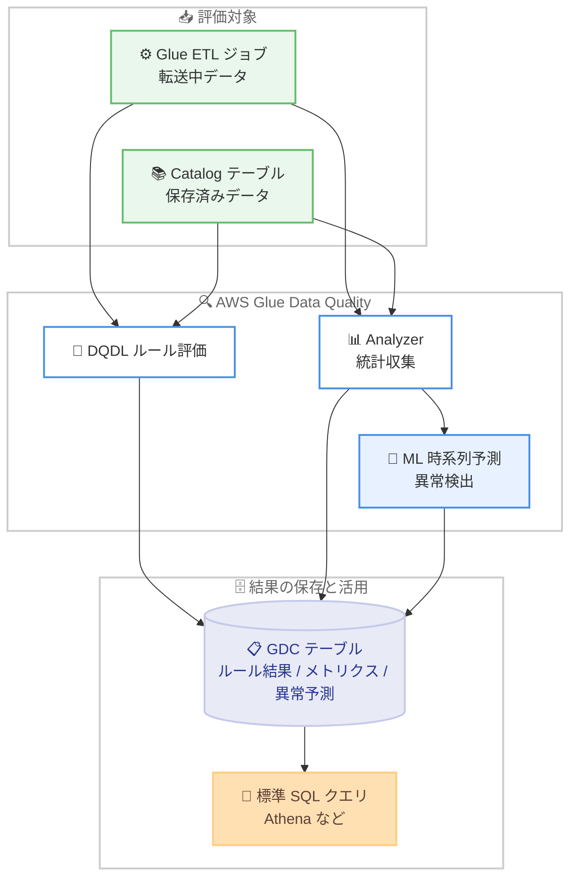

# AWS Glue Data Quality - Catalog ベース評価での異常検出と Data Catalog への結果書き込みサポート

**リリース日**: 2026 年 7 月 27 日
**サービス**: AWS Glue (AWS Glue Data Quality)
**機能**: Catalog ベースのデータ品質評価での異常検出、および評価結果の AWS Glue Data Catalog テーブルへの書き込み

📊 [このアップデートのインフォグラフィックを見る](https://takech9203.github.io/aws-news-summary/20260727-aws-glue-data-quality-catalog-anomaly-detection-write-results.html)

## 概要

AWS Glue Data Quality が、Catalog ベースのデータ品質評価における異常検出 (Anomaly Detection) と、評価結果の AWS Glue Data Catalog (GDC) テーブルへの書き込みをサポートしました。これらの機能は AWS Glue ETL ジョブと Catalog 評価の両方で動作し、ワークフローの種類にかかわらず一貫したデータ品質管理体験を提供します。

異常検出は ML ベースの時系列予測を利用し、distinct 値の急減や行数のスパイクといったデータ統計の予期しない変化を、明示的なしきい値ルールを定義することなく検出します。数百の Catalog テーブルを監視するデータエンジニアにとって、問題が自動的に検出されるため、運用負荷を大幅に削減できます。

また、ルール評価結果、プロファイリングメトリクス、信頼区間付きの異常予測を GDC テーブルに書き戻せるようになり、評価がどこで実行されたかにかかわらず、データ品質評価の履歴を標準 SQL でいつでもクエリできる監査証跡として蓄積できます。

**アップデート前の課題**

- Catalog ベースの評価では異常検出が利用できず、データドリフトや不規則性を検出するには固定しきい値のルールを手動で作成・保守する必要があった
- ビジネス環境の変化によりデータの特性が変わると、固定しきい値のルールが陳腐化し、品質問題を見逃すリスクがあった
- 評価結果を SQL でクエリ可能な形で一元的に蓄積する標準的な仕組みがなく、結果の長期分析や監査に手間がかかった

**アップデート後の改善**

- Catalog ベースの評価でも ML ベースの時系列予測による異常検出が利用可能になり、しきい値ルールなしで統計変化 (distinct 値の急減、行数スパイクなど) を検出できるようになった
- ルール結果、プロファイリングメトリクス、信頼区間付きの異常予測を GDC テーブルへ書き込めるようになり、標準 SQL でクエリ可能な品質評価履歴を構築できるようになった
- ETL ジョブと Catalog 評価の両方で同じ機能が動作し、ワークフローの種類を問わず一貫したデータ品質体験が得られるようになった

## アーキテクチャ図



ETL ジョブと Catalog テーブルの両方の評価で、ルール結果・統計・ML 異常予測が GDC テーブルへ書き込まれ、標準 SQL でクエリ可能な品質履歴が構築されるフローを示しています。

## サービスアップデートの詳細

### 主要機能

1. **Catalog ベース評価での異常検出**
   - Data Catalog に登録されたテーブルに対する評価実行で異常検出を有効化できる (`ObservationScope: ALL` を指定)
   - ML アルゴリズムが過去の統計トレンドから将来値を予測し、実際の値が予測範囲 (上限・下限) を外れた場合に Anomaly Observation を生成する
   - 平日と週末の違いなど、季節性パターンを自動的に学習し、パターンからの逸脱を検出する (特別な設定は不要)
   - 将来同様の問題を検出するためのデータ品質ルールも推奨される

2. **評価結果の GDC テーブルへの書き込み**
   - ルール評価結果、プロファイリングメトリクス、信頼区間付きの異常予測を GDC テーブルに書き戻せる
   - 評価が ETL ジョブと Catalog 評価のどちらで実行されたかにかかわらず、クエリ可能な履歴として一元的に蓄積される
   - 標準 SQL でいつでもアクセスでき、監査やトレンド分析に活用できる

3. **Analyzer による統計収集**
   - ルールを明示的に定義しなくても、Analyzer (`RowCount`、`DistinctValuesCount`、`AllStatistics` など) で重要カラムの統計を収集できる
   - 収集された統計 (データプロファイル) は AWS Glue サービス内に時系列で保存され、異常検出の入力となる
   - 同じカラムに Rule と Analyzer の両方がある場合でも統計収集は 1 回のみで、効率的に処理される

## 技術仕様

### 異常検出の仕様

| 項目 | 詳細 |
|------|------|
| 検出方式 | ML ベースの時系列予測 (過去トレンドから上限・下限を導出) |
| 必要データポイント | 最低 3 つの統計データポイント |
| 季節性 | 自動学習 (曜日パターンなどを考慮、追加設定不要) |
| 異常検出時のスコア | 異常が生成されてもデータ品質スコアには影響しない |
| モデルの再学習 | 検出された異常は次回以降「正常」として学習されるため、異常の承認・除外によるフィードバックが重要 |
| 統計の保存 | アカウントあたり 100,000 統計まで、最大 2 年間保存 (保存自体は無料)、AWS KMS キーによる暗号化に対応 |

### API 変更履歴

| 日付 | サービス | 変更内容 |
|------|----------|----------|
| 2026/07/27 | [AWS Glue](https://awsapichanges.com/archive/changes/1ea078-glue.html) | 1 new 8 updated api methods - `BatchGetDataQualityRulesetEvaluationRun` API の追加 (複数の評価実行を一括取得)、異常検出用の `ObservationScope` / `ObservationMode` パラメータ、評価結果の Data Catalog テーブルへの書き込み、レコメンデーション実行のカスタムロググループパスのサポート |

### DQDL によるルールと Analyzer の設定例

```
Rules = [
    IsComplete "passenger_count",
    RowCount > 1000
]

Analyzers = [
    AllStatistics "fare_amount",
    DistinctValuesCount "pulocationid",
    RowCount
]
```

Rules はデータへの期待を明示的に定義し、Analyzers はルールを定義せずに統計のみを収集します。収集された統計が ML 異常検出の入力になります。

## 設定方法

### 前提条件

1. AWS Glue Data Catalog にテーブルが登録されていること
2. データ品質評価を実行する IAM ロールに必要な権限 (Glue、S3、対象データソースへのアクセス) が付与されていること
3. 異常検出には最低 3 回分の統計データポイントが必要 (評価を複数回実行して蓄積する)

### 手順

#### ステップ 1: ルールセットの作成

```bash
aws glue create-data-quality-ruleset \
  --name my-table-ruleset \
  --target-table '{"TableName": "my_table", "DatabaseName": "my_database"}' \
  --ruleset 'Rules = [ IsComplete "order_id", RowCount > 1000 ] Analyzers = [ RowCount, DistinctValuesCount "customer_id" ]'
```

Data Catalog テーブルを対象とするデータ品質ルールセットを作成します。Rules で明示的な検証を、Analyzers で異常検出用の統計収集を定義しています。

#### ステップ 2: 異常検出を有効にした評価実行の開始

```bash
aws glue start-data-quality-ruleset-evaluation-run \
  --data-source '{"GlueTable": {"TableName": "my_table", "DatabaseName": "my_database"}}' \
  --role arn:aws:iam::123456789012:role/GlueDataQualityRole \
  --ruleset-names my-table-ruleset \
  --additional-run-options '{"ObservationScope": "ALL"}'
```

Catalog テーブルに対する評価実行を開始します。`ObservationScope` を `ALL` に設定することで、Catalog ベース評価での異常検出が有効になります。

#### ステップ 3: 結果の確認と SQL でのクエリ

```bash
aws glue batch-get-data-quality-rulesets-evaluation-runs \
  --run-ids run-abc123 run-def456
```

新しい `BatchGetDataQualityRulesetEvaluationRun` API により、複数の評価実行結果を一括取得できます。GDC テーブルへの書き込みを構成している場合は、Amazon Athena などから標準 SQL で評価履歴 (ルール結果、メトリクス、信頼区間付き異常予測) をクエリできます。

#### ステップ 4: 異常へのフィードバック

検出された異常を確認し、AWS Glue Studio または API で承認・除外のフィードバックを行います。異常値は明示的に除外しない限り次回以降のモデル学習に「正常値」として取り込まれるため、精度維持にはフィードバックが重要です。

## メリット

### ビジネス面

- **品質問題の早期検出**: 固定しきい値では見逃しがちなデータドリフトやパイプライン障害による統計変化を自動検出し、誤った意思決定のリスクを低減できる
- **運用コスト削減**: 数百のテーブルに対するしきい値ルールの手動作成・保守が不要になり、データエンジニアの工数を削減できる
- **監査対応の強化**: SQL でクエリ可能な品質評価履歴が GDC テーブルに蓄積され、コンプライアンスや監査の証跡として活用できる

### 技術面

- **一貫した品質管理体験**: ETL ジョブ (転送中データ) と Catalog 評価 (保存済みデータ) の両方で同じ異常検出・結果書き込み機能が動作する
- **季節性の自動学習**: 曜日や時期による変動パターンを ML が自動学習するため、複雑なルール設計が不要
- **標準 SQL による分析**: 評価結果が GDC テーブルに格納されるため、Athena などの既存の SQL ツールでトレンド分析やダッシュボード構築が容易

## デメリット・制約事項

### 制限事項

- 異常検出には最低 3 つのデータポイント (評価実行の履歴) が必要で、初回から利用できるわけではない
- 統計の保存はアカウントあたり 100,000 統計まで、保存期間は最大 2 年間
- 検出された異常は明示的に除外しない限り次回以降「正常」としてモデルに取り込まれるため、フィードバック運用が必要

### 考慮すべき点

- 異常検出は統計ごとに 1 DPU で検出所要時間に応じて課金されるため、監視対象の統計数が多い場合はコストを見積もる必要がある
- 異常が検出されてもデータ品質スコアには影響しないため、アラート連携 (EventBridge など) を別途設計する必要がある
- モデルの精度維持には異常の承認・除外によるフィードバックの運用プロセスを確立することが望ましい

## ユースケース

### ユースケース 1: 数百の Catalog テーブルの自動品質監視

**シナリオ**: データレイクに数百のテーブルを持つ企業で、すべてのテーブルにしきい値ルールを定義・保守するのが困難。ETL パイプラインの障害によるデータ欠損を早期に検出したい。

**実装例**:
```
Analyzers = [
    RowCount,
    DistinctValuesCount "customer_id",
    Completeness "order_date"
]
```
Catalog 評価を `ObservationScope: ALL` でスケジュール実行し、統計を蓄積する。

**効果**: しきい値ルールを書かずに行数の急減や distinct 値の異常を自動検出でき、パイプライン障害によるサイレントなデータ欠損を早期に発見できる。

### ユースケース 2: 品質評価履歴の SQL 分析とダッシュボード化

**シナリオ**: データガバナンスチームが、組織全体のデータ品質のトレンドを可視化し、品質スコアの推移を経営層へレポートしたい。

**実装例**:
```sql
SELECT table_name, evaluation_date, rule_name, outcome, metric_value
FROM data_quality_results
WHERE evaluation_date >= date_add('day', -30, current_date)
ORDER BY evaluation_date DESC;
```
GDC テーブルに書き込まれた評価結果を Athena でクエリし、BI ツールでダッシュボード化する。

**効果**: ETL ジョブと Catalog 評価の結果が一元的に SQL でクエリでき、組織横断の品質トレンド分析と監査証跡の整備が容易になる。

### ユースケース 3: 季節性のある業務データの品質監視

**シナリオ**: 小売業で、売上データが週末や繁忙期に増加する季節性を持つ。固定しきい値では季節変動を異常と誤検出したり、実際の障害を見逃したりしていた。

**実装例**:
```
Analyzers = [
    RowCount,
    Sum "sales_amount"
]
```
異常検出を有効にして評価を継続実行し、季節性パターンを学習させる。

**効果**: ML が曜日・季節パターンを自動学習し、パターンからの逸脱のみを異常として検出するため、誤検出を減らしつつ実際の品質問題を確実に捉えられる。

## 料金

AWS Glue Data Quality は DPU 時間ベースの課金です。異常検出は統計ごとに 1 DPU が割り当てられ、検出に要した時間に応じて課金されます。統計の保存自体には料金はかかりません (アカウントあたり 100,000 統計、最大 2 年間保存)。

詳細は [AWS Glue の料金ページ](https://aws.amazon.com/glue/pricing/)を参照してください。

## 利用可能リージョン

すべての AWS 商用リージョンおよび AWS GovCloud (US) リージョンで利用可能です。

## 関連サービス・機能

- **AWS Glue Data Catalog**: 評価結果の書き込み先となるメタデータリポジトリ。品質履歴をテーブルとして管理できる
- **Amazon Athena**: GDC テーブルに書き込まれた評価結果を標準 SQL でクエリし、品質トレンドを分析できる
- **Amazon EventBridge / Amazon CloudWatch**: データ品質評価結果や異常検出をトリガーとしたアラート・自動対応の構築に利用できる
- **AWS Glue Studio**: 異常の可視化 (実測値、トレンド、上限・下限) と異常へのフィードバック操作を GUI で実行できる

## 参考リンク

- 📊 [インフォグラフィック](https://takech9203.github.io/aws-news-summary/20260727-aws-glue-data-quality-catalog-anomaly-detection-write-results.html)
- [公式発表 (What's New)](https://aws.amazon.com/about-aws/whats-new/2026/07/aws-glue-data-quality-catalog-anomaly-detection-write-results)
- [ドキュメント: AWS Glue Data Quality](https://docs.aws.amazon.com/glue/latest/dg/data-quality.html)
- [ドキュメント: Anomaly detection in AWS Glue Data Quality](https://docs.aws.amazon.com/glue/latest/dg/data-quality-anomaly-detection.html)
- [API 変更詳細 (awsapichanges.com)](https://awsapichanges.com/archive/changes/1ea078-glue.html)
- [料金ページ](https://aws.amazon.com/glue/pricing/)

## まとめ

今回のアップデートにより、AWS Glue Data Quality の異常検出が Catalog ベース評価でも利用可能になり、評価結果を GDC テーブルへ書き込んで標準 SQL でクエリできるようになりました。しきい値ルールの保守負荷を減らしつつ、データドリフトや障害による統計変化を自動検出できるため、多数のテーブルを監視するデータ基盤では Analyzer と `ObservationScope: ALL` を用いた評価のスケジュール実行を検討することを推奨します。
