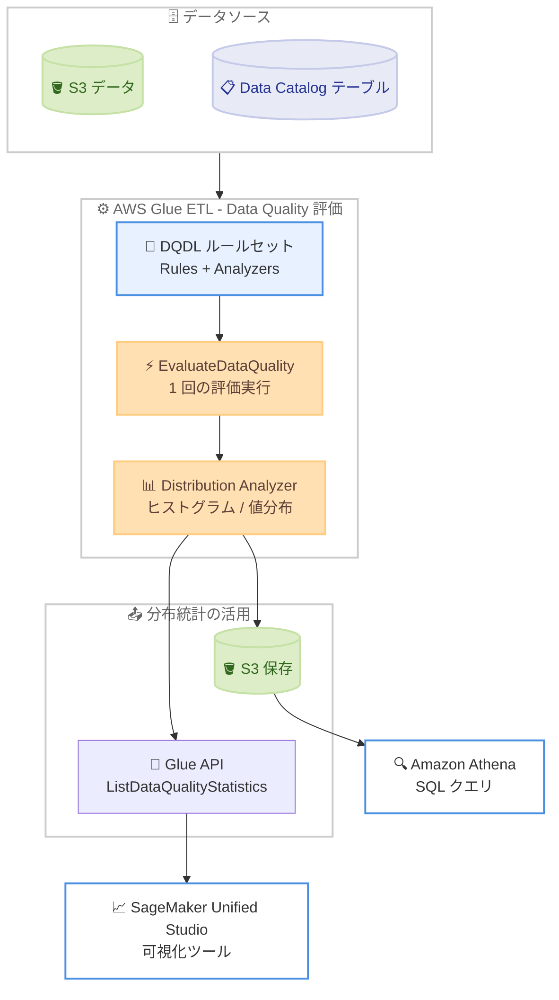

# AWS Glue Data Quality - Distribution Analyzer による分布統計データプロファイリング

**リリース日**: 2026 年 7 月 27 日
**サービス**: AWS Glue (AWS Glue Data Quality)
**機能**: Distribution Analyzer による分布統計 (Distribution Statistics) のデータプロファイリング

📊 [このアップデートのインフォグラフィックを見る](https://takech9203.github.io/aws-news-summary/20260727-aws-glue-data-quality-distribution-profiling.html)

## 概要

AWS Glue Data Quality が新しい Distribution Analyzer をサポートし、データセットの頻度分布プロファイルを生成できるようになりました。Data Quality Definition Language (DQDL) の `Analyzers` ブロックに `Distribution` アナライザーを記述するだけで、数値カラムに対してはヒストグラム (等幅ビンによる度数分布)、カテゴリカル / 日付 / ブールカラムに対しては値の頻度分布を自動生成します。カスタムビン数の指定にも対応しており、ユースケースに応じた粒度でデータの形状を把握できます。

この機能により、歪度 (スキュー)、外れ値、予期しないパターンをカスタムコードなしで特定できます。既存の DQDL ルールセットと統合されているため、1 回の評価実行で分布プロファイリングと品質チェックの両方を実行できます。生成された分布統計は Amazon S3 に保存され Amazon Athena でクエリでき、API 経由での取得や SageMaker Unified Studio などの可視化ツールとの統合も可能です。

データエンジニアやデータ品質管理者にとって、データの分布変化 (データドリフト) を継続的にモニタリングする基盤が、追加の開発なしで手に入るアップデートです。

**アップデート前の課題**

このアップデート以前は、データの分布を把握するために追加の開発や運用が必要でした。

- Glue Data Quality の統計は Mean、Sum、StandardDeviation などのスカラー値が中心で、データの「形状」(分布) を直接プロファイリングできなかった
- ヒストグラムや値の頻度分布を得るには、Spark や Pandas でカスタムコードを実装し、別途ジョブとして運用する必要があった
- 歪度や外れ値、カテゴリ値の偏りといったパターンの検出に、品質チェックとは別の仕組みが必要だった
- 実行ごとにビン境界が変わると時系列での分布比較が困難だった

**アップデート後の改善**

今回のアップデートにより、以下が可能になりました。

- DQDL の `Analyzers` ブロックに 1 行追加するだけで、数値カラムのヒストグラムとカテゴリカル / 日付 / ブールカラムの値分布を生成できる
- `bins` パラメータでカスタムビン数 (最大 20) を指定し、ユースケースに合った粒度で分布を確認できる
- 既存の DQDL ルールセットに統合されるため、1 回の評価実行で品質チェックと分布プロファイリングを同時に実行できる
- 分布統計は S3 に保存され Athena でクエリ可能なほか、`ListDataQualityStatistics` / `GetDataQualityResult` API でも取得できる
- ビン境界の固定 (frozen edges) と自動リビニングにより、実行間で一貫性のある分布比較とデータレンジ変化への自動追従を両立できる

## アーキテクチャ図



DQDL ルールセット内の Distribution Analyzer が品質チェックと同じ評価実行の中で分布統計を生成し、結果を S3 と API 経由で Athena や可視化ツールに連携するフローを示しています。

## サービスアップデートの詳細

### 主要機能

1. **数値カラムのヒストグラム生成**
   - カラムの値レンジを等幅の区間 (ビン) に分割し、各ビンに含まれる値の件数をカウント
   - `bins` パラメータでビン数を指定可能 (デフォルト 20、最大 20)
   - 歪度や外れ値、値レンジのシフトをカスタムコードなしで検出可能

2. **カテゴリカル / 日付 / ブールカラムの値分布生成**
   - 各ディスティンクト値の出現頻度をカウントし、頻度の降順でソート
   - 上位 20 件の最頻値を返却
   - カテゴリ値の偏りや予期しない値の混入を把握可能

3. **既存 DQDL ルールセットとの統合**
   - `Rules` ブロックの品質チェックと `Analyzers` ブロックの分布プロファイリングを 1 回の評価実行で処理
   - `Distribution AllColumns` を指定すると、データセットの全カラムの分布を一括生成
   - NULL 値は分布計算から除外される

4. **ビン境界の固定 (Frozen Edges) と自動リビニング**
   - 初回実行時にビン境界を計算し、以降の実行では同じ境界を再利用することで、実行間の分布比較を可能に
   - 固定ビン範囲外の値は先頭 / 末尾のオーバーフロービンにカウントされ、オーバーフローが 2% を超えると情報レベル、5% を超えるとより強い Observation を生成
   - 5% 超のオーバーフローが 3 回連続すると、現在のデータレンジに基づいてビン境界を自動再計算 (`rebin = false` でオプトアウト可能)

5. **分布統計の保存と活用**
   - 分布統計は Amazon S3 に保存され、Amazon Athena でクエリ可能
   - `ListDataQualityStatistics` API や `GetDataQualityResult` API 経由でも取得可能
   - SageMaker Unified Studio などの可視化ツールやモニタリングワークフローと統合可能

## 技術仕様

### Distribution Analyzer の仕様

| 項目 | 詳細 |
|------|------|
| 記述場所 | DQDL ルールセットの `Analyzers` ブロックのみ (ルールとしては使用不可) |
| 対象カラム型 | 全カラム型 (数値、文字列、日付、ブールなど) |
| 数値カラムの出力 | 等幅ビンによるヒストグラム |
| 非数値カラムの出力 | 頻度降順の値分布 (上位 20 件) |
| `bins` パラメータ | ビン数を指定 (デフォルト 20、最大 20、非数値カラムには影響なし) |
| `rebin` パラメータ | 自動リビニングの有効 / 無効 (デフォルト `true`) |
| NULL 値の扱い | 分布計算から除外 |
| 出力形式 | `DistributionValue` オブジェクト (`BinEdges`、`Count`、`DataType`) |
| 結果取得 API | `ListDataQualityStatistics`、`GetDataQualityResult` |

### DQDL 構文

```
Distribution <COL_NAME>
Distribution <COL_NAME> with bins = <BIN_COUNT>
Distribution <COL_NAME> with bins = <BIN_COUNT>, rebin = <true|false>
Distribution AllColumns
```

### API変更履歴

| 日付 | サービス | 変更内容 |
|------|----------|----------|
| 2026/07/27 | [AWS Glue](https://awsapichanges.com/archive/changes/1ea078-glue.html) | 1 new 8 updated api methods - `BatchGetDataQualityRulesetEvaluationRun` API の追加、異常検知向け `ObservationScope` / `ObservationMode` パラメータ、評価結果の Data Catalog テーブルへの書き込み、レコメンデーション実行のカスタムロググループパスのサポート |

### ルールセットの記述例

```
Rules = [
    RowCount > 100,
    Completeness "Salary" > 0.9
]
Analyzers = [
    Mean "Salary",
    StandardDeviation "Salary",
    Distribution "Salary" with bins = 15,
    Distribution "Department"
]
```

品質チェック (Rules) と分布プロファイリング (Analyzers) を同一のルールセットに記述し、1 回の評価実行で処理する例です。

## 設定方法

### 前提条件

1. AWS Glue ETL ジョブで Data Quality 評価 (`EvaluateDataQuality` 変換) を使用していること (Analyzers は AWS Glue Data Catalog ベースの Data Quality では未サポート)
2. Glue ジョブの IAM ロールに、対象データソースおよび結果保存先 S3 バケットへのアクセス権限があること
3. Athena で統計をクエリする場合は、結果保存先 S3 に対する Athena のアクセス権限があること

### 手順

#### ステップ1: DQDL ルールセットに Distribution Analyzer を追加

```
Rules = [
    RowCount > 0
]
Analyzers = [
    Distribution "Salary" with bins = 10,
    Distribution "Department"
]
```

Glue Studio のビジュアルエディタまたはスクリプト内の `EvaluateDataQuality` 変換で、`Analyzers` ブロックに `Distribution` アナライザーを追加します。数値カラム `Salary` は 10 ビンのヒストグラム、文字列カラム `Department` は値の頻度分布としてプロファイリングされます。

#### ステップ2: Glue ジョブを実行して分布統計を生成

```bash
aws glue start-job-run --job-name my-dq-job
```

Data Quality 評価を含む Glue ジョブを実行します。品質チェックと分布プロファイリングが 1 回の評価実行で処理され、分布統計が生成されます。

#### ステップ3: 分布統計を取得・確認

```bash
aws glue list-data-quality-statistics \
  --profile-id <profile-id>
```

`ListDataQualityStatistics` API で `Distribution` 統計 (`BinEdges`、`Count`、`DataType` を含む `DistributionValue` オブジェクト) を取得します。S3 に保存された統計は Athena でクエリしたり、SageMaker Unified Studio などの可視化ツールで分析したりできます。

## メリット

### ビジネス面

- **データ品質問題の早期発見**: 分布の歪みや外れ値、予期しないパターンを可視化することで、下流の分析や ML モデルに影響が及ぶ前に問題を検出できる
- **開発・運用コストの削減**: 分布プロファイリング用のカスタムコードや別ジョブが不要になり、既存の品質評価パイプラインに統合できる
- **データへの信頼性向上**: 品質チェックの合否だけでなく「データがどのような形をしているか」を継続的に把握でき、データドリブンな意思決定を支える

### 技術面

- **1 回の評価で完結**: 既存の DQDL ルールセットに Analyzer を追加するだけで、品質チェックと分布プロファイリングを同一実行で処理できる
- **実行間で比較可能な統計**: frozen edges によりビン境界が固定されるため、時系列での分布比較やデータドリフト検出が意味を持つ
- **自動リビニングによる運用レス**: データレンジが恒常的に変化した場合は自動でビン境界を再計算し、一時的な変動ではビンを安定的に維持する
- **エコシステムとの統合**: S3 + Athena によるクエリ、API による取得、SageMaker Unified Studio などの可視化ツールとの連携が可能

## デメリット・制約事項

### 制限事項

- Analyzers は AWS Glue ETL でのみサポートされ、AWS Glue Data Catalog ベースの Data Quality では使用できない
- `Distribution` は `Analyzers` ブロック専用であり、条件を評価するルールとしては使用できない (合否判定やジョブ停止アクションは設定不可)
- 数値カラムのビン数は最大 20
- 非数値カラムの値分布は上位 20 件の最頻値のみ返却される
- NULL 値は分布計算から除外される

### 考慮すべき点

- frozen edges により初回実行時のデータレンジがビン境界の基準となるため、初回実行時のデータが代表的なレンジを持つことを確認する
- データレンジが恒常的に変化するデータセットでは、自動リビニング (デフォルト有効) の挙動を理解した上で、`rebin = false` の要否を判断する
- オーバーフロービンへの集中 (2% 超 / 5% 超) で Observation が生成されるため、モニタリングワークフローでこれらの通知を活用する設計が望ましい
- 分布統計の S3 保存と Athena クエリには、それぞれ S3 ストレージ料金と Athena スキャン料金が発生する

## ユースケース

### ユースケース1: 給与データの歪度・外れ値検出

**シナリオ**: 人事データレイクの給与カラムに、桁誤りなどの異常値が混入していないかを継続的に監視したい。

**実装例**:
```
Rules = [
    Completeness "Salary" > 0.95
]
Analyzers = [
    Distribution "Salary" with bins = 20
]
```

**効果**: ヒストグラムにより給与分布の形状を毎回の評価で記録し、末尾ビンへの異常な集中や分布の歪みからデータ入力ミスや上流システムの不具合を早期に検出できる。

### ユースケース2: カテゴリカラムのデータドリフト監視

**シナリオ**: EC サイトの注文データで、注文ステータスや地域コードなどのカテゴリ値の構成比が想定外に変化していないかを監視したい。

**実装例**:
```
Rules = [
    RowCount > avg(last(3))
]
Analyzers = [
    Distribution "order_status",
    Distribution "region_code"
]
```

**効果**: 値の頻度分布 (上位 20 件) を実行ごとに記録し、Athena で時系列比較することで、新しいステータス値の出現や地域構成比の急変といったデータドリフトを検出できる。

### ユースケース3: ML 特徴量の分布プロファイリングと可視化

**シナリオ**: SageMaker で学習する ML モデルの特徴量について、学習データの分布を定期的にプロファイリングし、モデル再学習の判断材料にしたい。

**実装例**:
```
Rules = [
    RowCount > 0
]
Analyzers = [
    Distribution AllColumns
]
```

**効果**: 全カラムの分布統計を 1 回の評価で一括生成し、S3 に保存された統計を SageMaker Unified Studio で可視化することで、特徴量の分布シフトを踏まえた再学習タイミングの判断ができる。

## 料金

Distribution Analyzer 自体の追加料金はアナウンスされていません。AWS Glue Data Quality の評価は Glue ジョブ (ETL) の一部として実行されるため、既存の AWS Glue の料金体系 (DPU 時間ベースの課金) が適用されます。

なお、分布統計の保存先である Amazon S3 のストレージ料金、および Athena でクエリする場合のスキャン料金が別途発生します。詳細は [AWS Glue の料金ページ](https://aws.amazon.com/glue/pricing/) を参照してください。

## 利用可能リージョン

すべての AWS 商用リージョンおよび AWS GovCloud (US) リージョンで利用可能です。

## 関連サービス・機能

- **AWS Glue Data Quality (DQDL)**: 本機能の基盤となるルール定義言語。Rules と Analyzers を組み合わせて品質チェックと統計生成を宣言的に記述できる
- **Amazon Athena**: S3 に保存された分布統計を SQL でクエリし、時系列での分布比較やレポーティングに活用できる
- **Amazon SageMaker Unified Studio**: 分布統計を可視化ツールで分析し、データエンジニアリングと ML ワークフローを横断して活用できる
- **Amazon S3**: 分布統計の保存先。ライフサイクルポリシーによる統計データの保持期間管理にも活用できる

## 参考リンク

- 📊 [インフォグラフィック](https://takech9203.github.io/aws-news-summary/20260727-aws-glue-data-quality-distribution-profiling.html)
- [公式発表 (What's New)](https://aws.amazon.com/about-aws/whats-new/2026/07/aws-glue-data-quality-distribution-profiling)
- [ドキュメント: DQDL Analyzers (Distribution Analyzer)](https://docs.aws.amazon.com/glue/latest/dg/dqdl.html#dqdl-analyzers)
- [ドキュメント: Distribution ルールタイプリファレンス](https://docs.aws.amazon.com/glue/latest/dg/dqdl-rule-types-Distribution.html)
- [ドキュメント: AWS Glue Data Quality](https://docs.aws.amazon.com/glue/latest/dg/glue-data-quality.html)
- [料金ページ](https://aws.amazon.com/glue/pricing/)

## まとめ

AWS Glue Data Quality の Distribution Analyzer により、DQDL ルールセットに 1 行追加するだけで、数値カラムのヒストグラムとカテゴリカルカラムの値分布をカスタムコードなしで生成できるようになりました。frozen edges と自動リビニングにより実行間で比較可能な統計が得られるため、データドリフト検出や ML 特徴量の監視に特に有効です。既存の Glue Data Quality 評価を運用しているチームは、まず主要な数値・カテゴリカラムに `Distribution` アナライザーを追加し、Athena や SageMaker Unified Studio での分布モニタリングを試すことを推奨します。
