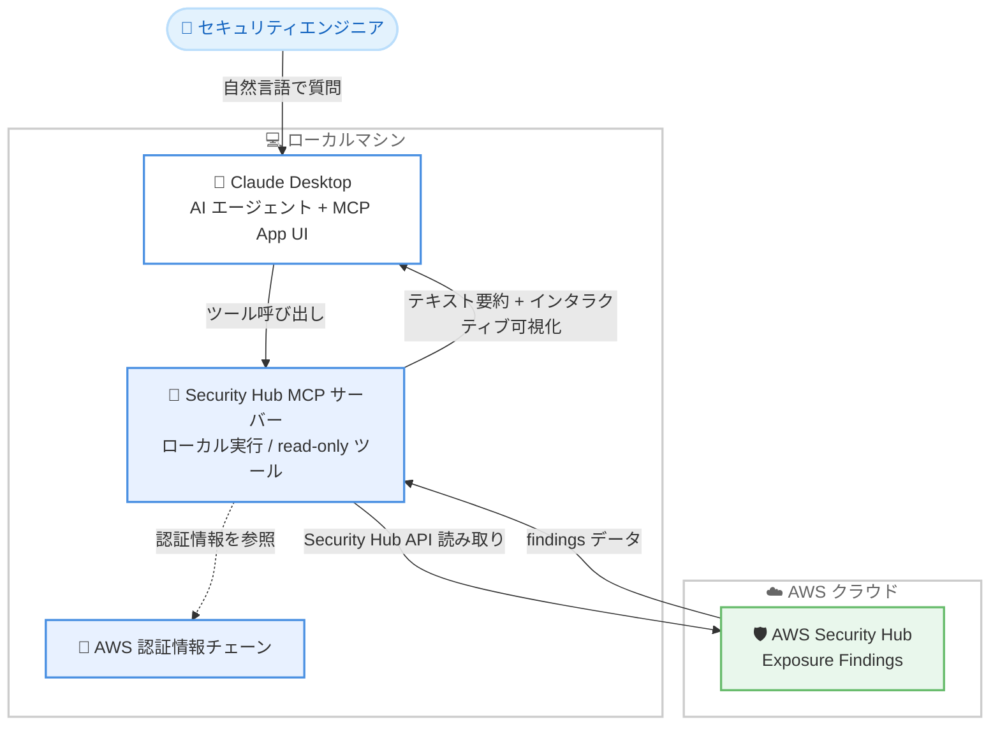

# AWS Security Hub - MCP App (プレビュー)

**リリース日**: 2026 年 7 月 27 日
**サービス**: AWS Security Hub
**機能**: AWS Security Hub MCP App (Preview)

📊 [このアップデートのインフォグラフィックを見る](https://takech9203.github.io/aws-news-summary/20260727-aws-security-hub-mcp-app.html)

## 概要

AWS は、AWS Security Hub の exposure findings (露出検出結果) を Claude Desktop に直接取り込める「AWS Security Hub MCP App」のプレビューを発表しました。MCP App はユーザーのマシン上でローカルに動作する Model Context Protocol (MCP) サーバーで、既存の AWS 認証情報を使用して Security Hub の API を直接呼び出します。これにより、AI エージェントとの対話の中で自然言語によるセキュリティ態勢の調査が可能になります。

自然言語での質問により、トップ exposure findings の一覧表示、attack path (攻撃パス) や expanded network path (拡張ネットワークパス) の深掘り、相関する findings や影響を受けるリソース設定の確認、修復推奨事項の取得を行えます。各ツール呼び出しは「デュアルレスポンス」として、AI エージェントが推論するためのテキスト要約と、同じ会話内でユーザーが検証できるインタラクティブな可視化の両方を返す点が特徴です。

すべてのツールは読み取り専用 (read-only) であり、環境やセキュリティ態勢への変更は一切行われません。Security Hub の利用者は追加コストなしで利用でき、Security Hub をサポートするすべての AWS 商用リージョンでプレビュー提供されます。セキュリティエンジニアやクラウド運用チームが、コンテキスト切り替えや手作業でのトリアージを減らし、調査を高速化することを目的としています。

**アップデート前の課題**

- exposure findings の調査には Security Hub コンソールと他のツール間で頻繁なコンテキスト切り替えが必要だった
- attack path やネットワーク経路、相関 findings の確認を手作業で行い、トリアージに時間がかかっていた
- AI アシスタントを活用したワークフローに Security Hub のデータを直接取り込む公式な手段がなかった

**アップデート後の改善**

- Claude Desktop 内で自然言語により Security Hub の exposure findings を直接調査できるようになった
- attack path グラフやネットワークパスなどのインタラクティブな可視化が会話内にレンダリングされ、AI の要約と併せて事実確認できるようになった
- ローカル実行かつ既存の AWS 認証情報チェーンを使用するため、追加の認証情報管理が不要になった

## アーキテクチャ図



MCP サーバーはローカルマシン上で動作し、ローカルの AWS 認証情報チェーンを使用して Security Hub API を読み取り専用で呼び出します。1 回のツール呼び出しでテキスト要約とインタラクティブな可視化の両方が Claude Desktop に返されます。

## サービスアップデートの詳細

### 主要機能

1. **自然言語によるセキュリティ態勢の調査**
   - 「What are my top security exposures?」のような質問で調査を開始できる
   - トップ exposure findings をインタラクティブなテーブルとして表示
   - findings の相関情報、影響を受けるリソースの設定、修復推奨事項を対話的に確認できる

2. **デュアルレスポンス (テキスト要約 + インタラクティブ可視化)**
   - 各ツール呼び出しは、AI エージェントが推論するためのコンパクトなテキスト要約を返す
   - 同時に、同じ会話内にインタラクティブな可視化 (MCP App ビュー) をレンダリングする
   - ユーザーは AI の説明と実データの可視化を突き合わせて検証できる

3. **Attack Path / Network Path の可視化**
   - attack path はインタラクティブなグラフとして表示され、ノードがリソース・アイデンティティ・サービスを、エッジがそれらの関係を表す
   - network path は AWS エッジからターゲットリソースまでの順序付きホップ (例: Internet Gateway → NACL → Security Group → ENI → Instance) として展開される

4. **ローカル実行と読み取り専用設計**
   - MCP サーバーはユーザーのマシン上でローカル実行され、AWS SDK の標準認証情報チェーンを使用する
   - サーバー自体は認証情報を保持しない
   - すべてのツールが read-only であり、セキュリティ態勢や環境への変更は行われない

## 技術仕様

### 主要概念

| 概念 | 説明 |
|------|------|
| Exposure finding | 脆弱性、設定ミス、ネットワーク到達性、機密データなど複数のシグナルを相関させ、リスクに露出したリソースを単一ビューで示す finding |
| Local MCP server | ローカル PC 上で動作し、Claude Desktop と Security Hub の間の安全な双方向ブリッジとして機能するプログラム。認証情報は保持せず、マシンの AWS 認証情報チェーンを使用 |
| MCP App | Claude Desktop 内にレンダリングされるインタラクティブアプリケーション。各ビューはトップ exposures テーブルや attack path グラフなど単一の役割を持つ |
| Dual response | 1 回のツール呼び出しが、エージェント推論用のテキスト要約と、ユーザー検証用のインタラクティブ可視化の 2 つの出力を返す仕組み |

### 提供されるツール一覧

| ツール名 | 機能 |
|----------|------|
| `top_exposures` | 最も緊急度の高い exposure findings をインタラクティブテーブルで一覧表示。他のツールが finding ID を必要とするため最初に呼び出す |
| `finding_detail` | 単一 finding の概要 (相関 finding のトレイトサマリーを含む) を返す |
| `finding_overview` | finding ID を指定して単一 finding のテキスト要約を返す |
| `correlated_finding_detail` | Vulnerability、Misconfiguration、Reachability などのトレイトごとに、exposure に相関する findings を一覧表示 |
| `attack_path` | 単一 finding の attack path グラフを構築 |
| `network_path` | finding のネットワークパスを AWS エッジからターゲットリソースまでの順序付きホップに展開 |
| `recommendation` | 単一 finding の修復ガイダンス (ドキュメントリンクを含む) を返す |
| `resource_detail` | ショート ID (例: `i-1234`) または ARN を指定して AWS リソースの設定を返す |

## 設定方法

### 前提条件

1. Security Hub が有効化され、exposure findings が利用可能な AWS アカウント
2. Claude Desktop のインストール (https://claude.ai/download)
3. 標準の AWS SDK 認証情報チェーンに設定された AWS 認証情報

### 手順

#### ステップ 1: 認証情報とリージョンの確認

```bash
aws sts get-caller-identity
aws configure get region
```

インストール前に、ターミナルで上記コマンドが成功することを確認します。1 つ目のコマンドは現在の AWS 認証情報で呼び出し元の ID を取得できるか、2 つ目のコマンドはデフォルトリージョンが設定されているかを確認しています。MCP サーバーはこれらの認証情報とリージョン設定を読み取って動作します。

#### ステップ 2: MCP App バンドルのダウンロードとインストール

```bash
# バンドルファイルをダウンロード
curl -LO https://d29a07xw1myhp4.cloudfront.net/latest/sechub-mcp.mcpb
```

Security Hub MCP App のバンドルファイル (`.mcpb`) をダウンロードします。ダウンロードした `.mcpb` ファイルを開くと Claude Desktop の設定フローが開始されるため、画面の指示に従ってサーバーをインストールします。

#### ステップ 3: 接続の確認

Claude Desktop で「What are my top security exposures?」のような質問を入力し、接続を確認します。エラーが表示された場合は、エラーメッセージのガイダンスを確認し、AWS 認証情報とリージョン設定を見直します。

## メリット

### ビジネス面

- **調査時間の短縮**: コンテキスト切り替えと手作業のトリアージが減り、セキュリティ調査を高速化できる
- **追加コストなし**: Security Hub の利用者は追加料金なしで MCP App を利用できる
- **セキュリティチームの生産性向上**: 自然言語での調査により、Security Hub コンソールの操作に習熟していないメンバーでも exposure の把握が容易になる

### 技術面

- **read-only 設計による安全性**: すべてのツールが読み取り専用であり、AI エージェント経由の操作で環境が変更されるリスクがない
- **認証情報の追加管理が不要**: ローカルの AWS 認証情報チェーンをそのまま使用し、MCP サーバー自体は認証情報を保持しない
- **検証可能な AI 支援**: デュアルレスポンスにより、AI の要約とインタラクティブな実データ可視化を同一会話内で突き合わせて確認できる

## デメリット・制約事項

### 制限事項

- パブリックプレビュー段階であり、仕様は今後変更される可能性がある
- 現時点でサポートされる AI クライアントは Claude Desktop (バンドルファイルによるインストール形式)
- Security Hub の exposure findings が利用可能であることが前提となる
- すべてのツールが read-only のため、修復アクションの実行は別途手動または他のツールで行う必要がある

### 考慮すべき点

- ローカルマシンの AWS 認証情報が使用されるため、最小権限の読み取り権限を持つプロファイルの利用など、認証情報の管理ポリシーを確認しておくことが望ましい
- findings の内容が外部の AI アシスタント (Claude Desktop) に渡るため、組織のデータ取り扱いポリシーとの整合性を確認する必要がある
- プレビュー機能のため、本番運用プロセスへの組み込みは GA 後に検討することが推奨される

## ユースケース

### ユースケース 1: 日次のセキュリティトリアージ

**シナリオ**: セキュリティエンジニアが毎朝、最も緊急度の高い exposure を把握し、優先順位を付けたい。

**実装例**:
```
Claude Desktop でのプロンプト例:
「What are my top security exposures?」
→ top_exposures ツールがインタラクティブテーブルを表示
「この中で最も重大な finding の詳細と修復方法を教えて」
→ finding_detail / recommendation ツールが詳細と修復ガイダンスを返す
```

**効果**: コンソールを開かずに会話ベースで優先度の高い exposure を特定し、トリアージ時間を短縮できる。

### ユースケース 2: 攻撃経路の分析

**シナリオ**: インターネットからの到達性がある exposure について、どのような経路で攻撃が成立し得るかを可視化して関係者に説明したい。

**実装例**:
```
Claude Desktop でのプロンプト例:
「この finding の attack path を見せて」
→ attack_path ツールがリソース・アイデンティティ・サービスをノードとするグラフを表示
「ネットワーク経路をホップごとに展開して」
→ network_path ツールが Internet Gateway → NACL → Security Group → ENI → Instance の順序付きホップを表示
```

**効果**: 攻撃経路とネットワーク到達性を視覚的に把握でき、修復すべきポイント (Security Group や NACL など) を特定しやすくなる。

### ユースケース 3: 相関 findings とリソース設定の深掘り

**シナリオ**: 1 つの exposure に関連する脆弱性、設定ミス、到達性のシグナルを横断的に確認し、根本原因を特定したい。

**実装例**:
```
Claude Desktop でのプロンプト例:
「この exposure に相関する Misconfiguration の findings を一覧して」
→ correlated_finding_detail ツールがトレイト別の相関 findings を表示
「i-1234 の設定を見せて」
→ resource_detail ツールがリソースの構成情報を返す
```

**効果**: 複数のシグナルとリソース設定を対話的にたどることで、根本原因の特定と修復計画の立案を効率化できる。

## 料金

Security Hub の利用者は追加料金なしで MCP App を利用できます。Security Hub 自体の料金は通常どおり発生します。

## 利用可能リージョン

Security Hub が利用可能なすべての AWS 商用リージョンでプレビュー提供されます。詳細は AWS Regional Services List を参照してください。

## 関連サービス・機能

- **AWS Security Hub**: exposure findings のデータソース。複数のシグナルを相関させた exposure findings を提供する
- **Model Context Protocol (MCP)**: AI アシスタントと外部データソース・ツールを接続するオープンプロトコル。本 MCP App の基盤技術
- **Claude Desktop**: MCP App の実行環境となる AI アシスタントのデスクトップアプリケーション
- **Amazon Inspector / AWS Config**: 脆弱性や設定ミスなど、Security Hub の exposure findings に相関するシグナルの供給元となるサービス

## 参考リンク

- 📊 [インフォグラフィック](https://takech9203.github.io/aws-news-summary/20260727-aws-security-hub-mcp-app.html)
- [公式発表 (What's New)](https://aws.amazon.com/about-aws/whats-new/2026/07/aws-security-hub-mcp-app/)
- [ドキュメント (MCP App - Preview)](https://docs.aws.amazon.com/securityhub/latest/userguide/securityhub-v2-mcp-app.html)
- [AWS Security Hub 製品ページ](https://aws.amazon.com/security-hub/)
- [Claude Desktop ダウンロード](https://claude.ai/download)

## まとめ

AWS Security Hub MCP App は、exposure findings の調査を AI 支援ワークフローに統合するローカル MCP サーバーのプレビューです。read-only 設計と既存認証情報の利用により安全に導入でき、テキスト要約とインタラクティブ可視化のデュアルレスポンスで AI の分析結果を検証しながら調査を進められます。Security Hub を利用中でセキュリティトリアージの効率化を検討しているチームは、追加コストなしで試せるため、検証環境でのプレビュー評価から始めることを推奨します。
