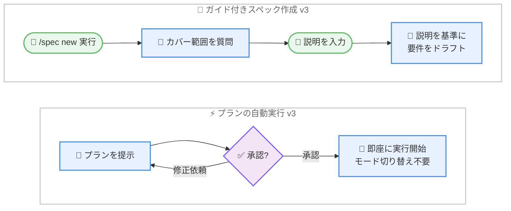

# Kiro - スペックドラフティングとプランの自動実行

**リリース日**: 2026年7月27日
**サービス**: Kiro
**機能**: Spec Drafting and Plan Auto-Execution (v2.15.0)

📊 [このアップデートのインフォグラフィックを見る](https://takech9203.github.io/aws-news-summary/20260727-kiro-changelog-2026-07-27.html)

## 概要

Kiro CLI v2.15.0 では、スペック作成とプラン実行のワークフローが改善されました。このリリースの中心は 2 つの機能です。1 つ目は、`/spec new` にガイド付きの説明ステップを追加する「ガイド付きスペック作成 (v3)」です。2 つ目は、Plan mode で承認済みのプランを手動のモード切り替えなしで自動実行する「プランの自動実行 (v3)」です。

ガイド付きスペック作成では、`/spec new` が要件のドラフトを作成する前に、そのスペックが何をカバーすべきかを質問するようになりました。エージェントはスペック名だけから内容を推測するのではなく、ユーザーが入力した説明を要件生成の基準 (ground truth) として使用します。これにより、意図に沿った要件が最初から生成されやすくなります。

プランの自動実行では、Plan mode でプランを承認すると、即座に実行が開始されるようになりました。プランをレビューして承認した後に、手動でモードを切り替える必要がなくなります。Kiro は AWS が提供するエージェント型 IDE であり、これらの改善はスペック駆動開発と Plan mode を活用する開発者のワークフローを効率化します。

**アップデート前の課題**

- 以前は、`/spec new` がスペック名だけから内容を推測して要件をドラフトしていたため、意図と異なる要件が生成されることがありました
- 以前は、Plan mode でプランを承認した後、実行に移るために手動でモードを切り替える必要がありました
- 以前は、`@prompt` 参照が、参照先のプロンプトファイルを読み込まずにプレーンテキストとして送信されることがありました

**アップデート後の改善**

- 今回のアップデートにより、`/spec new` がドラフト前にスペックのカバー範囲を質問し、ユーザーの説明を基準として要件を生成するようになりました
- 今回のアップデートにより、Plan mode でプランを承認すると即座に実行が開始され、手動のモード切り替えが不要になりました
- 今回のアップデートにより、新しい `chat.showThinkingTips` 設定で思考インジケーター下のヒント表示を非表示にできるようになりました

## アーキテクチャ図



ガイド付きスペック作成では、要件のドラフト前にユーザーの説明を収集して基準とします。プランの自動実行では、承認と同時に実行が開始され、手動のモード切り替えが不要になります。

## サービスアップデートの詳細

### 主要機能

1. **ガイド付きスペック作成 (Guided Spec Creation) (v3)**
   - `/spec new` が要件をドラフトする前に、そのスペックが何をカバーすべきかを質問するようになりました
   - エージェントはスペック名だけから内容を推測するのではなく、ユーザーが入力した説明を要件生成の基準 (ground truth) として使用します
   - 意図に沿った要件が最初から生成されやすくなり、スペックの手戻りが減ります

2. **プランの自動実行 (Plan Auto-Execution) (v3)**
   - Plan mode でプランを承認すると、即座に実行が開始されるようになりました
   - プランをレビューして承認した後に、手動でモードを切り替える必要がなくなりました

3. **改善: 思考ヒントの表示切り替え (Thinking Tips Toggle)**
   - 新しい `chat.showThinkingTips` 設定により、思考インジケーターの下に表示されるヒントを非表示にできます

4. **修正**
   - `@prompt` 参照が、参照先のプロンプトファイルを読み込まずにプレーンテキストとして送信されることがある問題を修正しました
   - `--classic` モードで、信頼プロンプトの権限上書き警告が、新しく信頼したツールだけでなく過去に信頼したすべてのツールに適用されていた問題を修正しました

## 技術仕様

### リリース情報

| 項目 | 詳細 |
|------|------|
| バージョン | v2.15.0 |
| 対象製品 | Kiro CLI |
| 対象モード | v3 (ガイド付きスペック作成、プランの自動実行) |
| 新規設定キー | `chat.showThinkingTips` |
| 修正対象 | `@prompt` 参照、`--classic` モードの信頼プロンプト警告 |

### 設定例

```json
{
  "chat.showThinkingTips": false
}
```

`chat.showThinkingTips` を `false` に設定すると、思考インジケーターの下に表示されるヒントが非表示になります。

## 設定方法

### 前提条件

1. Kiro CLI v2.15.0 以降がインストールされていること
2. ガイド付きスペック作成とプランの自動実行は v3 の機能であること

### 手順

#### ステップ1: ガイド付きスペック作成を利用する

```bash
/spec new
```

`/spec new` を実行すると、要件のドラフト前に、そのスペックが何をカバーすべきかを質問されます。ここで入力した説明が要件生成の基準として使用されるため、スペックの目的や範囲を具体的に記述します。

#### ステップ2: Plan mode でプランを承認する

Plan mode でエージェントが提示したプランをレビューし、承認します。承認すると即座に実行が開始されるため、手動でモードを切り替える操作は不要です。

#### ステップ3: 思考ヒントの表示を調整する

```json
{
  "chat.showThinkingTips": false
}
```

思考インジケーター下のヒント表示が不要な場合は、設定で `chat.showThinkingTips` を `false` にします。

## メリット

### ビジネス面

- **手戻りの削減**: スペックのドラフト前に意図を伝えられるため、要件の修正サイクルが減り、スペック駆動開発の立ち上がりが速くなります
- **ワークフローの効率化**: プラン承認から実行までがシームレスになり、レビュー後の操作コストが下がります
- **開発体験の向上**: `@prompt` 参照や信頼プロンプト警告の修正により、日常的な操作の信頼性が向上します

### 技術面

- **説明を基準とした要件生成**: エージェントがスペック名からの推測ではなく、ユーザーの説明を ground truth として要件を生成します
- **モード切り替えの自動化**: Plan mode での承認が実行のトリガーとなり、手動のモード切り替えが不要になります
- **表示のカスタマイズ**: `chat.showThinkingTips` により、思考インジケーター周りの表示を制御できます

## デメリット・制約事項

### 制限事項

- ガイド付きスペック作成とプランの自動実行は v3 の機能です
- 本リリースは Kiro CLI が対象です

### 考慮すべき点

- プランの承認が即座に実行につながるため、承認前にプランの内容を十分にレビューすることが重要です
- `/spec new` で入力する説明が要件生成の基準となるため、スペックの目的と範囲を明確に記述することが品質向上につながります

## ユースケース

### ユースケース1: 意図を反映したスペックの新規作成

**シナリオ**: 新機能のスペックを作成したいが、スペック名だけでは意図が伝わらず、生成された要件の修正に時間がかかっている。

**実装例**:
```
/spec new
# 質問に対して、スペックがカバーすべき範囲を具体的に説明する
# 例: 「ユーザー認証機能。メールとパスワードによるサインアップ、
#      ログイン、パスワードリセットをカバーする。SSO は対象外」
```

**効果**: 入力した説明が要件生成の基準となるため、意図に沿った要件が最初から生成され、手戻りが減ります。

### ユースケース2: プランレビューから実装までのシームレスな移行

**シナリオ**: Plan mode で実装計画をレビューした後、すぐに実装へ移りたいが、毎回モードを手動で切り替えるのが煩雑。

**実装例**:
```
# Plan mode でプランを確認し、承認する
# 承認と同時に実行が自動的に開始される
```

**効果**: 承認と同時に実行が開始されるため、レビューから実装までの流れが途切れず、操作の手間が減ります。

### ユースケース3: 表示をシンプルに保つ

**シナリオ**: 思考インジケーター下のヒント表示が不要で、出力をシンプルに保ちたい。

**実装例**:
```json
{
  "chat.showThinkingTips": false
}
```

**効果**: ヒントが非表示になり、コンソール出力がすっきりします。

## 利用可能リージョン

グローバル

Kiro はグローバルに提供されるエージェント型 IDE です。本機能は Kiro CLI v2.15.0 以降で利用できます。

## 関連サービス・機能

- **Kiro Specs**: スペック駆動開発の中核機能で、ガイド付きスペック作成により要件生成の精度が向上します
- **Plan mode (Planning Agent)**: 実装前にプランを作成・レビューするモードで、本リリースにより承認後の実行が自動化されました
- **カスタムプロンプト (@prompt)**: プロンプトファイルを参照する機能で、本リリースで参照の読み込みに関する不具合が修正されました

## 参考リンク

- 📊 [インフォグラフィック](https://takech9203.github.io/aws-news-summary/20260727-kiro-changelog-2026-07-27.html)
- [Kiro Changelog](https://kiro.dev/changelog/)
- [Kiro Changelog (CLI v2.15)](https://kiro.dev/changelog/cli/2-15)
- [Kiro CLI v3 Specs ドキュメント](https://kiro.dev/docs/cli/v3/specs)
- [Planning Agent ドキュメント](https://kiro.dev/docs/cli/chat/planning-agent)

## まとめ

Kiro CLI v2.15.0 は、`/spec new` にガイド付きの説明ステップを追加してユーザーの意図を要件生成の基準とし、Plan mode での承認後にプランを自動実行することで、スペック駆動開発とプラン実行のワークフローを効率化するアップデートです。スペック作成時は目的と範囲を具体的に説明し、プランは承認と同時に実行が始まる点を踏まえて十分にレビューすることをお勧めします。
