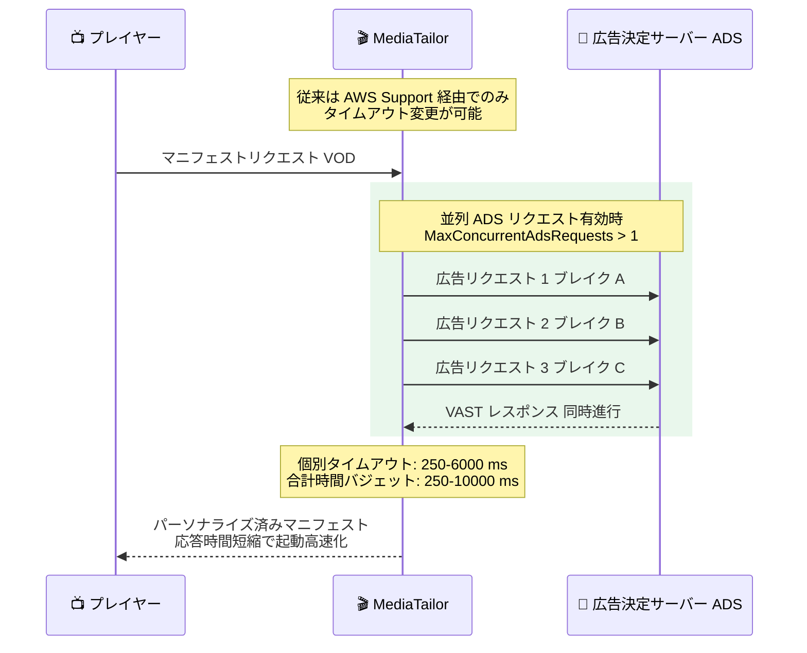

# AWS Elemental MediaTailor - 広告タイムアウトと並列処理の設定可能化

**リリース日**: 2026 年 7 月 27 日
**サービス**: AWS Elemental MediaTailor
**機能**: 設定可能な ADS タイムアウトと並列処理コントロール (AdsPersonalizationTimeouts / AdsPersonalizationConcurrency)

📊 [このアップデートのインフォグラフィックを見る](https://takech9203.github.io/aws-news-summary/20260727-mediatail-configurable-ad-timeout-and-concurrency.html)

## 概要

AWS Elemental MediaTailor で、ad decision server (ADS) に対するタイムアウト設定をお客様自身が直接制御できるようになりました。従来、これらの設定を変更するには AWS Support への問い合わせが必要でしたが、今回のアップデートにより、playback configuration の新しいパラメータ `AdsPersonalizationTimeouts` と `AdsPersonalizationConcurrency` を通じて、コンソール、AWS CLI、AWS SDK から直接設定できます。

設定できる項目は、個別の HTTP 広告リクエストタイムアウト、ライブ / VOD / ライブ広告プリフェッチそれぞれの広告パーソナライゼーション時間バジェット合計、そして ADS への並列リクエストの有効化です。たとえば、ライブイベントでパーソナライゼーション時間バジェットを引き上げることで広告フィル率 (ad fill rate) を向上させたり、VOD ワークフローで並列 ADS リクエストを有効にすることで応答時間を短縮し、動画の起動を高速化したりできます。

このアップデートは、サーバーサイド広告挿入 (SSAI) を利用してライブ配信や VOD を収益化しているブロードキャスター、OTT 事業者、ストリーミングプラットフォーム運営者にとって、広告収益とユーザー体験のバランスを自らチューニングできるようになる重要な改善です。

**アップデート前の課題**

このアップデート以前は、ADS タイムアウトに関する調整に大きな制約がありました。

- ADS タイムアウト設定の変更には AWS Support への問い合わせが必要で、迅速なチューニングやイベントごとの調整が困難だった
- 応答の遅い ADS を利用する場合、デフォルトのタイムアウト内に広告決定が完了せず、広告フィル率が低下することがあった
- VOD ワークフローで複数の広告ブレイクを順次処理する必要があり、マニフェスト応答が遅延して動画の起動時間が長くなることがあった
- プリフェッチ (ライブ広告の事前取得) に特化したタイムアウト制御ができなかった

**アップデート後の改善**

今回のアップデートにより、以下が可能になりました。

- playback configuration の設定として、コンソール、AWS CLI、SDK から ADS タイムアウトをセルフサービスで変更可能になった
- ライブ / VOD / プリフェッチのワークフローごとに、個別 HTTP リクエストタイムアウトと合計時間バジェットを独立して調整できるようになった
- VOD の VAST ワークフローで ADS リクエストを並列処理 (最大 100 並列) できるようになり、動画起動の高速化が期待できる
- ライブイベントで時間バジェットを引き上げることで、広告フィル率の改善が可能になった

## アーキテクチャ図



VOD ワークフローで VAST 並列化を有効にした場合の処理フローです。複数の広告ブレイクに対する ADS リクエストを並列に実行することで、マニフェスト応答時間を短縮し、動画の起動を高速化します。

## サービスアップデートの詳細

### 主要機能

1. **個別 ADS リクエストタイムアウト (AdsRequestTimeoutMilliseconds)**
   - ライブまたは VOD 再生中の広告決定において、単一の HTTP レスポンスを待機する最大時間をミリ秒単位で設定
   - デフォルト: 3,000 ms、有効範囲: 250〜6,000 ms
   - 応答の遅い ADS に合わせて延長したり、低レイテンシー重視で短縮したりできる

2. **ワークフロー別の合計時間バジェット**
   - **ライブ (LiveMaximumAdsPersonalizationTimeMilliseconds)**: ライブマニフェストのパーソナライゼーション中の全 ADS アクティビティに対する合計時間バジェット。デフォルト 10,000 ms、有効範囲 250〜10,000 ms。1 つのマニフェストリクエスト内のすべての広告ブレイクで共有される
   - **VOD (VodMaximumAdsPersonalizationTimeMilliseconds)**: VOD マニフェストのパーソナライゼーションに対する合計時間バジェット。デフォルト 10,000 ms、有効範囲 250〜10,000 ms
   - **プリフェッチ (PrefetchMaximumAdsPersonalizationTimeMilliseconds)**: プリフェッチ取得中の全 ADS アクティビティに対する合計時間バジェット。デフォルトでは上限なし、有効範囲 250〜10,000 ms

3. **プリフェッチ専用の個別タイムアウト (PrefetchAdsRequestTimeoutMilliseconds)**
   - プリフェッチ取得時の広告決定において、単一の HTTP レスポンスを待機する最大時間を設定
   - デフォルト: 個別 ADS リクエストタイムアウトの値を継承、有効範囲: 250〜10,000 ms
   - ライブストリームの広告取得をよりきめ細かく制御可能

4. **並列 ADS リクエスト (AdsPersonalizationConcurrency)**
   - **MaxConcurrentAdsRequests**: MediaTailor が ADS に対して同時に実行できるリクエスト数。デフォルト 1、有効範囲 1〜100
   - **EnableVodVastParallelization**: VAST レスポンスを返す VOD ワークフローで ADS リクエストを並列処理。デフォルトは無効。有効化するには MaxConcurrentAdsRequests を 1 より大きい値に設定する必要がある

## 技術仕様

### 新しい設定パラメータの一覧

| コンソール設定名 | API パラメータ | デフォルト | 有効範囲 | 対象ワークフロー |
|------|------|------|------|------|
| Individual ADS request timeout | `AdsPersonalizationTimeouts.AdsRequestTimeoutMilliseconds` | 3,000 ms | 250〜6,000 ms | ライブ / VOD |
| Live maximum ADS personalization time | `AdsPersonalizationTimeouts.LiveMaximumAdsPersonalizationTimeMilliseconds` | 10,000 ms | 250〜10,000 ms | ライブ |
| VOD maximum ADS personalization time | `AdsPersonalizationTimeouts.VodMaximumAdsPersonalizationTimeMilliseconds` | 10,000 ms | 250〜10,000 ms | VOD |
| Prefetch ADS request timeout | `AdsPersonalizationTimeouts.PrefetchAdsRequestTimeoutMilliseconds` | 個別タイムアウト値 | 250〜10,000 ms | プリフェッチ |
| Prefetch maximum ADS personalization time | `AdsPersonalizationTimeouts.PrefetchMaximumAdsPersonalizationTimeMilliseconds` | 上限なし | 250〜10,000 ms | プリフェッチ |
| Maximum concurrent ADS requests | `AdsPersonalizationConcurrency.MaxConcurrentAdsRequests` | 1 | 1〜100 | 全般 |
| Enable VOD VAST parallelization | `AdsPersonalizationConcurrency.EnableVodVastParallelization` | 無効 | 有効 / 無効 | VOD (VAST) |

### タイムアウト設定の組み合わせルール

ドキュメントによると、各ワークフローで個別タイムアウトと合計時間バジェットは**セットで設定する**必要があります。

- 個別タイムアウトは合計時間バジェットを超えることはできない
- ライブと VOD は単一の「Individual ADS request timeout」を共有するため、ライブと VOD 両方の合計時間バジェットと一緒に設定する
- 「Prefetch ADS request timeout」と「Prefetch maximum ADS personalization time」も同様にセットで設定する (片方だけの設定は不可)

### API変更履歴

| 日付 | サービス | 変更内容 |
|------|----------|----------|
| 2026/07/20 | [MediaTailor](https://awsapichanges.com/archive/changes/39540f-api.mediatailor.html) | 3 updated api methods - MediaTailor playback configuration に ADS タイムアウトと並列処理フィールドを設定する API サポートを追加 |

## 設定方法

### 前提条件

1. AWS Elemental MediaTailor の playback configuration が作成済み、または新規作成すること
2. `mediatailor:PutPlaybackConfiguration` を含む IAM 権限を持っていること
3. 利用する ADS の応答特性 (平均応答時間、VAST / VMAP の別) を把握していること

### 手順

#### ステップ1: 現在の playback configuration を確認する

```bash
aws mediatailor get-playback-configuration \
  --name my-playback-config
```

指定した playback configuration の現在の設定内容を取得します。既存のタイムアウト関連設定や ADS URL を確認し、変更の影響範囲を把握します。

#### ステップ2: タイムアウトと並列処理を設定する

```bash
aws mediatailor put-playback-configuration \
  --name my-playback-config \
  --ad-decision-server-url "https://my-ads.example.com/vast?..." \
  --video-content-source-url "https://origin.example.com/content" \
  --ads-personalization-timeouts '{
    "AdsRequestTimeoutMilliseconds": 4000,
    "LiveMaximumAdsPersonalizationTimeMilliseconds": 10000,
    "VodMaximumAdsPersonalizationTimeMilliseconds": 10000
  }' \
  --ads-personalization-concurrency '{
    "MaxConcurrentAdsRequests": 5,
    "EnableVodVastParallelization": true
  }'
```

`PutPlaybackConfiguration` API で、個別 ADS リクエストタイムアウトを 4,000 ms に延長し、ライブと VOD の合計時間バジェットを 10,000 ms に設定しています。あわせて最大 5 並列の ADS リクエストと VOD の VAST 並列化を有効化しています。個別タイムアウトと合計時間バジェットはセットで設定する必要がある点に注意してください。

#### ステップ3: コンソールでの設定 (代替手段)

MediaTailor コンソールの playback configuration 作成 / 編集画面にある「Advanced settings」セクションから、以下の項目を設定できます。

- Individual ADS request timeout
- Live maximum ADS personalization time
- VOD maximum ADS personalization time
- Prefetch ADS request timeout / Prefetch maximum ADS personalization time
- Maximum concurrent ADS requests / Enable VOD VAST parallelization

#### ステップ4: 効果を検証する

設定変更後、CloudWatch Logs のセッションログ (ADS ログ) や CloudWatch メトリクスを確認し、広告フィル率とマニフェスト応答時間の変化を検証します。ライブイベント前にステージング環境の playback configuration でテストすることを推奨します。

## メリット

### ビジネス面

- **広告収益の最大化**: ライブイベントでパーソナライゼーション時間バジェットを引き上げることで、応答に時間のかかる ADS でも広告決定を完了させ、広告フィル率を向上できる
- **視聴体験の向上**: VOD で並列 ADS リクエストを有効にすると応答時間が短縮され、動画起動が高速化することで離脱率の低減が期待できる
- **運用の迅速化**: AWS Support への問い合わせが不要になり、大型ライブイベント前のチューニングや ADS 変更時の調整を即座に実施できる

### 技術面

- **セルフサービス化**: コンソール、AWS CLI、SDK から設定でき、Infrastructure as Code (CloudFormation や CDK などの IaC ツール) への組み込みやすさが向上する
- **ワークフロー別の細かい制御**: ライブ、VOD、プリフェッチそれぞれに独立した時間バジェットを設定でき、ワークロード特性に合わせた最適化が可能
- **並列度の柔軟な調整**: 最大 100 並列まで ADS リクエストの同時実行数を調整でき、ADS 側のキャパシティに合わせたスロットリングも可能

## デメリット・制約事項

### 制限事項

- 個別 ADS リクエストタイムアウトの上限は 6,000 ms、合計時間バジェットの上限は 10,000 ms (これを超える設定はできない)
- VOD VAST 並列化は VAST レスポンスを返す VOD ワークフローのみが対象で、有効化には MaxConcurrentAdsRequests を 1 より大きくする必要がある
- 個別タイムアウトと合計時間バジェットはセットで設定する必要があり、個別タイムアウトが合計バジェットを超える設定はできない
- ライブと VOD は個別 ADS リクエストタイムアウトを共有するため、ワークフローごとに異なる個別タイムアウトは設定できない

### 考慮すべき点

- VAST 並列化を有効にすると、一部の広告サーバーでは並列リクエストに対してフリークエンシーキャップ (広告表示回数制限) が正しく適用されない場合がある。広告サーバープロバイダーに並列リクエスト時のフリークエンシーキャップ対応を確認し、未対応の場合は VMAP への切り替えを検討する
- タイムアウトを延長するとマニフェスト応答が遅くなる可能性があるため、広告フィル率と起動時間のトレードオフを考慮してチューニングする
- 並列リクエスト数を増やすと ADS 側の負荷が増加するため、ADS のキャパシティを事前に確認する

## ユースケース

### ユースケース1: 大規模ライブスポーツイベントでの広告フィル率向上

**シナリオ**: 大規模なライブスポーツ配信で、広告ブレイク時にプログラマティック広告の入札処理に時間がかかり、デフォルトのタイムアウト内に広告決定が完了せず、スレート (埋め草) 表示が多発している。

**実装例**:
```bash
aws mediatailor put-playback-configuration \
  --name live-sports-config \
  --ads-personalization-timeouts '{
    "AdsRequestTimeoutMilliseconds": 6000,
    "LiveMaximumAdsPersonalizationTimeMilliseconds": 10000,
    "VodMaximumAdsPersonalizationTimeMilliseconds": 10000
  }'
```

**効果**: 個別タイムアウトを上限の 6,000 ms まで延長することで、応答の遅い ADS でも広告決定を完了でき、スレート表示が減少して広告フィル率と広告収益が向上します。

### ユースケース2: VOD サービスの動画起動高速化

**シナリオ**: 多数のミッドロール広告ブレイクを含む長尺 VOD コンテンツで、広告ブレイクごとの ADS リクエストが順次処理されるため、マニフェストの初回応答が遅く、動画の起動に時間がかかっている。

**実装例**:
```bash
aws mediatailor put-playback-configuration \
  --name vod-config \
  --ads-personalization-timeouts '{
    "AdsRequestTimeoutMilliseconds": 3000,
    "LiveMaximumAdsPersonalizationTimeMilliseconds": 10000,
    "VodMaximumAdsPersonalizationTimeMilliseconds": 8000
  }' \
  --ads-personalization-concurrency '{
    "MaxConcurrentAdsRequests": 10,
    "EnableVodVastParallelization": true
  }'
```

**効果**: 複数の広告ブレイクに対する VAST リクエストが最大 10 並列で処理され、マニフェスト応答時間が短縮されて動画の起動が高速化し、視聴開始までの離脱を低減できます。

### ユースケース3: ライブ広告プリフェッチのきめ細かい制御

**シナリオ**: ライブストリームでプリフェッチ機能を利用して広告を事前取得しているが、プリフェッチはリアルタイム性の要求が緩いため、通常再生よりも長いタイムアウトを許容して広告取得の成功率を高めたい。

**実装例**:
```bash
aws mediatailor put-playback-configuration \
  --name live-prefetch-config \
  --ads-personalization-timeouts '{
    "AdsRequestTimeoutMilliseconds": 3000,
    "LiveMaximumAdsPersonalizationTimeMilliseconds": 10000,
    "VodMaximumAdsPersonalizationTimeMilliseconds": 10000,
    "PrefetchAdsRequestTimeoutMilliseconds": 8000,
    "PrefetchMaximumAdsPersonalizationTimeMilliseconds": 10000
  }'
```

**効果**: 通常再生の個別タイムアウトは 3,000 ms に保ちつつ、プリフェッチのみ 8,000 ms まで待機できるようになり、レイテンシーに影響を与えずにプリフェッチ経由の広告取得成功率を高められます。

## 料金

このアップデート自体に追加料金はありません。MediaTailor の料金は従来どおり、広告挿入 (サーバーサイド広告挿入した広告数またはストリーム時間) とチャンネルアセンブリの使用量に基づく従量課金です。

なお、並列リクエストやタイムアウト延長により広告フィル率が向上した場合、挿入される広告数の増加に応じて広告挿入料金が増える可能性がありますが、これは収益増加に伴うものです。詳細は [MediaTailor 料金ページ](https://aws.amazon.com/mediatailor/pricing/) を参照してください。

## 利用可能リージョン

AWS Elemental MediaTailor が利用可能なすべての AWS リージョンで利用できます。

## 関連サービス・機能

- **MediaTailor 広告プリフェッチ**: ライブストリーム向けに広告を事前取得する機能。今回のアップデートでプリフェッチ専用のタイムアウト制御が可能になった
- **AWS Elemental MediaPackage / MediaLive**: ライブ配信ワークフローで MediaTailor の上流としてマニフェストを供給するサービス。SCTE-35 マーカーによる広告ブレイク通知と組み合わせて利用
- **Amazon CloudFront**: MediaTailor のマニフェストと広告セグメント配信を最適化する CDN。タイムアウトチューニングの効果検証時に応答時間の測定にも活用できる
- **Amazon CloudWatch Logs**: MediaTailor の ADS インタラクションログを記録。タイムアウト変更後の広告フィル率や ADS 応答時間の検証に利用

## 参考リンク

- 📊 [インフォグラフィック](https://takech9203.github.io/aws-news-summary/20260727-mediatail-configurable-ad-timeout-and-concurrency.html)
- [公式発表 (What's New)](https://aws.amazon.com/about-aws/whats-new/2026/07/mediatail-configurable-ad-timeout-and-concurrency)
- [ドキュメント: Playback configuration の Advanced settings](https://docs.aws.amazon.com/mediatailor/latest/ug/configurations-create.html#configurations-advanced-settings)
- [API リファレンス: PutPlaybackConfiguration](https://docs.aws.amazon.com/mediatailor/latest/apireference/API_PutPlaybackConfiguration.html)
- [API 変更履歴 (awsapichanges.com)](https://awsapichanges.com/archive/changes/39540f-api.mediatailor.html)
- [料金ページ](https://aws.amazon.com/mediatailor/pricing/)

## まとめ

MediaTailor の ADS タイムアウトと並列処理設定がセルフサービス化され、AWS Support への問い合わせなしに広告フィル率と動画起動時間のトレードオフを自らチューニングできるようになりました。SSAI で収益化しているワークロードでは、まず現在の ADS 応答時間とスレート発生状況を CloudWatch Logs で確認し、ライブでは時間バジェットの引き上げ、VOD では VAST 並列化の有効化を検証することを推奨します。
