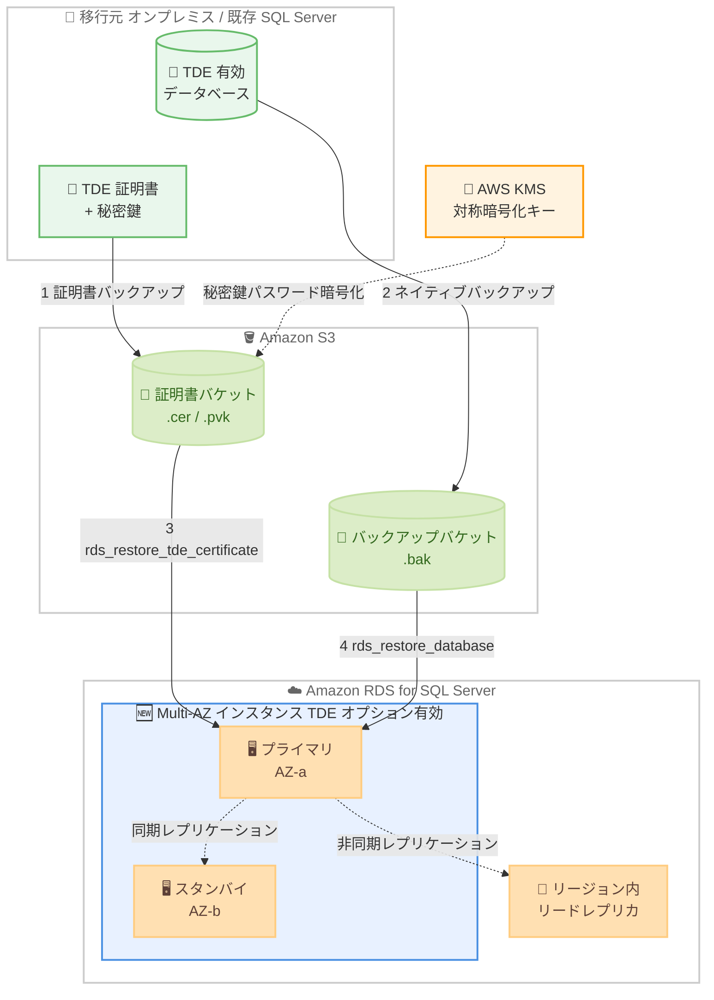

# Amazon RDS for SQL Server - Multi-AZ インスタンスへの TDE データベース復元サポート

**リリース日**: 2026 年 7 月 27 日
**サービス**: Amazon RDS for SQL Server
**機能**: Multi-AZ インスタンスおよびリージョン内リードレプリカ構成インスタンスへの TDE 有効データベースの native backup and restore による復元

📊 [このアップデートのインフォグラフィックを見る](https://takech9203.github.io/aws-news-summary/20260727-rds-sql-server-supports-tde-for-maz.html)

## 概要

Amazon RDS for SQL Server が、Transparent Data Encryption (TDE) が有効な SQL Server データベースを、Multi-AZ インスタンスおよび同一リージョン内にリードレプリカを持つインスタンスへ native backup and restore で復元することをサポートしました。

TDE は SQL Server の保存時暗号化機能で、データがストレージに書き込まれる前に自動的に暗号化し、読み取り時に自動的に復号します。コンプライアンス要件により保存データの暗号化が求められる金融、医療、公共分野などのワークロードで広く利用されています。従来、TDE 有効データベースの復元先は Single-AZ インスタンスに限定されていたため、高可用性と保存時暗号化の両立には追加の作業が必要でした。

今回のアップデートにより、既存の TDE 証明書をバックアップして Amazon S3 に保存し、TDE オプションが有効な RDS インスタンスに証明書を復元した後、S3 から TDE 有効データベースのバックアップを native backup and restore で復元するという一連の流れを、Multi-AZ 構成のインスタンスに対して直接実行できるようになりました。保存時暗号化と高可用性の両方を必要とする移行・復旧ワークフローが大幅に簡素化されます。

**アップデート前の課題**

このアップデート以前は、TDE 有効データベースの復元に以下の制約がありました。

- TDE 有効データベースの native backup and restore による復元は Single-AZ インスタンスのみでサポートされていた
- Multi-AZ インスタンスへ復元するには、事前に TDE を無効化するか、一旦 Single-AZ 構成へ変更 (または Single-AZ インスタンスへ復元後に Multi-AZ 化) する必要があった
- 復元作業中に暗号化を解除する運用は、セキュリティポリシーやコンプライアンス要件と競合する可能性があった
- Single-AZ で復元してから Multi-AZ へ変換する手順は、移行時間の増加と運用手順の複雑化を招いていた

**アップデート後の改善**

今回のアップデートにより、以下が可能になりました。

- TDE 有効データベースを Multi-AZ インスタンスへ直接復元できるようになった
- 同一リージョン内にリードレプリカを持つインスタンスへの復元もサポートされた
- TDE の無効化や Single-AZ 構成への変更といった中間ステップが不要になった
- 保存時暗号化 (TDE) と高可用性 (Multi-AZ) の両方を維持したまま、移行・復旧ワークフローを実行できるようになった

## アーキテクチャ図



TDE 証明書とデータベースバックアップを S3 経由で転送し、TDE オプションが有効な Multi-AZ インスタンスへ直接復元するワークフローを示しています。従来は Single-AZ インスタンスのみが復元先でしたが、今回のアップデートで Multi-AZ インスタンスとリージョン内リードレプリカ構成のインスタンスが復元先として利用可能になりました。

## サービスアップデートの詳細

### 主要機能

1. **Multi-AZ インスタンスへの TDE データベース復元**
   - TDE 有効データベースのバックアップ (.bak) を、Multi-AZ 構成の RDS for SQL Server インスタンスへ native backup and restore で直接復元可能
   - 復元後もプライマリとスタンバイ間の同期レプリケーションによる高可用性を維持
   - TDE の無効化や構成変更といった中間ステップが不要

2. **リージョン内リードレプリカ構成インスタンスへの復元**
   - 同一リージョン内にリードレプリカを持つインスタンスに対しても TDE 有効データベースを復元可能
   - 読み取りスケーリング構成を維持したまま暗号化データベースを移行できる

3. **TDE 証明書のバックアップ / 復元ワークフロー**
   - `rds_backup_tde_certificate` ストアドプロシージャで既存の TDE 証明書を S3 にバックアップ
   - `rds_restore_tde_certificate` ストアドプロシージャで移行先インスタンスに証明書を復元 (証明書名は `UserTDECertificate_` プレフィックスが必須)
   - 秘密鍵のパスワードは AWS KMS の対称暗号化キーで保護
   - 復元されたユーザー TDE 証明書は `rds_fn_list_user_tde_certificates` 関数で確認、`rds_drop_tde_certificate` で削除可能

## 技術仕様

### TDE サポート対象の SQL Server バージョン / エディション

| バージョン | 対応エディション |
|------|------|
| SQL Server 2025 | Standard、Enterprise |
| SQL Server 2022 | Standard、Enterprise |
| SQL Server 2019 | Standard、Enterprise |
| SQL Server 2017 | Enterprise |
| SQL Server 2016 | Enterprise |

### TDE 証明書関連のストアドプロシージャ / 関数

| 名称 | 用途 |
|------|------|
| `msdb.dbo.rds_backup_tde_certificate` | TDE 証明書と秘密鍵を S3 にバックアップ |
| `msdb.dbo.rds_restore_tde_certificate` | S3 から TDE 証明書を復元 (インポート) |
| `msdb.dbo.rds_fn_list_user_tde_certificates` | 復元済みユーザー TDE 証明書の一覧表示 |
| `msdb.dbo.rds_drop_tde_certificate` | 不要になったユーザー TDE 証明書の削除 |

### 必要なオプション / リソース

| 項目 | 詳細 |
|------|------|
| オプショングループ | `TRANSPARENT_DATA_ENCRYPTION` (CLI / API では `TDE`) と `SQLSERVER_BACKUP_RESTORE` の両方が必要 |
| Amazon S3 | 証明書用とデータベースバックアップ用に別々のバケットを推奨 |
| IAM ロール | native backup and restore 用の権限に加え、S3 バケットへの `s3:GetBucketAcl`、`s3:GetBucketLocation`、`s3:ListBucket` が必要。KMS キーのユーザーかつ管理者であること |
| AWS KMS | 秘密鍵パスワードの暗号化に対称暗号化 KMS キーが必要 (クロスアカウントキーは非サポート) |
| S3 メタデータ | 秘密鍵ファイル (.pvk) に `x-amz-meta-rds-tde-pwd` タグ (KMS データキーの CiphertextBlob 値) が必要 |

## 設定方法

### 前提条件

1. TDE をサポートする SQL Server エディション (Standard は 2019 以降、Enterprise は 2016 以降) を使用していること
2. オプショングループに `TRANSPARENT_DATA_ENCRYPTION` (TDE) と `SQLSERVER_BACKUP_RESTORE` の両オプションが追加され、対象 DB インスタンスに関連付けられていること
3. 証明書ファイルとバックアップファイルを保存する S3 バケット、および native backup and restore 用の IAM ロールが設定済みであること
4. 対称暗号化 KMS キーが利用可能であること

### 手順

#### ステップ 1: KMS データキーの生成と TDE 証明書のバックアップ (移行元)

```bash
aws kms generate-data-key \
    --key-id my_KMS_key_ID \
    --key-spec AES_256
```

KMS でデータキーを生成します。出力される `Plaintext` を秘密鍵のパスワードとして使用し、`CiphertextBlob` を後で S3 メタデータに設定します。

```sql
-- オンプレミス SQL Server の場合
BACKUP CERTIFICATE myOnPremTDEcertificate TO FILE = 'D:\tde-cert-backup.cer'
WITH PRIVATE KEY (
    FILE = 'D:\cert-backup-key.pvk',
    ENCRYPTION BY PASSWORD = '<Plaintext の値>');
```

移行元 (オンプレミス) の TDE 証明書を、データキーの平文をパスワードとして秘密鍵付きでバックアップします。移行元が RDS の場合は `rds_backup_tde_certificate` ストアドプロシージャを使用して S3 に直接バックアップします。

#### ステップ 2: 証明書ファイルを S3 にアップロード

```bash
aws s3 cp tde-cert-backup.cer s3://TDE_certs/mycertfile.cer

aws s3 cp cert-backup-key.pvk s3://TDE_certs/mykeyfile.pvk \
    --metadata rds-tde-pwd=<CiphertextBlob の値>
```

証明書ファイル (.cer) と秘密鍵ファイル (.pvk) を S3 の証明書バケットにアップロードします。秘密鍵ファイルには `x-amz-meta-rds-tde-pwd` メタデータタグとして、ステップ 1 で取得した `CiphertextBlob` の値を設定します。

#### ステップ 3: 移行先 Multi-AZ インスタンスへ TDE 証明書を復元

```sql
EXECUTE msdb.dbo.rds_restore_tde_certificate
    @certificate_name='UserTDECertificate_myTDEcertificate',
    @certificate_file_s3_arn='arn:aws:s3:::TDE_certs/mycertfile.cer',
    @private_key_file_s3_arn='arn:aws:s3:::TDE_certs/mykeyfile.pvk',
    @kms_password_key_arn='arn:aws:kms:us-west-2:123456789012:key/key-id';
```

TDE オプションが有効な Multi-AZ インスタンス上で、S3 に保存した証明書を復元 (インポート) します。証明書名には `UserTDECertificate_` プレフィックスが必要です。

#### ステップ 4: TDE 有効データベースを native backup and restore で復元

```sql
EXECUTE msdb.dbo.rds_restore_database
    @restore_db_name='myTDEdatabase',
    @s3_arn_to_restore_from='arn:aws:s3:::mybackups/myTDEdatabase.bak';
```

S3 上の TDE 有効データベースのバックアップファイルを、Multi-AZ インスタンスへ復元します。復元後、RDS は対象データベースを RDS 生成の TDE 証明書 (`RDSTDECertificate` プレフィックス) を使用するように変更してから利用可能にします。

```sql
-- 復元済みユーザー TDE 証明書の確認
SELECT * FROM msdb.dbo.rds_fn_list_user_tde_certificates();
```

復元されたユーザー TDE 証明書の一覧を確認します。同じ移行元の他のデータベースを復元する場合、同一証明書を再インポートする必要はありません。

## メリット

### ビジネス面

- **コンプライアンスの継続的な担保**: 移行・復旧の全工程で TDE による保存時暗号化を維持でき、暗号化解除を伴わないため規制要件 (PCI DSS、HIPAA など) への対応が容易になる
- **移行プロジェクトの短縮**: TDE 無効化や Single-AZ 経由の構成変更といった中間ステップが不要になり、移行計画の簡素化と作業時間の削減につながる
- **可用性要件との両立**: 暗号化要件と高可用性 (Multi-AZ) 要件を持つミッションクリティカルなワークロードを、妥協なく RDS へ移行できる

### 技術面

- **ワークフローの簡素化**: 証明書の S3 バックアップ、証明書復元、データベース復元という一貫したストアドプロシージャベースの手順で完結する
- **リードレプリカ構成の維持**: リージョン内リードレプリカを持つインスタンスへも復元できるため、読み取りスケーリング構成を崩さずに移行可能
- **KMS 統合によるキー保護**: TDE 証明書の秘密鍵パスワードが AWS KMS の対称暗号化キーで保護され、安全な証明書移送が可能

## デメリット・制約事項

### 制限事項

- TDE は SQL Server 2019 以降の Standard / Enterprise Edition、および SQL Server 2016 / 2017 の Enterprise Edition でのみ利用可能
- ユーザー TDE 証明書は 1 インスタンスあたり最大 10 個まで (超過時は未使用の証明書を削除する必要がある)
- ユーザー TDE 証明書は、移行元インスタンスの他の TDE 有効データベースの復元にのみ使用可能で、インスタンス上の他データベースの新規 TDE 暗号化には使用できない
- クロスアカウントの KMS キーは非サポート
- 証明書ファイルは .cer、秘密鍵ファイルは .pvk 拡張子が必須。証明書名に使用できる文字は a-z、0-9、@、$、#、アンダースコアのみ
- TDE 証明書のバックアップ / 復元タスクのキャンセルは非サポート
- 読み取り専用データベースの TDE は非サポート。`master` や `model` などのシステムデータベースは暗号化できない

### 考慮すべき点

- TDE オプションは永続オプションのため、一度オプショングループに追加すると、関連付けられた DB インスタンスとバックアップがすべてなくなるまで削除できない
- TDE の使用は SQL Server インスタンスのパフォーマンスに影響する可能性がある。同一インスタンス上に暗号化データベースが 1 つでもあると非暗号化データベースの性能も低下し得るため、暗号化 / 非暗号化データベースは別インスタンスに分離することが推奨される
- 復元後、RDS はデータベースを RDS 生成の TDE 証明書に付け替えるため、ユーザー証明書のライフサイクル管理 (不要になった証明書の削除) を運用に組み込むことが望ましい

## ユースケース

### ユースケース 1: オンプレミス SQL Server から Multi-AZ RDS への直接移行

**シナリオ**: 金融機関がオンプレミスで運用する TDE 有効な SQL Server データベースを、コンプライアンス要件 (保存時暗号化の常時維持) を満たしたまま、高可用性が必要な本番環境として Multi-AZ RDS インスタンスへ移行する。

**実装例**:
```sql
-- 1. 移行先 Multi-AZ インスタンスで証明書を復元
EXECUTE msdb.dbo.rds_restore_tde_certificate
    @certificate_name='UserTDECertificate_finance_tde_cert',
    @certificate_file_s3_arn='arn:aws:s3:::tde-certs/finance-cert.cer',
    @private_key_file_s3_arn='arn:aws:s3:::tde-certs/finance-key.pvk',
    @kms_password_key_arn='arn:aws:kms:ap-northeast-1:123456789012:key/key-id';

-- 2. TDE 有効データベースを復元
EXECUTE msdb.dbo.rds_restore_database
    @restore_db_name='FinanceDB',
    @s3_arn_to_restore_from='arn:aws:s3:::db-backups/FinanceDB.bak';
```

**効果**: 従来必要だった「Single-AZ へ復元してから Multi-AZ 化」という手順が不要になり、移行時間の短縮と暗号化の常時維持を両立できる。

### ユースケース 2: 障害復旧 (DR) ワークフローの簡素化

**シナリオ**: TDE 有効データベースのネイティブバックアップを S3 に定期保存している企業が、障害発生時に高可用性を確保した Multi-AZ インスタンスとして即座に復旧させたい。

**実装例**:
```sql
-- あらかじめ TDE オプション有効な Multi-AZ インスタンスに証明書を復元しておき、
-- 復旧時はバックアップの復元のみを実行
EXECUTE msdb.dbo.rds_restore_database
    @restore_db_name='ProductionDB',
    @s3_arn_to_restore_from='arn:aws:s3:::dr-backups/ProductionDB-latest.bak';
```

**効果**: 復旧先を最初から Multi-AZ 構成にできるため、復旧直後から高可用性が確保され、復旧手順から構成変更ステップが排除される。

### ユースケース 3: リードレプリカ構成インスタンスへの追加データベース移行

**シナリオ**: 読み取りスケーリングのためリージョン内リードレプリカを運用中の RDS for SQL Server インスタンスへ、別の移行元から TDE 有効データベースを追加移行する。

**実装例**:
```sql
-- リードレプリカを持つインスタンスに対して直接実行可能
EXECUTE msdb.dbo.rds_restore_tde_certificate
    @certificate_name='UserTDECertificate_analytics_cert',
    @certificate_file_s3_arn='arn:aws:s3:::tde-certs/analytics-cert.cer',
    @private_key_file_s3_arn='arn:aws:s3:::tde-certs/analytics-key.pvk',
    @kms_password_key_arn='arn:aws:kms:ap-northeast-1:123456789012:key/key-id';

EXECUTE msdb.dbo.rds_restore_database
    @restore_db_name='AnalyticsDB',
    @s3_arn_to_restore_from='arn:aws:s3:::db-backups/AnalyticsDB.bak';
```

**効果**: リードレプリカの削除・再作成が不要になり、既存の読み取りスケーリング構成を維持したまま暗号化データベースを統合できる。

## 料金

この機能自体に追加料金はありません。以下の関連リソースに対して通常の料金が発生します。

- Amazon RDS for SQL Server のインスタンス料金 (Multi-AZ 構成は Single-AZ の約 2 倍)
- Amazon S3 のストレージおよびリクエスト料金 (証明書ファイル、バックアップファイルの保存)
- AWS KMS のキー保管およびリクエスト料金

なお、TDE を利用できる SQL Server Standard / Enterprise Edition のライセンス費用はインスタンス料金 (License Included の場合) に含まれます。

## 利用可能リージョン

Amazon RDS for SQL Server がサポートされるすべての AWS リージョンで利用可能です (東京、大阪リージョンを含む)。

## 関連サービス・機能

- **Amazon S3**: TDE 証明書ファイルとネイティブバックアップファイルの保管先。native backup and restore の転送基盤
- **AWS KMS**: TDE 証明書の秘密鍵パスワードを保護する対称暗号化キーを提供
- **RDS オプショングループ**: `TRANSPARENT_DATA_ENCRYPTION` と `SQLSERVER_BACKUP_RESTORE` オプションの管理
- **RDS Multi-AZ 配置**: プライマリとスタンバイ間の同期レプリケーションによる高可用性を提供。今回のアップデートで TDE データベース復元先として利用可能に
- **RDS リードレプリカ**: 読み取りスケーリング用のレプリカ。同一リージョン内リードレプリカを持つインスタンスも復元先としてサポート

## 参考リンク

- 📊 [インフォグラフィック](https://takech9203.github.io/aws-news-summary/20260727-rds-sql-server-supports-tde-for-maz.html)
- [公式発表 (What's New)](https://aws.amazon.com/about-aws/whats-new/2026/07/rds-sql-server-supports-tde-for-maz/)
- [ドキュメント: Support for Transparent Data Encryption in SQL Server](https://docs.aws.amazon.com/AmazonRDS/latest/UserGuide/Appendix.SQLServer.Options.TDE.html)
- [ドキュメント: Backing up and restoring TDE certificates on RDS for SQL Server](https://docs.aws.amazon.com/AmazonRDS/latest/UserGuide/TDE.BackupRestoreRDS.html)
- [ドキュメント: Backing up and restoring TDE certificates for on-premises databases](https://docs.aws.amazon.com/AmazonRDS/latest/UserGuide/TDE.BackupRestoreOnPrem.html)
- [Amazon RDS for SQL Server 製品ページ](https://aws.amazon.com/rds/sqlserver/)
- [料金ページ](https://aws.amazon.com/rds/sqlserver/pricing/)

## まとめ

TDE 有効な SQL Server データベースを Multi-AZ インスタンスおよびリージョン内リードレプリカ構成のインスタンスへ直接復元できるようになり、保存時暗号化と高可用性を両立した移行・復旧が中間ステップなしで実現可能になりました。TDE を利用中のオンプレミス SQL Server の RDS 移行を検討している場合や、DR 手順に Single-AZ 経由の構成変更を含めている場合は、この機能を活用した手順の見直しを推奨します。
