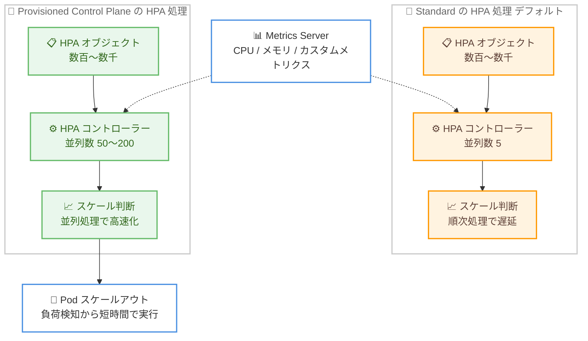

# Amazon EKS - Provisioned Control Plane による Pod オートスケーリングの高速化

**リリース日**: 2026 年 7 月 28 日
**サービス**: Amazon Elastic Kubernetes Service (Amazon EKS)
**機能**: Provisioned Control Plane における HPA sync concurrency の引き上げ

📊 [このアップデートのインフォグラフィックを見る](https://takech9203.github.io/aws-news-summary/20260728-amazon-eks-provisioned-control.html)

## 概要

Amazon EKS は、すべての Provisioned Control Plane クラスターにおいて、Horizontal Pod Autoscaler (HPA) の sync concurrency を Kubernetes のデフォルト値の最大 40 倍に引き上げたことを発表しました。HPA sync concurrency とは、Kubernetes のコントローラーマネージャーが並列に処理する HPA オブジェクトの数を指します。アップストリーム Kubernetes のデフォルト値は 5 ですが、Provisioned Control Plane クラスターではスケーリングティアに応じて 50〜200 に設定されます。

数百から数千の HPA オブジェクトを持つ大規模クラスターでは、コントロールプレーンの処理速度がワークロードのスケール速度を左右します。今回のアップデートにより、コントロールプレーンがより多くの HPA オブジェクトを同時に評価できるようになり、負荷の変化を検知してから Pod のスケールアウトが実行されるまでの時間が短縮されます。

本改善は Provisioned Control Plane を利用するすべてのユーザーに提供され、設定変更は一切不要です。大規模な AI 推論、e コマース、マイクロサービスなど、多数の HPA を運用するワークロードにおいて、オートスケーリングの応答性が自動的に向上します。

**アップデート前の課題**

このアップデート以前に存在していた課題は以下のとおりです。

- HPA コントローラーの並列処理数は Kubernetes デフォルトの 5 が上限であり、数百〜数千の HPA オブジェクトを持つクラスターでは HPA が順次処理されるため、リコンサイルの待ち行列が発生していた
- 負荷スパイクを検知してから実際に Pod がスケールアウトされるまでの遅延が大きく、トラフィック急増時のレイテンシー悪化やエラー増加につながる可能性があった
- HPA 処理のバックログ (`workqueue_depth`) が積み上がり、オートスケーリングの判断が遅延するリスクがあった

**アップデート後の改善**

今回のアップデートにより、以下が実現されました。

- HPA sync concurrency がスケーリングティアに応じて 50〜200 (デフォルト値 5 の最大 40 倍) に引き上げられ、多数の HPA オブジェクトを並列にリコンサイルできるようになった
- 負荷検知から Pod スケールアウトまでの時間が短縮され、大規模クラスターでのオートスケーリング応答性が向上した
- Provisioned Control Plane の全ユーザーに設定変更不要で自動適用されるため、追加の運用作業なしで恩恵を受けられる

## アーキテクチャ図



Standard モードのデフォルトでは HPA コントローラーの並列数が 5 であるのに対し、Provisioned Control Plane ではティアに応じて 50〜200 に引き上げられ、HPA オブジェクトのリコンサイルが並列化されることでスケール判断までの時間が短縮されます。

## サービスアップデートの詳細

### 主要機能

1. **HPA sync concurrency の引き上げ**
   - HPA sync concurrency は、Kubernetes コントローラーマネージャーが並列処理する HPA オブジェクトの数
   - アップストリーム Kubernetes のデフォルト値は 5
   - Provisioned Control Plane クラスターではスケーリングティアに応じて 50〜200 に設定 (最大 40 倍)

2. **全 Provisioned Control Plane クラスターへの自動適用**
   - Provisioned Control Plane を利用するすべてのユーザーが対象
   - 設定変更は一切不要で、自動的に適用される
   - Standard モードの動作には変更なし

3. **オートスケーリング応答性の向上**
   - 並列数の増加により、より多くの HPA オブジェクトを同時にリコンサイル可能
   - 負荷の変化からスケーリングアクションまでの時間を短縮
   - 数百〜数千の HPA オブジェクトを持つ大規模クラスターで特に効果が大きい

4. **効果の観測が可能**
   - コントローラーマネージャーの workqueue メトリクスで効果を確認可能
   - `workqueue_depth{name="horizontalpodautoscaler"}` が処理待ちの HPA オブジェクト数を示す
   - この値がゼロ付近で安定していれば、コントロールプレーンが HPA 処理に追従できていることを意味する

## 技術仕様

### スケーリングティア別の HPA sync concurrency

| Provisioned Control Plane スケーリングティア | HPA sync concurrency |
|---------------------------------------------|----------------------|
| XL | 50 |
| 2XL | 100 |
| 4XL | 200 |
| 8XL | 200 |

参考: アップストリーム Kubernetes のデフォルト値は 5 です。4XL / 8XL ティアの 200 はデフォルト値の 40 倍に相当します。

### Provisioned Control Plane スケーリングティアの概要 (EKS v1.34 以降)

| ティア | API リクエスト同時実行数 (seats) | Pod スケジューリングレート (pods/秒) | クラスターデータベースサイズ (GB) | SLA (1 分間隔で測定) |
|--------|----------------------------------|--------------------------------------|-----------------------------------|----------------------|
| XL | 2000 | 167 | 16 | 99.99% |
| 2XL | 4000 | 283 | 16 | 99.99% |
| 4XL | 8000 | 400 | 16 | 99.99% |
| 8XL | 16000 | 400 | 16 | 99.99% |

### 効果測定に使用できるメトリクス

| 観測項目 | メトリクス | 説明 |
|----------|-----------|------|
| HPA 処理のバックログ | `workqueue_depth{name="horizontalpodautoscaler"}` | HPA コントローラーの処理待ちオブジェクト数。ゼロ付近で安定していれば遅延なし |
| API リクエスト同時実行数 | `apiserver_flowcontrol_current_executing_seats` | コントロールプレーンの API 処理状況 |
| Pod スケジューリングレート | `scheduler_schedule_attempts_total` | スケジューラーの処理状況 |

## 設定方法

### 前提条件

1. Amazon EKS クラスター (Kubernetes v1.28 以降)
2. Provisioned Control Plane モードの利用 (Standard モードからのオプトインが必要)
3. HPA を利用するワークロードと Metrics Server などのメトリクスソース

### 手順

#### ステップ 1: Provisioned Control Plane へのオプトイン

```bash
aws eks update-cluster-config \
  --name my-cluster \
  --scaling-config tier=XL
```

クラスターのコントロールプレーンを Provisioned モードの指定ティアに変更します。今回の HPA sync concurrency の引き上げは、Provisioned Control Plane クラスターであれば追加設定なしで自動的に適用されます。

#### ステップ 2: 現在のスケーリングティアの確認

```bash
aws eks describe-cluster --name my-cluster
```

クラスターの詳細情報を取得し、現在のコントロールプレーンのスケーリングティアを確認します。ティア変更の進捗は `ScalingTierConfigUpdate` タイプのクラスター更新として確認できます。

#### ステップ 3: HPA 処理状況のモニタリング

```bash
kubectl get --raw /metrics | grep 'workqueue_depth{name="horizontalpodautoscaler"}'
```

コントローラーマネージャーの workqueue メトリクスを確認し、HPA オブジェクトの処理待ち数を観測します。この値がゼロ付近で安定していれば、コントロールプレーンがクラスター内の HPA オブジェクトの処理に追従できています。EKS コンソールの [Monitor cluster] からコントロールプレーンモニタリングダッシュボードでも確認できます。

## メリット

### ビジネス面

- **機会損失の低減**: トラフィック急増時のスケールアウト遅延が短縮され、e コマースセールやイベント時のレイテンシー悪化・エラーによる機会損失を抑制できる
- **運用コストの削減**: 設定変更が不要で自動適用されるため、チューニング作業や検証の工数が発生しない
- **予測可能なパフォーマンス**: Provisioned Control Plane の 99.99% SLA と組み合わせ、ミッションクリティカルなワークロードで一貫した応答性を確保できる

### 技術面

- **オートスケーリングの高速化**: HPA オブジェクトの並列リコンサイルにより、負荷検知からスケーリングアクションまでの時間が短縮される
- **大規模クラスターへの対応**: 数百〜数千の HPA オブジェクトを持つクラスターでも、処理のバックログが発生しにくくなる
- **観測性の確保**: workqueue メトリクスにより、改善効果を定量的に確認できる

## デメリット・制約事項

### 制限事項

- 本改善は Provisioned Control Plane クラスターのみが対象であり、Standard モードのクラスターには適用されない
- HPA sync concurrency の値はティアごとに固定されており、ユーザーが個別にカスタマイズすることはできない
- Provisioned Control Plane は明示的なオプトインが必要で、ティアごとの時間課金が EKS の標準料金に追加される

### 考慮すべき点

- 実際のオートスケーリング応答性は、コントロールプレーン以外の要素にも依存する。各 HPA のリコンサイルは Metrics Server やカスタム / 外部メトリクスアダプターからのメトリクス取得を伴うため、メトリクスソースの応答が遅い場合は並列数を増やしても効果が制限される
- 並列処理の効果を最大化するには、リクエスト量に見合った Metrics Server のレプリカ数の確保と、効率的なメトリクスクエリのスコープ設定が推奨される
- Provisioned モードでクラスターデータベース (etcd) サイズが 8 GB を超えた場合、8 GB 未満に削減するまで Standard モードに戻せない点に注意が必要

## ユースケース

### ユースケース 1: 大規模マイクロサービス基盤のオートスケーリング高速化

**シナリオ**: 数百のマイクロサービスをそれぞれ HPA で管理している大規模クラスターで、トラフィック急増時にスケールアウトの開始が遅れ、一部サービスでレイテンシーが悪化している。

**実装例**:
```bash
# Provisioned Control Plane 2XL ティアへオプトイン
aws eks update-cluster-config \
  --name microservices-cluster \
  --scaling-config tier=2XL

# HPA 処理バックログの確認
kubectl get --raw /metrics | grep 'workqueue_depth{name="horizontalpodautoscaler"}'
```

**効果**: HPA sync concurrency が 5 から 100 に引き上げられ、数百の HPA オブジェクトが並列にリコンサイルされる。負荷検知からスケールアウトまでの遅延が短縮され、トラフィック急増時のレイテンシー悪化を抑制できる。

### ユースケース 2: e コマースセールイベントへの事前準備

**シナリオ**: 大型セールイベントを控え、注文処理・在庫・決済など多数のサービスの HPA が同時に反応する状況で、スケーリングの応答性を最大化したい。

**実装例**:
```bash
# イベント前に 4XL ティアへスケールアップ
aws eks update-cluster-config \
  --name commerce-cluster \
  --scaling-config tier=4XL

# ティア変更の進捗確認
aws eks list-updates --name commerce-cluster
```

**効果**: HPA sync concurrency 200 (デフォルトの 40 倍) と API リクエスト同時実行数 8000 により、イベント時の急激な負荷変動に対して多数の HPA が即座に反応し、Pod スケールアウトが迅速に実行される。ティア変更中も API サーバーのダウンタイムは発生しない。

### ユースケース 3: AI 推論ワークロードの需要追従

**シナリオ**: 多数の推論エンドポイントをそれぞれ HPA で管理し、リクエスト数やカスタムメトリクスに基づいて Pod 数を調整している。推論リクエストの急増に対しスケールアウトの追従を速くしたい。

**実装例**:
```yaml
apiVersion: autoscaling/v2
kind: HorizontalPodAutoscaler
metadata:
  name: inference-endpoint-hpa
spec:
  scaleTargetRef:
    apiVersion: apps/v1
    kind: Deployment
    name: inference-endpoint
  minReplicas: 2
  maxReplicas: 100
  metrics:
    - type: Pods
      pods:
        metric:
          name: inference_requests_per_second
        target:
          type: AverageValue
          averageValue: "50"
```

**効果**: 多数の推論エンドポイント用 HPA が並列にリコンサイルされ、リクエスト急増時の Pod 追加が高速化される。メトリクスアダプターの応答性能を確保することで、並列化の効果を最大限に引き出せる。

## 料金

今回の HPA sync concurrency 引き上げ自体に追加料金はありません。Provisioned Control Plane の利用には、選択したスケーリングティアの時間課金が EKS の標準サポートまたは延長サポートの時間課金に追加されます。ティアごとの料金は [Amazon EKS 料金ページ](https://aws.amazon.com/eks/pricing/) を参照してください。8XL より大きなティアが必要な場合は、AWS アカウントチームへの問い合わせが必要です。

## 利用可能リージョン

EKS Provisioned Control Plane は、すべての AWS 商用リージョン、AWS GovCloud (US)、中国リージョンでサポートされています。Kubernetes v1.28 以降のクラスターで利用できます。今回の HPA sync concurrency の引き上げは、すべての Provisioned Control Plane クラスターに適用されます。

## 関連サービス・機能

- **Horizontal Pod Autoscaler (HPA)**: 今回の改善対象。ワークロードのメトリクスを監視し、需要に応じて Pod 数を自動調整する Kubernetes の標準機能
- **Kubernetes Metrics Server**: HPA が CPU / メモリ使用率を取得するメトリクスソース。並列化の効果を得るには十分なレプリカ数の確保が推奨される
- **Amazon CloudWatch**: コントロールプレーンのティア使用率メトリクス (`apiserver_flowcontrol_current_executing_seats` など) を確認可能
- **EKS コントロールプレーンモニタリング**: EKS コンソールの観測性ダッシュボードでコントロールプレーンの使用状況を可視化

## 参考リンク

- 📊 [インフォグラフィック](https://takech9203.github.io/aws-news-summary/20260728-amazon-eks-provisioned-control.html)
- [公式発表 (What's New)](https://aws.amazon.com/about-aws/whats-new/2026/07/amazon-eks-provisioned-control/)
- [ドキュメント: Amazon EKS Provisioned Control Plane](https://docs.aws.amazon.com/eks/latest/userguide/eks-provisioned-control-plane.html)
- [Kubernetes ドキュメント: Horizontal Pod Autoscaling](https://kubernetes.io/docs/concepts/workloads/autoscaling/horizontal-pod-autoscale/)
- [料金ページ](https://aws.amazon.com/eks/pricing/)

## まとめ

Amazon EKS Provisioned Control Plane の HPA sync concurrency が Kubernetes デフォルト値の最大 40 倍 (ティアに応じて 50〜200) に引き上げられ、多数の HPA オブジェクトを持つ大規模クラスターでのオートスケーリング応答性が設定変更不要で向上しました。Provisioned Control Plane を利用中のユーザーは、`workqueue_depth{name="horizontalpodautoscaler"}` メトリクスで効果を確認するとともに、Metrics Server の容量を見直して並列化の恩恵を最大化することを推奨します。
