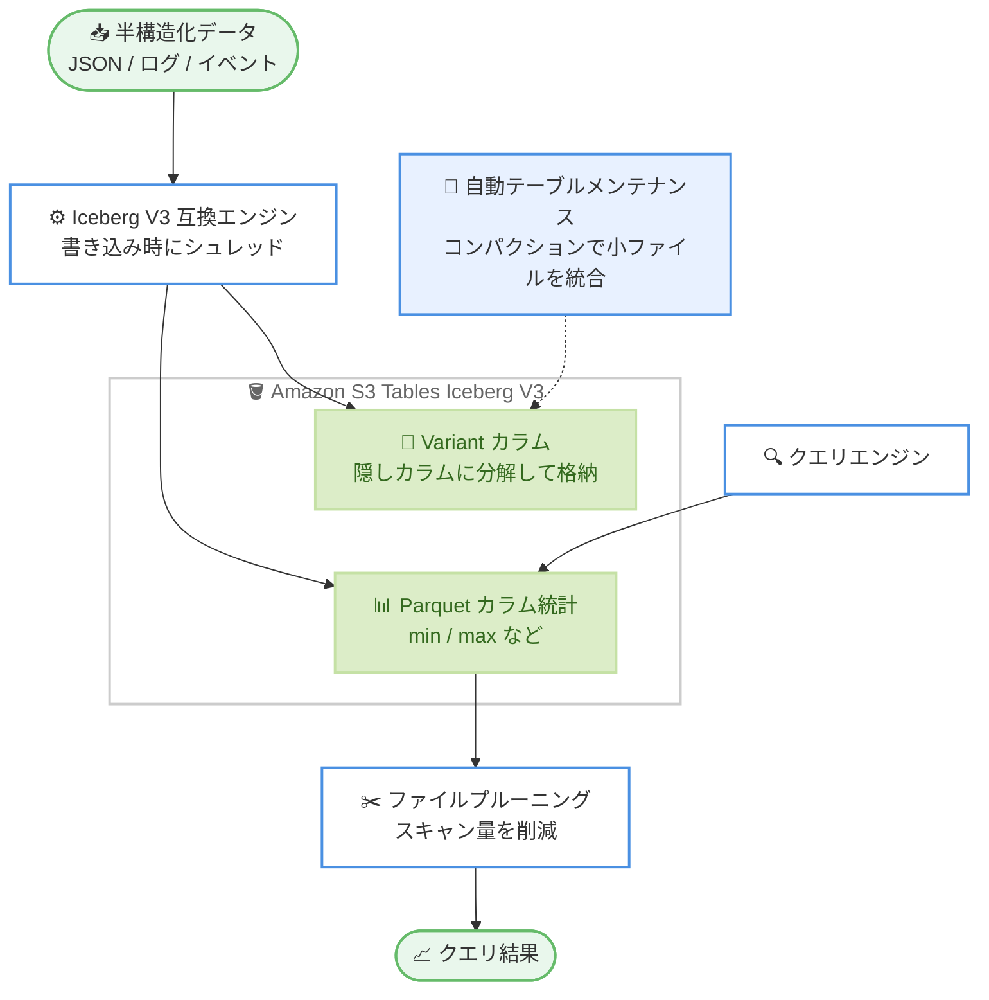

# Amazon S3 Tables - Apache Iceberg V3 の Variant データ型サポート

**リリース日**: 2026 年 7 月 28 日
**サービス**: Amazon S3 Tables
**機能**: Apache Iceberg V3 仕様の Variant データ型サポート

📊 [このアップデートのインフォグラフィックを見る](https://takech9203.github.io/aws-news-summary/20260728-amazon-s3-tables-variant-iceberg-v3.html)

## 概要

Amazon S3 Tables が、Apache Iceberg V3 仕様で定義された Variant データ型をサポートしました。Variant データ型を使用すると、JSON などの半構造化データを事前に固定スキーマを定義することなく、S3 Tables に直接書き込めるようになります。スキーマが頻繁に変化するログ、イベント、テレメトリなどのデータをデータレイクに取り込むワークロードに適した機能です。

Iceberg V3 互換のクエリエンジンは、書き込み時に半構造化データを隠しカラム (hidden columns) にシュレッド (shred) します。このシュレッディングにより Parquet のカラム統計が生成され、ファイルプルーニングなどのクエリ最適化が有効になり、クエリがスキャンするデータ量を削減できます。半構造化データを文字列として格納して都度パースする従来の方式と比べ、クエリパフォーマンスの向上が期待できます。

さらに、S3 Tables は Variant カラムを含むテーブルに対しても、コンパクションなどの継続的なテーブルメンテナンスを自動で実行します。小さなファイルを Iceberg エンジンから読み取り可能な大きなファイルへ統合するため、ストリーミング取り込みなどで発生しがちな小規模ファイルの増加による性能劣化を運用負荷なしに抑制できます。

**アップデート前の課題**

このアップデート以前に存在していた課題は以下のとおりです。

- JSON などの半構造化データを S3 Tables に格納するには、事前に固定スキーマを定義するか、JSON 全体を文字列型カラムに格納する必要があった
- 文字列として格納した JSON はクエリ実行時に毎回パースが必要で、カラム統計によるファイルプルーニングなどの最適化が効かず、スキャン量とクエリコストが増大していた
- スキーマが頻繁に変化するデータソースでは、スキーマ進化の管理や ETL パイプラインでの変換処理が運用負荷となっていた

**アップデート後の改善**

今回のアップデートにより、以下が実現されました。

- 事前のスキーマ定義なしで、JSON などの半構造化データを Variant 型カラムとして S3 Tables に直接書き込めるようになった
- Iceberg V3 互換エンジンが書き込み時にデータを隠しカラムへシュレッドし、Parquet カラム統計に基づくファイルプルーニングなどのクエリ最適化が有効になった
- Variant カラムを含むテーブルでもコンパクションなどの自動テーブルメンテナンスが提供され、小さなファイルの統合による性能維持が運用作業なしで行われるようになった

## アーキテクチャ図



Iceberg V3 互換エンジンが半構造化データを書き込み時に隠しカラムへシュレッドして Parquet カラム統計を生成し、クエリ時にはその統計を利用したファイルプルーニングでスキャン量を削減します。Variant カラムに対しても S3 Tables の自動コンパクションが動作します。

## サービスアップデートの詳細

### 主要機能

1. **Variant データ型による半構造化データの直接書き込み**
   - Apache Iceberg V3 仕様で定義された Variant データ型を S3 Tables でサポート
   - JSON などの半構造化データを、事前の固定スキーマ定義なしで直接書き込み可能
   - スキーマが頻繁に変化するログ、イベント、テレメトリなどのデータ取り込みに適合

2. **シュレッディングによるクエリ最適化**
   - Iceberg V3 互換エンジンが書き込み時に半構造化データを隠しカラムにシュレッド
   - シュレッドされたカラムに対して Parquet カラム統計が生成される
   - カラム統計によりファイルプルーニングなどの最適化が有効になり、クエリのスキャンデータ量を削減

3. **Variant カラムに対する自動テーブルメンテナンス**
   - コンパクションなどの継続的なテーブルメンテナンスを Variant カラムを含むテーブルにも提供
   - 小さなファイルを Iceberg エンジンから読み取り可能な大きなファイルへ自動的に統合
   - ストリーミング取り込みで発生しがちな小ファイル問題を運用負荷なしに抑制

## 技術仕様

### Apache Iceberg V3 と AWS サービスの対応状況

AWS Prescriptive Guidance によると、Iceberg テーブルフォーマット仕様 V3 は以下の AWS サービスでサポートされています。

| AWS サービス | V3 サポート |
|------|------|
| Amazon EMR for Apache Spark | Amazon EMR リリース 7.12 以降 |
| AWS Glue | あり |
| AWS Glue Iceberg REST API / テーブルメンテナンス | あり |
| Amazon SageMaker Unified Studio ノートブック | あり |
| Amazon S3 Tables (Iceberg REST API、テーブルメンテナンス) | あり |
| Amazon Athena (Trino) | なし |

### Iceberg V3 の主な機能

| 機能 | 説明 |
|------|------|
| Variant データ型 | 半構造化データを固定スキーマなしで格納。シュレッディングによりカラム統計とファイルプルーニングが有効 (今回のアップデート) |
| Deletion Vectors | V2 の位置削除ファイルを Puffin ファイル形式の効率的なバイナリに置き換え、更新・削除時の書き込み増幅を削減 |
| Row Lineage | 行レベルの変更追跡を組み込みで提供し、CDC ワークフローの増分処理を効率化 |

### V3 テーブルの作成例

Spark SQL で `format-version` テーブルプロパティを 3 に設定することで、Iceberg V3 テーブルを作成できます。

```sql
CREATE TABLE IF NOT EXISTS myns.events_v3 (
    event_id bigint,
    event_time timestamp,
    payload variant
)
USING iceberg
TBLPROPERTIES (
    'format-version' = '3'
)
```

既存の V2 テーブルは、データを書き換えることなく V3 にアップグレードできます (V3 から V2 へのダウングレードは不可)。

```sql
ALTER TABLE myns.existing_table
SET TBLPROPERTIES ('format-version' = '3')
```

## 設定方法

### 前提条件

1. S3 Tables のテーブルバケットが作成済みであること
2. Iceberg V3 互換のクエリエンジン (Amazon EMR 7.12 以降の Apache Spark、AWS Glue など) を利用できること
3. テーブルバケットおよびテーブルへのアクセスに必要な IAM 権限が設定済みであること

### 手順

#### ステップ 1: テーブルバケットの作成

```bash
aws s3tables create-table-bucket \
    --region us-east-1 \
    --name my-variant-table-bucket
```

S3 Tables のテーブルバケットを作成します。テーブルバケットは Iceberg テーブル専用に最適化されたバケットタイプです。

#### ステップ 2: Variant カラムを含む V3 テーブルの作成

```sql
CREATE TABLE s3tablescatalog.myns.app_events (
    event_id bigint,
    event_time timestamp,
    payload variant
)
USING iceberg
TBLPROPERTIES (
    'format-version' = '3'
)
```

Iceberg V3 互換エンジン (Spark など) から、`format-version = 3` を指定してテーブルを作成し、半構造化データ用のカラムに `variant` 型を指定します。

#### ステップ 3: 半構造化データの書き込みとクエリ

```sql
-- JSON データを Variant カラムに書き込み
INSERT INTO s3tablescatalog.myns.app_events
SELECT event_id, event_time, parse_json(raw_json) AS payload
FROM staging_events;

-- Variant カラムのフィールドを参照してクエリ
SELECT event_id, payload:user.country
FROM s3tablescatalog.myns.app_events
WHERE event_time > current_date() - INTERVAL 7 DAYS;
```

JSON 文字列を Variant 型に変換して書き込みます。エンジンが書き込み時にデータを隠しカラムへシュレッドし、以降のクエリではカラム統計に基づくファイルプルーニングが適用されます。クエリ構文はエンジンにより異なるため、利用するエンジンのドキュメントを確認してください。

## メリット

### ビジネス面

- **データ活用までの時間短縮**: スキーマ設計や ETL での変換処理を待たずに半構造化データをそのまま取り込めるため、分析開始までのリードタイムが短縮される
- **クエリコストの削減**: ファイルプルーニングによりスキャンデータ量が減少し、スキャン量課金のエンジンではクエリコストの削減につながる
- **運用負荷の軽減**: Variant カラムを含むテーブルでもコンパクションなどのメンテナンスがマネージドで実行され、小ファイル対策の運用作業が不要

### 技術面

- **スキーマレスな取り込みと最適化の両立**: 固定スキーマ不要の柔軟性と、シュレッディングによるカラム統計・ファイルプルーニングという列指向フォーマットの最適化を同時に実現
- **オープン仕様への準拠**: Apache Iceberg V3 という標準仕様に基づくため、V3 互換の複数エンジンから同じテーブルを利用できる
- **スキーマ進化への耐性**: データソース側のフィールド追加・変更があっても、テーブルスキーマの変更なしに取り込みを継続できる

## デメリット・制約事項

### 制限事項

- Variant データ型の利用には Iceberg V3 対応が必要であり、書き込み時のシュレッディングは Iceberg V3 互換エンジン側で行われる
- Amazon Athena (Trino) は本記事執筆時点で Iceberg V3 をサポートしていないため、利用するエンジンの V3 対応状況の確認が必要
- V2 から V3 へのアップグレードは一方向であり、V3 にアップグレードしたテーブルを V2 に戻すことはできない
- 利用可能リージョンは 14 リージョンに限定される (下記参照)

### 考慮すべき点

- テーブルにアクセスするすべてのエンジン・サードパーティツールが V3 仕様に対応しているかを事前に確認する必要がある
- シュレッディングの挙動やカラム統計の生成粒度はエンジンの実装に依存するため、想定するクエリパターンで性能検証を行うことが望ましい
- 頻繁にフィルタ条件として使用するフィールドが明確に決まっている場合は、通常の型付きカラムとして定義する設計との比較検討が有効

## ユースケース

### ユースケース 1: アプリケーションログ・イベントデータの直接取り込み

**シナリオ**: マイクロサービス群が出力する JSON 形式のイベントログは、サービスごと・バージョンごとにフィールド構成が異なり、頻繁に変化する。従来は取り込み前にスキーマを統一する ETL が必要だった。

**実装例**:
```sql
CREATE TABLE s3tablescatalog.logs.service_events (
    service_name string,
    event_time timestamp,
    event variant
)
USING iceberg
TBLPROPERTIES ('format-version' = '3')
```

**効果**: スキーマ統一の ETL を省略してイベントをそのまま取り込みつつ、シュレッディングによるファイルプルーニングで特定サービス・期間のクエリを効率的に実行できる。

### ユースケース 2: IoT テレメトリデータの分析基盤

**シナリオ**: 多種多様なデバイスから送信されるテレメトリはデバイス種別ごとにペイロード構造が異なる。デバイスの追加やファームウェア更新のたびにスキーマ変更が発生していた。

**実装例**:
```sql
INSERT INTO s3tablescatalog.iot.telemetry
SELECT device_id, ingest_time, parse_json(payload) AS metrics
FROM kinesis_staging
```

**効果**: デバイス追加時のスキーマ変更作業が不要になり、ストリーミング取り込みで発生する小ファイルも自動コンパクションで統合されるため、性能を維持しながら取り込みパイプラインを簡素化できる。

### ユースケース 3: 半構造化データを含む既存 V2 テーブルの近代化

**シナリオ**: 既存の Iceberg V2 テーブルでは JSON を文字列カラムに格納しており、クエリのたびにパースが発生してスキャン量も大きい。

**実装例**:
```sql
ALTER TABLE s3tablescatalog.myns.legacy_table
SET TBLPROPERTIES ('format-version' = '3');
-- 以降、新規カラムに variant 型を採用し、JSON 文字列カラムから移行
```

**効果**: V3 へのアップグレード後に Variant 型へ移行することで、パースコストの削減とカラム統計による最適化が可能になる。ただし V3 へのアップグレードは一方向のため、非本番環境での事前検証が推奨される。

## 料金

Variant データ型の利用自体に追加料金は発生せず、S3 Tables の標準料金 (ストレージ、リクエスト、モニタリング、コンパクション処理) が適用されます。コンパクションは処理されたデータ量とオブジェクト数に基づいて課金されます。詳細は [Amazon S3 の料金ページ](https://aws.amazon.com/s3/pricing/) を参照してください。

なお、ファイルプルーニングによりクエリエンジン側のスキャンデータ量が削減されるため、スキャン量に基づいて課金されるエンジンではクエリコストの削減効果が期待できます。

## 利用可能リージョン

本機能は以下の 14 リージョンで利用可能です。

- 米国東部 (バージニア北部、オハイオ)
- 米国西部 (オレゴン)
- アジアパシフィック (ムンバイ、ソウル、シンガポール、シドニー、東京)
- カナダ (中部)
- 欧州 (フランクフルト、アイルランド、ロンドン、パリ、ストックホルム)
- 南米 (サンパウロ)

## 関連サービス・機能

- **Amazon S3 Tables**: Apache Iceberg テーブル専用に最適化されたテーブルバケットを提供するストレージ機能。コンパクション、スナップショット管理、参照されないファイルの削除などのメンテナンスを自動実行
- **AWS Glue**: Iceberg V3 対応の ETL エンジンおよびデータカタログ。Iceberg REST API とテーブルメンテナンスをサポート
- **Amazon EMR**: リリース 7.12 以降の Apache Spark で Iceberg V3 をサポートし、Variant 型データの書き込み・クエリに利用可能
- **Amazon SageMaker Lakehouse / Unified Studio**: S3 Tables と統合したレイクハウス環境で Iceberg テーブルへのアクセスを提供

## 参考リンク

- 📊 [インフォグラフィック](https://takech9203.github.io/aws-news-summary/20260728-amazon-s3-tables-variant-iceberg-v3.html)
- [公式発表 (What's New)](https://aws.amazon.com/about-aws/whats-new/2026/07/amazon-s3-tables-variant-iceberg-v3/)
- [Amazon S3 Tables 製品ページ](https://aws.amazon.com/s3/features/tables/)
- [AWS Prescriptive Guidance: Iceberg テーブル仕様バージョン 3](https://docs.aws.amazon.com/prescriptive-guidance/latest/apache-iceberg-on-aws/table-spec-v3.html)
- [S3 Tables のテーブルメンテナンス](https://docs.aws.amazon.com/AmazonS3/latest/userguide/s3-tables-maintenance-overview.html)
- [Apache Iceberg テーブル仕様](https://iceberg.apache.org/spec/)
- [Amazon S3 料金ページ](https://aws.amazon.com/s3/pricing/)

## まとめ

Amazon S3 Tables の Variant データ型サポートにより、JSON などの半構造化データを事前のスキーマ定義なしで直接格納しながら、シュレッディングとカラム統計によるクエリ最適化、自動コンパクションによる性能維持を両立できるようになりました。ログやテレメトリなど、スキーマが変化しやすいデータをデータレイクで扱うワークロードでは、V3 テーブルと Variant 型の採用を検討する価値があります。導入にあたっては、利用するクエリエンジンの Iceberg V3 対応状況を確認し、非本番環境での性能検証から始めることを推奨します。
