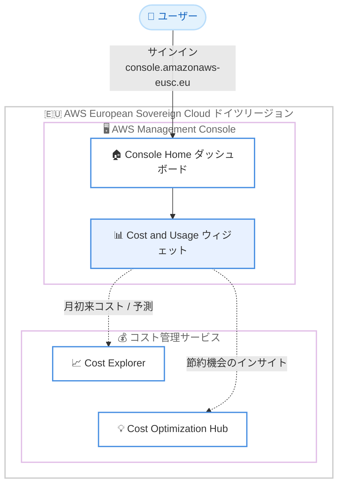

# AWS Console Home - AWS European Sovereign Cloud (ドイツ) リージョンでの Cost and Usage ウィジェットサポート

**リリース日**: 2026 年 7 月 28 日
**サービス**: AWS Console Home / AWS Management Console
**機能**: Cost and Usage ウィジェット (AWS European Sovereign Cloud 対応)

📊 [このアップデートのインフォグラフィックを見る](https://takech9203.github.io/aws-news-summary/20260728-aws-console-home-cost-and-usage-eu-sovereign-cloud.html)

## 概要

AWS Console Home が、AWS European Sovereign Cloud (ドイツ) リージョンで Cost and Usage ウィジェットをサポートしました。このウィジェットにより、Cost Explorer と Cost Optimization Hub のインサイトを Console Home のダッシュボード上に直接表示できるようになります。

Cost and Usage ウィジェットを使用すると、月初来 (Month-to-Date) のコストとコスト予測の追跡、潜在的な節約機会の特定、期間ごとのサービス別コスト内訳の確認が、コンソールにサインインした直後の画面で可能になります。個別のコスト管理サービスの画面に移動することなく、日々の運用の中でコスト状況を把握できます。

AWS European Sovereign Cloud は、欧州のデータ主権要件 (データレジデンシー、運用の自律性、レジリエンシー) に対応するために構築された、独立して運用されるクラウドです。今回のアップデートは、この主権クラウド環境を利用する欧州の政府機関や企業のユーザーにとって、標準の AWS リージョンと同等のコスト可視化体験を提供するものです。

**アップデート前の課題**

このアップデート以前には、以下の課題がありました。

- AWS European Sovereign Cloud (ドイツ) リージョンの Console Home では Cost and Usage ウィジェットが利用できず、コスト状況を確認するには Cost Explorer などのサービス画面へ個別に移動する必要があった
- サインイン直後のダッシュボードで月初来コストや予測コストを一目で把握できなかった
- 標準の AWS リージョンで提供されている Console Home のコスト可視化体験と差分があった

**アップデート後の改善**

今回のアップデートにより、以下が可能になりました。

- AWS European Sovereign Cloud (ドイツ) リージョンの Console Home ダッシュボードに Cost and Usage ウィジェットを追加し、Cost Explorer と Cost Optimization Hub のインサイトを直接表示できるようになった
- 月初来コストとコスト予測をサインイン直後の画面で追跡できるようになった
- Cost Optimization Hub による節約機会の特定や、期間ごとのサービス別コスト内訳の確認がダッシュボード上で完結するようになった

## アーキテクチャ図



AWS European Sovereign Cloud (ドイツ) リージョンの Console Home に追加された Cost and Usage ウィジェットが、Cost Explorer と Cost Optimization Hub からインサイトを取得してダッシュボードに表示する構成を示しています。

## サービスアップデートの詳細

### 主要機能

1. **月初来コストとコスト予測の追跡**
   - Cost Explorer のデータに基づき、当月の月初来 (Month-to-Date) コストを表示
   - 当月のコスト予測 (フォーキャスト) を確認可能
   - コンソールのサインイン直後にコストの傾向を把握できる

2. **節約機会の特定**
   - Cost Optimization Hub のインサイトをウィジェット上に表示
   - 潜在的なコスト削減機会をダッシュボードから確認可能
   - 詳細な最適化アクションへの入り口として機能

3. **サービス別コスト内訳の表示**
   - 期間ごとの支出をサービス別に分解して表示
   - どのサービスがコストの主要因かを一目で把握可能

4. **ウィジェットのカスタマイズ**
   - Console Home の [Add widgets] からドラッグアンドドロップで追加
   - ドラッグインジケーターによる配置変更、右下のリサイズアイコンによるサイズ変更に対応
   - 不要になった場合はウィジェットのメニューから削除可能で、後から再追加もできる

## 技術仕様

### ウィジェットの概要

| 項目 | 詳細 |
|------|------|
| ウィジェット名 | Cost and Usage |
| 表示場所 | AWS Console Home ダッシュボード |
| データソース | Cost Explorer、Cost Optimization Hub |
| 表示内容 | 月初来コスト、コスト予測、節約機会、サービス別コスト内訳 |
| 対象環境 | AWS European Sovereign Cloud (ドイツ) リージョン |
| コンソール URL | https://console.amazonaws-eusc.eu/ |

## 設定方法

### 前提条件

1. AWS European Sovereign Cloud のアカウントを保有していること
2. AWS European Sovereign Cloud のコンソール (console.amazonaws-eusc.eu) にサインインできること
3. コスト情報の表示に必要な IAM 権限 (Cost Explorer / Cost Optimization Hub の参照権限) を持っていること

### 手順

#### ステップ 1: コンソールにサインイン

AWS European Sovereign Cloud の AWS Management Console (https://console.amazonaws-eusc.eu/) にサインインします。サインイン後、Console Home ダッシュボードが表示されます。

#### ステップ 2: ウィジェットの追加

Console Home ダッシュボードの右上または右下にある [+Add widgets] を選択します。ウィジェット一覧から Cost and Usage ウィジェットを見つけ、左上のドラッグインジケーター (縦 6 点のアイコン) を使ってダッシュボード上にドラッグします。

#### ステップ 3: レイアウトの調整

追加したウィジェットは、ドラッグインジケーターで位置を移動したり、右下のリサイズアイコンでサイズを変更したりできます。レイアウトを初期状態に戻したい場合は、右上の [Reset to default layout] を使用します。

## メリット

### ビジネス面

- **コストの早期把握**: サインイン直後のダッシュボードで月初来コストと予測を確認でき、予算超過の兆候を早期に発見できる
- **コスト最適化の促進**: Cost Optimization Hub の節約機会がダッシュボードに表示されるため、コスト削減アクションへの着手が容易になる
- **主権クラウドでの同等の体験**: データ主権要件により AWS European Sovereign Cloud を利用する組織でも、標準リージョンと同様のコスト可視化体験を得られる

### 技術面

- **画面遷移の削減**: Cost Explorer や Cost Optimization Hub の画面へ個別に移動することなく、主要なコストインサイトを一画面で確認できる
- **カスタマイズ可能なダッシュボード**: ウィジェットの追加・削除・配置変更・リサイズにより、チームの運用に合わせた画面構成にできる
- **追加設定が不要**: ウィジェットを追加するだけで利用でき、追加のインフラ構築や設定作業は不要

## デメリット・制約事項

### 制限事項

- 今回の発表は AWS European Sovereign Cloud (ドイツ) リージョンを対象としたもの
- ウィジェットに表示されるのは概要レベルのインサイトであり、詳細な分析には Cost Explorer や Cost Optimization Hub 本体の画面が必要
- コスト情報の表示には、対応する IAM 権限が必要

### 考慮すべき点

- Console Home のウィジェットレイアウトはユーザーごとの設定であるため、チームで共有するコストダッシュボードが必要な場合は別の仕組み (Cost Explorer のレポートなど) を検討する
- コスト管理の運用ルール (タグ付け戦略、予算アラートなど) と組み合わせることで、ウィジェットによる可視化の効果が高まる

## ユースケース

### ユースケース 1: 主権クラウド環境での日次コストチェック

**シナリオ**: ドイツの公共機関が AWS European Sovereign Cloud 上でワークロードを運用しており、運用担当者が毎朝コスト状況を確認したい。

**実装例**:
```text
1. console.amazonaws-eusc.eu にサインイン
2. Console Home に Cost and Usage ウィジェットを追加
3. 毎朝のサインイン時に月初来コストと予測を確認
```

**効果**: サービス画面への遷移なしで日々のコスト確認が完了し、予算超過の兆候を早期に検知できる。

### ユースケース 2: コスト最適化活動の起点として活用

**シナリオ**: 欧州の企業がコスト最適化の取り組みを開始し、削減機会を定期的にレビューしたい。

**実装例**:
```text
1. Cost and Usage ウィジェットで Cost Optimization Hub の節約機会を確認
2. 気になる項目があれば Cost Optimization Hub 本体で詳細を確認
3. 推奨アクション (リサイズ、コミットメント購入など) を実施
```

**効果**: 節約機会がダッシュボードに常時表示されることで、コスト最適化活動が習慣化しやすくなる。

### ユースケース 3: サービス別コストの傾向監視

**シナリオ**: プラットフォームチームが、どの AWS サービスにコストが集中しているかを継続的に監視したい。

**実装例**:
```text
1. Cost and Usage ウィジェットで期間ごとのサービス別コスト内訳を確認
2. 特定サービスのコスト増加を検知したら Cost Explorer で詳細分析
3. 必要に応じてタグやコスト配分ルールを整備
```

**効果**: コスト構造の変化を早期に把握し、詳細分析や是正アクションへ迅速につなげられる。

## 料金

Cost and Usage ウィジェット自体の利用に追加料金は発表されていません。Console Home および Cost Explorer のコンソール上での閲覧は無料で利用できます (Cost Explorer API を使用したプログラムによるアクセスには別途料金が発生します)。

## 利用可能リージョン

- AWS European Sovereign Cloud (ドイツ) リージョン

## 関連サービス・機能

- **AWS Cost Explorer**: コストと使用量の可視化・分析サービス。ウィジェットの月初来コストや予測、サービス別内訳のデータソース
- **AWS Cost Optimization Hub**: コスト削減機会を一元的に特定・集約するサービス。ウィジェットの節約機会インサイトのデータソース
- **AWS Console Home**: AWS Management Console のホームダッシュボード。ウィジェットの追加・削除・配置変更によるカスタマイズが可能
- **AWS European Sovereign Cloud**: 欧州のデータレジデンシー、運用の自律性、レジリエンシー要件に対応する、独立して運用されるクラウド

## 参考リンク

- 📊 [インフォグラフィック](https://takech9203.github.io/aws-news-summary/20260728-aws-console-home-cost-and-usage-eu-sovereign-cloud.html)
- [公式発表 (What's New)](https://aws.amazon.com/about-aws/whats-new/2026/07/aws-console-home-cost-and-usage-eu-sovereign-cloud)
- [ドキュメント: Working with widgets in AWS Console Home (AWS European Sovereign Cloud)](https://docs.aws.eu/awsconsolehelpdocs/latest/gsg/work-with-widgets.html)
- [AWS European Sovereign Cloud コンソール](https://console.amazonaws-eusc.eu/)
- [AWS のデジタル主権への取り組み](https://aws.amazon.com/compliance/europe-digital-sovereignty/)

## まとめ

AWS European Sovereign Cloud (ドイツ) リージョンの Console Home で Cost and Usage ウィジェットが利用可能になり、主権クラウド環境でも標準リージョンと同様にサインイン直後の画面でコスト状況を把握できるようになりました。AWS European Sovereign Cloud を利用中または検討中の組織は、Console Home にウィジェットを追加し、月初来コスト・予測・節約機会の日常的な確認をワークフローに組み込むことを推奨します。
