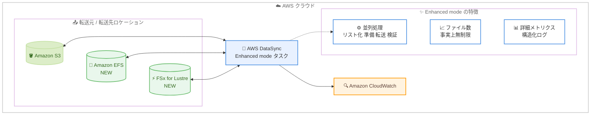

# AWS DataSync - Enhanced mode が Amazon EFS と Amazon FSx for Lustre をサポート

**リリース日**: 2026 年 7 月 28 日
**サービス**: AWS DataSync
**機能**: Enhanced mode での Amazon EFS / Amazon FSx for Lustre ロケーションサポート

📊 [このアップデートのインフォグラフィックを見る](https://takech9203.github.io/aws-news-summary/20260728-aws-datasync-amazon-efs-fsx-lustre.html)

## 概要

AWS DataSync の Enhanced mode が、Amazon EFS と Amazon FSx for Lustre を転送元または転送先ロケーションとしてサポートしました。AWS DataSync は、ネットワーク経由のデータ移動を簡素化するセキュアで高速なデータ転送サービスです。Enhanced mode は、データのリスト化・準備・転送・検証を並列に実行することで Basic mode より高いパフォーマンスを提供し、ファイル数の制限が事実上撤廃され、詳細な転送メトリクスを利用できます。

これまで Amazon EFS や Amazon FSx for Lustre が関係する転送は Basic mode のみの対応であり、タスクあたりのファイル数クォータや逐次処理によるパフォーマンスの制約を受けていました。今回のアップデートにより、Amazon S3、Amazon EFS、Amazon FSx for Lustre の間の転送をエージェント不要で Enhanced mode により実行できるようになり、大規模データ移行に加えて、エージェント型 AI や ML トレーニング、ハイパフォーマンスコンピューティング (HPC)、ゲノミクス解析、メディアレンダリングといった大量の小さなファイルを扱うワークフローが大幅に簡素化されます。

**アップデート前の課題**

- Amazon EFS / Amazon FSx for Lustre が関係する転送は Basic mode のみに制限されていた
- Basic mode ではタスク実行あたりのファイル数・オブジェクト数・ディレクトリ数にクォータがあり、大規模データセットではタスク分割などの回避策が必要だった
- Basic mode はデータの準備・転送・検証を逐次実行するため、大量の小さなファイルを含むワークロードで転送時間が長くなりがちだった
- 取得できる転送カウンターやメトリクスが限定的で、大規模転送の進捗を詳細に把握しにくかった

**アップデート後の改善**

- Amazon EFS / Amazon FSx for Lustre を転送元・転送先として Enhanced mode タスクを作成できるようになった
- リスト化・準備・転送・検証の並列処理により、ほとんどのワークロードで Basic mode より高いパフォーマンスを実現できるようになった
- ファイル数の制限が事実上撤廃され、数億ファイル規模のデータセットもタスク分割なしで転送できるようになった
- 転送元で検出したオブジェクト数や準備済みオブジェクト数など、より詳細なカウンターとメトリクス、JSON 形式の構造化ログを利用できるようになった

## アーキテクチャ図



Amazon S3、Amazon EFS、Amazon FSx for Lustre の間の転送を、エージェント不要の Enhanced mode タスクで実行できるようになりました。並列処理・ファイル数無制限・詳細メトリクスといった Enhanced mode の利点をフルマネージドファイルストレージでも活用できます。

## サービスアップデートの詳細

### 主要機能

1. **Amazon EFS / Amazon FSx for Lustre の Enhanced mode サポート**
   - Amazon EFS と Amazon FSx for Lustre を Enhanced mode タスクの転送元・転送先として指定可能
   - Amazon S3、Amazon EFS、Amazon FSx for Lustre 間の転送はエージェント不要
   - NFS / SMB ファイルサーバーや HDFS クラスターとの間の転送は Enhanced mode エージェントを使用

2. **並列データ処理による高パフォーマンス**
   - データのリスト化・準備・転送・検証を並列に実行
   - 逐次処理の Basic mode と比較して、ほとんどのワークロードで高速
   - 大量の小さなファイルを含むデータセットで特に効果が大きい

3. **ファイル数制限の撤廃**
   - Basic mode ではタスク実行あたりのファイル数・オブジェクト数にクォータが適用される
   - Enhanced mode では事実上無制限のオブジェクトを 1 回のタスク実行で処理可能
   - 大規模データセットをタスク分割せずに転送できる

4. **詳細な転送メトリクスと構造化ログ**
   - 転送元で検出されたオブジェクト数、タスク実行ごとの準備済みオブジェクト数などの追加カウンター
   - ファイル / オブジェクトカウンターと同様のフォルダーカウンター
   - JSON 形式の構造化ログにより、ログ分析基盤との統合が容易

## 技術仕様

### Enhanced mode と Basic mode の比較

| 項目 | Enhanced mode | Basic mode |
|------|---------------|------------|
| 処理方式 | リスト化・準備・転送・検証を並列実行 | 準備・転送・検証を逐次実行 |
| ファイル数 | 事実上無制限 | クォータあり |
| 対応ロケーション | Amazon S3、Amazon EFS、Amazon FSx for Lustre、NFS、SMB、HDFS、Azure Blob、オブジェクトストレージ | DataSync がサポートするすべてのロケーション |
| エージェント | S3 / EFS / FSx for Lustre 間は不要 | セルフマネージドストレージとの転送に必要 |
| メトリクス | 追加カウンターを含む詳細なメトリクス | 基本的なカウンターのみ |
| ログ | 構造化ログ (JSON 形式) | 非構造化ログ |
| データ検証 | 転送されたデータのみ検証 | デフォルトで全データを検証 |

### 必要な権限

Enhanced mode タスクの作成には、使用する IAM ロールに `iam:CreateServiceLinkedRole` 権限が必要です。AWS 管理ポリシー `AWSDataSyncFullAccess` の利用が推奨されています。

### タスク作成時の設定

```json
{
  "SourceLocationArn": "arn:aws:datasync:ap-northeast-1:123456789012:location/loc-src",
  "DestinationLocationArn": "arn:aws:datasync:ap-northeast-1:123456789012:location/loc-dst",
  "TaskMode": "ENHANCED",
  "Options": {
    "TransferMode": "CHANGED",
    "VerifyMode": "ONLY_FILES_TRANSFERRED",
    "LogLevel": "TRANSFER"
  }
}
```

`CreateTask` API の `TaskMode` パラメータに `ENHANCED` を指定します。タスク作成後にタスクモードを変更することはできません。

## 設定方法

### 前提条件

1. 転送元・転送先となる Amazon EFS ファイルシステム、Amazon FSx for Lustre ファイルシステム、または Amazon S3 バケットが作成済みであること
2. DataSync を使用する IAM ロールに `iam:CreateServiceLinkedRole` 権限があること
3. AWS CLI を使用する場合は、転送を実行するリージョンが設定されていること

### 手順

#### ステップ 1: 転送元 / 転送先ロケーションの作成

```bash
# Amazon EFS ロケーションを作成
aws datasync create-location-efs \
  --efs-filesystem-arn "arn:aws:elasticfilesystem:ap-northeast-1:123456789012:file-system/fs-0123456789abcdef0" \
  --ec2-config "SubnetArn=arn:aws:ec2:ap-northeast-1:123456789012:subnet/subnet-0123456789abcdef0,SecurityGroupArns=arn:aws:ec2:ap-northeast-1:123456789012:security-group/sg-0123456789abcdef0"

# Amazon FSx for Lustre ロケーションを作成
aws datasync create-location-fsx-lustre \
  --fsx-filesystem-arn "arn:aws:fsx:ap-northeast-1:123456789012:file-system/fs-0123456789abcdef0" \
  --security-group-arns "arn:aws:ec2:ap-northeast-1:123456789012:security-group/sg-0123456789abcdef0"
```

DataSync がアクセスする Amazon EFS と Amazon FSx for Lustre のロケーションを作成します。ファイルシステムの ARN と、DataSync がファイルシステムに接続するためのサブネットおよびセキュリティグループを指定します。

#### ステップ 2: Enhanced mode タスクの作成

```bash
aws datasync create-task \
  --source-location-arn "arn:aws:datasync:ap-northeast-1:123456789012:location/loc-src" \
  --destination-location-arn "arn:aws:datasync:ap-northeast-1:123456789012:location/loc-dst" \
  --name "efs-to-fsx-lustre-enhanced" \
  --task-mode "ENHANCED" \
  --options TransferMode=CHANGED,VerifyMode=ONLY_FILES_TRANSFERRED,LogLevel=TRANSFER
```

転送元と転送先のロケーション ARN を指定し、`--task-mode "ENHANCED"` で Enhanced mode タスクを作成します。`TransferMode=CHANGED` は変更されたデータのみを転送し、`VerifyMode=ONLY_FILES_TRANSFERRED` は転送されたファイルのみを検証する設定です。

#### ステップ 3: タスクの実行とモニタリング

```bash
# タスクを実行
aws datasync start-task-execution \
  --task-arn "arn:aws:datasync:ap-northeast-1:123456789012:task/task-0123456789abcdef0"

# タスク実行の詳細メトリクスを確認
aws datasync describe-task-execution \
  --task-execution-arn "arn:aws:datasync:ap-northeast-1:123456789012:task/task-0123456789abcdef0/execution/exec-0123456789abcdef0"
```

タスクを実行し、実行状況を確認します。Enhanced mode では転送元で検出されたオブジェクト数や準備済みオブジェクト数などの詳細なカウンターを確認できます。Amazon CloudWatch Logs には JSON 形式の構造化ログが出力されます。

## メリット

### ビジネス面

- **移行プロジェクトの短縮**: 並列処理による高速転送とファイル数制限の撤廃により、大規模なファイルシステム移行の計画・実行が簡素化され、移行期間を短縮できる
- **AI / ML ワークフローの加速**: ML トレーニングデータやエージェント型 AI のデータセットを Amazon S3 と FSx for Lustre / EFS の間で高速に移動でき、データ準備のリードタイムを削減できる
- **運用負荷の削減**: タスク分割などのクォータ回避策が不要になり、大規模データセットの転送を単一タスクで管理できる

### 技術面

- **エージェントレス転送**: Amazon S3、Amazon EFS、Amazon FSx for Lustre 間の転送はエージェントのデプロイ・管理が不要
- **並列パイプライン**: リスト化・準備・転送・検証が並列に進行するため、転送開始までの待ち時間が短く、大量の小さなファイルでも高いスループットを維持できる
- **可観測性の向上**: 詳細なカウンター・メトリクスと構造化ログにより、転送の進捗把握やトラブルシューティングが容易になる

## デメリット・制約事項

### 制限事項

- タスク作成後にタスクモード (Enhanced / Basic) を変更することはできない
- Enhanced mode がサポートするロケーションの組み合わせは限定されており、Amazon FSx for Windows File Server などとの転送は引き続き Basic mode が必要
- Enhanced mode タスクの作成には `iam:CreateServiceLinkedRole` 権限が必要
- オブジェクトタグをサポートしないロケーションとのクラウドストレージ転送では、`ObjectTags` オプションが未指定または `PRESERVE` の場合にタスク実行が即時失敗する (Basic mode では該当オブジェクトのみ失敗)

### 考慮すべき点

- Enhanced mode はデフォルトで転送されたデータのみを検証する。全データの検証が必要な要件がある場合は検証オプションを確認すること
- Enhanced mode は Basic mode と料金体系が異なるため、転送量とタスク実行頻度に応じたコスト比較を行うこと
- 既存の Basic mode タスクを Enhanced mode に切り替えるには、タスクの再作成が必要

## ユースケース

### ユースケース 1: 大規模ファイルシステムの移行

**シナリオ**: オンプレミス NFS サーバーから Amazon EFS へ、数億ファイル規模のファイル共有を移行する。従来は Basic mode のファイル数クォータのためタスクを複数に分割する必要があった。

**実装例**:
```bash
aws datasync create-task \
  --source-location-arn "arn:aws:datasync:ap-northeast-1:123456789012:location/loc-nfs" \
  --destination-location-arn "arn:aws:datasync:ap-northeast-1:123456789012:location/loc-efs" \
  --name "nfs-to-efs-migration" \
  --task-mode "ENHANCED"
```

**効果**: タスク分割なしで移行全体を単一タスクとして管理でき、並列処理により移行時間を短縮できる。詳細メトリクスで移行の進捗を正確に追跡できる。

### ユースケース 2: ML トレーニング用データの S3 から FSx for Lustre への転送

**シナリオ**: Amazon S3 に蓄積したトレーニングデータセットを、GPU クラスターが利用する Amazon FSx for Lustre ファイルシステムへ定期的に転送し、モデルトレーニングを実行する。

**実装例**:
```bash
aws datasync create-task \
  --source-location-arn "arn:aws:datasync:ap-northeast-1:123456789012:location/loc-s3" \
  --destination-location-arn "arn:aws:datasync:ap-northeast-1:123456789012:location/loc-fsx-lustre" \
  --name "s3-to-lustre-training-data" \
  --task-mode "ENHANCED" \
  --options TransferMode=CHANGED
```

**効果**: 数百万の小さなファイルからなるデータセットも並列処理で高速に転送でき、トレーニングジョブ開始までのデータ準備時間を短縮できる。`TransferMode=CHANGED` により差分のみを転送し、転送コストを抑制できる。

### ユースケース 3: HPC / ゲノミクス解析結果のアーカイブ

**シナリオ**: Amazon FSx for Lustre 上で実行したゲノミクス解析や HPC シミュレーションの結果ファイルを、長期保管のため Amazon S3 へ定期的に転送する。

**実装例**:
```bash
aws datasync create-task \
  --source-location-arn "arn:aws:datasync:ap-northeast-1:123456789012:location/loc-fsx-lustre" \
  --destination-location-arn "arn:aws:datasync:ap-northeast-1:123456789012:location/loc-s3-archive" \
  --name "lustre-to-s3-archive" \
  --task-mode "ENHANCED" \
  --options TransferMode=CHANGED,VerifyMode=ONLY_FILES_TRANSFERRED
```

**効果**: 解析ごとに生成される大量の結果ファイルをエージェントレスかつ高速に S3 へ退避でき、FSx for Lustre のストレージ容量を効率的に利用できる。構造化ログにより転送の監査証跡も確保できる。

## 料金

DataSync は転送されたデータ量に基づく従量課金です。初期費用や最低料金はありません。Enhanced mode と Basic mode では料金レートが異なります。

- Basic mode: 0.0125 USD/GB
- Enhanced mode: 0.015 USD/GB + タスク実行あたり 0.55 USD

上記に加えて、S3 リクエスト料金、EFS / FSx / KMS / CloudWatch などの関連サービスの標準料金、リージョン間・リージョン外へのデータ転送料金が別途発生します。最新の料金は [DataSync 料金ページ](https://aws.amazon.com/datasync/pricing/) を確認してください。

### 料金例

| 使用量 | 料金 (概算) |
|--------|-------------|
| Enhanced mode で 1 TB 転送 (1 回のタスク実行) | 約 15.91 USD (0.015 USD/GB x 1,024 GB + 0.55 USD) |
| Basic mode で 1 TB 転送 | 約 12.80 USD (0.0125 USD/GB x 1,024 GB) |

## 利用可能リージョン

AWS DataSync が利用可能なすべての AWS リージョンで利用できます。リージョンごとの提供状況は [AWS リージョン別サービス一覧](https://aws.amazon.com/about-aws/global-infrastructure/regional-product-services/) を確認してください。

## 関連サービス・機能

- **Amazon EFS**: フルマネージドの NFS ファイルシステム。今回のアップデートで Enhanced mode の転送元・転送先として利用可能になった
- **Amazon FSx for Lustre**: HPC や ML 向けの高性能ファイルシステム。今回のアップデートで Enhanced mode の転送元・転送先として利用可能になった
- **Amazon S3**: Enhanced mode の最初の対応ロケーション。EFS / FSx for Lustre との間でエージェントレス転送が可能
- **Amazon CloudWatch**: Enhanced mode の詳細メトリクスと構造化ログの出力先としてタスクのモニタリングに使用

## 参考リンク

- 📊 [インフォグラフィック](https://takech9203.github.io/aws-news-summary/20260728-aws-datasync-amazon-efs-fsx-lustre.html)
- [公式発表 (What's New)](https://aws.amazon.com/about-aws/whats-new/2026/07/aws-datasync-amazon-efs-fsx-lustre/)
- [ドキュメント: AWS DataSync とは](https://docs.aws.amazon.com/datasync/latest/userguide/what-is-datasync.html)
- [ドキュメント: タスクモードの選択](https://docs.aws.amazon.com/datasync/latest/userguide/choosing-task-mode.html)
- [料金ページ](https://aws.amazon.com/datasync/pricing/)

## まとめ

AWS DataSync Enhanced mode が Amazon EFS と Amazon FSx for Lustre に対応したことで、フルマネージドファイルストレージへの大規模データ移行や、AI / ML、HPC、ゲノミクス、メディアレンダリングといった大量ファイルを扱うワークフローのデータ移動が大幅に簡素化されます。Basic mode のファイル数クォータや逐次処理がボトルネックとなっていた場合は、新規タスクを Enhanced mode で作成し、パフォーマンスとコストを評価することを推奨します。
