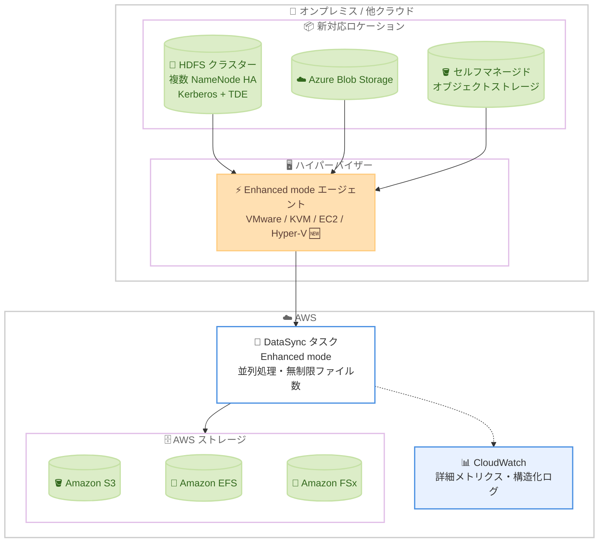

# AWS DataSync - Enhanced mode が HDFS、Azure Blob、オブジェクトストレージロケーションと Hyper-V エージェントをサポート

**リリース日**: 2026 年 7 月 28 日
**サービス**: AWS DataSync
**機能**: Enhanced mode のエージェントベース転送における HDFS / Microsoft Azure Blob Storage / セルフマネージドオブジェクトストレージ対応、および Microsoft Hyper-V への Enhanced mode エージェントデプロイ対応

📊 [このアップデートのインフォグラフィックを見る](https://takech9203.github.io/aws-news-summary/20260728-aws-datasync-hdfs-azure-blob-hyper-v.html)

## 概要

AWS DataSync の Enhanced mode が、エージェントベースのデータ転送において HDFS (Hadoop Distributed File System)、Microsoft Azure Blob Storage、セルフマネージドオブジェクトストレージの 3 つのロケーションタイプを新たにサポートしました。また、Enhanced mode エージェントを Microsoft Hyper-V ハイパーバイザーにデプロイできるようになりました。

Enhanced mode は、リスト化・準備・転送・検証を並列実行することで Basic mode より高いパフォーマンスを実現し、実質無制限のファイル数を扱える DataSync のタスクモードです。今回のアップデートにより、DataSync エージェントを使用してこれらのロケーションと転送を行うお客様も、並列処理、無制限のファイル数、詳細なメトリクスといった Enhanced mode の利点を活用できるようになりました。

特に HDFS サポートには、高可用性 (HA) のための複数 NameNode 構成と、Kerberos 認証使用時の Transparent Data Encryption (TDE) 対応が含まれます。これにより、金融や医療などの規制産業のお客様が、可用性を維持しながらペタバイト規模の暗号化された Hadoop データを安全に AWS へ移行できます。

**アップデート前の課題**

- HDFS、Azure Blob Storage、セルフマネージドオブジェクトストレージとのエージェントベース転送は Basic mode に限定され、ファイル数のクォータ制限と逐次処理によるパフォーマンス制約があった
- Basic mode の HDFS ロケーションでは NameNode を 1 つしか指定できず、NameNode HA 構成のクラスターでフェイルオーバーに追従できなかった
- Kerberos 認証を使用する TDE 有効化クラスターとの転送がサポートされておらず、規制産業の暗号化された Hadoop データの移行に制約があった
- Enhanced mode エージェントのオンプレミスデプロイ先として Microsoft Hyper-V を選択できなかった

**アップデート後の改善**

- HDFS、Azure Blob Storage、セルフマネージドオブジェクトストレージ (他クラウドのストレージを含む) とのエージェントベース転送で Enhanced mode を選択でき、並列処理による高速転送と実質無制限のファイル数を利用可能になった
- Enhanced mode タスクでは HDFS ロケーションに複数の NameNode を指定でき、DataSync がアクティブな NameNode に自動接続することで HA 構成に対応した
- Kerberos 認証と TDE を組み合わせた暗号化 Hadoop クラスターからの転送が Enhanced mode で可能になった
- Enhanced mode エージェントを VMware ESXi、KVM、Amazon EC2 に加えて Microsoft Hyper-V (.vhdx イメージ) にもデプロイ可能になった

## アーキテクチャ図



Enhanced mode エージェント (Hyper-V を含む 4 種類のプラットフォームにデプロイ可能) が、HDFS、Azure Blob Storage、セルフマネージドオブジェクトストレージと AWS ストレージサービス間の転送を並列処理で実行する構成です。

## サービスアップデートの詳細

### 主要機能

1. **HDFS ロケーションの Enhanced mode サポート**
   - HDFS クラスターと AWS ストレージサービス間のエージェントベース転送で Enhanced mode を選択可能
   - NameNode HA 構成のクラスター向けに複数 NameNode を指定でき、DataSync がアクティブな NameNode へ自動接続 (Basic mode は 1 つの NameNode のみ)
   - Kerberos 認証使用時の Transparent Data Encryption (TDE) 有効化クラスターとの読み書きに対応 (Basic mode ではシンプル認証時のみ TDE に対応)
   - Kerberos の QOP (Quality of Protection) 設定による転送中データの暗号化をサポート

2. **Azure Blob Storage / セルフマネージドオブジェクトストレージの Enhanced mode サポート**
   - Microsoft Azure Blob Storage や他クラウドを含むセルフマネージドオブジェクトストレージとの転送で Enhanced mode を利用可能
   - Amazon S3 との間の転送ではエージェント不要、Amazon EFS や Amazon FSx など他の AWS ストレージサービスとの転送では Enhanced mode エージェントを使用
   - 並列でのリスト化・準備・転送・検証により、大規模データセットの転送時間を短縮

3. **Microsoft Hyper-V への Enhanced mode エージェントデプロイ**
   - Enhanced mode エージェントを .vhdx イメージとして Microsoft Hyper-V にデプロイ可能
   - 既存の VMware ESXi (.ova)、KVM / Nutanix AHV (.qcow2)、Amazon EC2 (AMI) に加えたデプロイ先の拡大
   - Hyper-V を標準化しているオンプレミス環境でも Enhanced mode を利用可能に

4. **Enhanced mode 共通の利点**
   - タスク実行あたり実質無制限のファイル / オブジェクト数 (Basic mode はクォータ制限あり)
   - ソースで検出したオブジェクト数や準備済みオブジェクト数などの詳細なデータ転送カウンターとメトリクス
   - JSON 形式の構造化ログによる監視・トラブルシューティングの容易化

## 技術仕様

### タスクモードの比較

| 項目 | Enhanced mode | Basic mode |
|------|---------------|------------|
| 処理方式 | リスト化・準備・転送・検証を並列実行 | 準備・転送・検証を逐次実行 |
| ファイル / オブジェクト数 | 実質無制限 | クォータ制限あり |
| 対応ロケーション | S3、EFS、FSx for Lustre、NFS、SMB、HDFS 🆕、Azure Blob 🆕、オブジェクトストレージ 🆕 | すべての DataSync 対応ロケーション |
| HDFS の NameNode 指定 | 複数指定可能 (HA 対応) 🆕 | 1 つのみ |
| HDFS の TDE + Kerberos | 対応 🆕 | 非対応 (シンプル認証のみ TDE 対応) |
| ログ | 構造化ログ (JSON 形式) | 非構造化ログ |
| メトリクス | 詳細なカウンターとメトリクス | 限定的 |
| データ検証 | 転送されたデータのみ検証 | デフォルトで全データを検証 |

### エージェントのデプロイプラットフォーム

| プラットフォーム | Enhanced mode エージェント | イメージ形式 |
|------------------|---------------------------|--------------|
| VMware ESXi | 対応 | .ova |
| KVM / Nutanix AHV | 対応 | .qcow2 |
| Microsoft Hyper-V | 対応 🆕 | .vhdx |
| Amazon EC2 | 対応 (SSM パラメータ `/aws/service/datasync/ami/v3`) | AMI |

### HDFS ロケーションのセキュリティ設定

| 項目 | 詳細 |
|------|------|
| 認証方式 | シンプル認証 (ユーザー名) または Kerberos 認証 (プリンシパル、keytab ファイル、krb5 設定ファイル) |
| 転送中の暗号化 | Kerberos QOP 設定 (RPC 保護、データ転送保護) による暗号化。aes256-cts-hmac-sha1-96 など複数の暗号化タイプに対応 |
| 保管時の暗号化 | TDE 有効化クラスターとの読み書きに対応。暗号化ゾーンは HDFS クラスター側で事前設定が必要 (DataSync は作成しない) |
| KMS | シンプル認証時に HDFS クラスターの Key Management Server URI を指定可能 |

### 未サポートの HDFS 機能

- Hadoop HDFS over HTTP (HttpFS)
- POSIX アクセスコントロールリスト (ACL)
- HDFS 拡張属性 (xattr)
- Apache HBase を使用する HDFS クラスター

## 設定方法

### 前提条件

1. DataSync エージェントを転送対象のストレージシステムのできるだけ近く (可能であれば同一ローカルネットワーク) にデプロイしていること
2. エージェントと HDFS クラスター間で必要な TCP ポートへのネットワーク接続が確保されていること
3. Enhanced mode タスクの作成には、使用する IAM ロールに `iam:CreateServiceLinkedRole` 権限が必要
4. TDE 有効化クラスターへ書き込む場合は、HDFS クラスター側で暗号化ゾーンを事前に設定していること

### 手順

#### ステップ 1: Enhanced mode エージェントを Hyper-V にデプロイ

```bash
# DataSync コンソールの [Agents] - [Create agent] で
# Hypervisor に [Microsoft Hyper-V] を選択し .vhdx イメージをダウンロード
# Hyper-V ホストに .vhdx をデプロイして起動し、エージェントの IP アドレスを確認
```

DataSync コンソールから Enhanced mode エージェントの .vhdx イメージをダウンロードし、Hyper-V ホストにデプロイします。起動後にエージェント VM の IP アドレスを取得し、アクティベーションに使用します。なお、Broadcom ネットワークアダプターを使用する Hyper-V ホストで VMQ を有効にするとネットワークパフォーマンスが低下する場合がある点に注意してください。

#### ステップ 2: HDFS ロケーションを作成 (複数 NameNode を指定)

```bash
aws datasync create-location-hdfs \
    --name-nodes '[{"Hostname":"namenode1.example.com","Port":8020},{"Hostname":"namenode2.example.com","Port":8020}]' \
    --authentication-type "KERBEROS" \
    --kerberos-principal "user@EXAMPLE.COM" \
    --kerberos-keytab "file:///path/to/user.keytab" \
    --kerberos-krb5-conf "file:///path/to/krb5.conf" \
    --agent-arns '["arn:aws:datasync:ap-northeast-1:123456789012:agent/agent-01234567890example"]' \
    --subdirectory "/data/warehouse"
```

`create-location-hdfs` コマンドで HDFS ロケーションを作成します。Enhanced mode タスクでは `--name-nodes` に複数の NameNode を指定でき、NameNode HA 構成のクラスターに対応します。Kerberos 認証を使用する場合はプリンシパル、keytab ファイル、krb5 設定ファイルを指定します。

#### ステップ 3: Enhanced mode タスクを作成して実行

```bash
# Enhanced mode タスクを作成
aws datasync create-task \
    --source-location-arn "arn:aws:datasync:ap-northeast-1:123456789012:location/loc-hdfs-example" \
    --destination-location-arn "arn:aws:datasync:ap-northeast-1:123456789012:location/loc-s3-example" \
    --name "hdfs-to-s3-migration" \
    --task-mode "ENHANCED" \
    --options TransferMode=CHANGED,VerifyMode=ONLY_FILES_TRANSFERRED,LogLevel=TRANSFER

# タスクを実行
aws datasync start-task-execution \
    --task-arn "arn:aws:datasync:ap-northeast-1:123456789012:task/task-08de6e6697796f026"
```

`create-task` コマンドで `--task-mode "ENHANCED"` を指定して Enhanced mode タスクを作成し、`start-task-execution` で転送を開始します。タスクモードは作成後に変更できないため、ロケーションの組み合わせが Enhanced mode に対応していることを事前に確認してください。

## メリット

### ビジネス面

- **規制産業での大規模移行の実現**: Kerberos 認証 + TDE 対応により、金融・医療などの規制産業がセキュリティ要件を維持したままペタバイト規模の暗号化 Hadoop データを AWS へ移行可能
- **移行期間の短縮**: 並列処理による高速転送で大規模データレイク移行のプロジェクト期間を短縮し、移行コストを削減
- **既存インフラ投資の活用**: Hyper-V を標準化している企業が追加のハイパーバイザーを導入することなく Enhanced mode を利用可能

### 技術面

- **高可用性への追従**: 複数 NameNode 指定により、転送中に NameNode のフェイルオーバーが発生してもアクティブな NameNode へ接続して転送を継続
- **クォータ制限の解消**: 実質無制限のファイル数により、数十億オブジェクト規模のデータセットでもタスク分割の設計が不要
- **可観測性の向上**: 詳細なデータ転送カウンター、CloudWatch メトリクス、JSON 形式の構造化ログにより、大規模転送の進捗監視とトラブルシューティングが容易

## デメリット・制約事項

### 制限事項

- タスクモードは作成後に変更できない (Enhanced から Basic、またはその逆への変更は不可)
- HttpFS、POSIX ACL、HDFS 拡張属性 (xattr)、Apache HBase 使用クラスターは両モードとも非対応
- TDE 有効化クラスターへ書き込む場合、暗号化ゾーンは HDFS 側で事前設定が必要 (DataSync は暗号化ゾーンを作成しない)
- Amazon FSx for Windows File Server など一部のロケーションとの転送は引き続き Basic mode のみ対応

### 考慮すべき点

- Enhanced mode は Basic mode と料金体系が異なる (GB あたりの単価が高く、タスク実行ごとの料金が加算される) ため、転送規模に応じたコスト比較が必要
- Enhanced mode ではオブジェクトタグ非対応ロケーションとの転送時に `ObjectTags` オプションが未指定または `PRESERVE` の場合、タスク実行が即座に失敗する (Basic mode はオブジェクト単位の失敗として報告)
- Enhanced mode のデータ検証は転送されたデータのみが対象のため、全データ検証が必要な場合は要件を確認すること
- エージェントはストレージシステムのできるだけ近くにデプロイし、ネットワークレイテンシーを最小化することが推奨される

## ユースケース

### ユースケース 1: 規制産業における暗号化 Hadoop データレイクの AWS 移行

**シナリオ**: 金融機関が、Kerberos 認証と TDE で保護されたペタバイト規模のオンプレミス Hadoop クラスターを Amazon S3 ベースのデータレイクへ移行する。セキュリティ要件により、移行中も認証と暗号化を維持する必要がある。

**実装例**:
```bash
aws datasync create-location-hdfs \
    --name-nodes '[{"Hostname":"nn1.bank.internal","Port":8020},{"Hostname":"nn2.bank.internal","Port":8020}]' \
    --authentication-type "KERBEROS" \
    --kerberos-principal "datasync@BANK.INTERNAL" \
    --kerberos-keytab "file:///secure/datasync.keytab" \
    --kerberos-krb5-conf "file:///etc/krb5.conf" \
    --qop-configuration DataTransferProtection=PRIVACY,RpcProtection=PRIVACY \
    --agent-arns '["arn:aws:datasync:ap-northeast-1:123456789012:agent/agent-example"]' \
    --subdirectory "/encrypted-zone/transactions"
```

**効果**: TDE で暗号化されたデータを Kerberos 認証と QOP による転送中暗号化を維持したまま移行でき、コンプライアンス要件を満たしながらペタバイト規模の移行を並列処理で高速に完了できる。

### ユースケース 2: NameNode HA 構成クラスターからの無停止大規模転送

**シナリオ**: 本番稼働中の HDFS クラスター (NameNode HA 構成) から Amazon S3 へ数十億ファイルを継続的に同期する。転送中に NameNode のフェイルオーバーが発生してもタスクを継続させたい。

**実装例**:
```bash
# 複数 NameNode を指定した HDFS ロケーションと Enhanced mode タスクを組み合わせ
aws datasync create-task \
    --source-location-arn "arn:aws:datasync:ap-northeast-1:123456789012:location/loc-hdfs-ha" \
    --destination-location-arn "arn:aws:datasync:ap-northeast-1:123456789012:location/loc-s3-datalake" \
    --task-mode "ENHANCED" \
    --options TransferMode=CHANGED,VerifyMode=ONLY_FILES_TRANSFERRED
```

**効果**: DataSync がアクティブな NameNode へ自動接続するため、フェイルオーバー発生時も転送が継続する。実質無制限のファイル数により、タスクを分割せずに数十億ファイルの同期を単一タスクで運用できる。

### ユースケース 3: Hyper-V 環境からの Azure Blob Storage データ移行

**シナリオ**: Hyper-V を標準ハイパーバイザーとする企業が、Microsoft Azure Blob Storage 上のデータを Amazon EFS へ移行する。オンプレミスの Hyper-V 環境に Enhanced mode エージェントをデプロイして転送を実行する。

**実装例**:
```bash
# 1. DataSync コンソールから Enhanced mode エージェントの .vhdx イメージを
#    ダウンロードし、Hyper-V ホストにデプロイしてアクティベート
# 2. Azure Blob ロケーションと EFS ロケーションを作成し Enhanced mode タスクを実行
aws datasync create-task \
    --source-location-arn "arn:aws:datasync:ap-northeast-1:123456789012:location/loc-azure-blob" \
    --destination-location-arn "arn:aws:datasync:ap-northeast-1:123456789012:location/loc-efs" \
    --task-mode "ENHANCED"
```

**効果**: 追加のハイパーバイザーを導入せず既存の Hyper-V 基盤で Enhanced mode を利用でき、並列処理と詳細メトリクスによりマルチクラウドのデータ移行を効率的に管理できる。

## 料金

DataSync の料金は転送されたデータ量に基づく従量課金です。Enhanced mode と Basic mode で料金体系が異なります。

| モード | データ転送料金 | タスク実行料金 |
|--------|----------------|----------------|
| Enhanced mode | 0.015 USD/GB | 0.55 USD/タスク実行 |
| Basic mode | 0.0125 USD/GB | なし |

上記に加えて、S3 リクエスト料金、データ転送料金、AWS KMS、Amazon CloudWatch、AWS PrivateLink など関連サービスの標準料金が別途発生します。最新の情報は [DataSync 料金ページ](https://aws.amazon.com/datasync/pricing/) を参照してください。

## 利用可能リージョン

DataSync が提供されているすべての AWS リージョンで利用可能です (東京・大阪リージョンを含む)。

## 関連サービス・機能

- **Amazon S3**: HDFS や Azure Blob Storage からの移行先として最も一般的なデータレイクストレージ。S3 との Azure Blob / オブジェクトストレージ転送はエージェント不要
- **Amazon EMR**: 移行後の Hadoop / Spark ワークロードの実行基盤。HDFS から S3 へ移行することで EMR のコンピュートとストレージの分離アーキテクチャを実現
- **Amazon EFS / Amazon FSx for Lustre**: Enhanced mode が対応する AWS ストレージサービス。エージェント経由での転送先として利用可能
- **AWS Snowball**: ネットワーク帯域が限られる環境での大規模データ移行の代替手段

## 参考リンク

- 📊 [インフォグラフィック](https://takech9203.github.io/aws-news-summary/20260728-aws-datasync-hdfs-azure-blob-hyper-v.html)
- [公式発表 (What's New)](https://aws.amazon.com/about-aws/whats-new/2026/07/aws-datasync-hdfs-azure-blob-hyper-v/)
- [ドキュメント: AWS DataSync とは](https://docs.aws.amazon.com/datasync/latest/userguide/what-is-datasync.html)
- [ドキュメント: タスクモードの選択](https://docs.aws.amazon.com/datasync/latest/userguide/choosing-task-mode.html)
- [ドキュメント: HDFS クラスターとの転送設定](https://docs.aws.amazon.com/datasync/latest/userguide/create-hdfs-location.html)
- [ドキュメント: DataSync エージェントのデプロイ](https://docs.aws.amazon.com/datasync/latest/userguide/deploy-agents.html)
- [料金ページ](https://aws.amazon.com/datasync/pricing/)

## まとめ

AWS DataSync Enhanced mode の対応ロケーションが HDFS、Azure Blob Storage、セルフマネージドオブジェクトストレージに拡大し、エージェントのデプロイ先に Microsoft Hyper-V が加わりました。特に複数 NameNode による HA 対応と Kerberos 認証 + TDE のサポートにより、規制産業におけるペタバイト規模の暗号化 Hadoop データ移行が現実的な選択肢となります。大規模な Hadoop データレイクの AWS 移行を検討している場合は、Basic mode との料金差を考慮した上で Enhanced mode の採用を評価することを推奨します。
