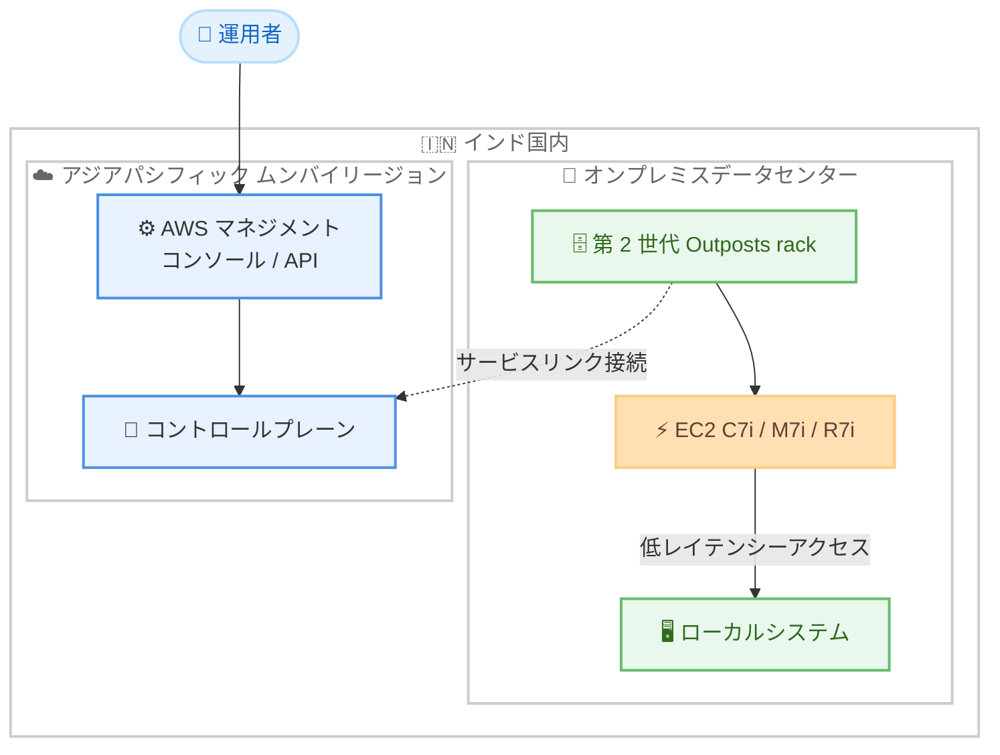

# AWS Outposts - 第 2 世代 Outposts racks のアジアパシフィック (ムンバイ) リージョンサポート

**リリース日**: 2026 年 7 月 28 日
**サービス**: AWS Outposts
**機能**: 第 2 世代 Outposts racks のアジアパシフィック (ムンバイ) リージョン接続サポート

📊 [このアップデートのインフォグラフィックを見る](https://takech9203.github.io/aws-news-summary/20260728-aws-outposts-asia-pacific-mumbai.html)

## 概要

第 2 世代 AWS Outposts racks が、アジアパシフィック (ムンバイ) リージョンでサポートされるようになりました。これにより、インド国内外のスタートアップから大企業、公共部門の組織まで、ムンバイリージョンに接続する Outposts racks を注文できるようになります。

AWS Outposts racks は、AWS のインフラストラクチャ、サービス、API、ツールを、事実上あらゆるオンプレミスのデータセンターやコロケーションスペースに拡張し、一貫したハイブリッドエクスペリエンスを提供するフルマネージドサービスです。第 2 世代 Outposts racks は、最新世代の x86 ベース Amazon EC2 インスタンス (C7i、M7i、R7i) をサポートし、第 1 世代の C5、M5、R5 インスタンスと比較して最大 40% 優れたパフォーマンスを提供します。

今回のアップデートは、Outposts racks を接続する AWS リージョン (ホームリージョン) の選択肢を拡大するものです。オンプレミスシステムへの低レイテンシーアクセスが必要なワークロードをローカルで実行しつつ、ムンバイリージョンからアプリケーションを管理できるようになり、インドのデータレジデンシー要件への対応がより容易になります。

**アップデート前の課題**

- 第 2 世代 Outposts racks はインド国内への出荷に対応していたものの、ムンバイリージョンをホームリージョンとして接続できなかった
- インド国内の組織は、Outposts の管理・運用のために地理的に離れたリージョンに接続する必要があり、コントロールプレーン通信のレイテンシーが大きくなる可能性があった
- データレジデンシーやレイテンシーの要件に応じた接続先リージョンの選択肢が限られていた

**アップデート後の改善**

- ムンバイリージョンに接続する第 2 世代 Outposts racks を注文できるようになった
- インド国内の Outposts 利用者は、地理的に近いムンバイリージョンから Outposts を管理・運用できるようになり、リージョンとの通信レイテンシーを最小化できる
- レイテンシーとデータレジデンシーのニーズに合わせて、Outposts を接続するリージョンをより柔軟に選択できるようになった

## アーキテクチャ図



インド国内のオンプレミスに設置した第 2 世代 Outposts rack をムンバイリージョンに接続する構成です。ワークロードとデータはオンプレミスに保持したまま、地理的に近いムンバイリージョンから管理・運用できます。

## サービスアップデートの詳細

### 主要機能

1. **ムンバイリージョンへの接続サポート**
   - 第 2 世代 Outposts racks のホームリージョンとしてアジアパシフィック (ムンバイ) を選択可能に
   - インド国内外の組織が、ムンバイリージョンに接続する Outposts racks を AWS マネジメントコンソールから注文可能
   - Outposts の管理・運用をムンバイリージョン経由で実行

2. **最新世代 EC2 インスタンスのサポート**
   - C7i (コンピューティング最適化)、M7i (汎用)、R7i (メモリ最適化) インスタンスをサポート
   - 第 1 世代の C5、M5、R5 インスタンスと比較して最大 40% のパフォーマンス向上
   - 従来と比較して 2 倍の vCPU、メモリ、ネットワーク帯域幅を提供

3. **簡素化されたネットワークアーキテクチャ**
   - 専用の Outposts ネットワークラックをハブとして、コンピューティングをネットワークから独立してスケール可能
   - ネットワークデバイス障害に対する組み込みの回復性
   - IP、VLAN、BGP の構成を API またはコンソールから簡単に設定可能

4. **アクセラレーテッドネットワーキングインスタンス**
   - 超低レイテンシーや高スループットに最適化された専用インスタンスカテゴリ
   - bmn-sf2e: 全コア 3.9 GHz 持続の超低レイテンシー向けベアメタルインスタンス
   - bmn-cx2: 最大 800 Gbps のベアメタルネットワーク帯域幅を提供する高スループット向けインスタンス

## 技術仕様

### 第 2 世代 Outposts racks の主な仕様

| 項目 | 詳細 |
|------|------|
| サポートインスタンス | C7i、M7i、R7i (第 4 世代 Intel Xeon スケーラブルプロセッサ搭載) |
| パフォーマンス | 第 1 世代 (C5、M5、R5) 比で最大 40% 向上 |
| リソース | 従来比 2 倍の vCPU、メモリ、ネットワーク帯域幅 |
| ネットワーク | 専用ネットワークラックによる独立したスケーリングと簡素化された構成 |
| 特殊インスタンス | アクセラレーテッドネットワーキングインスタンス (bmn-sf2e、bmn-cx2) |
| 接続リージョン | アジアパシフィック (ムンバイ) を新たにサポート |

### ホームリージョンの役割

| 機能 | 説明 |
|------|------|
| コントロールプレーン | Outposts の管理・運用・モニタリングはホームリージョン経由で実行 |
| サービスリンク | Outposts とホームリージョン間の接続。管理トラフィックと VPC トラフィックを伝送 |
| データレジデンシー | ワークロードのデータはオンプレミスの Outposts 上に保持可能 |

## 設定方法

### 前提条件

1. AWS アカウントを保有していること
2. Outposts rack の設置場所が物理的要件 (スペース、電源、冷却、ネットワーク) を満たしていること
3. Outposts からアジアパシフィック (ムンバイ) リージョンへの安定したネットワーク接続を確保できること

### 手順

#### ステップ 1: 設置場所の確認と注文

AWS マネジメントコンソールの AWS Outposts 画面から、カタログで第 2 世代 Outposts racks の構成を選択し、ホームリージョンとしてアジアパシフィック (ムンバイ) を指定して注文します。設置場所の住所や施設要件の情報を入力します。

#### ステップ 2: 設置とアクティベーション

AWS が Outposts rack を配送し、設置を行います。設置後、Outposts はサービスリンクを通じてムンバイリージョンに接続され、アクティベートされます。

#### ステップ 3: リソースの起動

```bash
# Outposts 上にサブネットを作成
aws ec2 create-subnet \
  --vpc-id vpc-xxxxxxxx \
  --cidr-block 10.0.1.0/24 \
  --outpost-arn arn:aws:outposts:ap-south-1:123456789012:outpost/op-xxxxxxxx \
  --availability-zone ap-south-1a \
  --region ap-south-1

# Outposts 上に EC2 インスタンスを起動
aws ec2 run-instances \
  --image-id ami-xxxxxxxx \
  --instance-type c7i.xlarge \
  --subnet-id subnet-xxxxxxxx \
  --region ap-south-1
```

ムンバイリージョン (ap-south-1) の API エンドポイントに対して、Outposts の ARN を指定したサブネットを作成し、そのサブネット内に EC2 インスタンスを起動します。リソースの管理は通常の AWS リージョンと同じ API・ツールで行えます。

## メリット

### ビジネス面

- **データレジデンシー要件への対応**: インド国内でデータを保持しながら、地理的に近いムンバイリージョンから AWS サービスを管理・運用できる
- **規制要件への準拠**: 金融や公共部門など、データの国内保持が求められる業界の要件を満たしつつクラウドの利便性を享受できる
- **接続先リージョンの柔軟な選択**: レイテンシーとデータレジデンシーのニーズに合わせて最適なホームリージョンを選択できる

### 技術面

- **低レイテンシーアクセス**: オンプレミスシステムへの低レイテンシーアクセスが必要なワークロードをローカルで実行できる
- **コントロールプレーン通信の最適化**: インド国内の設置場所から地理的に近いムンバイリージョンに接続することで、管理トラフィックのレイテンシーを低減できる
- **最新世代のパフォーマンス**: C7i、M7i、R7i インスタンスにより、第 1 世代比で最大 40% のパフォーマンス向上を実現できる

## デメリット・制約事項

### 制限事項

- Outposts racks の設置には物理的なスペース、電源、冷却設備が必要
- ホームリージョンへの安定したネットワーク接続 (サービスリンク) が必要
- 第 2 世代 Outposts racks は、第 1 世代でサポートされていた AWS サービスの一部のみをサポート (順次拡大予定)

### 考慮すべき点

- サポートされる国・地域と接続可能なリージョンの最新情報は Outposts rack FAQs ページで確認する必要がある
- 3 年契約が標準となるため、長期的なキャパシティ計画が必要
- 物理的なセキュリティは利用者側の責任となる

## ユースケース

### ユースケース 1: 金融機関のデータレジデンシー対応

**シナリオ**: インドの金融機関が、規制により顧客データを国内に保持する必要があるが、AWS のマネージドサービスと運用モデルを利用したい。

**実装例**:
```
1. 自社データセンターに第 2 世代 Outposts rack を設置
2. ホームリージョンとしてムンバイリージョンを指定
3. 顧客データを扱うワークロードを Outposts 上の EC2 (M7i/R7i) で実行
4. 管理・モニタリングはムンバイリージョンの CloudWatch などで一元化
```

**効果**: データを国内のオンプレミスに保持しながら、AWS の API・ツールによる一貫した運用が可能になる。地理的に近いムンバイリージョンへの接続により、管理通信のレイテンシーも最小化できる。

### ユースケース 2: 製造業の低レイテンシーワークロード

**シナリオ**: インド国内の製造業が、工場の生産設備や IoT デバイスからのデータをリアルタイムに処理し、即座に制御へフィードバックする必要がある。

**実装例**:
```
1. 工場敷地内に Outposts rack を設置し、ムンバイリージョンに接続
2. C7i インスタンスでリアルタイムデータ処理アプリケーションを実行
3. 集計済みデータのみをムンバイリージョンの分析基盤に転送
```

**効果**: 生産設備への低レイテンシーアクセスを維持しながら、クラウドと同じツールチェーンで開発・運用できる。集計データのみをリージョンへ送ることで帯域コストも最適化できる。

### ユースケース 3: 段階的なクラウド移行

**シナリオ**: オンプレミスのレガシーシステムに依存する企業が、レイテンシー要件からすべてを一度にクラウド移行できないが、段階的にモダナイズを進めたい。

**実装例**:
```
1. レガシーシステムと同じデータセンターに Outposts rack を設置
2. レガシーシステムと連携するアプリケーションを Outposts 上で稼働
3. 依存関係が解消されたワークロードから順次ムンバイリージョンへ移行
```

**効果**: レガシーシステムとの低レイテンシー接続を維持したままクラウドネイティブな開発を開始でき、リスクを抑えた段階的な移行が可能になる。

## 料金

AWS Outposts racks の料金は、選択した構成 (インスタンスタイプ、ストレージ容量、ネットワーク構成) によって異なります。3 年契約が標準で、全額前払い、一部前払い、前払いなしの支払いオプションから選択できます。料金には、配送、設置、インフラストラクチャの保守、ソフトウェアのパッチやアップグレードが含まれます。

詳細な料金については、[AWS Outposts 料金ページ](https://aws.amazon.com/outposts/rack/pricing/) を参照してください。

## 利用可能リージョン

第 2 世代 AWS Outposts racks は、今回新たにアジアパシフィック (ムンバイ) リージョンをホームリージョンとしてサポートしました。インド国内外の組織が、ムンバイリージョンに接続する Outposts racks を注文できます。

第 2 世代 Outposts racks がサポートされる国・地域と接続可能な AWS リージョンの最新リストについては、[Outposts rack FAQs ページ](https://aws.amazon.com/outposts/rack/faqs/) を参照してください。

## 関連サービス・機能

- **Amazon EC2**: Outposts 上で実行される C7i、M7i、R7i および bmn 系インスタンス
- **Amazon EBS**: Outposts 上のブロックストレージ
- **Amazon S3 on Outposts**: Outposts 上のオブジェクトストレージ (第 2 世代 racks でもサポート)
- **Amazon VPC**: Outposts のサブネットはホームリージョンの VPC を拡張して構成
- **AWS Direct Connect**: サービスリンクの接続経路として利用可能

## 参考リンク

- 📊 [インフォグラフィック](https://takech9203.github.io/aws-news-summary/20260728-aws-outposts-asia-pacific-mumbai.html)
- [公式発表 (What's New)](https://aws.amazon.com/about-aws/whats-new/2026/07/aws-outposts-asia-pacific-mumbai/)
- [AWS Blog - 第 2 世代 Outposts racks の発表](https://aws.amazon.com/blogs/aws/announcing-second-generation-aws-outposts-racks-with-breakthrough-performance-and-scalability-on-premises/)
- [AWS Outposts ユーザーガイド](https://docs.aws.amazon.com/outposts/latest/userguide/what-is-outposts.html)
- [Outposts rack FAQs](https://aws.amazon.com/outposts/rack/faqs/)
- [料金ページ](https://aws.amazon.com/outposts/rack/pricing/)

## まとめ

第 2 世代 AWS Outposts racks がアジアパシフィック (ムンバイ) リージョンをサポートしたことで、インド国内外の組織はデータレジデンシー要件と低レイテンシー要件を満たしながら、地理的に近いリージョンから Outposts を管理・運用できるようになりました。インドでのハイブリッドクラウド展開やデータレジデンシー対応を検討している場合は、ムンバイリージョンをホームリージョンとした第 2 世代 Outposts racks の導入を検討してください。
