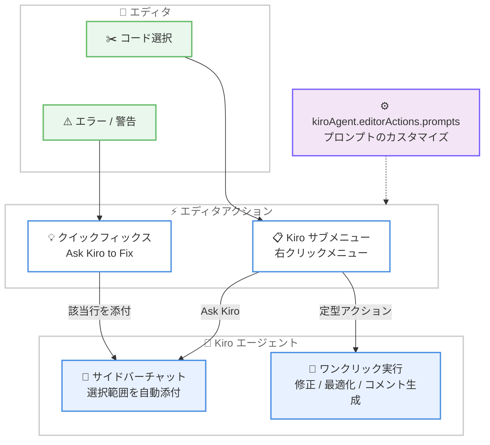

# Kiro - エディタアクション、ガイド付きフック作成、Code OSS アップグレード

**リリース日**: 2026年7月28日
**サービス**: Kiro (IDE v1.0.242)
**機能**: Editor Actions, Guided Hook Creation, and Code OSS Upgrade

📊 [このアップデートのインフォグラフィックを見る](https://takech9203.github.io/aws-news-summary/20260728-kiro-changelog-2026-07-28.html)

## 概要

Kiro IDE v1.0.242 がリリースされ、エディタとエージェントの連携を強化する複数の機能が追加されました。エディタのコンテキストメニューに Kiro サブメニューが追加され、選択したコードに対して「Ask Kiro」やコード修正・最適化・コメント生成などのアクションをワンクリックで実行できるようになりました。また、エラーや警告の電球アイコン (クイックフィックス) から「Ask Kiro to Fix」を呼び出せるようになり、該当行をコンテキストとして添付した修正依頼が可能になりました。

さらに、Agent Hooks ビューにガイド付きのフック作成フォームが追加され、フックを手動で設定できるようになりました。基盤面では Code OSS が v1.107.1 から v1.108.2 にアップグレードされ、Kiro が IDE の表示言語で応答するようになるなど、日常的な使い勝手に直結する改善が多数含まれています。チャット履歴がワークスペースフォルダの変更後も保持されるようになったほか、サインイン、信頼 (Trust)、承認 (Approval) に関する多数の不具合も修正されています。

**アップデート前の課題**

- 選択したコードに対して修正やコメント生成を依頼するには、チャット入力欄へ手動でコードを添付し、プロンプトを毎回入力する必要があった
- エラーや警告の修正を Kiro に依頼する際、言語サーバーの診断情報と該当行を自分でチャットに持ち込む必要があった
- エージェントフックの作成は設定ファイルの直接編集が中心で、初学者にはハードルが高かった
- Kiro の応答言語は IDE の表示言語と連動しておらず、日本語などの環境でも英語で応答されることがあった
- `#File` 参照やエディタからの選択範囲は、保存済みのディスク上の内容が使われるため、未保存の編集内容がエージェントに伝わらなかった
- ワークスペースフォルダを変更するとチャット履歴が失われていた

**アップデート後の改善**

- 右クリックの Kiro サブメニューから、文法修正、コメント生成、Docstring 生成、コード修正、コード最適化をワンクリックで実行できるようになった
- エラー / 警告のクイックフィックスに「Ask Kiro to Fix」が追加され、編集可能なプロンプトと該当行が自動で添付されるようになった
- Agent Hooks ビューの + ボタンから、フォーム形式でフックを作成・編集できるようになった
- Kiro が VS Code の表示言語を読み取り、その言語で応答するようになった (コード、API 名、ファイルパス、コマンド出力は翻訳されない)
- `#File` 参照とエディタからの選択範囲が、未保存の編集内容を含む現在のエディタ内容を使用するようになった
- チャット履歴がワークスペースフォルダの変更後も保持されるようになった

## アーキテクチャ図



エディタでのコード選択やエラー / 警告から、コンテキストメニューまたはクイックフィックス経由で Kiro エージェントに直接依頼できるフローを示しています。

## サービスアップデートの詳細

### 主要機能

1. **エディタコンテキストメニューアクション**
   - ファイル内で選択範囲を右クリックすると Kiro サブメニューが開く
   - `Ask Kiro` は選択範囲を添付した新しいサイドバーセッションを開き、ユーザーの入力を待つ
   - 「Fix Grammar / Spelling」「Write Comments for this Code」「Write a Docstring for this Code」「Fix this Code」「Optimize this Code」はワンクリックで実行される
   - 各アクションのプロンプトは `kiroAgent.editorActions.prompts` 設定でカスタマイズ可能

2. **Ask Kiro to Fix クイックフィックス**
   - エラーや警告の電球アイコンに `Ask Kiro to Fix` が追加された
   - プロンプトは編集可能で、影響を受ける行がコンテキストとして自動添付される
   - 言語サーバー自身の修正候補の下に表示されるため、既存のワークフローを妨げない

3. **ガイド付きフック作成**
   - Agent Hooks ビューの + ボタンから「Create a hook」フォームが開き、フックを手動で設定できる
   - ツリー内のフックをクリックするとエディタで開き、別の場所でファイルが編集された場合は開いているフォームが自動更新される

4. **IDE の表示言語での応答**
   - Kiro が VS Code の表示言語を読み取り、その言語で応答する
   - コード、API 名、ファイルパス、コマンド出力は翻訳されない

5. **Code OSS v1.108.2 へのアップグレード**
   - Code OSS v1.107.1 から v1.108.2 に移行
   - Terminal IntelliSense (`terminal.integrated.suggest.enabled`) がアップストリームのデフォルトに合わせてデフォルトで有効になった

6. **その他の改善**
   - **プレーンテキスト貼り付け**: チャット入力欄で `Shift+Cmd+V` (Windows / Linux は `Shift+Ctrl+V`) を使うと、リッチテキストや画像処理をスキップしてプレーンテキストとして貼り付けられる
   - **より正確なコマンド信頼パターン**: `GIT_PAGER=cat git diff` のような環境変数代入で始まるコマンドを「always allow」にした場合、代入部分ではなく実行されるプログラムを基準にパターンが保存される。`env` 経由のコマンドは完全一致のみで保存される
   - **未保存の編集を含むファイル参照**: `#File` 参照とエディタからの選択範囲が、ディスク上の保存内容ではなく現在のエディタ内容を使用する
   - **チャット内の Powers ツール呼び出し**: Powers のアクティベーションに説明的なカードタイトルが表示され、`list` と `configure` が空のカードではなく出力を表示する
   - **セッションエクスポートのフォルダ記憶**: Export chat ダイアログが、毎回 Downloads ではなく前回エクスポートしたフォルダで開く
   - **コマンドパスのツールチップ**: コマンドツールカード上の省略されたパスにホバーするとフルパスが表示される
   - **`sleep` の承認プロンプト省略**: `sleep` のみを呼び出すコマンドはセッションを一時停止して承認を求めなくなった
   - **到達不能ページの高速失敗**: `web_fetch` がクライアントエラーを返すページをリトライしなくなり、リンク切れや無応答ホストは約 30 秒で失敗する
   - **レート制限時のスマートなリトライ**: サービスが待機時間を指定した場合、推測ではなくその指定に従ってリトライする
   - **Agent Focus Mode の Agent Settings**: プロジェクトに適用されるステアリング、MCP サーバー、フック、スキル、Powers を一覧表示する読み取り専用ページが追加された (メニュー項目名は `Kiro Settings` から変更)
   - **Open with Kiro CLI**: Agent Focus Mode の Add Project メニューから、ポップアウトしたターミナルでフォルダを Kiro CLI に渡せる (Kiro CLI 2.8.1 より新しいバージョンが必要)

### 主な修正 (Fixes)

- 特定の拡張機能 (SARIF Viewer など) がインストールされているとチャットが開始できない問題を修正
- 2 つの IDE ウィンドウが同時にトークンを保存した際に発生する予期しないサインアウトを修正
- Windows で `2>&1` を含む `cmd` コマンドの信頼ダイアログに `1` と表示され、マッチしない「Always Allow」ルールが保存される問題を修正
- ツール承認が保留中に送信したフォローアップメッセージが、会話の記憶なしでターンを開始する問題を修正
- Supervised モードで承認待ちのセッションを閉じて再度開くと `Review changes` パネルが失われる問題を修正
- ワークスペース外のファイルに `Always Allow` を付与すると `cannot open file:///consent` エラーで失敗する問題を修正
- OAuth が必要な MCP サーバーがサインイン完了直後に abort エラーで失敗する問題を修正
- 言語サーバーが検出した問題に対して診断が断続的に `No diagnostics found` を報告する問題を修正
- `<script>` や `<iframe>` などの生の HTML を含むメッセージが空のチャットバブルとして表示される問題を修正 (マークアップはリテラルテキストとして表示)
- Chrome / Edge のアドレスバーからコピーした URL を貼り付けるとページタイトルが挿入される問題を修正
- Agent Focus Mode ウィンドウでのスペックワークフローの質問がハングする問題、およびステアリング / スキル / MCP プロンプトピッカーが `No matching items` を報告する問題を修正

## 技術仕様

### バージョン情報

| 項目 | 詳細 |
|------|------|
| リリースバージョン | Kiro IDE v1.0.242 |
| リリース日 | 2026 年 7 月 28 日 |
| Code OSS ベース | v1.107.1 → v1.108.2 |
| Terminal IntelliSense | `terminal.integrated.suggest.enabled` がデフォルトで有効 |
| Kiro CLI 連携 | 「Open with Kiro CLI」には Kiro CLI 2.8.1 より新しいバージョンが必要 |

### 関連設定

| 設定 | 説明 |
|------|------|
| `kiroAgent.editorActions.prompts` | エディタアクションの各プロンプトをカスタマイズ |
| `terminal.integrated.suggest.enabled` | Terminal IntelliSense (今回からデフォルト有効) |

## 設定方法

### 前提条件

1. Kiro IDE がインストールされていること (kiro.dev からダウンロード可能)
2. Kiro IDE を v1.0.242 以降にアップデートしていること
3. Kiro アカウントでサインインしていること

### 手順

#### ステップ1: エディタアクションを使用する

1. エディタでコードを選択して右クリック
2. Kiro サブメニューから実行したいアクションを選択

「Ask Kiro」を選択すると、選択範囲が添付された新しいサイドバーセッションが開き、自由にプロンプトを入力できます。「Fix this Code」などの定型アクションは選択と同時に実行されます。

#### ステップ2: Ask Kiro to Fix を使用する

1. エラーまたは警告が表示されている行にカーソルを合わせる
2. 電球アイコン (クイックフィックス) をクリック
3. `Ask Kiro to Fix` を選択し、必要に応じてプロンプトを編集して送信

影響を受ける行が自動的にコンテキストとして添付されるため、追加のコピー & ペーストは不要です。

#### ステップ3: ガイド付きフォームでフックを作成する

1. サイドバーの Agent Hooks ビューを開く
2. + ボタンをクリックして「Create a hook」フォームを開く
3. フォームに従ってトリガーやアクションを設定して保存

作成したフックはツリーからクリックするとエディタで開き、ファイルが別の場所で編集された場合もフォームに自動反映されます。

#### ステップ4: エディタアクションのプロンプトをカスタマイズする

```json
{
  "kiroAgent.editorActions.prompts": {
    "fixCode": "このコードのバグを修正し、修正内容を日本語で説明してください"
  }
}
```

`settings.json` に `kiroAgent.editorActions.prompts` を追加することで、各アクションのプロンプトを組織やプロジェクトの規約に合わせて調整できます。

## メリット

### ビジネス面

- **開発速度の向上**: コード修正、コメント生成、最適化がワンクリックで実行でき、定型作業の時間を削減できる
- **オンボーディングの容易さ**: ガイド付きフック作成フォームにより、設定ファイルの知識がなくてもチーム全体でフックを活用できる
- **グローバルチームへの対応**: IDE の表示言語での応答により、非英語話者の開発者もネイティブ言語で Kiro を活用できる

### 技術面

- **コンテキスト精度の向上**: 未保存の編集内容がエージェントに伝わるため、作業中のコードに対する提案精度が向上する
- **診断情報との統合**: Ask Kiro to Fix は言語サーバーの診断と該当行を自動添付するため、手動でのコンテキスト共有が不要になる
- **セキュリティ精度の向上**: コマンド信頼パターンが実行プログラムを基準に保存されるため、意図しないコマンドの自動許可を防げる
- **最新の Code OSS 基盤**: v1.108.2 へのアップグレードにより、Terminal IntelliSense などアップストリームの改善を利用できる

## デメリット・制約事項

### 制限事項

- 「Open with Kiro CLI」オプションは Kiro CLI 2.8.1 より新しいバージョンがインストールされている場合のみ表示される
- 表示言語での応答はコード、API 名、ファイルパス、コマンド出力には適用されない (翻訳されない)
- Agent Focus Mode の Agent Settings ページは読み取り専用で、編集は「Edit in IDE」リンク経由で行う

### 考慮すべき点

- Terminal IntelliSense がデフォルトで有効になるため、従来の挙動を維持したい場合は `terminal.integrated.suggest.enabled` を無効化する必要がある
- エディタアクションのプロンプトをカスタマイズする場合、チーム内での設定共有方法を検討する必要がある

## ユースケース

### ユースケース1: レビュー前のコード品質向上

**シナリオ**: プルリクエスト作成前に、コメント不足や冗長な実装を素早く改善したい。

**実装例**:
```text
1. 対象の関数を選択して右クリック
2. Kiro サブメニュー > Write a Docstring for this Code を実行
3. 続けて Optimize this Code を実行し、提案を確認して適用
```

**効果**: チャットへのコード貼り付けやプロンプト入力なしで、ドキュメント整備とリファクタリングを数クリックで完了できる。

### ユースケース2: 言語サーバーのエラーを即座に修正

**シナリオ**: TypeScript の型エラーが発生しており、言語サーバーの自動修正では解決できない。

**実装例**:
```text
1. エラー行の電球アイコンをクリック
2. Ask Kiro to Fix を選択
3. 自動添付された該当行を確認し、必要に応じてプロンプトを補足して送信
```

**効果**: 診断情報と該当コードが自動でコンテキストに含まれるため、正確な修正提案を最短の手順で得られる。

### ユースケース3: チーム標準のフックをフォームで整備

**シナリオ**: ファイル保存時にテストを自動実行するフックをチームに展開したいが、メンバー全員が設定ファイルの記法に詳しいわけではない。

**実装例**:
```text
1. Agent Hooks ビューの + ボタンをクリック
2. Create a hook フォームでトリガー (ファイル保存) とアクションを設定
3. 作成されたフックファイルをリポジトリで共有
```

**効果**: 設定ファイルを直接編集することなくフックを作成でき、フォームとファイルが双方向に同期するためメンテナンスも容易になる。

## 料金

今回のアップデートによる料金体系の変更はありません。Kiro は Free (月 50 クレジット) から Pro / Pro+ / Pro Max / Power までの各プランで利用できます。詳細は [料金ページ](https://kiro.dev/pricing/) を参照してください。

## 利用可能リージョン

グローバル (Kiro はデスクトップアプリケーションとして提供され、リージョンの制約はありません)

## 関連サービス・機能

- **Kiro Agent Hooks**: 今回ガイド付き作成フォームが追加された、イベント駆動でエージェントを起動する仕組み
- **Kiro Powers**: チャット内のツール呼び出し表示が改善された、エージェントの機能拡張の仕組み
- **Kiro CLI**: Agent Focus Mode からフォルダを直接引き渡せるようになったコマンドラインエージェント
- **Kiro Agent Focus Mode**: Agent Settings ページの追加など、複数プロジェクトのエージェント作業を集中管理する実験的機能

## 参考リンク

- 📊 [インフォグラフィック](https://takech9203.github.io/aws-news-summary/20260728-kiro-changelog-2026-07-28.html)
- [Kiro Changelog](https://kiro.dev/changelog/)
- [Kiro Changelog - IDE v1.0.242](https://kiro.dev/changelog/ide/1-0-242/)
- [Kiro Hooks ドキュメント](https://kiro.dev/docs/hooks)
- [Kiro Powers ドキュメント](https://kiro.dev/docs/powers)
- [Kiro Agent Focus Mode ドキュメント](https://kiro.dev/docs/experimental/focus-mode)
- [料金ページ](https://kiro.dev/pricing/)

## まとめ

Kiro IDE v1.0.242 は、エディタコンテキストメニューと「Ask Kiro to Fix」クイックフィックスにより、コードを選択してからエージェントに依頼するまでの手順を大幅に短縮するアップデートです。ガイド付きフック作成や表示言語での応答など、日常の開発体験を底上げする改善も多く、Kiro を利用しているすべての開発者にアップデートを推奨します。まずは右クリックの Kiro サブメニューと、エラー箇所での Ask Kiro to Fix を試してみてください。
