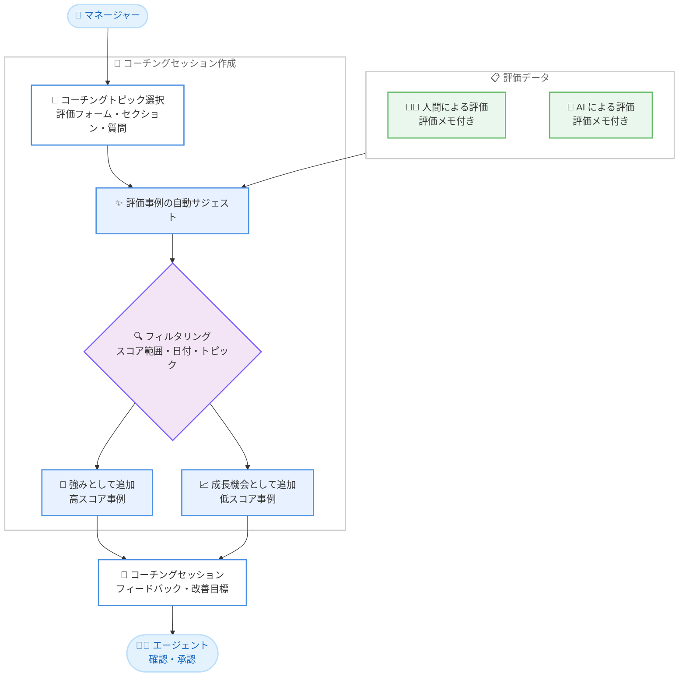

# Amazon Connect Customer - コーチング向け評価事例の自動サジェスト

**リリース日**: 2026 年 7 月 29 日
**サービス**: Amazon Connect (Connect Customer)
**機能**: エージェントコーチング作成時の評価事例の自動サジェスト

📊 [このアップデートのインフォグラフィックを見る](https://takech9203.github.io/aws-news-summary/20260729-amazon-connect-customer-example-evaluations-for-agent-coaching.html)

## 概要

Amazon Connect Customer が、エージェントへのコーチングフィードバックを作成する際に、関連する過去の評価事例を自動的に見つけて提示する機能を発表しました。マネージャー (スーパーバイザー) がコーチングセッションでトピックを選択すると、そのトピックについてエージェントが高スコアまたは低スコアを獲得した直近の評価が自動的にサジェストされます。

サジェストされる事例には、人間の評価者または AI 評価者による「どのようなエージェントの行動がその結果につながったのか」を説明するメモが含まれます。たとえば「ディエスカレーション (顧客の怒りの沈静化)」についてコーチングする場合、エージェントが怒っている顧客をうまく落ち着かせた通話の事例と、エスカレーションに至ってしまった通話の事例の両方が、それぞれの結果を生んだ行動への洞察とともに提示されます。

これにより、マネージャーは具体的な証拠に基づいた実践的なコーチングをエージェントに提供でき、エージェントのパフォーマンス改善を加速できます。また、コーチングの根拠となる事例を手作業で探す時間が不要になります。コンタクトセンターの品質管理チームやスーパーバイザーにとって、コーチング準備の効率と質を大きく向上させるアップデートです。

**アップデート前の課題**

このアップデート以前は、コーチングの準備に手作業での事例収集が必要でした。

- コーチングトピックに関連する評価事例を、Contact Search や評価一覧から手作業で検索する必要があった
- 良い事例 (強み) と改善が必要な事例 (成長機会) をバランスよく集めるのに時間がかかった
- 事例が不足したまま抽象的なフィードバックになりやすく、エージェントが具体的な改善行動をイメージしにくかった

**アップデート後の改善**

今回のアップデートにより、事例収集が自動化されます。

- コーチングトピック (評価フォーム、セクション、質問) を選択するだけで、関連する評価事例が自動的にサジェストされる
- 高スコア事例を「強み」、低スコア事例を「成長機会 (opportunity)」として、ワンクリックでコーチングセッションに追加できる
- スコア範囲、日付範囲、トピックなどの条件でサジェストをフィルタリングでき、目的に合った事例を素早く選別できる

## アーキテクチャ図



マネージャーがコーチングトピックを選択すると、人間または AI による過去の評価データから関連事例が自動サジェストされ、強み・成長機会としてコーチングセッションに追加できます。

## サービスアップデートの詳細

### 主要機能

1. **評価事例の自動サジェスト**
   - コーチングセッション作成時に、参加者 (エージェント) とトピックを選択すると、そのエージェントの関連する評価が自動的に提示される
   - サジェストは、選択した評価フォーム、セクション、または質問に基づいて行われる
   - 高スコア事例と低スコア事例の両方が提示され、バランスの取れたフィードバックを作成できる

2. **評価者メモによる行動の可視化**
   - 各事例には、人間の評価者または AI 評価者によるメモが含まれ、どのエージェントの行動がその評価結果につながったかを説明する
   - 「なぜ良かったのか」「なぜ改善が必要なのか」の根拠を示した、証拠に基づくコーチングが可能になる

3. **サジェストのフィルタリング**
   - 「Show strength suggestions」「Show opportunity suggestions」で強み・成長機会それぞれのサジェストを表示できる
   - スコア範囲、日付範囲、トピックなどの条件でサジェストを絞り込める

4. **コーチングワークフローとの統合**
   - サジェストされた事例は、強みまたは成長機会としてコーチングセッションに追加できる
   - コーチングセッションには日時・場所・詳細フィードバック・改善目標を設定でき、共有するとエージェントにメール通知が送信される
   - エージェントはコーチング内容を確認し、自身のメモとともに承認 (acknowledge) できる

## 技術仕様

### 必要な権限 (セキュリティプロファイル)

| ロール | 必要な権限 |
|------|------|
| 管理者・品質管理者 | Coaching - manage coaching sessions (インスタンス内の全コーチングセッションへのアクセス、スーパーバイザーへのコーチング割り当て) |
| スーパーバイザー | Coaching - my coaching sessions (View、Create、Delete、Edit) |
| エージェント | Coaching - my coaching sessions - View (自身が参加者のコーチングの閲覧・承認) |
| サジェスト利用者 (追加要件) | Contact Search - View および Evaluation forms - perform evaluations - View |

**重要**: 評価事例の自動サジェストを利用するには、コーチング権限に加えて **Contact Search - View** と **Evaluation forms - perform evaluations - View** の権限が必要です。

### 機能の位置づけ

| 項目 | 詳細 |
|------|------|
| 提供機能 | Connect Customer のパフォーマンス評価 (performance evaluations) 機能の一部 |
| コーチング開始方法 | 集計されたパフォーマンスインサイトから開始、または個別の評価から開始の 2 通り |
| セッションへのリンク上限 | 1 つのコーチングセッションに最大 10 件の評価または評価アイテムをリンク可能 |
| 通知 | セッション共有時、エージェントにメール通知 (メール設定済みの場合、SAML インスタンスではセカンダリメール) |

## 設定方法

### 前提条件

1. Amazon Connect Customer インスタンスでパフォーマンス評価 (評価フォーム) を利用していること
2. コーチング対象のエージェントに対して、スコア付きの評価 (人間または AI による) が存在すること
3. コーチングを作成するユーザーのセキュリティプロファイルに、コーチング権限、Contact Search - View、Evaluation forms - perform evaluations - View が付与されていること

### 手順

#### ステップ 1: コーチングセッションの作成

1. 必要な権限を持つセキュリティプロファイルで Connect Customer にログインする
2. ナビゲーションから **Analytics and Optimization** > **Coaching sessions** に移動する
3. 新しいコーチングセッションを作成し、参加者 (エージェント) を選択する

#### ステップ 2: トピックの選択と事例サジェストの確認

1. スコア付き評価フォームをセッションのトピックとして追加する (評価フォーム全体、セクション、質問のいずれかを選択可能)
2. Connect Customer が該当エージェントの評価事例を自動的にサジェストする
3. サジェストを「強み」または「成長機会」としてセッションに追加する
4. 必要に応じて、スコア範囲・日付範囲・トピックでサジェストをフィルタリングする

#### ステップ 3: フィードバックの作成と共有

1. セッションの日時・場所を指定し、詳細なフィードバックと改善目標を記入する (セッション期日は必須)
2. **Submit** でドラフトとして保存し、準備ができたら **Share** でエージェントに共有する
3. コーチング実施後に **Mark as Complete** で完了とし、エージェントが内容を承認する

## メリット

### ビジネス面

- **コーチング準備時間の削減**: 関連事例の手作業での検索が不要になり、スーパーバイザーはフィードバック内容の検討に時間を使える
- **エージェント育成の加速**: 具体的な成功事例と失敗事例を対比して示すことで、エージェントが改善すべき行動を明確に理解でき、パフォーマンス改善が速まる
- **コーチング品質の標準化**: 証拠に基づくコーチングが仕組みとして担保され、スーパーバイザーごとのコーチング品質のばらつきを抑えられる

### 技術面

- **評価データの活用促進**: 蓄積された人間・AI による評価データが、ダッシュボードでの傾向把握だけでなく個別コーチングにも自動活用される
- **追加設定不要**: 既存のパフォーマンス評価機能の延長として動作し、権限設定以外に新たなインフラ構築や設定は不要
- **柔軟なフィルタリング**: スコア範囲や日付範囲での絞り込みにより、直近の傾向に焦点を当てたコーチングが可能

## デメリット・制約事項

### 制限事項

- 本機能は Connect Customer のパフォーマンス評価機能の一部であり、評価フォームによる評価 (スコア付き) が運用されていることが前提となる
- サジェストを利用するには Contact Search - View と Evaluation forms - perform evaluations - View の権限が追加で必要
- 1 つのコーチングセッションにリンクできる評価・評価アイテムは最大 10 件

### 考慮すべき点

- サジェストの質は蓄積された評価データの質と量に依存するため、評価フォームの設計と評価運用 (人間・AI 評価) の整備が重要
- 評価メモ (評価者のコメント) が充実しているほど、サジェストされる事例の説明力が高まる
- エージェントの評価・通話記録へのアクセス権限を広げることになるため、セキュリティプロファイルの設計はロールに応じて最小権限で行うことが望ましい

## ユースケース

### ユースケース 1: ディエスカレーションスキルのコーチング

**シナリオ**: あるエージェントが、怒っている顧客への対応 (ディエスカレーション) の評価スコアで低い傾向を示している。スーパーバイザーは 1on1 でこのスキルを重点的にコーチングしたい。

**実装例**:
```
1. Coaching sessions ページで新規セッションを作成し、対象エージェントを選択
2. ディエスカレーションに関する評価質問をトピックとして追加
3. 自動サジェストから、顧客をうまく沈静化できた通話を「強み」、
   エスカレーションに至った通話を「成長機会」として追加
4. 各評価のメモを引用し、行動の違いを対比したフィードバックを作成
```

**効果**: エージェントは自身の成功パターンと失敗パターンを具体的な通話事例で理解でき、次回から取るべき行動が明確になります。

### ユースケース 2: 品質管理チーム主導の組織的なコーチング運用

**シナリオ**: 品質管理チームが評価ダッシュボードで「共感の表現」のスコアが低いエージェントを複数特定した。各エージェントのスーパーバイザーに期日付きでコーチングを割り当てたい。

**実装例**:
```
1. 品質管理者が manage coaching sessions 権限でコーチングを
   スーパーバイザーに期日付きで割り当て
2. 各スーパーバイザーは共感に関する評価トピックを選択し、
   自動サジェストされた事例をもとにフィードバックを作成
3. コーチング完了後、エージェントが承認し、進捗を一元的に追跡
```

**効果**: 組織全体で特定スキルの底上げを図る際も、各スーパーバイザーの事例収集の負担なく、一貫した品質のコーチングを展開できます。

### ユースケース 3: 直近パフォーマンス変化への迅速な対応

**シナリオ**: 新しい料金プランのリリース後、あるエージェントの説明品質に関するスコアが直近 2 週間で低下している。早期に是正したい。

**実装例**:
```
1. コーチングセッション作成時に、説明品質に関する評価質問をトピックに設定
2. サジェストのフィルタで日付範囲を直近 2 週間に設定し、
   スコア範囲で低スコア事例を抽出
3. 新料金プランに関する問い合わせで発生した具体的なつまずきを特定し、
   改善目標を設定
```

**効果**: 日付・スコア範囲フィルタにより、直近の変化に焦点を当てたタイムリーなコーチングが可能になります。

## 料金

今回の発表に追加料金に関する記載はありません。本機能は Connect Customer のパフォーマンス評価機能の一部として提供されます。パフォーマンス評価機能の料金の詳細は [Amazon Connect の料金ページ](https://aws.amazon.com/connect/pricing/) を参照してください。

## 利用可能リージョン

Amazon Connect Customer が提供されているすべてのリージョンで利用可能です。リージョンの一覧は [Amazon Connect のリージョン対応表](https://docs.aws.amazon.com/connect/latest/adminguide/regions.html#amazonconnect_region) を参照してください。

## 関連サービス・機能

- **Amazon Connect パフォーマンス評価 (Evaluations)**: 評価フォームによるエージェント評価機能。本コーチング機能のサジェストの元データとなる
- **Amazon Connect Contact Lens**: 会話分析機能。AI による自動評価 (generative AI 評価) と組み合わせることで、評価メモ付きの事例が自動的に蓄積される
- **エージェントパフォーマンス評価ダッシュボード**: 評価スコアの集計・傾向を可視化するダッシュボード。コーチングすべきトピックの特定に活用できる

## 参考リンク

- 📊 [インフォグラフィック](https://takech9203.github.io/aws-news-summary/20260729-amazon-connect-customer-example-evaluations-for-agent-coaching.html)
- [公式発表 (What's New)](https://aws.amazon.com/about-aws/whats-new/2026/07/amazon-connect-customer-example-evaluations-for-agent-coaching/)
- [ドキュメント: Provide agent coaching in Connect Customer](https://docs.aws.amazon.com/connect/latest/adminguide/provide-coaching.html)
- [Amazon Connect Conversational Analytics](https://aws.amazon.com/connect/conversational-analytics/)
- [料金ページ](https://aws.amazon.com/connect/pricing/)

## まとめ

Amazon Connect Customer のコーチング機能に、評価事例の自動サジェストが追加され、証拠に基づく実践的なコーチングを大幅に効率化できるようになりました。パフォーマンス評価を運用しているコンタクトセンターでは、Contact Search - View と Evaluation forms - perform evaluations - View 権限をコーチング担当者に付与し、次回のコーチングセッション作成時から本機能の活用を開始することを推奨します。
