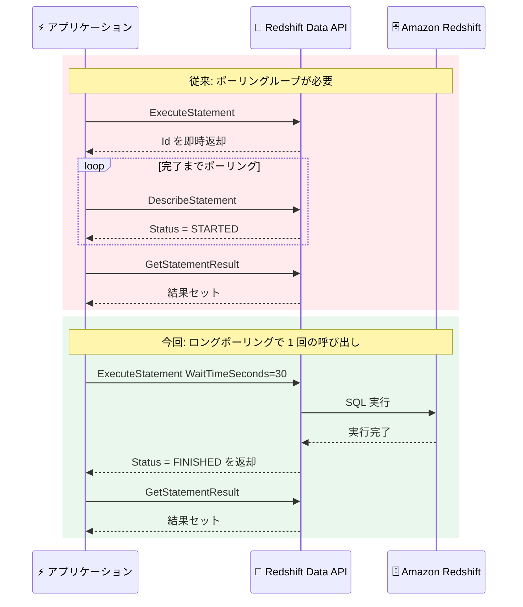

# Amazon Redshift - Data API のロングポーリング、セッション管理、柔軟なバッチ実行

**リリース日**: 2026 年 7 月 29 日
**サービス**: Amazon Redshift (Redshift Data API)
**機能**: ロングポーリング (WaitTimeSeconds)、ListSessions API、BatchExecuteStatement の ExecutionMode と SqlParameter 配列サポート

📊 [このアップデートのインフォグラフィックを見る](https://takech9203.github.io/aws-news-summary/20260729-amazon-redshift-data-api-longpolling-listsession-flexiblebatchexecute.html)

## 概要

Amazon Redshift Data API に 3 つの新機能が追加されました。(1) SQL ステートメントの完了まで API レスポンスを待機させるロングポーリング、(2) アクティブなセッションを一覧表示する ListSessions API、(3) バッチ実行の柔軟性を高める BatchExecuteStatement の ExecutionMode パラメータと SqlParameter 配列サポートです。

Redshift Data API は、JDBC/ODBC ドライバーや永続的な接続管理なしに HTTPS 経由で Redshift に SQL を実行できる API であり、Lambda や Step Functions などのサーバーレスアプリケーションから広く利用されています。今回のアップデートにより、ステートメントのメタデータや結果の取得に必要な API 呼び出し回数が削減され、セッションの可視性が向上し、バッチステートメントを個別のトランザクションとして実行できるようになりました。

対象ユーザーは、Data API を利用して ETL パイプライン、イベント駆動型アプリケーション、管理スクリプトを構築している開発者やデータエンジニアです。

**アップデート前の課題**

- 以前は非同期で実行された SQL ステートメントの完了を検知するために、DescribeStatement を繰り返し呼び出すポーリングループを実装する必要があり、API 呼び出し回数の増加とコードの複雑化を招いていた
- 以前はアクティブなセッションの一覧を取得する手段がなく、セッション再利用を行うアプリケーションはセッション ID を外部 (DynamoDB や環境変数など) で管理する必要があった
- 以前は BatchExecuteStatement のすべてのステートメントが単一トランザクションとして実行されるため、1 つのステートメントが失敗するとバッチ全体がロールバックされていた
- 以前は BatchExecuteStatement でパラメータ化クエリが利用できず、各ステートメントにリテラル値を埋め込む必要があった

**アップデート後の改善**

- WaitTimeSeconds パラメータにより、ステートメント完了まで API レスポンスを同期的に待機させることが可能になり、ポーリングループの実装が不要になった
- ListSessions API により、アクティブなセッションをステータス、コンピュートターゲット、データベースでフィルタリングして一覧表示できるようになり、セッション ID の外部管理が不要になった
- ExecutionMode=AUTO_COMMIT により、バッチ内の各ステートメントが独立して実行され、一部の失敗がバッチ全体に影響しなくなった
- BatchExecuteStatement で SqlParameter 配列がサポートされ、パラメータを一度定義してバッチ内の全ステートメントから参照できるようになった

## アーキテクチャ図



ロングポーリング導入前後の API 呼び出しフローの比較です。WaitTimeSeconds を指定すると、ステートメント完了まで API がレスポンスを保留するため、ポーリングループによる繰り返し呼び出しが不要になります。

## サービスアップデートの詳細

### 主要機能

1. **ロングポーリング (WaitTimeSeconds パラメータ)**
   - ExecuteStatement、BatchExecuteStatement、DescribeStatement、GetStatementResult、GetStatementResultV2 の 5 つの API 操作に WaitTimeSeconds パラメータが追加された
   - パラメータを設定すると、SQL ステートメントが完了するまで API が同期レスポンスを遅延させる
   - ExecuteStatement と BatchExecuteStatement のレスポンスには Status、HasResultSet、RedshiftPid フィールドが追加され、実行結果を即座に判断できる
   - ステートメント完了検知のための繰り返しポーリングが不要になり、API 呼び出し回数を削減できる

2. **ListSessions API**
   - アクティブなセッションを一覧表示する新しい API
   - ステータス (AVAILABLE、BUSY、CLOSED)、コンピュートターゲット (ClusterIdentifier、WorkgroupName)、データベースでフィルタリング可能
   - レスポンスには SessionId、Status、CreatedAt、UpdatedAt、SessionAliveSeconds、SessionTtl、CurrentStatementId などのセッション詳細が含まれる
   - セッションを複数クエリで再利用するアプリケーションで、セッション ID を外部システムで管理する必要がなくなる

3. **BatchExecuteStatement の ExecutionMode**
   - TRANSACTION (従来の動作、デフォルト) と AUTO_COMMIT の 2 つのモードを選択可能
   - AUTO_COMMIT モードでは、バッチ内の各ステートメントが独立したトランザクションとして実行される
   - 1 つのステートメントが失敗しても他のステートメントはロールバックされないため、部分的な完了が許容される ETL パイプラインや管理スクリプトに有効
   - DescribeStatement のレスポンスにも ExecutionMode フィールドが追加され、実行モードを確認できる

4. **BatchExecuteStatement の SqlParameter 配列サポート**
   - BatchExecuteStatement のリクエストに Parameters フィールドが追加され、パラメータ化クエリが利用可能になった
   - パラメータを一度定義すると、バッチ内のすべてのステートメントから参照できる
   - 各クエリにリテラル値を埋め込む必要がなくなり、SQL インジェクション対策とコードの保守性が向上する

## 技術仕様

### 新規・更新された API 操作

| API 操作 | 変更内容 |
|------|------|
| ListSessions | 新規 API。セッション一覧の取得とフィルタリング |
| ExecuteStatement | WaitTimeSeconds パラメータ追加。レスポンスに Status、HasResultSet、RedshiftPid 追加 |
| BatchExecuteStatement | WaitTimeSeconds、ExecutionMode、Parameters パラメータ追加。レスポンスに Status、HasResultSet、RedshiftPid 追加 |
| DescribeStatement | WaitTimeSeconds パラメータ追加。レスポンスに ExecutionMode 追加 |
| GetStatementResult | WaitTimeSeconds パラメータ追加 |
| GetStatementResultV2 | WaitTimeSeconds パラメータ追加 |

### ListSessions のリクエストパラメータ

| パラメータ | 詳細 |
|------|------|
| SessionId | 特定のセッション ID でフィルタリング |
| Status | AVAILABLE、BUSY、CLOSED でフィルタリング |
| ClusterIdentifier | Provisioned クラスターでフィルタリング |
| WorkgroupName | Serverless ワークグループでフィルタリング |
| Database | データベース名でフィルタリング |
| RoleLevel | ロールレベルでの絞り込み |
| MaxResults / NextToken | ページネーション制御 |

### API変更履歴

| 日付 | サービス | 変更内容 |
|------|----------|----------|
| 2026/07/23 | [Redshift Data API Service](https://awsapichanges.com/archive/changes/b71d56-redshift-data.html) | 1 new 5 updated api methods - ロングポーリング用の WaitTimeSeconds パラメータを 5 つの API 操作に追加、新 API ListSessions、BatchExecuteStatement に ExecutionMode パラメータを追加 |

## 設定方法

### 前提条件

1. Amazon Redshift Provisioned クラスターまたは Redshift Serverless ワークグループが稼働していること
2. Data API を呼び出す IAM プリンシパルに `redshift-data:*` 系の適切な権限 (ExecuteStatement、ListSessions など) が付与されていること
3. AWS CLI または SDK が最新バージョンに更新されていること (新パラメータのサポートに必要)

### 手順

#### ステップ1: ロングポーリングを使用した SQL 実行

```bash
aws redshift-data execute-statement \
  --workgroup-name my-workgroup \
  --database dev \
  --sql "SELECT count(*) FROM sales" \
  --wait-time-seconds 30
```

WaitTimeSeconds を指定して SQL を実行します。ステートメントが 30 秒以内に完了した場合、レスポンスの Status に FINISHED が返却され、追加のポーリングなしで完了を検知できます。

#### ステップ2: アクティブセッションの一覧表示

```bash
aws redshift-data list-sessions \
  --workgroup-name my-workgroup \
  --database dev \
  --status AVAILABLE
```

指定したワークグループとデータベースで、再利用可能な (AVAILABLE 状態の) セッションを一覧表示します。返却された SessionId を ExecuteStatement の `--session-id` に指定することで、既存セッションを再利用できます。

#### ステップ3: AUTO_COMMIT モードでのバッチ実行

```bash
aws redshift-data batch-execute-statement \
  --workgroup-name my-workgroup \
  --database dev \
  --sqls "VACUUM table_a" "VACUUM table_b" "ANALYZE table_c" \
  --execution-mode AUTO_COMMIT
```

複数のメンテナンスコマンドを AUTO_COMMIT モードでバッチ実行します。各ステートメントは独立したトランザクションとして実行されるため、途中のステートメントが失敗しても、成功したステートメントの結果は保持されます。

#### ステップ4: パラメータ化バッチクエリの実行

```bash
aws redshift-data batch-execute-statement \
  --workgroup-name my-workgroup \
  --database dev \
  --sqls "DELETE FROM sales WHERE region = :region" \
         "INSERT INTO audit_log VALUES (:region, current_timestamp)" \
  --parameters name=region,value=us-west
```

SqlParameter 配列を使用してパラメータを一度定義し、バッチ内の複数のステートメントから参照します。リテラル値の埋め込みが不要になります。

## メリット

### ビジネス面

- **開発コストの削減**: ポーリングループやセッション ID の外部管理といった定型コードが不要になり、アプリケーション開発とメンテナンスの工数を削減できる
- **運用効率の向上**: ETL パイプラインで部分的な失敗が許容されるため、失敗時の全体再実行が不要になり、処理時間とコンピュートコストを削減できる
- **API コストの最適化**: ステートメント完了検知のための繰り返し API 呼び出しが削減され、Lambda 実行時間や API スロットリングリスクを低減できる

### 技術面

- **シンプルな同期型プログラミングモデル**: WaitTimeSeconds により、非同期 API を同期的に扱えるようになり、Step Functions のポーリングステートや Lambda の待機ロジックを簡素化できる
- **セッションの可視性向上**: ListSessions により、アプリケーションの再起動後やマルチプロセス環境でも既存セッションを検出して再利用でき、セッション作成のオーバーヘッドを回避できる
- **セキュリティの向上**: BatchExecuteStatement のパラメータ化クエリにより、SQL インジェクションのリスクを低減できる
- **柔軟なエラーハンドリング**: AUTO_COMMIT モードにより、ステートメント単位での成否管理が可能になり、DescribeStatement の SubStatements で個別のステータスを確認できる

## デメリット・制約事項

### 制限事項

- WaitTimeSeconds で指定した時間内にステートメントが完了しない場合は、従来どおり DescribeStatement による追加確認が必要
- ExecutionMode のデフォルトは TRANSACTION であり、AUTO_COMMIT を利用するには明示的な指定が必要
- VACUUM などトランザクション内で実行できないコマンドの扱いは実行モードに依存するため、事前に動作確認が必要

### 考慮すべき点

- AUTO_COMMIT モードでは原子性が失われるため、全ステートメントの成功が必須の処理 (整合性が必要なデータ更新など) には従来の TRANSACTION モードを使用すべき
- ロングポーリング使用時は、呼び出し元 (Lambda など) のタイムアウト設定と WaitTimeSeconds の値の整合性に注意が必要
- 既存のポーリングベースの実装は引き続き動作するため、移行は段階的に実施できる

## ユースケース

### ユースケース1: Lambda からの同期的なクエリ実行

**シナリオ**: API Gateway + Lambda の構成で、Redshift に対する短時間のルックアップクエリを実行し、結果をレスポンスとして返却したい。従来はポーリングループの実装が必要だった。

**実装例**:
```python
import boto3

client = boto3.client("redshift-data")

# ロングポーリングで実行し、完了を待つ
response = client.execute_statement(
    WorkgroupName="my-workgroup",
    Database="dev",
    Sql="SELECT product_id, stock FROM inventory WHERE product_id = :id",
    Parameters=[{"name": "id", "value": "P-1001"}],
    WaitTimeSeconds=20,
)

if response["Status"] == "FINISHED" and response["HasResultSet"]:
    result = client.get_statement_result(Id=response["Id"])
    print(result["Records"])
```

**効果**: ポーリングループが不要になり、Lambda のコードが簡素化される。API 呼び出し回数の削減により実行時間とコストも低減する。

### ユースケース2: セッション再利用による一時テーブルベースの処理

**シナリオ**: 一時テーブルを使用する多段階の ETL 処理で、同一セッションを複数の Lambda 呼び出しにまたがって再利用したい。従来はセッション ID を DynamoDB などで管理する必要があった。

**実装例**:
```python
# 再利用可能なセッションを検索
sessions = client.list_sessions(
    WorkgroupName="my-workgroup",
    Database="dev",
    Status="AVAILABLE",
)

if sessions["Sessions"]:
    session_id = sessions["Sessions"][0]["SessionId"]
    # 既存セッションを再利用して一時テーブルにアクセス
    client.execute_statement(
        Sql="INSERT INTO final_table SELECT * FROM temp_staging",
        SessionId=session_id,
    )
else:
    # 新規セッションを作成
    client.execute_statement(
        WorkgroupName="my-workgroup",
        Database="dev",
        Sql="CREATE TEMP TABLE temp_staging (...)",
        SessionKeepAliveSeconds=300,
    )
```

**効果**: セッション ID の外部管理が不要になり、アーキテクチャが簡素化される。セッション再利用により接続確立のオーバーヘッドも削減できる。

### ユースケース3: 部分的な失敗を許容するメンテナンスバッチ

**シナリオ**: 夜間バッチで複数テーブルの VACUUM や ANALYZE、統計更新を一括実行したい。従来は 1 つのテーブルでエラーが発生するとバッチ全体がロールバックされ、すべてやり直しになっていた。

**実装例**:
```python
response = client.batch_execute_statement(
    WorkgroupName="my-workgroup",
    Database="dev",
    Sqls=[
        "ANALYZE sales",
        "ANALYZE customers",
        "ANALYZE orders",
    ],
    ExecutionMode="AUTO_COMMIT",
)

# サブステートメントごとの成否を確認
desc = client.describe_statement(Id=response["Id"])
for sub in desc["SubStatements"]:
    print(sub["QueryString"], sub["Status"], sub.get("Error", ""))
```

**効果**: 一部のテーブルで処理が失敗しても、成功したテーブルの処理結果は保持される。失敗したステートメントのみ再実行すればよく、バッチ全体の処理時間を短縮できる。

## 料金

Redshift Data API 自体の利用に追加料金はありません。Amazon Redshift Provisioned クラスターまたは Redshift Serverless の通常のコンピュート料金が適用されます。ロングポーリングの利用によりポーリング用の API 呼び出しが削減されるため、Lambda などの呼び出し元のコンピュート時間を間接的に削減できる場合があります。

## 利用可能リージョン

Amazon Redshift Data API が利用可能なすべての AWS 商用リージョンおよび AWS GovCloud (US) リージョンで、Amazon Redshift Provisioned と Amazon Redshift Serverless の両方に対して一般提供が開始されています。

## 関連サービス・機能

- **AWS Lambda**: Data API の主要な利用元。ロングポーリングによりポーリングロジックが不要になり、関数コードが簡素化される
- **AWS Step Functions**: Redshift Data API との統合でワークフローを構築する際、完了待機のステート設計が簡素化される
- **AWS Secrets Manager**: Data API の認証情報管理に使用。SecretArn パラメータで指定する
- **Amazon EventBridge**: WithEvent パラメータと組み合わせて、ステートメント完了イベントを非同期に処理するパターンも引き続き利用可能
- **Amazon Redshift Serverless**: WorkgroupName を指定して Data API から利用可能。今回の新機能はすべて Serverless でもサポートされる

## 参考リンク

- 📊 [インフォグラフィック](https://takech9203.github.io/aws-news-summary/20260729-amazon-redshift-data-api-longpolling-listsession-flexiblebatchexecute.html)
- [公式発表 (What's New)](https://aws.amazon.com/about-aws/whats-new/2026/07/amazon-redshift-data-api-longpolling-listsession-flexiblebatchexecute/)
- [Amazon Redshift Data API 開発者ガイド](https://docs.aws.amazon.com/redshift/latest/mgmt/data-api.html)
- [AWS API Changes - Redshift Data API Service](https://awsapichanges.com/archive/changes/b71d56-redshift-data.html)
- [Amazon Redshift 料金ページ](https://aws.amazon.com/redshift/pricing/)

## まとめ

Redshift Data API のロングポーリング、ListSessions、柔軟なバッチ実行の追加により、サーバーレスアプリケーションから Redshift を利用する際の定型コードが大幅に削減されます。特にポーリングループやセッション ID の外部管理を実装している既存アプリケーションは、SDK/CLI を最新化した上で WaitTimeSeconds と ListSessions への移行を検討することを推奨します。ETL パイプラインでは、処理の性質に応じて TRANSACTION と AUTO_COMMIT を使い分けることで、エラーハンドリングと再実行の効率を改善できます。
