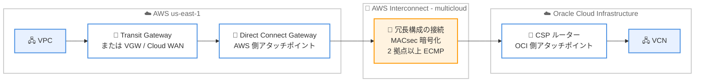

# AWS Interconnect - multicloud の Oracle Cloud Infrastructure 接続が GA

**リリース日**: 2026 年 7 月 29 日
**サービス**: AWS Interconnect
**機能**: AWS Interconnect - multicloud (Oracle Cloud Infrastructure 接続の一般提供開始)

📊 [このアップデートのインフォグラフィックを見る](https://takech9203.github.io/aws-news-summary/20260729-aws-announces-AWS-interconnect-multicloud-OCI-GA.html)

## 概要

AWS は、AWS Interconnect - multicloud における Oracle Cloud Infrastructure (OCI) との接続の一般提供 (GA) を発表しました。AWS Interconnect - multicloud は、AWS と他のクラウドプロバイダー間の回復性とスケーラビリティを備えたプライベート接続を、数分で簡単にプロビジョニングできるマネージドサービスです。AWS はこれを「この種のものとしては初の専用製品」と位置付けており、クラウド間の接続方法に新しいモデルをもたらすものとしています。

本サービスはオープン仕様 (https://github.com/aws/Interconnect で公開されている Connection Coordinator API 仕様) に基づいて構築されています。OCI は 2026 年 5 月にこのオープン仕様を採用してパブリックプレビューを開始しており、今回の GA により、OCI と Google Cloud の両方で一貫した操作性でワークロード間を相互接続できるようになりました。Microsoft Azure のサポートは 2026 年後半に予定されています。

マルチクラウド戦略を採用する企業にとって、これまでクラウド間接続は自前で構築・運用する必要があり、グローバルな多層ネットワークを大規模に管理する複雑さが課題でした。AWS Interconnect - multicloud はこの課題をマネージドサービスとして解決します。

**アップデート前の課題**

このアップデート以前は、AWS と OCI 間のプライベート接続の構築に多くの手作業と運用負荷が発生していました。

- 物理・仮想ルーターの設定、クロスコネクトの発注、BGP ピアリングの管理など、DIY 方式でクラウド間ネットワークを構築する必要があった
- 接続のプロビジョニングに時間がかかり、帯域幅の変更にも再プロビジョニングやサポートへの依頼が必要だった
- 冗長構成や暗号化を自ら設計・運用する必要があり、グローバルな多層ネットワークの管理が複雑だった

**アップデート後の改善**

今回のアップデートにより、以下が可能になりました。

- AWS Management Console、CLI、API から数分で AWS と OCI 間の回復性のあるプライベート接続をプロビジョニングできるようになった
- 物理インフラ、VLAN、BGP セッションの設定と保守を AWS とプロバイダーが管理するため、ユーザーはアプリケーションに集中できるようになった
- OCI と Google Cloud に対して同一の一貫したエクスペリエンスでマルチクラウド接続を管理できるようになった

## アーキテクチャ図



AWS 側では Direct Connect Gateway がアタッチポイントとなり、OCI 側の CSP ルーターとの間に、MACsec で暗号化された冗長構成の Interconnect が単一の論理オブジェクトとしてプロビジョニングされます。

## サービスアップデートの詳細

### 主要機能

1. **OCI とのマネージドプライベート接続の GA**
   - AWS と OCI 間のプライベート接続を数分でプロビジョニング可能
   - OCI は 2026 年 5 月にオープン仕様を採用してパブリックプレビューを開始し、今回 GA に到達
   - AWS Management Console、CLI、API から操作可能

2. **オープン仕様に基づく相互接続モデル**
   - GitHub (https://github.com/aws/Interconnect) で公開される Connection Coordinator API 仕様 (OpenAPI 3.0) に基づく
   - 2 者間で対称的に実装できる API により、マネージド L3 接続の調整を標準化
   - Apache-2.0 ライセンスで公開され、ガバナンスモデルも整備

3. **マルチクラウドでの一貫したエクスペリエンス**
   - OCI と Google Cloud に対して同一の操作性で接続を管理可能
   - Microsoft Azure のサポートは 2026 年後半に予定
   - 帯域幅はコンソールから再プロビジョニングなしで増減可能

4. **組み込みの回復性とセキュリティ**
   - 独立した電源とネットワークを持つ 2 つ以上の物理施設にまたがる冗長ネットワークデバイス上にプロビジョニング
   - 4 接続モデルと ECMP ロードバランシングにより、計画メンテナンス中も少なくとも 1 つのリンクが稼働
   - AWS とプロバイダーのデバイス間の接続は IEEE 802.1AE MACsec でデフォルト暗号化

## 技術仕様

### AWS Interconnect の主要概念

| 項目 | 詳細 |
|------|------|
| Interconnect | AWS とプロバイダー間にプロビジョニングされるマネージド接続オブジェクト。冗長インフラを単一の論理オブジェクトとして抽象化 |
| アタッチポイント | 接続の両側を固定する論理識別子。AWS 側は常に Direct Connect Gateway、multicloud のリモート側は CSP ルーター |
| Direct Connect Gateway | VGW、Transit Gateway、Cloud WAN および AWS Interconnect のアタッチポイントとなる、グローバルに分散された高可用性オブジェクト |
| アクティベーションキー | 接続作成時に生成されるトークン。AWS とプロバイダー間で共有し、双方がリクエストを検証してからプロビジョニングを実行 |
| Create/Accept フロー | 一方が Create でアクティベーションキーを生成し、他方が Accept で承認すると両側で自動プロビジョニングが開始 |
| 暗号化 | IEEE 802.1AE MACsec によるデフォルト暗号化。暗号化セッションがアクティブな場合のみトラフィックを転送 |
| モニタリング | CloudWatch Network Synthetic Monitor が追加費用なしで 1 つ付属 (レイテンシー、パケットロス)。帯域使用率メトリクスも提供 |

### 対応する AWS ネットワーキングサービス

| 接続方式 | 到達性 |
|----------|--------|
| Virtual Private Gateway / Transit Gateway | Direct Connect Gateway 経由で、同一リージョン内の Interconnect のみに到達可能 |
| AWS Cloud WAN | ネイティブ Direct Connect アタッチメントにより、任意の Core Network Edge から同一 Direct Connect Gateway に接続されたグローバルの Interconnect に到達可能 |

## 設定方法

### 前提条件

1. AWS アカウントと、接続先の OCI テナンシーを保有していること
2. AWS 側のアタッチポイントとなる Direct Connect Gateway を用意していること (VGW、Transit Gateway、Cloud WAN のいずれかと関連付け)
3. OCI 接続をサポートするリージョン (us-east-1) を使用すること

### 手順

#### ステップ 1: Interconnect の作成

```bash
# AWS Management Console、CLI、または API で
# リージョン、必要なネットワーク容量、プロバイダー (OCI) を選択して作成
```

リージョン、帯域幅、プロバイダーを選択して Create アクションを実行すると、アクティベーションキーが発行され、リクエストがプロバイダーに送信されます。

#### ステップ 2: アクティベーションキーによる承認

```bash
# 発行されたアクティベーションキーを使用して
# リモート側 (OCI) で Accept アクションを実行
```

アクティベーションキーを使ってリクエストを承認すると、AWS とプロバイダーの双方で自動プロビジョニングが開始されます。以降のユーザー操作は不要です。

#### ステップ 3: ルーティングとモニタリングの設定

Interconnect は AWS 側で Direct Connect Gateway に、リモート側でプロバイダーのアタッチポイントにアタッチされます。CloudWatch Network Synthetic Monitor でレイテンシーとパケットロスを、帯域使用率メトリクスで容量の使用状況を監視し、必要に応じて CloudWatch アラームを設定します。

## メリット

### ビジネス面

- **マルチクラウド戦略の加速**: 相互運用性の確保、テクノロジー選択の柔軟性、環境をまたいだアプリケーション展開の迅速化を実現
- **運用コストの削減**: 物理インフラの構築・保守が不要になり、ネットワーク運用チームの負荷を軽減
- **弾力的なコスト管理**: ピーク時に帯域幅をスケールアップし、不要時にスケールダウンする弾力的なモデルでコストを制御

### 技術面

- **迅速なプロビジョニング**: 新しい Interconnect は通常数分でプロビジョニングと設定が完了
- **高い回復性**: デバイス、クロスコネクト、施設のレベルで単一障害点を排除する冗長アーキテクチャ
- **デフォルトのセキュリティ**: MACsec によるデフォルト暗号化と、双方の検証を伴う Create/Accept フロー
- **標準化された接続モデル**: オープン仕様により、複数のクラウドプロバイダーに対して一貫した API と操作性を提供

## デメリット・制約事項

### 制限事項

- OCI との接続は現時点で us-east-1 (バージニア北部) リージョンのみで利用可能
- Microsoft Azure のサポートは 2026 年後半予定であり、現時点では利用不可
- VGW / Transit Gateway 経由の場合、同一リージョン内の Interconnect にのみ到達可能 (グローバル到達には Cloud WAN が必要)
- CloudWatch の Network Health Indicator 機能は Interconnect では未サポート (レイテンシーとパケットロスのメトリクスはサポート)

### 考慮すべき点

- 発表時点で料金の詳細は明記されていないため、利用前に料金体系の確認が必要
- 日本のリージョンからの利用にはリージョン拡大を待つか、Cloud WAN の構成を検討する必要がある
- 既存の DIY 方式 (Direct Connect + 相互接続ポイント経由の自前構成) からの移行では、ルーティング設計の見直しが必要

## ユースケース

### ユースケース 1: Oracle Database と AWS アプリケーションの連携

**シナリオ**: 基幹データベースを OCI 上の Oracle Database で運用し、アプリケーション層やアナリティクスを AWS で稼働させている企業が、両環境間で低レイテンシーかつセキュアなプライベート接続を必要としている。

**実装例**:
```
AWS VPC (アプリケーション層)
  → Transit Gateway → Direct Connect Gateway
  → AWS Interconnect - multicloud
  → OCI VCN (Oracle Database)
```

**効果**: 物理接続や BGP の管理なしに、暗号化された冗長プライベート接続を数分で確立し、クロスクラウドのデータベースアクセスを安定化。

### ユースケース 2: マルチクラウド分散ワークロードの統合ネットワーク

**シナリオ**: AI/ML 処理を Google Cloud、基幹系を OCI、その他のワークロードを AWS で運用する企業が、クラウド間のネットワークを統一的に管理したい。

**実装例**:
```
AWS Cloud WAN (グローバルネットワーク)
  → Direct Connect Gateway
  → AWS Interconnect - multicloud → OCI
  → AWS Interconnect - multicloud → Google Cloud
```

**効果**: OCI と Google Cloud に対して同一のエクスペリエンスで接続を管理し、マルチクラウドネットワーク運用を標準化。

### ユースケース 3: 帯域幅の弾力的なスケーリング

**シナリオ**: 月次バッチでクラウド間の大量データ転送が発生する企業が、ピーク時のみ帯域幅を増強したい。

**実装例**:
```
通常時: 低帯域で運用
バッチ実行前: コンソールから帯域幅を増加 (再プロビジョニング不要)
バッチ完了後: 帯域幅を縮小してコストを削減
```

**効果**: 接続の再構築やサポートへの依頼なしに帯域幅を増減でき、コストとパフォーマンスを最適化。

## 料金

発表時点の What's New では料金の詳細は明記されていません。CloudWatch Network Synthetic Monitor は各 Interconnect に追加費用なしで 1 つ含まれます。最新の料金情報は AWS Interconnect の公式ページで確認してください。

## 利用可能リージョン

- OCI との AWS Interconnect - multicloud: us-east-1 (米国東部、バージニア北部)
- Google Cloud との接続は既に利用可能
- Microsoft Azure のサポートは 2026 年後半に予定

## 関連サービス・機能

- **AWS Direct Connect**: Direct Connect Gateway が AWS 側のアタッチポイントとして機能し、VGW、Transit Gateway、Cloud WAN との接続を仲介
- **AWS Transit Gateway**: リージョン内の複数 VPC を集約して Interconnect に接続するハブとして利用可能
- **AWS Cloud WAN**: グローバルネットワークの任意の Core Network Edge から、同一 Direct Connect Gateway に接続されたグローバルの Interconnect に到達可能
- **Amazon CloudWatch**: Network Synthetic Monitor によるレイテンシー・パケットロス監視と、帯域使用率メトリクスによる容量管理
- **AWS Interconnect - last mile**: 支社、データセンター、リモート拠点を認定パートナーのラストマイルネットワーク経由で AWS に接続する姉妹オファリング

## 参考リンク

- 📊 [インフォグラフィック](https://takech9203.github.io/aws-news-summary/20260729-aws-announces-AWS-interconnect-multicloud-OCI-GA.html)
- [公式発表 (What's New)](https://aws.amazon.com/about-aws/whats-new/2026/07/aws-announces-AWS-interconnect-multicloud-OCI-GA/)
- [ドキュメント: What is AWS Interconnect?](https://docs.aws.amazon.com/interconnect/latest/userguide/what-is-interconnect.html)
- [オープン仕様 (GitHub: aws/Interconnect)](https://github.com/aws/Interconnect)

## まとめ

AWS Interconnect - multicloud の OCI 接続 GA により、AWS と OCI 間のプライベート接続を数分でプロビジョニングできるようになり、マルチクラウドネットワークの構築・運用が大幅に簡素化されます。オープン仕様に基づく標準化されたモデルは Google Cloud に続く展開であり、2026 年後半には Azure サポートも予定されているため、マルチクラウド戦略を持つ組織は今のうちにアーキテクチャへの組み込みを検討することを推奨します。現時点で OCI 接続は us-east-1 のみのため、利用リージョンと料金体系の確認から始めてください。
