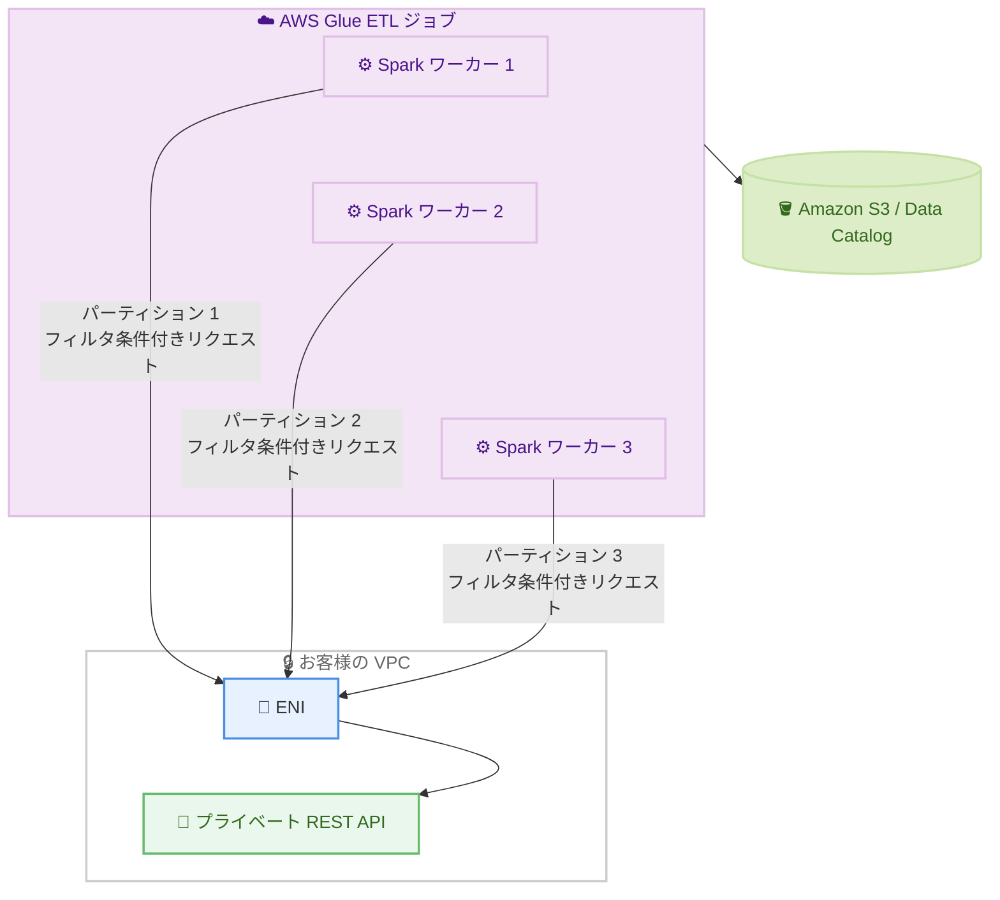

# AWS Glue - REST API コネクタの VPC サポート、フィルタプッシュダウン、パーティションサポート

**リリース日**: 2026 年 7 月 29 日
**サービス**: AWS Glue
**機能**: REST API コネクタの VPC 接続、フィルタプッシュダウン、パーティション読み取り

📊 [このアップデートのインフォグラフィックを見る](https://takech9203.github.io/aws-news-summary/20260729-aws-glue-rest-connector-filtering-partitioning-vpc.html)

## 概要

AWS Glue は、REST API コネクタに 3 つの新機能を追加しました。VPC サポート、フィルタプッシュダウン、パーティションサポートです。REST API コネクタは、ネイティブコネクタが存在しない独自システムを含む、任意の REST ベースの API ソースからデータを取り込むための機能で、2026 年 2 月に一般提供が開始されました。

今回のアップデートにより、プライベートサブネット内や AWS PrivateLink、VPN 経由でのみアクセス可能なデータソースへ、トラフィックをパブリックインターネットに公開することなく安全に接続できるようになりました。また、クエリの述語 (predicate) を API ネイティブなパラメータに変換して転送データ量を削減するフィルタプッシュダウンと、大規模データセットを複数の Spark ワーカーに分散して並列読み取りを行うパーティションサポートにより、ETL ジョブのパフォーマンスとコスト効率が向上します。

社内システムや SaaS の REST API からデータを取り込む ETL パイプラインを運用するデータエンジニアにとって、カスタムコードなしでプライベート接続・データ転送の最適化・並列読み取りを実現できる重要なアップデートです。

**アップデート前の課題**

- REST API コネクタはパブリックにアクセス可能なエンドポイントのみに対応しており、VPC 内のプライベート API に接続するには回避策が必要だった
- フィルタ条件をソース側に伝搬できず、全データを取得した後に Glue 側でフィルタリングする必要があり、不要なデータ転送コストが発生していた
- 大規模なページネーション API からの読み取りが単一の逐次処理となり、取り込みに時間がかかっていた

**アップデート後の改善**

- VPC 設定を持つ REST 接続により、プライベートサブネット、VPN、AWS PrivateLink 経由のデータソースへ安全に接続可能になった
- フィルタプッシュダウンにより、条件に一致するレコードのみがソースから転送され、データ転送コストの削減とジョブパフォーマンスの向上を実現した
- フィールドベースまたはレコード数ベースのパーティション戦略により、複数の Spark ワーカーによる並列読み取りが可能になり、大量データの取り込みが高速化された

## アーキテクチャ図



AWS Glue はお客様の VPC 内に ENI を作成してプライベート REST API への接続を確立します。各 Spark ワーカーはパーティションごとにフィルタ条件をプッシュダウンしたリクエストを並列実行し、必要なデータのみを取得して出力先へ書き込みます。

## サービスアップデートの詳細

### 主要機能

1. **VPC サポート**
   - VPC 設定 (`PhysicalConnectionRequirements`) を含む REST 接続を作成することで、VPC 内でのみアクセス可能なプライベート REST API に接続可能
   - VPN、AWS PrivateLink、ファイアウォールの背後にある API にも対応
   - AWS Glue が接続のサブネットから ENI (Elastic Network Interface) を作成し、Spark エグゼキュータを VPC 内に配置
   - トラフィックがパブリックインターネットに露出しないため、セキュリティ要件の厳しい環境でも利用可能

2. **フィルタプッシュダウン**
   - クエリの述語を API ネイティブなパラメータに変換し、条件に一致するレコードのみをソースから転送
   - `QUERY_PARAMS` モード: 各フィルタを個別の URL クエリパラメータに変換 (例: `?created[gte]=1704067200&created[lte]=1717200000`)
   - `FILTER_STRING` モード: すべてのフィルタを単一のクエリパラメータに結合 (例: `?search=status eq "ACTIVE" and lastUpdated gt "2024-01-01"`)
   - サポートされる演算子: `EQUAL_TO`、`GREATER_THAN`、`LESS_THAN`、`GREATER_THAN_OR_EQUAL_TO`、`LESS_THAN_OR_EQUAL_TO`、`NOT_EQUAL_TO`、`CONTAINS`、`BETWEEN`、`AND`、`OR`
   - フィールド単位のオーバーライド (`FilterOverrides`) により、API ごとの演算子構文や日時フォーマットの違いに柔軟に対応

3. **パーティションサポート**
   - 大規模データセットを複数の Spark ワーカーに分散して並列読み取りを実行
   - **フィールドベースパーティション**: `TIMESTAMP` または `INTEGER` 型のフィールドの値範囲を分割 (例: 日付範囲を 4 分割して 4 ワーカーで並列取得)
   - **レコード数ベースパーティション**: レコード総数を取得する `CountRequest` を設定し、総数に基づいてデータを分割
   - パーティションフィルタとユーザーフィルタは AND で結合され、パーティション生成に失敗した場合は単一パーティションにフォールバックしてジョブは完了する

## 技術仕様

### VPC 接続の要件

| 項目 | 詳細 |
|------|------|
| VPC 構成 | 少なくとも 1 つのサブネットとセキュリティグループが必要 |
| セキュリティグループ | 自己参照ルール (全 TCP) が必要 |
| ネットワーク接続 | VPC からターゲット REST API への到達性が必要 |
| IAM 権限 | `ec2:CreateNetworkInterface`、`ec2:DescribeNetworkInterfaces`、`ec2:DeleteNetworkInterface` |
| ジョブ実行ロール | `glue:DescribeConnectionType` 権限が必要 |
| 制約 | ジョブあたり 1 VPC のみ。カスタムプロキシ・カスタム証明書は非対応 |

### パーティション関連の Spark ジョブパラメータ

| パラメータ | 対象 | 説明 |
|------|------|------|
| `NUM_PARTITIONS` | 共通 (必須) | 並列パーティション数 |
| `PARTITION_FIELD` | フィールドベースのみ | パーティション対象フィールド。スキーマで `IsPartitionable: true` の指定が必要 |
| `LOWER_BOUND` | フィールドベースのみ | パーティション範囲の下限 (境界を含む) |
| `UPPER_BOUND` | フィールドベースのみ | パーティション範囲の上限 (最後のパーティションのみ境界を含む) |

### API変更履歴

| 日付 | サービス | 変更内容 |
|------|----------|----------|
| 2026/07/29 | [AWS Glue](https://awsapichanges.com/archive/changes/391890-glue.html) | 2 updated api methods - `RegisterConnectionType` と `DescribeConnectionType` に `FilterConfiguration`、`PartitionConfiguration`、`IsPartitionable` などのフィルタリング・パーティショニング・VPC 関連パラメータを追加 |

### VPC 接続の設定例

```json
{
    "ConnectionInput": {
        "Name": "my-private-rest-connection",
        "ConnectionType": "MY_REST_CONNECTION_TYPE",
        "PhysicalConnectionRequirements": {
            "SubnetId": "subnet-0123456789abcdef0",
            "SecurityGroupIdList": ["sg-0123456789abcdef0"],
            "AvailabilityZone": "ap-northeast-1a"
        },
        "AuthenticationConfiguration": {
            "AuthenticationType": "BASIC"
        }
    }
}
```

## 設定方法

### 前提条件

1. AWS Glue REST API ConnectionType が登録済みであること (`RegisterConnectionType`)
2. VPC 接続を使用する場合、サブネット・セキュリティグループ (自己参照ルール付き)・ターゲット API へのネットワーク到達性が確保されていること
3. ジョブ実行ロールに ENI 操作権限 (`ec2:CreateNetworkInterface` など) と `glue:DescribeConnectionType` 権限が付与されていること

### 手順

#### ステップ1: ConnectionType にフィルタ・パーティション設定を登録

```json
"FilterConfiguration": {
    "FilterMode": "QUERY_PARAMS",
    "OperatorMappings": {
        "EQUAL_TO": "{FIELD}",
        "GREATER_THAN_OR_EQUAL_TO": "{FIELD}[gte]",
        "LESS_THAN_OR_EQUAL_TO": "{FIELD}[lte]"
    },
    "DateTimeFormat": "EPOCH_SECONDS",
    "BetweenConfiguration": {
        "LowBoundKey": "{FIELD}[gte]",
        "HighBoundKey": "{FIELD}[lte]"
    }
}
```

`RegisterConnectionType` の `FilterConfiguration` で、Glue のフィルタ述語をターゲット API のクエリパラメータ構文にマッピングします。この例では `created >= 2024-01-01 AND created <= 2024-06-01` という条件が `?created[gte]=1704067200&created[lte]=1717200000` に変換されます。フィールドベースパーティションを使う場合は、スキーマ定義で対象フィールドに `"IsPartitionable": true` を設定します。

#### ステップ2: VPC 設定付きの接続を作成

```bash
aws glue create-connection --connection-input '{
    "Name": "my-private-rest-connection",
    "ConnectionType": "MY_REST_CONNECTION_TYPE",
    "PhysicalConnectionRequirements": {
        "SubnetId": "subnet-0123456789abcdef0",
        "SecurityGroupIdList": ["sg-0123456789abcdef0"],
        "AvailabilityZone": "ap-northeast-1a"
    }
}'
```

`PhysicalConnectionRequirements` にサブネット ID、セキュリティグループ ID、アベイラビリティゾーンを指定して接続を作成します。ETL ジョブ実行時に AWS Glue がこのサブネットに ENI を作成し、Spark エグゼキュータを VPC 内に配置してプライベート API への接続を確立します。

#### ステップ3: ETL ジョブでフィルタとパーティションを指定して読み取り

```python
rest_read = glueContext.create_dynamic_frame.from_options(
    connection_type="rest",
    connection_options={
        "connectionName": "my-private-rest-connection",
        "ENTITY_NAME": "orders",
        "CONNECTION_TYPE": "MY_REST_CONNECTION_TYPE",
        "FILTER_PREDICATE": "status = \"ACTIVE\" AND lastUpdated >= \"2026-01-01T00:00:00.000Z\"",
        "PARTITION_FIELD": "lastUpdated",
        "LOWER_BOUND": "2026-01-01T00:00:00.000Z",
        "UPPER_BOUND": "2026-07-01T00:00:00.000Z",
        "NUM_PARTITIONS": "4"
    }
)
```

`FILTER_PREDICATE` でソース側にプッシュダウンするフィルタ条件を指定し、`PARTITION_FIELD` と `NUM_PARTITIONS` で並列読み取りを構成します。この例では `lastUpdated` フィールドの範囲が 4 分割され、4 つの Spark ワーカーがそれぞれの範囲を並列に取得します。

## メリット

### ビジネス面

- **セキュリティコンプライアンスの強化**: プライベート API へのアクセスがパブリックインターネットを経由しないため、金融・医療など厳格なセキュリティ要件を持つ業界でも REST API コネクタを採用可能
- **コスト削減**: フィルタプッシュダウンにより必要なデータのみを転送するため、データ転送コストと Glue ジョブの実行時間 (DPU 時間) を削減
- **開発工数の削減**: プライベート接続・フィルタリング・並列化をカスタムコードなしで実現でき、パイプライン開発と保守の工数を削減

### 技術面

- **並列読み取りによる高速化**: フィールドベースまたはレコード数ベースのパーティション戦略により、大量のページネーション API からの取り込みを複数ワーカーで並列化
- **柔軟なフィルタマッピング**: `QUERY_PARAMS` と `FILTER_STRING` の 2 つのモードと演算子マッピングにより、多様な REST API のフィルタ構文に適応可能
- **フォールトトレランス**: パーティション生成に失敗した場合も単一パーティションにフォールバックしてジョブが完了するため、堅牢なパイプラインを構築可能

## デメリット・制約事項

### 制限事項

- VPC REST 接続では、ジョブあたり 1 つの VPC のみサポート
- VPC REST 接続では、カスタムプロキシおよびカスタム証明書は非対応
- フィールドベースパーティションの対象フィールドは `TIMESTAMP` または `INTEGER` 型のみで、スキーマで `IsPartitionable: true` の指定が必要
- フィルタ述語に LIMIT 句が含まれる場合、パーティショニングはスキップされる

### 考慮すべき点

- 初回接続作成時の ENI プロビジョニングによりレイテンシが発生する可能性がある
- セキュリティグループに自己参照ルール (全 TCP) が必要なため、既存のセキュリティグループポリシーとの整合性を確認する必要がある
- フィルタプッシュダウンの効果はターゲット API がフィルタパラメータをサポートしているかに依存するため、API 仕様に合わせた `FilterConfiguration` の設計が必要
- パーティション数はターゲット API のレートリミットを考慮して設定する必要がある

## ユースケース

### ユースケース1: 社内プライベート API からの安全なデータ取り込み

**シナリオ**: オンプレミスから VPN で接続された VPC 内にある社内基幹システムの REST API から、日次で受注データをデータレイクに取り込みたい。セキュリティポリシー上、トラフィックをインターネットに出すことはできない。

**実装例**:
```json
"PhysicalConnectionRequirements": {
    "SubnetId": "subnet-xxxxxxxx",
    "SecurityGroupIdList": ["sg-xxxxxxxx"],
    "AvailabilityZone": "ap-northeast-1a"
}
```

**効果**: AWS Glue が VPC 内に ENI を作成して接続するため、トラフィックがインターネットに露出せず、セキュリティポリシーを満たしながら ETL パイプラインを構築できる。

### ユースケース2: 増分取り込みでのデータ転送量削減

**シナリオ**: SaaS の REST API から顧客データを取り込んでいるが、毎回全件取得しているため転送量とジョブ実行時間が増大している。前回実行以降に更新されたレコードのみを取得したい。

**実装例**:
```python
connection_options={
    "connectionName": "saas-connection",
    "ENTITY_NAME": "customers",
    "CONNECTION_TYPE": "SAAS_REST_TYPE",
    "FILTER_PREDICATE": "lastUpdated >= \"2026-07-28T00:00:00.000Z\""
}
```

**効果**: フィルタ条件が API のクエリパラメータに変換されてソース側で絞り込みが行われるため、更新分のみが転送され、転送コストとジョブ実行時間を大幅に削減できる。

### ユースケース3: 大規模ページネーション API の並列取り込み

**シナリオ**: 数千万件のトランザクションデータを提供するページネーション API からの初回フル取り込みに時間がかかりすぎている。

**実装例**:
```python
connection_options={
    "connectionName": "transactions-connection",
    "ENTITY_NAME": "transactions",
    "CONNECTION_TYPE": "TXN_REST_TYPE",
    "PARTITION_FIELD": "createdAt",
    "LOWER_BOUND": "2025-01-01T00:00:00.000Z",
    "UPPER_BOUND": "2026-07-01T00:00:00.000Z",
    "NUM_PARTITIONS": "8"
}
```

**効果**: 日付範囲が 8 分割され、8 つの Spark ワーカーが並列にデータを取得するため、逐次読み取りと比較して取り込み時間を大幅に短縮できる。

## 料金

REST API コネクタ自体に追加料金はなく、AWS Glue ETL ジョブの標準料金 (DPU 時間ベース) が適用されます。フィルタプッシュダウンによる転送データ量の削減とパーティションによる実行時間の短縮は、ジョブの DPU 時間削減によるコスト最適化につながる可能性があります。詳細は [AWS Glue 料金ページ](https://aws.amazon.com/glue/pricing/) を参照してください。

## 利用可能リージョン

AWS Glue が利用可能なすべての AWS 商用リージョンで利用できます (東京・大阪リージョンを含む)。

## 関連サービス・機能

- **AWS PrivateLink**: VPC サポートにより、PrivateLink 経由で公開されるプライベート API エンドポイントへの接続が可能
- **AWS Glue Data Catalog**: REST API から取り込んだデータをカタログ化し、Athena や Redshift Spectrum から検索可能
- **AWS Secrets Manager**: REST API 接続の認証情報 (API キー、OAuth トークンなど) を安全に管理
- **Amazon VPC**: ENI の作成先となるサブネットとセキュリティグループを提供し、プライベート接続を実現

## 参考リンク

- 📊 [インフォグラフィック](https://takech9203.github.io/aws-news-summary/20260729-aws-glue-rest-connector-filtering-partitioning-vpc.html)
- [公式発表 (What's New)](https://aws.amazon.com/about-aws/whats-new/2026/07/aws-glue-rest-connector-filtering-partitioning-vpc)
- [ドキュメント: Connecting to a REST API](https://docs.aws.amazon.com/glue/latest/dg/connecting-to-data-rest-api.html)
- [ドキュメント: Connect to private REST APIs through a VPC](https://docs.aws.amazon.com/glue/latest/dg/rest-api-vpc.html)
- [ドキュメント: Reading from a REST API](https://docs.aws.amazon.com/glue/latest/dg/rest-api-reading.html)
- [料金ページ](https://aws.amazon.com/glue/pricing/)
- [関連レポート: AWS Glue ネイティブ REST API コネクタ (2026 年 2 月)](./2026-02-05-aws-glue-rest-api-connector.md)

## まとめ

AWS Glue REST API コネクタへの VPC サポート、フィルタプッシュダウン、パーティションサポートの追加により、プライベートな REST API を含む任意の REST データソースから、安全かつ効率的にデータを取り込めるようになりました。特にセキュリティ要件でプライベート接続が必須の環境や、大量データの増分取り込み・並列取り込みが必要なパイプラインで大きな効果が期待できます。REST API からのデータ取り込みにカスタムコードを使用している場合は、本コネクタへの移行を検討することを推奨します。
