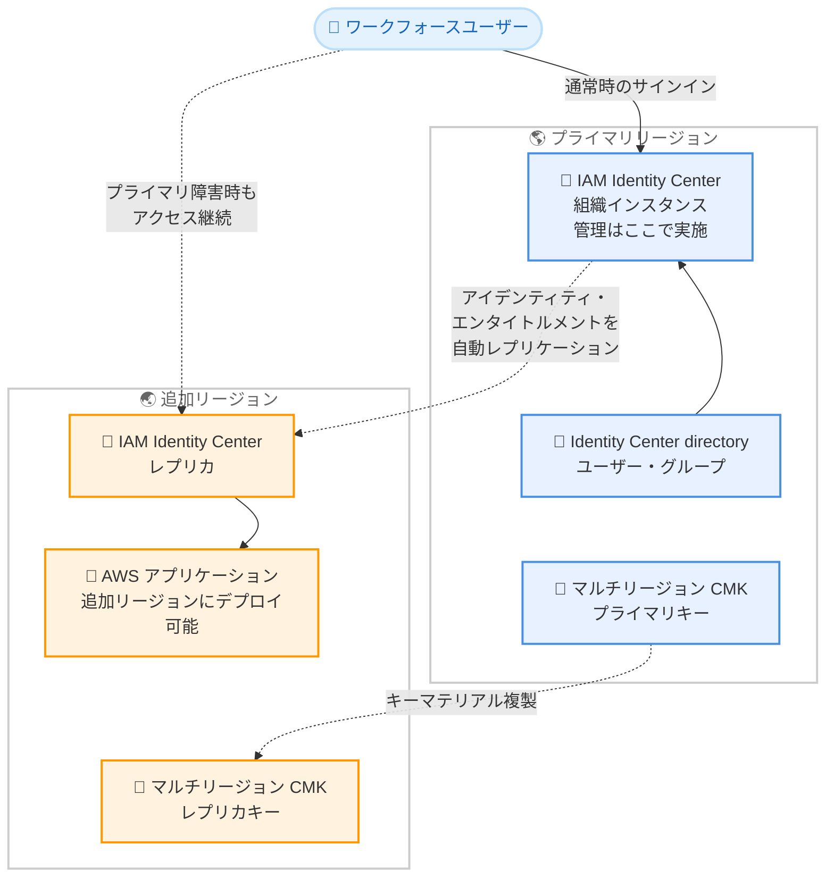

# AWS IAM Identity Center - Identity Center directory へのマルチリージョンサポート拡張

**リリース日**: 2026年07月29日
**サービス**: AWS IAM Identity Center
**機能**: Identity Center directory を ID ソースとする組織インスタンスのマルチリージョンサポート

📊 [このアップデートのインフォグラフィックを見る](https://takech9203.github.io/aws-news-summary/20260729-aws-iam-identity-center-extends-multi-region-support-to-identity-center-directory.html)

## 概要

AWS IAM Identity Center が、マルチリージョンサポートを Identity Center directory を ID ソースとして使用する組織インスタンスにも拡張したことを発表しました。これまでマルチリージョンサポートは、外部アイデンティティプロバイダー (Okta、Microsoft Entra ID など) に接続された組織インスタンスのみで利用可能でしたが、今回のアップデートにより、IAM Identity Center に組み込みの Identity Center directory でワークフォースのアイデンティティを管理している組織でも利用できるようになりました。

この機能を有効化すると、アイデンティティ、エンタイトルメント (アクセス権限)、その他の情報がプライマリリージョンから追加リージョンへ自動的にレプリケートされます。プライマリリージョンで障害が発生した場合でも、追加リージョンに既にプロビジョニングされているエンタイトルメントを通じて、ユーザーは AWS アカウントへのアクセスを維持できます。外部 IdP を導入していない中小規模の組織や、Identity Center directory をシンプルに利用している組織にとって、レジリエンス向上の選択肢が大きく広がるアップデートです。

**アップデート前の課題**

- マルチリージョンサポートは外部アイデンティティプロバイダーを使用する組織インスタンスに限定されており、Identity Center directory を ID ソースとする組織は利用できなかった
- Identity Center directory を使用する組織では、プライマリリージョンの障害時にユーザーアクセスが中断されるリスクがあった
- マルチリージョンの恩恵を受けるためだけに、外部 IdP の導入・運用コストを負担する必要があった

**アップデート後の改善**

- Identity Center directory を ID ソースとする組織インスタンスでも、マルチリージョンサポートを利用できるようになった
- アイデンティティとエンタイトルメントがプライマリリージョンから追加リージョンへ自動的にレプリケートされ、リージョン障害時もユーザーアクセスを維持できるようになった
- データレジデンシーやユーザーへの近接性といったビジネスニーズに合わせて、AWS アプリケーションを追加リージョンにデプロイできるようになった

## アーキテクチャ図



この図は、Identity Center directory を ID ソースとする組織インスタンスにおいて、プライマリリージョンから追加リージョンへアイデンティティとエンタイトルメントが自動レプリケートされ、障害時もユーザーアクセスが継続される構成を示しています。

## サービスアップデートの詳細

### 主要機能

1. **Identity Center directory へのマルチリージョンサポート拡張**
   - 従来は外部 IdP 接続の組織インスタンスのみが対象だったマルチリージョンサポートを、組み込みの Identity Center directory を使用するインスタンスにも拡張
   - 外部 IdP を導入せずに、マルチリージョンのレジリエンスを実現可能
   - 組織インスタンスが対象 (アカウントインスタンスは対象外)

2. **アイデンティティとエンタイトルメントの自動レプリケーション**
   - 有効化すると、アイデンティティ、エンタイトルメント、その他の情報がプライマリリージョンから追加リージョンへ自動的にレプリケートされる
   - プライマリリージョンの障害時も、追加リージョンに既にプロビジョニング済みのエンタイトルメントを通じて AWS アカウントへのアクセスを維持
   - 手動での同期作業は不要

3. **追加リージョンへの AWS アプリケーションデプロイ**
   - アプリケーション管理者は、標準のデプロイワークフローを使用して、対応する AWS アプリケーションを追加リージョンにデプロイ可能
   - データレジデンシー要件やユーザーへの近接性など、ビジネスニーズに合わせたリージョン選択が可能
   - IAM Identity Center の管理操作自体はプライマリリージョンで実施

## 技術仕様

### 前提条件と要件

| 項目 | 詳細 |
|------|------|
| インスタンスタイプ | 組織インスタンスのみ対象 |
| ID ソース | Identity Center directory (今回追加)、外部 IdP (従来から対応) |
| KMS キー | マルチリージョンカスタマー管理キー CMK が必須 |
| 利用可能リージョン | 17 の enabled-by-default 商用リージョン |
| 管理操作 | プライマリリージョンで実施 |
| レプリケーション | プライマリリージョンから追加リージョンへ自動実行 |

### マルチリージョン CMK の要件

マルチリージョンサポートを有効化するには、インスタンスがマルチリージョンカスタマー管理キー (CMK) を使用している必要があります。マルチリージョンキーにより、複数リージョン間で同一のキーマテリアルを使用した暗号化・復号が可能になります。

```bash
# プライマリリージョンでマルチリージョン CMK を作成
aws kms create-key \
  --multi-region \
  --description "Multi-Region key for IAM Identity Center" \
  --key-usage ENCRYPT_DECRYPT \
  --region us-east-1
```

## 設定方法

### 前提条件

1. AWS Organizations で IAM Identity Center の組織インスタンスが有効化されている
2. ID ソースとして Identity Center directory または外部 IdP が設定されている
3. マルチリージョンカスタマー管理キー (CMK) が作成され、インスタンスで使用されている
4. 追加リージョンが enabled-by-default の商用リージョンである

### 手順

#### ステップ 1: マルチリージョン CMK の作成

```bash
aws kms create-key \
  --multi-region \
  --description "Multi-Region key for IAM Identity Center" \
  --key-usage ENCRYPT_DECRYPT \
  --region us-east-1
```

プライマリリージョンでマルチリージョン CMK を作成します。既にシングルリージョンの CMK や AWS 所有キーを使用している場合は、マルチリージョン CMK への切り替えが必要です。

#### ステップ 2: レプリカキーの作成

```bash
aws kms replicate-key \
  --key-id <primary-key-id> \
  --replica-region ap-northeast-1 \
  --region us-east-1
```

追加リージョンにレプリカキーを作成します。これにより、追加リージョンでも同一のキーマテリアルを使用してデータを復号できます。

#### ステップ 3: 追加リージョンの有効化

AWS Management Console で IAM Identity Center の設定を開き、マルチリージョンの設定から追加リージョンを選択して有効化します。有効化後、アイデンティティとエンタイトルメントが自動的にレプリケートされます。詳細な手順は IAM Identity Center ユーザーガイドのマルチリージョンセクションを参照してください。

#### ステップ 4: アプリケーションのデプロイ

標準のデプロイワークフローを使用して、対応する AWS アプリケーションを追加リージョンにデプロイします。対応アプリケーションの一覧はユーザーガイドで確認できます。

## メリット

### ビジネス面

- **ビジネス継続性の向上**: プライマリリージョンの障害時もユーザーアクセスが維持され、業務中断のリスクを低減できる
- **外部 IdP 導入コストの回避**: マルチリージョンのレジリエンスを得るために外部 IdP を導入・運用する必要がなくなる
- **データレジデンシー対応**: ビジネスニーズに合わせたリージョンへのアプリケーションデプロイにより、規制要件に対応しやすくなる

### 技術面

- **自動レプリケーション**: アイデンティティとエンタイトルメントが自動的に複製されるため、手動同期の仕組みを構築する必要がない
- **既存ワークフローとの互換性**: アプリケーションのデプロイは標準ワークフローをそのまま使用できる
- **一元管理の維持**: 管理操作はプライマリリージョンに集約されたまま、アクセスの可用性のみを複数リージョンに拡張できる

## デメリット・制約事項

### 制限事項

- 組織インスタンスのみ対象で、アカウントインスタンスでは利用できない
- マルチリージョンカスタマー管理キー (CMK) の使用が必須
- 利用可能なのは 17 の enabled-by-default 商用リージョンに限定される (オプトインリージョンは対象外)
- IAM Identity Center の管理操作はプライマリリージョンでのみ実施可能

### 考慮すべき点

- マルチリージョン CMK の保存と使用に対して AWS KMS の標準料金が発生する
- 既に AWS 所有キーやシングルリージョン CMK を使用している場合、マルチリージョン CMK への移行作業が必要
- 追加リージョンで利用できる AWS アプリケーションは、対応アプリケーションの一覧を事前に確認する必要がある

## ユースケース

### ユースケース 1: 外部 IdP を持たない組織のディザスタリカバリ

**シナリオ**: 外部 IdP を導入せず、Identity Center directory でユーザーを直接管理している組織が、リージョン障害時にも AWS アカウントへのアクセスを確保したい。

**実装例**:
```bash
# プライマリリージョン: us-east-1、追加リージョン: us-west-2
aws kms create-key --multi-region --region us-east-1
aws kms replicate-key --key-id <key-id> --replica-region us-west-2 --region us-east-1
# コンソールから追加リージョンを有効化
```

**効果**: 外部 IdP を導入することなく、プライマリリージョン障害時も従業員が AWS アカウントへのアクセスを継続でき、ディザスタリカバリ体制を低コストで強化できる。

### ユースケース 2: データレジデンシー要件への対応

**シナリオ**: 規制要件により、特定の国や地域内で AWS アプリケーションを稼働させる必要がある企業が、Identity Center directory を維持したままリージョンを拡張したい。

**実装例**:
```bash
# プライマリリージョン: us-east-1、追加リージョン: eu-central-1
aws kms replicate-key --key-id <key-id> --replica-region eu-central-1 --region us-east-1
# 追加リージョンに対応 AWS アプリケーションをデプロイ
```

**効果**: ID ソースを変更することなく、データレジデンシー要件を満たすリージョンにアプリケーションをデプロイでき、コンプライアンスとユーザー体験を両立できる。

### ユースケース 3: グローバル拠点のユーザー近接性の向上

**シナリオ**: 複数地域に拠点を持つ企業が、各拠点のユーザーに近いリージョンで AWS アプリケーションを提供し、レイテンシーを低減したい。

**実装例**:
```bash
# プライマリリージョン: us-east-1
# 追加リージョン: ap-northeast-1 東京、eu-west-1 アイルランド
aws kms replicate-key --key-id <key-id> --replica-region ap-northeast-1 --region us-east-1
aws kms replicate-key --key-id <key-id> --replica-region eu-west-1 --region us-east-1
```

**効果**: 各地域のユーザーが近接リージョンのアプリケーションを利用でき、アクセスの応答性とレジリエンスの両方が向上する。

## 料金

IAM Identity Center 自体は追加料金なしで利用できます。ただし、マルチリージョンサポートに必須のカスタマー管理キー (CMK) の保存と使用に対して、AWS KMS の標準料金が適用されます。

### 料金例

| 使用量 | 月額料金 (概算) |
|--------|-----------------|
| マルチリージョン CMK (プライマリ + レプリカ 1 リージョン) | $2.00 (各リージョン $1.00) |
| KMS API リクエスト (20,000 リクエスト/月、無料枠超過分) | 約 $0.03 |

**注意**: 実際の料金はリージョンや使用量によって異なります。詳細は [AWS KMS 料金ページ](https://aws.amazon.com/kms/pricing/) をご確認ください。

## 利用可能リージョン

17 の enabled-by-default 商用 AWS リージョンで、組織インスタンスを対象に利用可能です。enabled-by-default リージョンの一覧は [AWS アカウントのドキュメント](https://docs.aws.amazon.com/accounts/latest/reference/manage-acct-regions.html) を参照してください。

## 関連サービス・機能

- **AWS Organizations**: IAM Identity Center の組織インスタンスを利用するための基盤サービス
- **AWS KMS**: マルチリージョンカスタマー管理キーによるレプリケーションデータの暗号化を提供
- **AWS マネージドアプリケーション**: Amazon Q Developer や Amazon QuickSight など、IAM Identity Center と統合し追加リージョンへデプロイ可能なアプリケーション

## 参考リンク

- 📊 [インフォグラフィック](https://takech9203.github.io/aws-news-summary/20260729-aws-iam-identity-center-extends-multi-region-support-to-identity-center-directory.html)
- [公式発表 (What's New)](https://aws.amazon.com/about-aws/whats-new/2026/07/aws-iam-identity-center-extends-multi-region-support-to-identity-center-directory)
- [IAM Identity Center 製品ページ](https://aws.amazon.com/iam/identity-center/)
- [IAM Identity Center ユーザーガイド - マルチリージョン](https://docs.aws.amazon.com/singlesignon/latest/userguide/multi-region.html)
- [AWS KMS マルチリージョンキー](https://docs.aws.amazon.com/kms/latest/developerguide/multi-region-keys-overview.html)
- [AWS KMS 料金ページ](https://aws.amazon.com/kms/pricing/)

## まとめ

今回のアップデートにより、外部 IdP を持たない組織でも IAM Identity Center のマルチリージョンサポートを利用できるようになり、ワークフォースアクセスのレジリエンス向上の選択肢が大きく広がりました。Identity Center directory を ID ソースとして利用している組織は、マルチリージョン CMK の準備状況を確認したうえで、ディザスタリカバリ戦略への本機能の組み込みを検討することを推奨します。
